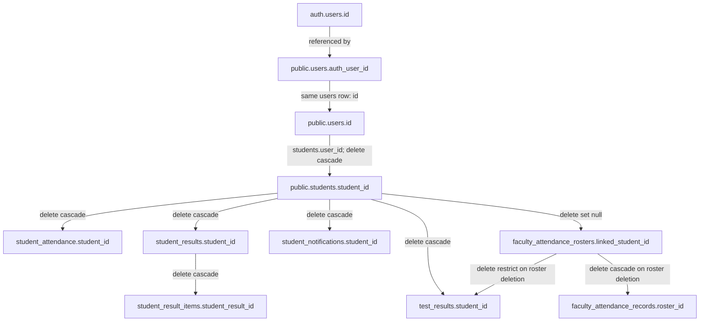

# College AI Chatbot — M1 Preflight Schema & Data Audit

Audit date: **10 October 2026 (Asia/Calcutta / IST)**  
Recommendation: **NO-GO for executing the M1 migration in its present, unspecified form.**  
Deliverable: report only. No enrollment tables, migrations, application changes, database writes, seeds, resets, package installs, or deployments were performed.

## 1. Executive summary

The live **local** PostgreSQL database was inspected successfully through the verified Docker Desktop container `supabase_db_CollegeAIChatbot`. Its catalog, rather than either schema export, is the authority for this report. PostgreSQL reports version **17.6**. Every audit connection used `PGOPTIONS=-c default_transaction_read_only=on -c statement_timeout=30000`; both initial and final SELECTs verified read-only transaction state. [SQL: environment, final_environment]

- **60 public tables, 640 columns, 428 constraints, 236 indexes, 36 non-internal triggers, and 64 public routine signatures** were inventoried. The constraints comprise 60 primary keys, 147 foreign keys, 44 unique constraints, 174 checks, and 3 exclusions. All inventoried constraints are validated. [SQL: tables, columns_*, constraints0–2, indexes0–2, triggers, functions]
- The local ledger contains **39 migration versions**, matching the 39 repository migration filenames and names. Ledger membership does not establish that a file's current bytes are the bytes originally applied. [SQL: migration_history; Appendix E]
- **There are zero students, zero institutions, zero public users, zero auth users, and zero records in all audited student/attendance/result/notification/roster tables.** Duplicate, orphan, mismatch, and ambiguous-record checks therefore return zero on empty populations. These results do **not** establish that populated legacy data can be safely backfilled. [SQL: row_counts, student_quality, extra_null_references, related_quality, related_deep, backfill_eligibility]
- **Critical:** `students`, `student_attendance`, `student_results`, `student_result_items`, and `student_notifications` have RLS disabled and effective SELECT/INSERT/UPDATE/DELETE privileges for both `anon` and `authenticated`. Trigger checks enforce some relationships but do not authorize the caller to access a student. [SQL: tables, grants; Appendix D]
- **Critical:** six non-trigger SECURITY DEFINER routine signatures in the email/invitation workflow retain EXECUTE privileges for both client roles. In particular, the old six-argument invitation-creation function and the outbox-claim function have no caller-authorization check in their inspected definitions. Their permissions permit bypassing intended backend-only workflows; no routine was invoked and no exploit or credential disclosure was attempted. [SQL: functions, extra_function_bodies; migrations `20261002000000_phase_7_17_email_outbox_worker.sql:437`, `20261002010000_phase_7_18_mailgun_webhook_reconciliation.sql:193`]
- **High compatibility risk:** student and tenant resolution, SQL tenant guards, roster reconciliation, result visibility, and UI contracts all use a single institution/program/year on the student identity row. Existing academic keys identify students or rosters, not enrollment episodes. [Sections 5–8; Appendix F]
- Preserving existing `student_id` values and the unique `students.user_id` identity relationship is consistent with introducing separate enrollment episodes. There is no evidence requiring new student identities for readmission or transfer. The current `graduated` vocabulary can be retained. [SQL: constraints2; migration `20260909000000_phase_admin_1_admin_student_schema.sql:41`]

**Decision:** the schema permits planning an additive, staged architecture, but this audit cannot approve a populated-data backfill or a tenant-source cutover. Address the verified privilege issues, define enrollment selection and historical mapping rules, and audit representative local legacy data before changing this recommendation.

## 2. Audit scope and environment

| Item | Evidence / observed value |
| --- | --- |
| Workspace | `F:/Git Project/CollegeAIChatbot` |
| Audit date and timezone | 2026-10-10, Asia/Calcutta (IST, UTC+05:30) |
| Git HEAD | `e4cf26cc555f96991cc74d849b9747744ffefdb7` |
| Local target | Docker context `desktop-linux`; its endpoint was checked to be a local Windows named pipe; `DOCKER_HOST` was absent |
| Container / image | `supabase_db_CollegeAIChatbot`; `public.ecr.aws/supabase/postgres:17.6.1.166` |
| Local published DB port | 54322 → container port 5432; configured in `supabase/config.toml` |
| Actual connection | Container-local Unix socket, database `postgres`, role `postgres`; no connection string or password was read or displayed |
| Initial catalog time | 2026-10-10 06:45:22 UTC (2026-10-10 12:15:22 IST) |
| Final aggregate time | 2026-10-10 06:54:24 UTC (2026-10-10 12:24:24 IST) |
| SQL execution | `psql -X -q -A -t -v ON_ERROR_STOP=1`; SELECT/catalog inspection only |
| Safety verification | Initial `transaction_read_only=on` and `default_transaction_read_only=on`; final `transaction_read_only=on` |
| Public schema exposure | `supabase/config.toml` exposes `public` through the local API; gateway/PostgREST containers were running |
| Enrollment architecture | `to_regclass('public.student_enrollments')` and `to_regclass('public.student_enrollment_events')` both returned null |
| Repository guidance | No applicable `AGENTS.md` found in the workspace or checked ancestors |
| Source analysis | Static reads/searches and Python AST inspection; Python used `-B` to avoid bytecode writes |
| Tests | Test sources inspected; no pytest, Vitest, physical test, or application route was executed |

The audit covers every public relation's columns, constraints, indexes, RLS state and grants; every public routine's execution privileges; every non-internal public trigger and its underlying definition; all foreign keys owned by public tables; and all cross-schema incoming and recursive descendants of `public.students`. Auth inspection was limited to the referenced key and aggregate account counts. Supabase internals, storage contents, auth sessions and credential-bearing records were not dumped.

Initial working-tree changes were preserved: modified `frontend/src/features/faculty/FacultyAttendance.tsx` and `FacultyAttendance.test.tsx`; untracked `frontend/src/features/faculty/useFacultyAttendanceData.ts` and root `schemaV2_export.sql`. Findings describe the working-tree files, including that untracked hook. Migration hashes are recorded in Appendix E. Source/test/migration fingerprints were captured for 526 files and rechecked for report verification.

The sandbox initially blocked the local Docker pipe. A read-only escalated inspection succeeded and confirmed the local target. The host has no discovered `psql` executable, so container-provided `psql` was used. No Supabase status output, environment file values, Docker environment inspection, passwords, API keys, access tokens or connection secrets were printed.

Queries ran in separate read-only sessions; this is not one global repeatable-read snapshot. Final student/institution/academic counts were rechecked and remained zero. Database query results, exact SQL, source coordinates and catalog function definitions are embedded in the appendices.

## 3. Schema and constraint inventory

### 3.1 Student identity and legacy membership

The verified `public.students` row combines account identity and membership: 16 columns, all inventoried below. No student column uses identity/generated-column syntax.

| Column | Type | Nullable | Default |
| --- | --- | --- | --- |
| `student_id` | `uuid` | no | `gen_random_uuid()` |
| `user_id` | `uuid` | no | — |
| `institution_id` | `uuid` | no | — |
| `student_number` | `text` | no | — |
| `program_id` | `uuid` | yes | — |
| `academic_year_id` | `uuid` | yes | — |
| `enrollment_date` | `date` | no | — |
| `expected_graduation_date` | `date` | yes | — |
| `status` | `text` | no | `'active'::text` |
| `is_active` | `boolean` | no | `true` |
| `created_at` | `timestamp with time zone` | no | `now()` |
| `updated_at` | `timestamp with time zone` | no | `now()` |
| `email` | `text` | yes | — |
| `register_number` | `text` | yes | — |
| `university_roll_number` | `text` | yes | — |
| `approval_status` | `text` | no | `'pending'::text` |


The primary key is `students_pkey(student_id)`. The unique `students_user_id_key(user_id)` makes the account/profile relation one-to-one. Its outgoing foreign key references **`public.users(id)`**, not `auth.users(id)`, and has DELETE CASCADE / UPDATE NO ACTION. `users.auth_user_id` is unique and references `auth.users(id)`; `users.email` is globally unique by stored text. [SQL: constraints2]

Student foreign keys are scalar:

| Student column | Referenced key | Delete | Update |
| --- | --- | --- | --- |
| institution_id | institutions.institution_id | RESTRICT | NO ACTION |
| program_id | programs.program_id | SET NULL | NO ACTION |
| academic_year_id | academic_years.academic_year_id | SET NULL | NO ACTION |
| user_id | users.id | CASCADE | NO ACTION |

Program ownership is reached through `programs.department_id → departments.institution_id`; academic-year ownership is stored on `academic_years.institution_id`. There is **no composite student/program/institution or student/year/institution constraint**, and the two student triggers are reconciliation/visibility triggers rather than a guard validating those student relationships. FK existence alone therefore does not enforce tenant equality on the student's program and year. The observed mismatch counts are zero. [SQL: constraints0–2, triggers, student_quality]

There are four institution-scoped student unique constraints: `(institution_id, student_number)`, `(institution_id, register_number)`, `(institution_id, university_roll_number)`, and `(institution_id, email)`. The latter three columns are nullable; uniqueness allows multiple nulls. These are stored-text keys, not normalized-expression indexes. Email has a lowercase/trim check; identifiers have nonblank checks, but those checks do not require their stored text to be trimmed. [SQL: constraints2, indexes2; migration `20260912000000_phase_6_2_student_identity_model.sql:70`]

Allowed student `status` values are **active, inactive, graduated, withdrawn**; `approval_status` is independently **pending, approved, rejected**. No constraint couples these to `is_active`. The expected graduation date must be null or on/after enrollment date. Enrollment date is required and has no database default; expected graduation date is optional. There is no actual graduation date, withdrawal date, readmission date, episode number or historical-transition field on the student row. [SQL: columns_student, constraints2]

### 3.2 Academic record contracts

| Table / relation | Verified ownership / uniqueness contract | Enrollment implication |
| --- | --- | --- |
| student_attendance | Required student, institution, section, year, semester and date; UNIQUE(student_id, section_id, date) | No episode key; trigger derives tenant from current student |
| student_results | Required student, institution, program, year and semester; UNIQUE(student_id, academic_year_id, semester_id, program_id) | Repeated episodes cannot be distinguished by this key alone |
| student_result_items | Required result and course; optional section; parent-result FK cascades | Tenant is indirect through the parent; course and section FKs are scalar |
| test_results | Nullable student; legacy branch requires student, workflow branch requires test/roster/mark_status | Null workflow student is permitted pending roster reconciliation |
| faculty_attendance_rosters | Nullable linked_student_id; required tenant/section/offering/semester/register_number | An unregistered roster is not an established student identity |
| student_notifications | Required student and institution; optional source_record_id without a source FK | Polymorphic event links are not enrollment history |

Legacy test results have a partial unique index on `(student_id, course_id, test_name, academic_year_id, semester_id)` where `test_id IS NULL`. Workflow results have unique `(test_id, roster_id)` and partial unique `(test_id, student_id)` for linked students. Roster identifiers are unique within `(institution_id, section_id)`, so a register number appearing in multiple sections is allowed and must not be mistaken for duplicate people. Notifications have a partial unique index on `(student_id, source_record_id, notification_type)` for non-null sources. [SQL: constraints1–2, indexes1–2]

### 3.3 Full inventory and validity

Appendix A lists all 60 tables and all 640 columns with type, nullability, default, physical ordinal and identity/generated metadata. Appendix B contains all 428 constraint definitions and all 236 indexes, including predicate, validity and readiness. All captured indexes are valid and ready. Every public table has a primary key. No public enum or domain was found; constrained vocabularies use text checks. No public view/materialized view was found. The only public identity column is `email_outbox.delivery_sequence`, generated ALWAYS; its bigint sequence exists. No stored generated columns were found. [SQL: columns_*, constraints0–2, indexes0–2, enums, schema_other]

Student read indexes cover institution, approval, user, identifiers, program and academic year. Attendance/results/test-results have student and academic-context indexes; the roster linked-student index is partial on non-null links. These support the present access patterns. There are no enrollment indexes because enrollment tables do not exist. New episode access patterns and populated query performance cannot be established from this empty database. [SQL: indexes1–2, environment]

Appendix C maps all 36 enabled user-defined triggers to functions; Appendix F includes definitions of all 23 distinct trigger functions, plus the student-identity helper and selected privileged workflow functions. Internal FK triggers are represented through catalog FK definitions rather than duplicated. RLS and effective grants are in Appendix D.

### 3.4 Migration and export provenance

All 39 local ledger version/name pairs have matching current files; no missing-file, missing-ledger or name mismatch was found. Historical migrations were read as source definitions, never executed. Relevant sources include the student baseline, student identity model, attendance/results/notifications guards, faculty reconciliation workflow, test-result workflow and recent curriculum convergence. [SQL: migration_history; Appendix E]

The untracked root `schemaV2_export.sql` has 60 parsed public table definitions, but its `program_courses` definition includes `semester_number`, which is absent from the live catalog. Its column order also differs there. The tracked `docs/schema/schemaV2_export.sql` has only 26 parsed public tables and omits students and the later academic workflows. Both export hashes and structural differences are recorded in Appendix E. Neither export is an authoritative description of the current local database. [SQL: columns_student; `schemaV2_export.sql:4268`; Appendix E]

## 4. Data-quality findings with counts and evidence

### 4.1 Population and interpretation

**Total students: 0. Institutions containing students: 0.** The actual GROUP BY institution result is an empty array, not an omitted positive population. The GROUP BY status/approval/active result is also empty. A separate vocabulary cross-join query enumerated all 24 allowed combinations, each with count 0. [SQL: student_grouping, student_status_combinations]

| Population | Rows |
| --- | --- |
| `academic_years` | 0 |
| `course_offerings` | 0 |
| `departments` | 0 |
| `faculty_attendance_import_rows` | 0 |
| `faculty_attendance_imports` | 0 |
| `faculty_attendance_records` | 0 |
| `faculty_attendance_rosters` | 0 |
| `faculty_attendance_sessions` | 0 |
| `faculty_responsibilities` | 0 |
| `faculty_section_assignments` | 0 |
| `faculty_tests` | 0 |
| `institutions` | 0 |
| `programs` | 0 |
| `sections` | 0 |
| `semesters` | 0 |
| `student_attendance` | 0 |
| `student_notifications` | 0 |
| `student_result_items` | 0 |
| `student_results` | 0 |
| `students` | 0 |
| `test_results` | 0 |
| `users` | 0 |


Exact, trimmed, and casefolded comparisons were checked separately. All three exclude values with `NULLIF(btrim(value), '') IS NULL`; grouping always includes `institution_id`. Results report duplicate groups, affected students, and excess rows, not just a yes/no flag.

| Identifier | Comparison | Duplicate groups | Affected students | Excess rows |
| --- | --- | --- | --- | --- |
| `email` | casefolded | 0 | 0 | 0 |
| `email` | exact | 0 | 0 | 0 |
| `email` | trimmed | 0 | 0 | 0 |
| `register_number` | casefolded | 0 | 0 | 0 |
| `register_number` | exact | 0 | 0 | 0 |
| `register_number` | trimmed | 0 | 0 | 0 |
| `student_number` | casefolded | 0 | 0 | 0 |
| `student_number` | exact | 0 | 0 | 0 |
| `student_number` | trimmed | 0 | 0 | 0 |
| `university_roll_number` | casefolded | 0 | 0 | 0 |
| `university_roll_number` | exact | 0 | 0 | 0 |
| `university_roll_number` | trimmed | 0 | 0 | 0 |


The exact SQL is included in Appendix G. Normalized collision checks identify potential conflicts if future enrollment uniqueness normalizes identifiers; they do not assert that today's stored-text constraints are violated.

### 4.2 Student references, dates and missing identity

Every student-quality predicate and count is listed below. Future enrollment dates are a review flag, not automatically an error for a legitimate future admission. Dates are compared against **2026-10-10**, the user's audit date. Null program/year values are permitted by this schema; they become an ambiguity only if the target enrollment design requires those values.

| Exact predicate label | Count |
| --- | --- |
| `blank_email` | 0 |
| `blank_student_number` | 0 |
| `future_enrollment_date` | 0 |
| `graduated_missing_expected_date` | 0 |
| `graduation_before_enrollment` | 0 |
| `inactive_institution` | 0 |
| `inactive_program_or_department` | 0 |
| `invalid_academic_year` | 0 |
| `invalid_institution` | 0 |
| `invalid_program` | 0 |
| `invalid_user` | 0 |
| `missing_academic_year` | 0 |
| `missing_email` | 0 |
| `missing_enrollment_date` | 0 |
| `missing_expected_graduation_date` | 0 |
| `missing_institution` | 0 |
| `missing_program` | 0 |
| `missing_register_number` | 0 |
| `missing_university_roll_number` | 0 |
| `missing_user` | 0 |
| `nonfinite_enrollment_date` | 0 |
| `nonfinite_expected_graduation_date` | 0 |
| `program_tenant_mismatch` | 0 |
| `student_user_email_mismatch` | 0 |
| `total` | 0 |
| `user_missing_auth` | 0 |
| `year_tenant_mismatch` | 0 |


A separate shared-user query found **0 groups, 0 affected students, 0 excess rows**; missing and invalid user links are separately counted above. Aggregate auth-user and auth-user-without-public-account counts are both **0**. Cross-field register-number versus university-roll-number collisions between different students within an institution are **0**. [SQL: student_grouping, extra_null_references]

### 4.3 Academic, roster, notification and orphan checks

| Population / check | Count |
| --- | --- |
| `results.total` | 0 |
| `results.orphan_student` | 0 |
| `results.year_tenant_mismatch` | 0 |
| `results.semester_year_mismatch` | 0 |
| `results.program_tenant_mismatch` | 0 |
| `results.student_tenant_mismatch` | 0 |
| `results.current_student_program_difference` | 0 |
| `rosters.total` | 0 |
| `rosters.unlinked` | 0 |
| `rosters.program_difference` | 0 |
| `rosters.invalid_student_link` | 0 |
| `rosters.section_tenant_mismatch` | 0 |
| `rosters.linked_student_tenant_mismatch` | 0 |
| `rosters.ambiguous_or_pending_reconciliation` | 0 |
| `rosters.missing_academic_identity_for_enrollment` | 0 |
| `attendance.total` | 0 |
| `attendance.nonfinite_date` | 0 |
| `attendance.orphan_student` | 0 |
| `attendance.year_tenant_mismatch` | 0 |
| `attendance.section_year_mismatch` | 0 |
| `attendance.semester_year_mismatch` | 0 |
| `attendance.section_tenant_mismatch` | 0 |
| `attendance.student_tenant_mismatch` | 0 |
| `attendance.section_program_mismatch` | 0 |
| `attendance.before_student_enrollment` | 0 |
| `attendance.section_semester_mismatch` | 0 |
| `result_items.total` | 0 |
| `result_items.orphan_result` | 0 |
| `result_items.course_parent_tenant_mismatch` | 0 |
| `test_results.total` | 0 |
| `test_results.null_student` | 0 |
| `test_results.orphan_student` | 0 |
| `test_results.test_tenant_mismatch` | 0 |
| `test_results.year_tenant_mismatch` | 0 |
| `test_results.course_tenant_mismatch` | 0 |
| `test_results.roster_tenant_mismatch` | 0 |
| `test_results.semester_year_mismatch` | 0 |
| `test_results.roster_student_mismatch` | 0 |
| `test_results.student_tenant_mismatch` | 0 |
| `test_results.before_student_enrollment` | 0 |
| `test_results.legacy_without_conducted_at` | 0 |
| `test_results.unlinked_roster_workflow_result` | 0 |
| `notifications.total` | 0 |
| `notifications.orphan_student` | 0 |
| `notifications.no_source_record` | 0 |
| `notifications.student_tenant_mismatch` | 0 |
| `notifications.untyped_source_reference` | 0 |
| `faculty_records.total` | 0 |
| `faculty_records.no_linked_student` | 0 |
| `faculty_records.roster_session_tenant_mismatch` | 0 |
| `faculty_records.roster_session_section_mismatch` | 0 |
| `result_item_section_mismatch` | 0 |
| `test_section_context_mismatch` | 0 |
| `roster_offering_semester_mismatch` | 0 |
| `attendance_year_student_current_difference` | 0 |
| `notifications_source_without_any_known_parent` | 0 |


Current-student program/year differences are labelled as differences, not proof that historical records are wrong. A result or attendance record may legitimately belong to a previous academic year; an enrollment mapping needs historical context before treating such a difference as an error.

All **147 public-owned foreign keys** were checked with non-null child-key anti-joins against the referenced parent, including the `public.users → auth.users` link. Each returned **0 orphans**. All use MATCH SIMPLE; nullable links are counted separately and are not treated as orphans. Appendix G preserves each query and per-constraint result. [SQL: fk_edges, orphan_fks0–5]

Optional notification source links and JSON fields are not protected by ordinary source foreign keys. A broad read-only diagnostic searched non-null notification source IDs across attendance, result, test-result and student keys and returned 0 unmatched links. That diagnostic is not a complete type-aware validity proof: academic-status/admin source semantics permit arbitrary authoritative event sources, and no notification records exist to inspect. The import-row tables also contain JSON payloads without a general relational student key; there are 0 import rows. [SQL: columns_academic, related_deep, row_counts; `backend/app/services/student_notifications_integration.py:106`]

### 4.4 Initial mapping diagnostic

The SELECT-only eligibility diagnostic found:

| Explicit audit criterion | Count |
| --- | ---: |
| Legacy membership structurally preservable, allowing null program/year | 0 |
| Structurally preservable with both program and academic year populated | 0 |
| Invalid/missing base links or unusable date/identifier requiring quarantine | 0 |
| Missing program or academic year requiring a policy decision | 0 |

The criterion requires existing user/institution keys, nonblank student number, finite enrollment date, a valid date ordering when expected graduation is present, and tenant consistency for each non-null program/year. It is an **audit diagnostic**, not an approved migration eligibility policy; it intentionally does not discard pending, rejected, inactive, withdrawn or graduated rows. [SQL: backfill_eligibility]

No actual local record currently needs an initial mapping. This is an empty-input result, not a successful rehearsal of a backfill and not evidence about remote/production student data.

## 5. Foreign-key dependency map

The complete recursive catalog traversal found five direct incoming student-key FKs and three depth-two paths. No incoming FK in any schema references `students.user_id`; the incoming references all target `students.student_id`. [SQL: fk_edges, fk_dependency_paths]

| Depth | Dependency path (parent → child) | Foreign key | Delete behavior | Update |
| --- | --- | --- | --- | --- |
| 1 | `students` → `faculty_attendance_rosters` | `faculty_attendance_rosters_linked_student_id_fkey` | SET NULL | NO ACTION |
| 1 | `students` → `student_attendance` | `student_attendance_student_id_fkey` | CASCADE | NO ACTION |
| 1 | `students` → `student_notifications` | `student_notifications_student_id_fkey` | CASCADE | NO ACTION |
| 1 | `students` → `student_results` | `student_results_student_id_fkey` | CASCADE | NO ACTION |
| 1 | `students` → `test_results` | `test_results_student_id_fkey` | CASCADE | NO ACTION |
| 2 | `students` → `faculty_attendance_rosters` → `faculty_attendance_records` | `faculty_attendance_records_roster_id_fkey` | CASCADE | NO ACTION |
| 2 | `students` → `student_results` → `student_result_items` | `student_result_items_student_result_id_fkey` | CASCADE | NO ACTION |
| 2 | `students` → `faculty_attendance_rosters` → `test_results` | `test_results_roster_id_fkey` | RESTRICT | NO ACTION |




This diagram is a **dependency graph**, not a claim that every connected row is deleted when a student is deleted. A student deletion nulls the roster link and leaves that roster intact; consequently it does not cascade through that SET NULL edge into roster records. Other RESTRICT/NO ACTION dependencies may prevent an account deletion entirely.

The `students.user_id → users.id` FK is the account anchor, with DELETE CASCADE and UPDATE NO ACTION. The 38 public FK edges referencing `users(id)` are listed separately in Appendix B. Most are sibling account/actor dependencies (roles, audit actors, faculty, document ownership, invitations), not FKs to `students.user_id`. Do not reinterpret actor account keys as enrollment keys.

Preserve the student PK and existing academic FK values. For a later staged migration, add an explicit enrollment association to membership-owned academic rows where a mapping can be verified; retain existing keys during the transition. Do not regenerate student IDs or move historical records to the current institution merely because an identity transfers.

## 6. Backend and frontend compatibility inventory

Coordinates below refer to the audited working tree. The direct student-table access list in Appendix H is a supplementary AST-based inventory.

### 6.1 Backend services and contracts

| Path and exact line | Function / contract | Observed dependency and required review |
| --- | --- | --- |
| `backend/app/db/supabase.py:40`, `:69`, `:121` | get_user_by_auth_id | Embeds students(institution_id); projects one institution, selecting the first relation item if a list is returned |
| `backend/app/db/supabase.py:191`, `:212`, `:221` | get_sign_in_context | Embeds one student approval/active/tenant context; same first-item fallback |
| `backend/app/core/security.py:48`, `:78`, `:126` | verify_jwt, get_current_user | JWT verification and role-derived tenant; student fallback still reads the scalar profile tenant |
| `backend/app/core/security.py:214`, `:233`, `:343` | scope_tenant, assert_tenant_object, require_institution_roles | Tenant guards and admin/staff institution dependency must retain server-owned authority |
| `backend/app/services/authorization.py:139`, `:196` | resolve_institution_authorization_context | Requires exactly one active institution grant for these operations; multiple grant scopes fail closed |
| `backend/app/services/authorization.py:231`, `:532`, `:540` | resolve_authorization_context, _profile_institution_id, assert_scope_consistency | Scope summary/profile consistency uses one current institution |
| `backend/app/services/student_context.py:52`, `:88`, `:108`, `:140` | get_student_context, _assert_student_eligible, assert_student_context_tenant | Unique user→student lookup; approval/is_active/institution-active eligibility; copies student tenant |
| `backend/app/repositories/admin_academics.py:18`, `:30`, `:38` | student projections | Student identity and membership fields travel together in existing projections |
| `backend/app/repositories/admin_academics.py:124`, `:163`, `:175`, `:202` | list_students and user-id/profile lookups | Institution filters and maybe_single user lookup; preserve identity uniqueness but obtain membership separately |
| `backend/app/repositories/admin_academics.py:235`, `:256`, `:275`, `:292`, `:310`, `:327` | email/register/roll lookups | Institution-local identifiers live on students; global email lookup assumes at most one profile |
| `backend/app/services/student_auth.py:86`, `:98`, `:141`, `:163`, `:213` | identity resolution and authenticate_student | Academic identifier requires institution code; approved/active student and active institution checks |
| `backend/app/services/sign_in.py:48`, `:61` | _has_student_profile, assert_sign_in_allowed | A single student lifecycle/tenant controls account sign-in |
| `backend/app/services/student_registration.py:242`, `:373`, `:462` | duplicate checks, _create_student_profile, _register_student | Direct pending student membership insert; separate auth/account creation with compensation |
| `backend/app/services/user_registration.py:93`, `:104`, `:134`, `:147` | _register_user | Existing account/student registration is rejected; date.today() becomes enrollment_date; program/year omitted |
| `backend/app/services/admin_academics.py:63`, `:85`, `:318`, `:336`, `:364` | StudentCreate/Update, student CRUD/archive | Writes identifiers/program/year/status/approval on student identity; creation/update lacks program/year tenant validation |
| `backend/app/services/admin_academics.py:443`, `:486`, `:505` | approve_student, reject_student | Approval separate from status; grants student role with institutional scope, best-effort after approval |
| `backend/app/repositories/admin_academics.py:434`, `:454` | set_student_approval_status | Conditional pending-state transition scoped by institution and student |
| `backend/app/api/admin.py:162`, `:191`, `:210`, `:239`, `:839`, `:965` | authorization and student API | Permission map plus institution-role dependency; payload tenant/target student checked before writes |
| `backend/app/repositories/attendance.py:46`, `:52`; `backend/app/services/attendance.py:98`, `:142` | get_student_context, create_attendance | Reads student tenant/program; validates section chain; persists current student tenant |
| `backend/app/repositories/results.py:33`, `:37`; `backend/app/services/results.py:157`, `:167`, `:218` | result student and academic validators | Current student tenant is authority for legacy result/test-result ownership |
| `backend/app/services/student_data.py:22`, `:47`, `:65`, `:114` | own profile/results/attendance | Resolves one student by user_id, then queries by student ID; no episode distinction |
| `backend/app/services/student_academic_profile.py:49`, `:76`, `:88` | get_academic_profile | One institution, program, year and current semester from the student row |
| `backend/app/services/student_attendance.py:38`; `backend/app/services/student_results.py:27`, `:77`, `:121` | own academic projections | Retain own-student and published-data filtering while adding episode/history policy |
| `backend/app/services/student_academic_context.py:65`, `:108`; `backend/app/services/personalization.py:472`, `:481` | academic and AI personalization context | Combines one profile and its labels; prevent mixing institutions when context selection changes |
| `backend/app/services/student_academic_experience.py:111`, `:133`; `backend/app/repositories/student_academic_experience.py:75`, `:195` | _scope, _own_rosters, list_linked_rosters, list_legacy_attendance | Tenant/student checked twice, but one institution and linked student govern all rosters/history |
| `backend/app/services/student_notices.py:80`; `backend/app/services/student_resources.py:77` | student notices/resources tenant extraction | Institution-level content follows the single student context |
| `backend/app/services/student_notifications.py:25`, `:88`, `:126`, `:151`; `backend/app/api/student_notifications.py:55` | notification creation/read/read-marking | Caller student is server-derived; reads and ownership checks use student_id, not episode/selected institution |
| `backend/app/services/student_notifications_integration.py:22`, `:51`, `:79`, `:106` | authoritative event hooks | Pass student/institution and polymorphic source IDs; events need explicit enrollment provenance later |
| `backend/app/services/faculty_attendance.py:283`, `:299`, `:314`, `:319` | _identity, match_identity, _identity_candidates | Searches exact identifiers among tenant-local student rows; rejects ambiguous candidates |
| `backend/app/services/faculty_attendance.py:383`, `:478`, `:535`, `:543` | roster validation/manual creation/marking/RPC | Section authorization and trusted actor/tenant; roster mapping must become episode-aware |
| `backend/app/services/faculty_attendance_reporting.py:88`, `:101` | students_page, student_profile | Roster-based student reporting and historical attendance |
| `backend/app/services/faculty_tests.py:28`, `:60`, `:86`, `:94` | rpc, test_row, marks | Server actor/tenant overrides; compares student current program/year against assessment section |
| `backend/app/services/admin_dashboard.py:179` | _students_summary | Counts current student rows per institution; decide whether future metric counts identities or enrollments |
| `backend/app/services/admin_academics.py:764`, `:803` | upload_results_csv | Resolves institution student list and identifiers before academic writes |
| `backend/app/repositories/personalization.py:50`, `:94` | get_program_label, get_academic_year_label | Tenant-rechecked labels through program department/year ownership |

One user having one **student identity** can remain valid. It is the assumption that this identity also has one membership/institution/program for all operations that must change. Do not remove `students_user_id_key` merely to support multiple enrollments.

### 6.2 SQL functions requiring coordinated review

`student_attendance_tenant_guard`, `student_results_tenant_guard`, the legacy branch of `test_results_tenant_guard`, and `trg_student_notifications_tenant_guard` derive or validate institution against the current student row. `faculty_attendance_context_guard` verifies the linked student's institution. `faculty_attendance_identity` resolves identifiers from tenant-local students. `reconcile_faculty_attendance_roster_student` may write roster links and attendance when student identity/approval/lifecycle changes. `refresh_student_test_visibility` and `reconcile_faculty_test_roster` cause result re-evaluation. [SQL: triggers, functions_trigger_bodies, extra_function_bodies; Appendix F]

The roster-reconciliation student trigger watches register number, roll number, approval, status and is_active, **not institution_id/program_id/academic_year_id**. The test-visibility trigger watches approval, is_active, status, program and year, **not institution_id**. Changing the student tenant through a future transfer workflow is therefore not a safe mechanism to update old membership ownership. [SQL: triggers]

Workflow result visibility checks current student's `status='active'`, approval, is_active, institution, program and year. Inference: changing those current profile values may turn previously visible historical results into drafts when these triggers run. The audit observed the definition, not a populated-data reproduction. Preserve the `graduated` label while explicitly deciding graduate/historical access and ending one episode without rewriting another's result ownership. [SQL: functions_trigger_bodies: test_results_tenant_guard, refresh_student_test_visibility]

### 6.3 Frontend inventory

| Path and exact line | Contract / component | Required review |
| --- | --- | --- |
| `frontend/src/types/auth.ts:105` | CurrentUser.institution_id | One scalar tenant, no selected enrollment |
| `frontend/src/features/auth/AuthProvider.tsx:49` | AuthContextValue | Account/session state has no enrollment context or switch operation |
| `frontend/src/types/student.ts:27` | StudentAcademicProfile | One identifier set, institution, program, year, status and approval |
| `frontend/src/services/studentApi.ts:142`, `:153`, `:172`, `:177` | profile/attendance/result API loaders | Account-bound /me endpoints; no enrollment request contract |
| `frontend/src/features/student/useStudentResource.ts:25`, `:37` | useStudentResource | Query key has token/watchKey/resource/instance, no explicit enrollment identifier |
| `frontend/src/features/student/StudentDashboard.tsx:34`, `:35` | StudentDashboard | Loads one academic profile and corresponding summaries/content |
| `frontend/src/features/student/StudentPages.tsx:74` | student information page | Reuses the same singular academic profile |
| `frontend/src/features/student/StudentIdentityCard.tsx:39`; `frontend/src/features/student/AcademicContextCard.tsx:33` | profile display | Membership fields must correspond to verified selected episode |
| `frontend/src/features/admin/StudentManager.tsx:25`, `:28` | StudentManager | Institution from /auth/me; student-row keys and enrollment-date display |
| `frontend/src/features/faculty/useFacultyAttendanceData.ts:15`, `:21`, `:39` | faculty attendance keys/data hook | Current untracked working-tree hook uses scope + section; roster/episode identity remains backend responsibility |
| `frontend/src/features/faculty/FacultyAttendance.tsx:104`, `frontend/src/features/faculty/FacultyAttendance.test.tsx:83` | existing edited attendance UI/tests | Preserve user edits; review new roster linkage/representation against these files |

Future selection must be validated on the server against authenticated student identity and enrollment membership. Cache keys and invalidation must distinguish accepted enrollment context, including stale requests after a switch. This is a future compatibility requirement, not a claim that the current single-context UI leaks data.

### 6.4 Existing tests to retain, adapt or extend

**These tests were inspected, not run.** Names establish existing expected behavior only.

| Test source and exact line | Existing assertion / scenario | Enrollment coverage needed |
| --- | --- | --- |
| `backend/tests/test_auth.py:133`, `:273`, `:311` | One-to-one student embedding; student tenant; spoofed client auth data ignored | Keep identity relation; add deterministic authorized enrollment resolution |
| `backend/tests/test_student_model_phase_6_2.py:273`, `:287`, `:602` | Identifier reuse across institutions; scoped email; unique user lookup | Move membership-key assertions at the approved stage; preserve identity uniqueness |
| `backend/tests/test_student_registration_phase_6_3.py:359`, `:371` | Existing accounts/profiles cannot re-register | Separate creating identity from requesting readmission/transfer |
| `backend/tests/test_student_auth_phase_6_5.py:345`, `:364`, `:433` | Same identifier in different institutions; forged institution UUID | Academic login must resolve an allowed episode without widening identity |
| `backend/tests/test_student_approval_phase_6_4.py:322`, `:337`, `:463` | Conditional approval/rejection and stale decision conflicts | Keep registration approval separate from admission/enrollment status |
| `backend/tests/test_students_api.py:73`, `:86`, `:196` | JWT-owned student; client student spoofing; other-student isolation | Add owned/foreign/inactive/historical enrollment selection |
| `backend/tests/test_attendance_phase_6_7.py:232`, `:334`, `:850` | Derived tenant; foreign section denied; tenantless admin denied | Same student with two episodes must not conflate ownership |
| `backend/tests/test_results_phase_6_8.py:821`, `:883`, `:1403` | Derived result tenant, program/context checks, identity params | Preserve old-episode records and authorized history after transfer |
| `backend/tests/test_student_academic_context_6144.py:267`, `:328` | Cross-institution and client institution mismatch | Bind personalization/AI context to accepted episode |
| `backend/tests/test_student_academic_experience.py:412`, `:466`, `:574`, `:588` | Spoofed identity ignored; foreign student/tenant/records excluded | Repeated episodes, stale selection, roster with multiple candidate memberships |
| `backend/tests/test_student_notifications_phase_6_11.py:314`, `:324`, `:767` | Own notification/read-marking; institution scoping | Decide per-enrollment history and verify tenant/source association |
| `backend/tests/test_faculty_attendance_workflow.py:62`, `:68`, `:125`, `:242` | Ambiguity rejection, tenant-local candidates, pending registration, server actor | Readmission identifier reuse and pre-registration rosters |
| `backend/tests/test_faculty_tests.py:174`, `:193`, `:282` | RPC actor/tenant; own published data; identity conflicts | Historical publication after status/program/year changes |
| `backend/tests/test_phase_7_20_university_admin_tenant_isolation.py:177`, `:191` | Forged institution query/body denied before writes | Forged enrollment must not change admin/faculty institution authority |
| `frontend/src/services/studentApi.test.ts:31`, `:54` | Current /me profile and result URLs | Approved selection contract and cache invalidation |
| `frontend/src/features/student/StudentDashboardIntegration.test.tsx:34` | Single-profile student journey | Switch between authorized episodes; keep displayed labels and records aligned |
| `frontend/src/features/auth/AuthProvider.test.tsx:95`, `:109` | Session/logout/cross-tab cache clearing | Same-session context switching and stale responses |
| `frontend/src/features/faculty/FacultyAttendance.test.tsx:83`, `:218`, `:239` | Current edited roster/UI tests | Preserve current user changes while extending episode linkage coverage |

No implementation reference to `student_enrollments`, `student_enrollment_events`, `enrollment_id`, or `readmission` was found by the scoped search of backend/app, frontend/src and current migrations. Existing tests therefore do not demonstrate the proposed architecture. Test evidence above is source evidence, not a passing test report.

## 7. Backfill feasibility and ambiguous-record categories

### 7.1 Assessment of the requested design

| Proposed requirement | Evidence-based assessment |
| --- | --- |
| Preserve all existing student IDs | Structurally supported: UUID PK and five incoming student-key FKs can remain; no local IDs currently exist to exercise this |
| One initial enrollment per eligible legacy student | SELECT diagnostic yields 0 candidates; safe populated-data mapping remains unverified |
| Multiple episodes, readmission, transfer | Separate enrollment rows are consistent with unique account→identity; current scalar student tenant and membership keys cannot themselves express episodes |
| Staged movement of identifiers/membership | Required for the source/query/trigger contracts in Section 6; preserve legacy reads until an explicit compatibility projection is verified |
| Keep graduated terminology | Supported by the installed student status check; distinguish expected date from actual graduation |
| Keep approval separate | Installed approval/status columns are independent; registration inserts active + pending, so active alone is not proof of admission |
| Preserve uncertain history | Required: no historical episode/event model exists, enrollment_date may be registration date, and terminal transition dates are absent |

No proposed DDL, exact enrollment uniqueness rules, event vocabulary, overlap policy, active-enrollment limit or required target fields were supplied. Those policies cannot be tested for conflicts yet. Reapplying today's `(institution, identifier)` constraints directly to every episode could prevent readmission using the same identifier; that is an inferred design conflict, not an observed duplicate. [SQL: constraints2; `backend/app/services/user_registration.py:134`]

### 7.2 Categories requiring an explicit mapping policy

Each measured local category has count **0** because its relevant population is empty. Do not extrapolate those counts to production.

| Category | Measured local count / evidence | Preserve / resolve without guessing |
| --- | --- | --- |
| Missing/nonexistent institution or user | 0 for each predicate; student_quality | Quarantine invalid base membership; retain original identity and evidence |
| Missing program or academic year | 0 for each; student_quality | Permit explicitly unknown values or require manual resolution; do not select a convenient current program/year |
| Existing but foreign-tenant program/year | 0 for each; student_quality | Verify source owner and correct explicitly before enforcing new target rules |
| Duplicate identifiers within institution | 0 groups for every exact/trimmed/casefolded comparison | Choose identifier normalization, historical reuse and uniqueness scope first |
| Shared user identities | 0 groups; student_grouping | Preserve one identity per account; do not merge identities automatically if a later dataset contradicts this |
| Missing/unusable enrollment date or date inversion | 0 for each; student_quality | Retain source uncertainty; do not substitute created_at as proven admission date |
| Enrollment date set from registration clock | No dated student records to inspect; source sets date.today() | Preserve legacy value with provenance; its academic-admission semantics remain unknown |
| Missing expected graduation date | 0; student_quality | Keep null; expected graduation is not actual graduation |
| Terminal/transfer/readmission event dates | 0 students to assess; corresponding columns/events absent | Import current known state as legacy state, not fabricated past events |
| Academic record with inconsistent tenant | 0 for each relationship check | Preserve record owner; quarantine mismatches before episode attachment |
| Earlier year/program than current profile | 0 diagnosed differences | Differences can be legitimate history; do not coerce them to the current episode |
| Unlinked/ambiguous/pending roster | 0 for each roster predicate | Retain unregistered/pending/conflict state; identifiers alone do not establish episode ownership |
| Workflow test result without student | 0; schema permits it | Keep tied to its authoritative test/roster; do not synthesize a student identity |
| Attendance/test date predating source enrollment | 0; related_quality | Treat as historical-date ambiguity rather than automatically rejecting a valid legacy record |
| Notification without a source / polymorphic source | 0 for each; related_quality/related_deep | Preserve optionality and source provenance; do not treat notifications as a complete enrollment event log |

A later approved backfill should record the factual import operation at migration time and retain legacy field provenance, if that event semantics is chosen. Do not fabricate admission, graduation, withdrawal, readmission or transfer events merely from current status, expected dates, created_at or an attendance record. No test backfill was run.

## 8. Security and tenant-isolation findings

### 8.1 Verified database authorization gaps

There are **27 RLS-enabled** public tables and **33 with RLS disabled**; none force RLS. **Zero public policies** exist. Thus enabled tables rely on restricted grants/service-role access, while disabled tables have no row-policy boundary. Of the 33 disabled tables, **30 grant effective SELECT to anon**. The sensitive legacy student tables listed in the executive summary also grant client-role writes. [SQL: tables, policies, grants]

The configured local API includes public schema, and anon/authenticated have public schema USAGE. These are verified prerequisites for direct Data API access bypassing FastAPI's route guards. HTTP reachability with a specific client credential, actual read/write exploitation and remote deployment equivalence were not tested. The present tables are empty, so no current student data exposure was demonstrated. This remains a critical permission defect before loading data or creating enrollment tables under the same defaults.

The six non-trigger definer signatures accessible to client roles are:

- `phase717_claim_email_outbox(integer,integer,integer)`
- `phase717_complete_email_outbox(uuid,integer,text,text,text,text,timestamp with time zone)`
- `phase717_create_invitation_with_outbox(uuid,text,text,timestamp with time zone,uuid,text)`
- `phase717_resolve_email_outbox_context(uuid,text)`
- `phase717_rotate_invitation_with_outbox(uuid,text,timestamp with time zone,timestamp with time zone,text,integer)`
- `phase718_reconcile_mailgun_event(text,text,text,text,text,timestamp with time zone)`

The inspected outbox-claim body mutates outbox/attempt/invitation records and returns outbox rows under the owner's privileges, without an authenticated actor check. The old six-argument creation overload accepts tenant/creator inputs and writes invitations. These bodies were obtained with `pg_get_functiondef`, not called. The routine names and parameter names in this report are schema metadata; no token/key/password values were queried. [SQL: functions, extra_function_bodies]

The relevant migrations revoke EXECUTE **from PUBLIC only**, then grant service_role; they do not remove the separate anon/authenticated grants inherited from the observed default function privileges. The installed ACLs confirm those client grants remain. The seven-argument invitation-creation overload is separately restricted and does not repair the six-argument overload. [Migration `20261002000000_phase_7_17_email_outbox_worker.sql:437`; SQL: functions, grants]

Three other client-executable SECURITY DEFINER routines return `trigger`. They are recorded in the privilege inventory, but their signatures should not be equated with callable mutation RPCs: trigger functions need trigger execution context. This distinction prevents overstating the RPC finding. [SQL: functions; Appendix F]

Observed default table and function privileges for public objects created by postgres/supabase_admin include client roles. Inference: creating enrollment tables/functions with these defaults, without explicit restrictive grants and RLS policy decisions, could reproduce the exposure. [SQL: grants.defaults]

### 8.2 Verified application safeguards

JWT identity comes from verified Supabase claims, public account lookup and server-side role assignments. Admin and faculty routes require institution authority; requested institution IDs are checked against server-owned scope. Student /me operations derive student ID from the account; academic-identifier login uses institution code for scoping. These are verified source behaviors, not end-to-end results. [`backend/app/core/security.py:48`, `:78`, `:343`; `backend/app/services/authorization.py:139`; `backend/app/api/admin.py:839`; `backend/app/services/student_auth.py:98`]

The service-role client bypasses RLS by design, and its installed role has BYPASSRLS. Application and RPC authorization must therefore remain explicit even after introducing new RLS policies. [`backend/app/db/supabase.py:20`; SQL: grants.roles]

### 8.3 Tenant integrity versus authorization

Attendance/results/notifications triggers protect particular row relationships. They do not establish that an arbitrary anon/authenticated caller owns that student. Student FKs themselves allow existing program/year keys belonging to a different institution, and no dedicated student tenant guard is installed. Admin student CRUD validates student status/approval and normalizes identifiers, but does not validate the tenant of supplied program/year keys before persistence. [SQL: constraints2, triggers; `backend/app/services/admin_academics.py:318`, `:336`; `backend/app/api/admin.py:843`, `:970`]

Historical academic rows have their own tenant fields. A future transfer must not replace those tenants based on the latest student's institution. A client-supplied enrollment UUID must be treated as a requested resource: resolve it against authenticated identity, allowed lifecycle, institution and academic ownership before granting context. No present authorization path trusts a client enrollment ID because that contract does not exist. [Section 6; SQL: columns_academic, functions_trigger_bodies]

## 9. Classified findings

Verified observations and inferred consequences are distinguished in each row.

| ID | Severity | Finding and evidence | Classification |
| --- | --- | --- | --- |
| C1 | Critical | Legacy student/attendance/results/items/notifications have disabled RLS and client-role read/write grants. [tables, grants, policies] | Verified permissions; exploitation not tested |
| C2 | Critical | Six client-executable definer workflow signatures; selected owner-privileged bodies have no caller authorization; PUBLIC-only revokes miss direct client grants. [functions, extra_function_bodies, cited migrations] | Verified ACL/body; misuse risk inferred |
| H1 | High | No local legacy student/academic/institution population is available for representative mapping validation. [row_counts, backfill_eligibility] | Verified audit limitation |
| H2 | High | Authentication, student context and tenant guards use one student's institution/program/year and have no episode contract. [Section 6, Appendix F] | Verified coupling; transfer/readmission breakage inferred |
| H3 | High | No student program/year tenant-equality constraint or dedicated guard; CRUD does not validate supplied ownership. [constraints2, triggers; admin_academics:318/336] | Verified integrity gap; observed bad rows 0 |
| H4 | High | Roster reconciliation and workflow publication depend on current student state; tenant changes are outside student trigger watch lists. [triggers, test_results_tenant_guard] | Verified definitions; historical mapping/visibility consequences inferred |
| M1 | Medium | Stored-text institution identifier keys do not define historical episode reuse/normalization/overlap policy. [constraints2, indexes2; missing proposed DDL] | Verified existing keys; target uniqueness conflicts conditional |
| M2 | Medium | Registration assigns today's date; actual enrollment/terminal dates and events are not independently recorded. [user_registration:134; columns_student] | Verified source/schema; semantic dates unknown for empty population |
| M3 | Medium | Global student-email maybe_single assumes uniqueness not enforced globally on students; no student/account email equality constraint. [admin_academics:256; constraints2] | Verified assumption gap; duplicate/email mismatch counts 0 locally |
| M4 | Medium | Notification source IDs/JSON references are not a relational enrollment history; historical associations may require manual provenance. [columns_academic; notification integration sources] | Verified schema; mapping ambiguity inferred, observed records 0 |
| L1 | Low | Schema exports differ from live inventory; root program_courses differs and docs export omits student architecture. [Appendix E] | Verified structural comparison |
| I1 | Informational | UUID student identity, unique user identity, graduated vocabulary and independent approval/status already exist; enrollment tables do not. [environment, constraints2] | Verified supporting architecture |

No finding asserts that a populated data-quality violation was found. All measured local violations are zero; unknown remote counts are **not checked**, not zero.

## 10. Recommended remediation — no implementation

1. **Correct the verified authorization defects before loading data or exposing new membership objects.** Decide the intended access boundary, restrict sensitive table grants, and review RLS on identity/membership/academic tables. Remove client EXECUTE from backend-only definer routines and every overload; address default grants so new enrollment objects start with intended permissions. Verify through role-specific read-only inspection and separately authorized behavioral tests.
2. **Provide a representative, verified local legacy dataset in a separately authorized task**, then rerun this report's SELECT diagnostics. Include pending/rejected/inactive/graduated/withdrawn identities, missing program/year/dates, repeated identifiers, linked/unlinked rosters and historical results. This audit authorizes no import, seed or remote connection.
3. **Specify the enrollment contract before DDL:** required versus unknown fields, membership/approval state separation, episode/identifier reuse scope, allowed overlaps or simultaneous memberships, transfer/readmission semantics and historical visibility. Keep student/account identity uniqueness distinct from enrollment uniqueness.
4. **Use an additive compatibility stage.** Preserve every existing student ID and academic FK; create only verified initial membership mappings when authorized. Keep existing student membership projections until all reads/writes/triggers can resolve the approved episode context. Do not switch `students.institution_id` to represent a transfer while historical guards still use it.
5. **Enforce tenant equality at both database and application boundaries.** Enrollment→student/institution must be explicit; program/year/section ownership must agree with enrollment institution. Authorization must bind caller, enrollment and role/resource scope. A row relationship check alone is not an authorization check.
6. **Define immutable backfill provenance and review categories.** Preserve original values/nulls, distinguish registration-time enrollment_date from known academic admission, and label imported state without inventing historical transitions. Keep `graduated` and approval terminology initially.
7. **Coordinate academic mapping and triggers.** Attendance, results, test results, notifications and rosters need deterministic association to the correct episode or an explicit unresolved state. Keep unregistered roster/test workflows valid and preserve old publication/history when current membership changes.
8. **Plan behavioral validation for the later implementation.** Extend the exact tests in Section 6; cover owned/foreign episode IDs, two episodes for one identity, transfer/readmission identifier reuse, graduate history, stale context switching, pending/rejected approval and rollback preservation. Use a disposable local database only after explicit authorization for write-based checks.
9. **Refresh schema documentation after an authorized schema change.** Use live catalog/migration definitions as authority; retain migration source hashes and an explicit provenance statement.

These recommendations are a review plan, not executed SQL or an implemented migration.

## 11. Checks not completed and reasons

| Check | Reason / limit |
| --- | --- |
| Remote/production schema, RLS, grants and data quality | Explicitly prohibited; no remote Supabase connection attempted |
| Representative populated-data backfill feasibility | Local students, institutions and academic records are empty |
| Enrollment-table constraint/uniqueness/event validation | Tables and proposed exact DDL are absent; no speculative target constraints were treated as verified |
| Test backfill, migration replay, reset, seed or rollback execution | Requires writes and is explicitly prohibited |
| pytest/Vitest/build/physical/integration test execution | Audit restricted to reads; existing suites/scripts can write artifacts or use live services; no runner launched |
| Role impersonation, mutating RPC calls, HTTP exploitation | Would require session-setting/non-SELECT operations or potentially mutating calls; catalog privileges and definitions inspected instead |
| Successful HTTP reads through publishable/anon credentials | No credentials were read/copied; catalog+config expose prerequisites but no credentialed request was made |
| True admission/graduation/withdrawal/readmission/transfer dates | No student population, no historical enrollment events and absent terminal-date fields; no history inferred |
| Full semantic validation of JSON/polymorphic source references | No relevant records; general source relationships are not declared FKs |
| Historical applied-file checksum equality | Ledger version/name compared; applied statement text was not reconstructed into authoritative historical file bytes |
| Single globally consistent audit snapshot | Separate read-only SELECT sessions used; final core counts rechecked and remained zero |
| Populated query performance and concurrency races | No representative rows and no writes permitted |

Several initial SELECT drafts encountered ambiguous-column/join or syntax errors; those diagnostics were corrected and rerun successfully. A large orphan-check command exceeded Windows command-line length before process creation; the six smaller SELECT batches completed. An initial full-catalog response exceeded output limits; the complete inventory was subsequently captured in bounded sections. These are resolved collection limitations, not omitted checks or database changes.

## 12. Final M1 recommendation

**NO-GO for executing an enrollment migration, backfill or tenant-source cutover now.**

The blocking evidence is the verified critical privilege configuration, the absence of representative local legacy data, the current single-membership dependencies in application and SQL, and the absence of a precise target contract. Zero detected data defects in zero students is not a GO signal.

Reconsider **CONDITIONAL GO** for an explicitly approved additive M1 stage after the security boundary is corrected, the target rules and compatibility behavior are reviewable, and representative **local** data proves deterministic initial mappings with ambiguous records preserved for review. A full **GO** additionally requires appropriate separately authorized migration/backfill/authorization regression evidence.

**Stop point:** only this report has been created. No enrollment implementation or deployment has begun; further action requires explicit approval.

---

# Evidence appendices

All SQL below was read-only SELECT/catalog inspection. Function/trigger/index/constraint definitions in catalog output are evidence text; their embedded CREATE/INSERT/UPDATE/etc. were never executed by this audit.

## Appendix A — Full live table and column inventory

Source: tables and columns_* SELECTs. All listed relations are ordinary public tables owned by postgres. Physical ordinals may have gaps after historical schema changes.

| Public table | Owner | Kind | RLS | Force RLS | Exact row count |
| --- | --- | --- | --- | --- | --- |
| `academic_years` | postgres | r | yes | no | 0 |
| `admin_audit_log` | postgres | r | no | no | 0 |
| `ai_responses` | postgres | r | no | no | 0 |
| `auth_consumed_password_recovery_sessions` | postgres | r | yes | no | 0 |
| `auth_security_events` | postgres | r | yes | no | 0 |
| `campuses` | postgres | r | no | no | 0 |
| `chunk_embeddings` | postgres | r | no | no | 0 |
| `conversations` | postgres | r | no | no | 0 |
| `course_offerings` | postgres | r | yes | no | 0 |
| `courses` | postgres | r | yes | no | 0 |
| `departments` | postgres | r | yes | no | 0 |
| `document_processing_runs` | postgres | r | no | no | 0 |
| `document_versions` | postgres | r | no | no | 0 |
| `documents` | postgres | r | no | no | 0 |
| `email_delivery_attempts` | postgres | r | yes | no | 0 |
| `email_delivery_events` | postgres | r | yes | no | 0 |
| `email_outbox` | postgres | r | yes | no | 0 |
| `faculty_attendance_import_rows` | postgres | r | yes | no | 0 |
| `faculty_attendance_imports` | postgres | r | yes | no | 0 |
| `faculty_attendance_records` | postgres | r | yes | no | 0 |
| `faculty_attendance_rosters` | postgres | r | yes | no | 0 |
| `faculty_attendance_sessions` | postgres | r | yes | no | 0 |
| `faculty_responsibilities` | postgres | r | yes | no | 0 |
| `faculty_section_assignments` | postgres | r | yes | no | 0 |
| `faculty_tests` | postgres | r | yes | no | 0 |
| `faqs` | postgres | r | no | no | 0 |
| `institution_join_requests` | postgres | r | no | no | 0 |
| `institution_membership_requests` | postgres | r | no | no | 0 |
| `institutions` | postgres | r | no | no | 0 |
| `knowledge_chunks` | postgres | r | no | no | 0 |
| `knowledge_sources` | postgres | r | no | no | 0 |
| `message_citations` | postgres | r | no | no | 0 |
| `messages` | postgres | r | no | no | 0 |
| `notices` | postgres | r | no | no | 0 |
| `organizations` | postgres | r | no | no | 1 |
| `permissions` | postgres | r | no | no | 78 |
| `platform_admin_invitations` | postgres | r | no | no | 0 |
| `platform_institution_audit_log` | postgres | r | no | no | 0 |
| `platform_role_audit_log` | postgres | r | no | no | 0 |
| `platform_super_admin_invitations` | postgres | r | yes | no | 0 |
| `program_courses` | postgres | r | yes | no | 0 |
| `programs` | postgres | r | yes | no | 0 |
| `responsibility_definitions` | postgres | r | yes | no | 5 |
| `responsibility_permissions` | postgres | r | yes | no | 19 |
| `retrieval_operations` | postgres | r | no | no | 0 |
| `retrieved_chunks` | postgres | r | no | no | 0 |
| `role_permissions` | postgres | r | no | no | 126 |
| `roles` | postgres | r | no | no | 5 |
| `sections` | postgres | r | yes | no | 0 |
| `semesters` | postgres | r | yes | no | 0 |
| `student_attendance` | postgres | r | no | no | 0 |
| `student_notifications` | postgres | r | no | no | 0 |
| `student_result_items` | postgres | r | no | no | 0 |
| `student_results` | postgres | r | no | no | 0 |
| `students` | postgres | r | no | no | 0 |
| `test_results` | postgres | r | yes | no | 0 |
| `test_types` | postgres | r | yes | no | 10 |
| `user_permission_grants` | postgres | r | yes | no | 0 |
| `user_roles` | postgres | r | no | no | 0 |
| `users` | postgres | r | no | no | 0 |

### public.academic_years

| Ordinal | Column | Type | Nullable | Default expression | Identity | Generated |
| --- | --- | --- | --- | --- | --- | --- |
| 1 | `academic_year_id` | `uuid` | no | `gen_random_uuid()` | none | none |
| 2 | `institution_id` | `uuid` | no | — | none | none |
| 3 | `name` | `text` | no | — | none | none |
| 4 | `code` | `text` | no | — | none | none |
| 5 | `start_date` | `date` | no | — | none | none |
| 6 | `end_date` | `date` | no | — | none | none |
| 7 | `is_current` | `boolean` | no | `false` | none | none |
| 8 | `is_active` | `boolean` | no | `true` | none | none |
| 9 | `created_at` | `timestamp with time zone` | no | `now()` | none | none |
| 10 | `updated_at` | `timestamp with time zone` | no | `now()` | none | none |

### public.admin_audit_log

| Ordinal | Column | Type | Nullable | Default expression | Identity | Generated |
| --- | --- | --- | --- | --- | --- | --- |
| 1 | `audit_id` | `uuid` | no | `gen_random_uuid()` | none | none |
| 2 | `actor_user_id` | `uuid` | no | — | none | none |
| 3 | `action` | `text` | no | — | none | none |
| 4 | `table_name` | `text` | yes | — | none | none |
| 5 | `record_id` | `text` | yes | — | none | none |
| 6 | `record_data` | `jsonb` | yes | — | none | none |
| 7 | `ip_address` | `inet` | yes | — | none | none |
| 8 | `user_agent` | `text` | yes | — | none | none |
| 9 | `status` | `text` | no | `'success'::text` | none | none |
| 10 | `performed_at` | `timestamp with time zone` | no | `now()` | none | none |
| 11 | `institution_id` | `uuid` | yes | — | none | none |

### public.ai_responses

| Ordinal | Column | Type | Nullable | Default expression | Identity | Generated |
| --- | --- | --- | --- | --- | --- | --- |
| 1 | `ai_response_id` | `uuid` | no | `gen_random_uuid()` | none | none |
| 2 | `message_id` | `uuid` | no | — | none | none |
| 3 | `provider_name` | `text` | no | — | none | none |
| 4 | `model_name` | `text` | no | — | none | none |
| 5 | `validation_status` | `text` | no | `'pending'::text` | none | none |
| 6 | `input_token_count` | `integer` | yes | — | none | none |
| 7 | `output_token_count` | `integer` | yes | — | none | none |
| 8 | `latency_ms` | `integer` | yes | — | none | none |
| 9 | `created_at` | `timestamp with time zone` | no | `now()` | none | none |

### public.auth_consumed_password_recovery_sessions

| Ordinal | Column | Type | Nullable | Default expression | Identity | Generated |
| --- | --- | --- | --- | --- | --- | --- |
| 1 | `session_fingerprint` | `text` | no | — | none | none |
| 2 | `auth_user_id` | `uuid` | no | — | none | none |
| 3 | `expires_at` | `timestamp with time zone` | no | — | none | none |
| 4 | `consumed_at` | `timestamp with time zone` | no | `now()` | none | none |

### public.auth_security_events

| Ordinal | Column | Type | Nullable | Default expression | Identity | Generated |
| --- | --- | --- | --- | --- | --- | --- |
| 1 | `event_id` | `uuid` | no | `gen_random_uuid()` | none | none |
| 2 | `user_id` | `uuid` | yes | — | none | none |
| 3 | `auth_user_id` | `uuid` | yes | — | none | none |
| 4 | `event` | `text` | no | — | none | none |
| 5 | `status` | `text` | no | — | none | none |
| 6 | `ip_address` | `inet` | yes | — | none | none |
| 7 | `user_agent` | `text` | yes | — | none | none |
| 8 | `occurred_at` | `timestamp with time zone` | no | `now()` | none | none |

### public.campuses

| Ordinal | Column | Type | Nullable | Default expression | Identity | Generated |
| --- | --- | --- | --- | --- | --- | --- |
| 1 | `campus_id` | `uuid` | no | `gen_random_uuid()` | none | none |
| 2 | `institution_id` | `uuid` | no | — | none | none |
| 3 | `name` | `text` | no | — | none | none |
| 4 | `code` | `text` | no | — | none | none |
| 5 | `description` | `text` | yes | — | none | none |
| 6 | `address` | `text` | yes | — | none | none |
| 7 | `city` | `text` | yes | — | none | none |
| 8 | `state` | `text` | yes | — | none | none |
| 9 | `country` | `text` | yes | — | none | none |
| 10 | `postal_code` | `text` | yes | — | none | none |
| 11 | `is_active` | `boolean` | no | `true` | none | none |
| 12 | `created_at` | `timestamp with time zone` | no | `now()` | none | none |
| 13 | `updated_at` | `timestamp with time zone` | no | `now()` | none | none |

### public.chunk_embeddings

| Ordinal | Column | Type | Nullable | Default expression | Identity | Generated |
| --- | --- | --- | --- | --- | --- | --- |
| 1 | `chunk_id` | `uuid` | no | — | none | none |
| 2 | `model_name` | `text` | no | — | none | none |
| 3 | `embedding_dimensions` | `integer` | no | — | none | none |
| 4 | `embedding` | `vector(1536)` | no | — | none | none |
| 5 | `embedded_at` | `timestamp with time zone` | no | `now()` | none | none |

### public.conversations

| Ordinal | Column | Type | Nullable | Default expression | Identity | Generated |
| --- | --- | --- | --- | --- | --- | --- |
| 1 | `conversation_id` | `uuid` | no | `gen_random_uuid()` | none | none |
| 2 | `user_id` | `uuid` | no | — | none | none |
| 3 | `title` | `text` | yes | — | none | none |
| 4 | `status` | `text` | no | `'active'::text` | none | none |
| 5 | `created_at` | `timestamp with time zone` | no | `now()` | none | none |
| 6 | `updated_at` | `timestamp with time zone` | no | `now()` | none | none |

### public.course_offerings

| Ordinal | Column | Type | Nullable | Default expression | Identity | Generated |
| --- | --- | --- | --- | --- | --- | --- |
| 1 | `course_offering_id` | `uuid` | no | `gen_random_uuid()` | none | none |
| 2 | `course_id` | `uuid` | no | — | none | none |
| 3 | `academic_year_id` | `uuid` | no | — | none | none |
| 4 | `semester_id` | `uuid` | no | — | none | none |
| 5 | `program_id` | `uuid` | no | — | none | none |
| 6 | `capacity` | `integer` | yes | — | none | none |
| 7 | `is_active` | `boolean` | no | `true` | none | none |
| 8 | `created_at` | `timestamp with time zone` | no | `now()` | none | none |
| 9 | `updated_at` | `timestamp with time zone` | no | `now()` | none | none |

### public.courses

| Ordinal | Column | Type | Nullable | Default expression | Identity | Generated |
| --- | --- | --- | --- | --- | --- | --- |
| 1 | `course_id` | `uuid` | no | `gen_random_uuid()` | none | none |
| 2 | `department_id` | `uuid` | no | — | none | none |
| 3 | `name` | `text` | no | — | none | none |
| 4 | `code` | `text` | no | — | none | none |
| 5 | `description` | `text` | yes | — | none | none |
| 6 | `credits` | `numeric(5,2)` | yes | — | none | none |
| 7 | `lecture_hours` | `numeric(5,2)` | yes | — | none | none |
| 8 | `tutorial_hours` | `numeric(5,2)` | yes | — | none | none |
| 9 | `practical_hours` | `numeric(5,2)` | yes | — | none | none |
| 10 | `is_active` | `boolean` | no | `true` | none | none |
| 11 | `created_at` | `timestamp with time zone` | no | `now()` | none | none |
| 12 | `updated_at` | `timestamp with time zone` | no | `now()` | none | none |

### public.departments

| Ordinal | Column | Type | Nullable | Default expression | Identity | Generated |
| --- | --- | --- | --- | --- | --- | --- |
| 1 | `department_id` | `uuid` | no | `gen_random_uuid()` | none | none |
| 2 | `institution_id` | `uuid` | no | — | none | none |
| 3 | `campus_id` | `uuid` | yes | — | none | none |
| 4 | `name` | `text` | no | — | none | none |
| 5 | `code` | `text` | no | — | none | none |
| 6 | `description` | `text` | yes | — | none | none |
| 7 | `email` | `text` | yes | — | none | none |
| 8 | `phone` | `text` | yes | — | none | none |
| 9 | `is_active` | `boolean` | no | `true` | none | none |
| 10 | `created_at` | `timestamp with time zone` | no | `now()` | none | none |
| 11 | `updated_at` | `timestamp with time zone` | no | `now()` | none | none |

### public.document_processing_runs

| Ordinal | Column | Type | Nullable | Default expression | Identity | Generated |
| --- | --- | --- | --- | --- | --- | --- |
| 1 | `processing_run_id` | `uuid` | no | `gen_random_uuid()` | none | none |
| 2 | `document_version_id` | `uuid` | no | — | none | none |
| 3 | `status` | `text` | no | `'queued'::text` | none | none |
| 4 | `processor_name` | `text` | yes | — | none | none |
| 5 | `processor_version` | `text` | yes | — | none | none |
| 6 | `started_at` | `timestamp with time zone` | yes | — | none | none |
| 7 | `completed_at` | `timestamp with time zone` | yes | — | none | none |
| 8 | `error_message` | `text` | yes | — | none | none |
| 9 | `created_at` | `timestamp with time zone` | no | `now()` | none | none |
| 10 | `embedding_status` | `text` | yes | — | none | none |
| 11 | `embedding_error` | `text` | yes | — | none | none |

### public.document_versions

| Ordinal | Column | Type | Nullable | Default expression | Identity | Generated |
| --- | --- | --- | --- | --- | --- | --- |
| 1 | `document_version_id` | `uuid` | no | `gen_random_uuid()` | none | none |
| 2 | `document_id` | `uuid` | no | — | none | none |
| 3 | `version_number` | `integer` | no | — | none | none |
| 4 | `version_label` | `text` | yes | — | none | none |
| 5 | `original_filename` | `text` | no | — | none | none |
| 6 | `file_type` | `text` | no | — | none | none |
| 7 | `mime_type` | `text` | yes | — | none | none |
| 8 | `file_size_bytes` | `bigint` | yes | — | none | none |
| 9 | `storage_provider` | `text` | no | — | none | none |
| 10 | `storage_bucket` | `text` | no | — | none | none |
| 11 | `storage_object_key` | `text` | no | — | none | none |
| 12 | `file_checksum` | `text` | yes | — | none | none |
| 13 | `lifecycle_status` | `text` | no | `'draft'::text` | none | none |
| 14 | `effective_from` | `date` | yes | — | none | none |
| 15 | `effective_until` | `date` | yes | — | none | none |
| 16 | `supersedes_version_id` | `uuid` | yes | — | none | none |
| 17 | `created_by_user_id` | `uuid` | no | — | none | none |
| 18 | `reviewed_by_user_id` | `uuid` | yes | — | none | none |
| 19 | `approved_by_user_id` | `uuid` | yes | — | none | none |
| 20 | `created_at` | `timestamp with time zone` | no | `now()` | none | none |
| 21 | `updated_at` | `timestamp with time zone` | no | `now()` | none | none |
| 22 | `extracted_text` | `text` | yes | — | none | none |

### public.documents

| Ordinal | Column | Type | Nullable | Default expression | Identity | Generated |
| --- | --- | --- | --- | --- | --- | --- |
| 1 | `document_id` | `uuid` | no | `gen_random_uuid()` | none | none |
| 2 | `knowledge_source_id` | `uuid` | no | — | none | none |
| 3 | `created_at` | `timestamp with time zone` | no | `now()` | none | none |
| 4 | `updated_at` | `timestamp with time zone` | no | `now()` | none | none |

### public.email_delivery_attempts

| Ordinal | Column | Type | Nullable | Default expression | Identity | Generated |
| --- | --- | --- | --- | --- | --- | --- |
| 1 | `id` | `uuid` | no | `gen_random_uuid()` | none | none |
| 2 | `outbox_id` | `uuid` | no | — | none | none |
| 3 | `attempt_number` | `integer` | no | — | none | none |
| 4 | `started_at` | `timestamp with time zone` | no | `now()` | none | none |
| 5 | `completed_at` | `timestamp with time zone` | yes | — | none | none |
| 6 | `result` | `text` | no | `'processing'::text` | none | none |
| 7 | `failure_category` | `text` | yes | — | none | none |
| 8 | `provider_message_id` | `text` | yes | — | none | none |

### public.email_delivery_events

| Ordinal | Column | Type | Nullable | Default expression | Identity | Generated |
| --- | --- | --- | --- | --- | --- | --- |
| 1 | `id` | `uuid` | no | `gen_random_uuid()` | none | none |
| 2 | `provider_name` | `text` | no | — | none | none |
| 3 | `event_key` | `text` | no | — | none | none |
| 4 | `replay_token_digest` | `text` | no | — | none | none |
| 5 | `provider_event_id` | `text` | no | — | none | none |
| 6 | `provider_message_id` | `text` | yes | — | none | none |
| 7 | `event_type` | `text` | no | — | none | none |
| 8 | `event_timestamp` | `timestamp with time zone` | no | — | none | none |
| 9 | `outbox_id` | `uuid` | yes | — | none | none |
| 10 | `processing_result` | `text` | no | `'received'::text` | none | none |
| 11 | `state_changed` | `boolean` | no | `false` | none | none |
| 12 | `received_at` | `timestamp with time zone` | no | `now()` | none | none |
| 13 | `processed_at` | `timestamp with time zone` | yes | — | none | none |

### public.email_outbox

| Ordinal | Column | Type | Nullable | Default expression | Identity | Generated |
| --- | --- | --- | --- | --- | --- | --- |
| 1 | `id` | `uuid` | no | `gen_random_uuid()` | none | none |
| 2 | `message_type` | `text` | no | `'admin_invitation'::text` | none | none |
| 3 | `aggregate_type` | `text` | no | `'platform_admin_invitation'::text` | none | none |
| 4 | `aggregate_id` | `uuid` | no | — | none | none |
| 5 | `protected_token` | `text` | yes | — | none | none |
| 6 | `status` | `text` | no | `'pending'::text` | none | none |
| 7 | `attempt_count` | `integer` | no | `0` | none | none |
| 8 | `available_at` | `timestamp with time zone` | no | `now()` | none | none |
| 9 | `locked_at` | `timestamp with time zone` | yes | — | none | none |
| 10 | `sent_at` | `timestamp with time zone` | yes | — | none | none |
| 11 | `failed_at` | `timestamp with time zone` | yes | — | none | none |
| 12 | `delivery_updated_at` | `timestamp with time zone` | yes | — | none | none |
| 13 | `provider_name` | `text` | yes | — | none | none |
| 14 | `provider_message_id` | `text` | yes | — | none | none |
| 15 | `last_error_category` | `text` | yes | — | none | none |
| 16 | `created_at` | `timestamp with time zone` | no | `now()` | none | none |
| 17 | `updated_at` | `timestamp with time zone` | no | `now()` | none | none |
| 18 | `delivery_sequence` | `bigint` | no | — | a | none |

### public.faculty_attendance_import_rows

| Ordinal | Column | Type | Nullable | Default expression | Identity | Generated |
| --- | --- | --- | --- | --- | --- | --- |
| 1 | `import_row_id` | `uuid` | no | `gen_random_uuid()` | none | none |
| 2 | `import_id` | `uuid` | no | — | none | none |
| 3 | `row_number` | `integer` | no | — | none | none |
| 4 | `raw_data` | `jsonb` | no | — | none | none |
| 5 | `normalized_data` | `jsonb` | yes | — | none | none |
| 6 | `validation_status` | `text` | no | `'ERROR'::text` | none | none |
| 7 | `errors` | `jsonb` | no | `'[]'::jsonb` | none | none |
| 8 | `created_at` | `timestamp with time zone` | no | `now()` | none | none |
| 9 | `warnings` | `jsonb` | no | `'[]'::jsonb` | none | none |

### public.faculty_attendance_imports

| Ordinal | Column | Type | Nullable | Default expression | Identity | Generated |
| --- | --- | --- | --- | --- | --- | --- |
| 1 | `import_id` | `uuid` | no | `gen_random_uuid()` | none | none |
| 2 | `institution_id` | `uuid` | no | — | none | none |
| 3 | `section_id` | `uuid` | no | — | none | none |
| 4 | `course_offering_id` | `uuid` | no | — | none | none |
| 5 | `academic_year_id` | `uuid` | no | — | none | none |
| 6 | `semester_id` | `uuid` | no | — | none | none |
| 7 | `uploaded_by` | `uuid` | no | — | none | none |
| 8 | `original_filename` | `text` | no | — | none | none |
| 9 | `file_type` | `text` | no | — | none | none |
| 10 | `processing_strategy` | `text` | no | — | none | none |
| 11 | `ai_confirmation_required` | `boolean` | no | `false` | none | none |
| 12 | `ai_confirmed_at` | `timestamp with time zone` | yes | — | none | none |
| 13 | `status` | `text` | no | `'UPLOADED'::text` | none | none |
| 14 | `summary` | `jsonb` | no | `'{}'::jsonb` | none | none |
| 15 | `created_at` | `timestamp with time zone` | no | `now()` | none | none |
| 16 | `updated_at` | `timestamp with time zone` | no | `now()` | none | none |
| 17 | `test_id` | `uuid` | yes | — | none | none |

### public.faculty_attendance_records

| Ordinal | Column | Type | Nullable | Default expression | Identity | Generated |
| --- | --- | --- | --- | --- | --- | --- |
| 1 | `record_id` | `uuid` | no | `gen_random_uuid()` | none | none |
| 2 | `session_id` | `uuid` | no | — | none | none |
| 3 | `roster_id` | `uuid` | no | — | none | none |
| 4 | `status` | `text` | no | — | none | none |
| 5 | `notes` | `text` | yes | — | none | none |
| 6 | `created_at` | `timestamp with time zone` | no | `now()` | none | none |
| 7 | `updated_at` | `timestamp with time zone` | no | `now()` | none | none |

### public.faculty_attendance_rosters

| Ordinal | Column | Type | Nullable | Default expression | Identity | Generated |
| --- | --- | --- | --- | --- | --- | --- |
| 1 | `roster_id` | `uuid` | no | `gen_random_uuid()` | none | none |
| 2 | `institution_id` | `uuid` | no | — | none | none |
| 3 | `section_id` | `uuid` | no | — | none | none |
| 4 | `course_offering_id` | `uuid` | no | — | none | none |
| 5 | `semester_id` | `uuid` | no | — | none | none |
| 6 | `register_number` | `text` | no | — | none | none |
| 7 | `university_roll_number` | `text` | yes | — | none | none |
| 8 | `student_name` | `text` | no | — | none | none |
| 9 | `email` | `text` | yes | — | none | none |
| 10 | `address` | `text` | yes | — | none | none |
| 11 | `roster_status` | `text` | no | `'UNREGISTERED'::text` | none | none |
| 12 | `linked_student_id` | `uuid` | yes | — | none | none |
| 13 | `source_metadata` | `jsonb` | no | `'{}'::jsonb` | none | none |
| 14 | `imported_summary` | `jsonb` | yes | — | none | none |
| 15 | `created_by` | `uuid` | no | — | none | none |
| 16 | `created_at` | `timestamp with time zone` | no | `now()` | none | none |
| 17 | `updated_at` | `timestamp with time zone` | no | `now()` | none | none |
| 18 | `reconciliation_state` | `text` | no | `'NONE'::text` | none | none |
| 19 | `reconciliation_errors` | `jsonb` | no | `'[]'::jsonb` | none | none |

### public.faculty_attendance_sessions

| Ordinal | Column | Type | Nullable | Default expression | Identity | Generated |
| --- | --- | --- | --- | --- | --- | --- |
| 1 | `session_id` | `uuid` | no | `gen_random_uuid()` | none | none |
| 2 | `institution_id` | `uuid` | no | — | none | none |
| 3 | `section_id` | `uuid` | no | — | none | none |
| 4 | `course_offering_id` | `uuid` | no | — | none | none |
| 5 | `session_date` | `date` | no | — | none | none |
| 6 | `conducted_by` | `uuid` | no | — | none | none |
| 7 | `source_metadata` | `jsonb` | no | `'{}'::jsonb` | none | none |
| 8 | `created_at` | `timestamp with time zone` | no | `now()` | none | none |

### public.faculty_responsibilities

| Ordinal | Column | Type | Nullable | Default expression | Identity | Generated |
| --- | --- | --- | --- | --- | --- | --- |
| 1 | `responsibility_id` | `uuid` | no | `gen_random_uuid()` | none | none |
| 2 | `institution_id` | `uuid` | no | — | none | none |
| 3 | `faculty_user_id` | `uuid` | no | — | none | none |
| 4 | `responsibility_code` | `text` | no | — | none | none |
| 5 | `scope_type` | `text` | no | — | none | none |
| 6 | `scope_id` | `uuid` | no | — | none | none |
| 7 | `department_id` | `uuid` | yes | — | none | none |
| 8 | `program_id` | `uuid` | yes | — | none | none |
| 9 | `semester_id` | `uuid` | yes | — | none | none |
| 10 | `academic_year_id` | `uuid` | yes | — | none | none |
| 11 | `section_id` | `uuid` | yes | — | none | none |
| 12 | `section_code` | `text` | yes | — | none | none |
| 13 | `course_id` | `uuid` | yes | — | none | none |
| 14 | `scope_key` | `text` | no | — | none | none |
| 15 | `exclusive_scope` | `boolean` | no | `true` | none | none |
| 16 | `start_at` | `timestamp with time zone` | no | — | none | none |
| 17 | `end_at` | `timestamp with time zone` | yes | — | none | none |
| 18 | `is_active` | `boolean` | no | `true` | none | none |
| 19 | `created_at` | `timestamp with time zone` | no | `now()` | none | none |
| 20 | `updated_at` | `timestamp with time zone` | no | `now()` | none | none |
| 21 | `created_by` | `uuid` | no | — | none | none |
| 22 | `revoked_at` | `timestamp with time zone` | yes | — | none | none |
| 23 | `revoked_by` | `uuid` | yes | — | none | none |

### public.faculty_section_assignments

| Ordinal | Column | Type | Nullable | Default expression | Identity | Generated |
| --- | --- | --- | --- | --- | --- | --- |
| 1 | `assignment_id` | `uuid` | no | `gen_random_uuid()` | none | none |
| 2 | `institution_id` | `uuid` | no | — | none | none |
| 3 | `faculty_user_id` | `uuid` | no | — | none | none |
| 4 | `section_id` | `uuid` | no | — | none | none |
| 5 | `assigned_by` | `uuid` | no | — | none | none |
| 6 | `assigned_at` | `timestamp with time zone` | no | `now()` | none | none |
| 7 | `revoked_by` | `uuid` | yes | — | none | none |
| 8 | `revoked_at` | `timestamp with time zone` | yes | — | none | none |
| 9 | `start_at` | `timestamp with time zone` | no | `now()` | none | none |
| 10 | `end_at` | `timestamp with time zone` | yes | — | none | none |
| 11 | `is_active` | `boolean` | no | `true` | none | none |
| 12 | `updated_at` | `timestamp with time zone` | no | `now()` | none | none |

### public.faculty_tests

| Ordinal | Column | Type | Nullable | Default expression | Identity | Generated |
| --- | --- | --- | --- | --- | --- | --- |
| 1 | `test_id` | `uuid` | no | `gen_random_uuid()` | none | none |
| 2 | `institution_id` | `uuid` | no | — | none | none |
| 3 | `section_id` | `uuid` | no | — | none | none |
| 4 | `title` | `text` | no | — | none | none |
| 5 | `test_type` | `text` | no | — | none | none |
| 6 | `description` | `text` | yes | — | none | none |
| 7 | `max_marks` | `numeric(8,2)` | no | — | none | none |
| 8 | `passing_marks` | `numeric(8,2)` | yes | — | none | none |
| 9 | `scheduled_date` | `date` | yes | — | none | none |
| 10 | `start_time` | `time without time zone` | yes | — | none | none |
| 11 | `end_time` | `time without time zone` | yes | — | none | none |
| 12 | `duration_minutes` | `integer` | yes | — | none | none |
| 13 | `status` | `text` | no | `'DRAFT'::text` | none | none |
| 14 | `marks_state` | `text` | no | `'DRAFT'::text` | none | none |
| 15 | `version` | `bigint` | no | `1` | none | none |
| 16 | `created_by` | `uuid` | no | — | none | none |
| 17 | `updated_by` | `uuid` | no | — | none | none |
| 18 | `created_at` | `timestamp with time zone` | no | `now()` | none | none |
| 19 | `updated_at` | `timestamp with time zone` | no | `now()` | none | none |

### public.faqs

| Ordinal | Column | Type | Nullable | Default expression | Identity | Generated |
| --- | --- | --- | --- | --- | --- | --- |
| 1 | `faq_id` | `uuid` | no | `gen_random_uuid()` | none | none |
| 2 | `institution_id` | `uuid` | yes | — | none | none |
| 3 | `category` | `text` | no | `'general'::text` | none | none |
| 4 | `question` | `text` | no | — | none | none |
| 5 | `answer` | `text` | no | — | none | none |
| 6 | `display_order` | `integer` | no | `0` | none | none |
| 7 | `is_active` | `boolean` | no | `true` | none | none |
| 8 | `created_at` | `timestamp with time zone` | no | `now()` | none | none |
| 9 | `updated_at` | `timestamp with time zone` | no | `now()` | none | none |
| 10 | `is_published` | `boolean` | no | `false` | none | none |

### public.institution_join_requests

| Ordinal | Column | Type | Nullable | Default expression | Identity | Generated |
| --- | --- | --- | --- | --- | --- | --- |
| 1 | `join_request_id` | `uuid` | no | `gen_random_uuid()` | none | none |
| 2 | `organization_id` | `uuid` | no | — | none | none |
| 3 | `institution_id` | `uuid` | no | — | none | none |
| 4 | `requested_institution_code` | `text` | no | — | none | none |
| 5 | `requested_by_user_id` | `uuid` | no | — | none | none |
| 6 | `status` | `text` | no | `'pending'::text` | none | none |
| 7 | `decision_reason` | `text` | yes | — | none | none |
| 8 | `decided_by_user_id` | `uuid` | yes | — | none | none |
| 9 | `decided_at` | `timestamp with time zone` | yes | — | none | none |
| 10 | `created_at` | `timestamp with time zone` | no | `now()` | none | none |
| 11 | `updated_at` | `timestamp with time zone` | no | `now()` | none | none |

### public.institution_membership_requests

| Ordinal | Column | Type | Nullable | Default expression | Identity | Generated |
| --- | --- | --- | --- | --- | --- | --- |
| 1 | `request_id` | `uuid` | no | `gen_random_uuid()` | none | none |
| 2 | `institution_id` | `uuid` | no | — | none | none |
| 3 | `organization_id` | `uuid` | no | — | none | none |
| 4 | `user_id` | `uuid` | no | — | none | none |
| 5 | `requested_role` | `text` | no | — | none | none |
| 6 | `official_email` | `text` | no | — | none | none |
| 7 | `full_name` | `text` | yes | — | none | none |
| 8 | `designation` | `text` | yes | — | none | none |
| 9 | `department` | `text` | yes | — | none | none |
| 10 | `status` | `text` | no | `'pending'::text` | none | none |
| 11 | `decision_reason` | `text` | yes | — | none | none |
| 12 | `decided_by_user_id` | `uuid` | yes | — | none | none |
| 13 | `decided_at` | `timestamp with time zone` | yes | — | none | none |
| 14 | `created_at` | `timestamp with time zone` | no | `now()` | none | none |
| 15 | `updated_at` | `timestamp with time zone` | no | `now()` | none | none |

### public.institutions

| Ordinal | Column | Type | Nullable | Default expression | Identity | Generated |
| --- | --- | --- | --- | --- | --- | --- |
| 1 | `institution_id` | `uuid` | no | `gen_random_uuid()` | none | none |
| 2 | `name` | `text` | no | — | none | none |
| 3 | `code` | `text` | no | — | none | none |
| 4 | `description` | `text` | yes | — | none | none |
| 5 | `website_url` | `text` | yes | — | none | none |
| 6 | `email` | `text` | yes | — | none | none |
| 7 | `phone` | `text` | yes | — | none | none |
| 8 | `address` | `text` | yes | — | none | none |
| 9 | `city` | `text` | yes | — | none | none |
| 10 | `state` | `text` | yes | — | none | none |
| 11 | `country` | `text` | yes | — | none | none |
| 12 | `postal_code` | `text` | yes | — | none | none |
| 13 | `is_active` | `boolean` | no | `true` | none | none |
| 14 | `created_at` | `timestamp with time zone` | no | `now()` | none | none |
| 15 | `updated_at` | `timestamp with time zone` | no | `now()` | none | none |
| 16 | `organization_id` | `uuid` | no | — | none | none |
| 17 | `status` | `text` | no | `'pending'::text` | none | none |
| 18 | `display_name` | `text` | yes | — | none | none |
| 19 | `logo_url` | `text` | yes | — | none | none |
| 20 | `primary_color` | `text` | yes | — | none | none |
| 21 | `secondary_color` | `text` | yes | — | none | none |
| 22 | `welcome_message` | `text` | yes | — | none | none |

### public.knowledge_chunks

| Ordinal | Column | Type | Nullable | Default expression | Identity | Generated |
| --- | --- | --- | --- | --- | --- | --- |
| 1 | `chunk_id` | `uuid` | no | `gen_random_uuid()` | none | none |
| 2 | `processing_run_id` | `uuid` | no | — | none | none |
| 3 | `chunk_sequence` | `integer` | no | — | none | none |
| 4 | `content_text` | `text` | no | — | none | none |
| 5 | `page_start` | `integer` | yes | — | none | none |
| 6 | `page_end` | `integer` | yes | — | none | none |
| 7 | `section_title` | `text` | yes | — | none | none |
| 8 | `source_locator` | `text` | yes | — | none | none |
| 9 | `token_count` | `integer` | yes | — | none | none |
| 10 | `created_at` | `timestamp with time zone` | no | `now()` | none | none |

### public.knowledge_sources

| Ordinal | Column | Type | Nullable | Default expression | Identity | Generated |
| --- | --- | --- | --- | --- | --- | --- |
| 1 | `knowledge_source_id` | `uuid` | no | `gen_random_uuid()` | none | none |
| 2 | `institution_id` | `uuid` | no | — | none | none |
| 3 | `source_type` | `text` | no | — | none | none |
| 4 | `title` | `text` | no | — | none | none |
| 5 | `description` | `text` | yes | — | none | none |
| 6 | `owner_user_id` | `uuid` | yes | — | none | none |
| 7 | `created_by_user_id` | `uuid` | no | — | none | none |
| 8 | `reviewed_by_user_id` | `uuid` | yes | — | none | none |
| 9 | `approved_by_user_id` | `uuid` | yes | — | none | none |
| 10 | `authority_level` | `text` | no | `'standard'::text` | none | none |
| 11 | `lifecycle_status` | `text` | no | `'draft'::text` | none | none |
| 12 | `effective_from` | `date` | yes | — | none | none |
| 13 | `effective_until` | `date` | yes | — | none | none |
| 14 | `created_at` | `timestamp with time zone` | no | `now()` | none | none |
| 15 | `updated_at` | `timestamp with time zone` | no | `now()` | none | none |
| 16 | `visibility` | `text` | no | `'restricted'::text` | none | none |

### public.message_citations

| Ordinal | Column | Type | Nullable | Default expression | Identity | Generated |
| --- | --- | --- | --- | --- | --- | --- |
| 1 | `message_citation_id` | `uuid` | no | `gen_random_uuid()` | none | none |
| 2 | `message_id` | `uuid` | no | — | none | none |
| 3 | `retrieval_operation_id` | `uuid` | no | — | none | none |
| 4 | `chunk_id` | `uuid` | no | — | none | none |
| 5 | `display_order` | `integer` | no | — | none | none |
| 6 | `citation_label` | `text` | yes | — | none | none |
| 7 | `created_at` | `timestamp with time zone` | no | `now()` | none | none |

### public.messages

| Ordinal | Column | Type | Nullable | Default expression | Identity | Generated |
| --- | --- | --- | --- | --- | --- | --- |
| 1 | `message_id` | `uuid` | no | `gen_random_uuid()` | none | none |
| 2 | `conversation_id` | `uuid` | no | — | none | none |
| 3 | `message_sequence` | `integer` | no | — | none | none |
| 4 | `message_type` | `text` | no | — | none | none |
| 5 | `content_text` | `text` | no | — | none | none |
| 6 | `created_at` | `timestamp with time zone` | no | `now()` | none | none |

### public.notices

| Ordinal | Column | Type | Nullable | Default expression | Identity | Generated |
| --- | --- | --- | --- | --- | --- | --- |
| 1 | `notice_id` | `uuid` | no | `gen_random_uuid()` | none | none |
| 2 | `institution_id` | `uuid` | yes | — | none | none |
| 3 | `title` | `text` | no | — | none | none |
| 4 | `content` | `text` | no | — | none | none |
| 5 | `category` | `text` | no | `'general'::text` | none | none |
| 6 | `priority` | `text` | no | `'normal'::text` | none | none |
| 7 | `is_active` | `boolean` | no | `true` | none | none |
| 8 | `is_pinned` | `boolean` | no | `false` | none | none |
| 9 | `published_at` | `timestamp with time zone` | yes | — | none | none |
| 10 | `expires_at` | `timestamp with time zone` | yes | — | none | none |
| 11 | `created_by` | `uuid` | yes | — | none | none |
| 12 | `created_at` | `timestamp with time zone` | no | `now()` | none | none |
| 13 | `updated_at` | `timestamp with time zone` | no | `now()` | none | none |
| 14 | `is_published` | `boolean` | no | `false` | none | none |

### public.organizations

| Ordinal | Column | Type | Nullable | Default expression | Identity | Generated |
| --- | --- | --- | --- | --- | --- | --- |
| 1 | `organization_id` | `uuid` | no | `gen_random_uuid()` | none | none |
| 2 | `name` | `text` | no | — | none | none |
| 3 | `organization_code` | `text` | no | — | none | none |
| 4 | `official_email` | `text` | no | — | none | none |
| 5 | `contact_information` | `text` | no | — | none | none |
| 6 | `status` | `text` | no | `'pending'::text` | none | none |
| 7 | `join_code` | `text` | yes | — | none | none |
| 8 | `created_at` | `timestamp with time zone` | no | `now()` | none | none |
| 9 | `updated_at` | `timestamp with time zone` | no | `now()` | none | none |

### public.permissions

| Ordinal | Column | Type | Nullable | Default expression | Identity | Generated |
| --- | --- | --- | --- | --- | --- | --- |
| 1 | `permission_id` | `uuid` | no | `gen_random_uuid()` | none | none |
| 2 | `name` | `text` | no | — | none | none |
| 3 | `description` | `text` | yes | — | none | none |
| 4 | `is_active` | `boolean` | no | `true` | none | none |
| 5 | `created_at` | `timestamp with time zone` | no | `now()` | none | none |
| 6 | `updated_at` | `timestamp with time zone` | no | `now()` | none | none |
| 7 | `code` | `text` | no | — | none | none |
| 8 | `scope` | `text` | no | `'global'::character varying` | none | none |

### public.platform_admin_invitations

| Ordinal | Column | Type | Nullable | Default expression | Identity | Generated |
| --- | --- | --- | --- | --- | --- | --- |
| 1 | `invitation_id` | `uuid` | no | `gen_random_uuid()` | none | none |
| 2 | `institution_id` | `uuid` | no | — | none | none |
| 3 | `email` | `text` | no | — | none | none |
| 4 | `token_hash` | `text` | no | — | none | none |
| 5 | `role_name` | `text` | no | `'admin'::text` | none | none |
| 6 | `status` | `text` | no | `'invited'::text` | none | none |
| 7 | `expires_at` | `timestamp with time zone` | no | — | none | none |
| 8 | `accepted_at` | `timestamp with time zone` | yes | — | none | none |
| 9 | `cancelled_at` | `timestamp with time zone` | yes | — | none | none |
| 10 | `accepted_user_id` | `uuid` | yes | — | none | none |
| 11 | `created_by` | `uuid` | no | — | none | none |
| 12 | `created_at` | `timestamp with time zone` | no | `now()` | none | none |
| 13 | `updated_at` | `timestamp with time zone` | no | `now()` | none | none |
| 14 | `email_verified_at` | `timestamp with time zone` | yes | — | none | none |
| 15 | `email_delivery_status` | `text` | no | `'pending'::text` | none | none |
| 16 | `email_delivery_at` | `timestamp with time zone` | yes | — | none | none |
| 17 | `email_delivery_attempts` | `integer` | no | `0` | none | none |
| 18 | `last_sent_at` | `timestamp with time zone` | yes | — | none | none |
| 19 | `resend_count` | `integer` | no | `0` | none | none |

### public.platform_institution_audit_log

| Ordinal | Column | Type | Nullable | Default expression | Identity | Generated |
| --- | --- | --- | --- | --- | --- | --- |
| 1 | `audit_id` | `uuid` | no | `gen_random_uuid()` | none | none |
| 2 | `actor_user_id` | `uuid` | no | — | none | none |
| 3 | `action` | `text` | no | — | none | none |
| 4 | `institution_id` | `uuid` | no | — | none | none |
| 5 | `target_user_id` | `uuid` | yes | — | none | none |
| 6 | `result` | `text` | no | `'success'::text` | none | none |
| 7 | `details` | `jsonb` | no | `'{}'::jsonb` | none | none |
| 8 | `performed_at` | `timestamp with time zone` | no | `now()` | none | none |

### public.platform_role_audit_log

| Ordinal | Column | Type | Nullable | Default expression | Identity | Generated |
| --- | --- | --- | --- | --- | --- | --- |
| 1 | `audit_id` | `uuid` | no | `gen_random_uuid()` | none | none |
| 2 | `actor_identifier` | `text` | no | — | none | none |
| 3 | `action` | `text` | no | — | none | none |
| 4 | `target_user_id` | `uuid` | no | — | none | none |
| 5 | `role_name` | `text` | no | — | none | none |
| 6 | `result` | `text` | no | — | none | none |
| 7 | `metadata` | `jsonb` | no | `'{}'::jsonb` | none | none |
| 8 | `performed_at` | `timestamp with time zone` | no | `now()` | none | none |

### public.platform_super_admin_invitations

| Ordinal | Column | Type | Nullable | Default expression | Identity | Generated |
| --- | --- | --- | --- | --- | --- | --- |
| 1 | `invitation_id` | `uuid` | no | `gen_random_uuid()` | none | none |
| 2 | `email` | `text` | no | — | none | none |
| 3 | `token_hash` | `text` | no | — | none | none |
| 4 | `status` | `text` | no | `'invited'::text` | none | none |
| 5 | `expires_at` | `timestamp with time zone` | no | — | none | none |
| 6 | `created_by` | `uuid` | no | — | none | none |
| 7 | `accepted_user_id` | `uuid` | yes | — | none | none |
| 8 | `accepted_at` | `timestamp with time zone` | yes | — | none | none |
| 9 | `cancelled_at` | `timestamp with time zone` | yes | — | none | none |
| 10 | `created_at` | `timestamp with time zone` | no | `now()` | none | none |

### public.program_courses

| Ordinal | Column | Type | Nullable | Default expression | Identity | Generated |
| --- | --- | --- | --- | --- | --- | --- |
| 1 | `program_course_id` | `uuid` | no | `gen_random_uuid()` | none | none |
| 2 | `program_id` | `uuid` | no | — | none | none |
| 3 | `course_id` | `uuid` | no | — | none | none |
| 4 | `semester_id` | `uuid` | yes | — | none | none |
| 5 | `course_type` | `text` | no | — | none | none |
| 6 | `is_required` | `boolean` | no | `true` | none | none |
| 7 | `is_active` | `boolean` | no | `true` | none | none |
| 8 | `created_at` | `timestamp with time zone` | no | `now()` | none | none |
| 9 | `updated_at` | `timestamp with time zone` | no | `now()` | none | none |

### public.programs

| Ordinal | Column | Type | Nullable | Default expression | Identity | Generated |
| --- | --- | --- | --- | --- | --- | --- |
| 1 | `program_id` | `uuid` | no | `gen_random_uuid()` | none | none |
| 2 | `department_id` | `uuid` | no | — | none | none |
| 3 | `name` | `text` | no | — | none | none |
| 4 | `code` | `text` | no | — | none | none |
| 5 | `degree_type` | `text` | no | — | none | none |
| 6 | `description` | `text` | yes | — | none | none |
| 7 | `duration_years` | `numeric(4,2)` | no | — | none | none |
| 8 | `total_credits` | `numeric(6,2)` | yes | — | none | none |
| 9 | `is_active` | `boolean` | no | `true` | none | none |
| 10 | `created_at` | `timestamp with time zone` | no | `now()` | none | none |
| 11 | `updated_at` | `timestamp with time zone` | no | `now()` | none | none |

### public.responsibility_definitions

| Ordinal | Column | Type | Nullable | Default expression | Identity | Generated |
| --- | --- | --- | --- | --- | --- | --- |
| 1 | `code` | `text` | no | — | none | none |
| 2 | `name` | `text` | no | — | none | none |
| 3 | `allowed_scope_types` | `text[]` | no | — | none | none |
| 4 | `exclusive_scope` | `boolean` | no | `true` | none | none |
| 5 | `is_active` | `boolean` | no | `true` | none | none |

### public.responsibility_permissions

| Ordinal | Column | Type | Nullable | Default expression | Identity | Generated |
| --- | --- | --- | --- | --- | --- | --- |
| 1 | `responsibility_code` | `text` | no | — | none | none |
| 2 | `permission_id` | `uuid` | no | — | none | none |

### public.retrieval_operations

| Ordinal | Column | Type | Nullable | Default expression | Identity | Generated |
| --- | --- | --- | --- | --- | --- | --- |
| 1 | `retrieval_operation_id` | `uuid` | no | `gen_random_uuid()` | none | none |
| 2 | `ai_response_id` | `uuid` | no | — | none | none |
| 3 | `query_text` | `text` | no | — | none | none |
| 4 | `status` | `text` | no | `'queued'::text` | none | none |
| 5 | `result_count` | `integer` | yes | — | none | none |
| 6 | `created_at` | `timestamp with time zone` | no | `now()` | none | none |
| 7 | `completed_at` | `timestamp with time zone` | yes | — | none | none |

### public.retrieved_chunks

| Ordinal | Column | Type | Nullable | Default expression | Identity | Generated |
| --- | --- | --- | --- | --- | --- | --- |
| 1 | `retrieval_operation_id` | `uuid` | no | — | none | none |
| 2 | `chunk_id` | `uuid` | no | — | none | none |
| 3 | `retrieval_rank` | `integer` | no | — | none | none |
| 4 | `relevance_score` | `numeric` | yes | — | none | none |
| 5 | `selected_for_context` | `boolean` | no | `false` | none | none |

### public.role_permissions

| Ordinal | Column | Type | Nullable | Default expression | Identity | Generated |
| --- | --- | --- | --- | --- | --- | --- |
| 1 | `role_id` | `uuid` | no | — | none | none |
| 2 | `permission_id` | `uuid` | no | — | none | none |
| 3 | `assigned_at` | `timestamp with time zone` | no | `now()` | none | none |

### public.roles

| Ordinal | Column | Type | Nullable | Default expression | Identity | Generated |
| --- | --- | --- | --- | --- | --- | --- |
| 1 | `id` | `uuid` | no | `gen_random_uuid()` | none | none |
| 2 | `name` | `text` | no | — | none | none |
| 3 | `description` | `text` | yes | — | none | none |
| 4 | `is_active` | `boolean` | no | `true` | none | none |
| 5 | `created_at` | `timestamp with time zone` | no | `now()` | none | none |
| 6 | `updated_at` | `timestamp with time zone` | no | `now()` | none | none |

### public.sections

| Ordinal | Column | Type | Nullable | Default expression | Identity | Generated |
| --- | --- | --- | --- | --- | --- | --- |
| 1 | `section_id` | `uuid` | no | `gen_random_uuid()` | none | none |
| 2 | `course_offering_id` | `uuid` | no | — | none | none |
| 3 | `name` | `text` | no | — | none | none |
| 4 | `code` | `text` | no | — | none | none |
| 5 | `capacity` | `integer` | yes | — | none | none |
| 6 | `is_active` | `boolean` | no | `true` | none | none |
| 7 | `created_at` | `timestamp with time zone` | no | `now()` | none | none |
| 8 | `updated_at` | `timestamp with time zone` | no | `now()` | none | none |

### public.semesters

| Ordinal | Column | Type | Nullable | Default expression | Identity | Generated |
| --- | --- | --- | --- | --- | --- | --- |
| 1 | `semester_id` | `uuid` | no | `gen_random_uuid()` | none | none |
| 2 | `academic_year_id` | `uuid` | no | — | none | none |
| 3 | `name` | `text` | no | — | none | none |
| 4 | `code` | `text` | no | — | none | none |
| 5 | `semester_number` | `integer` | no | — | none | none |
| 6 | `start_date` | `date` | no | — | none | none |
| 7 | `end_date` | `date` | no | — | none | none |
| 8 | `is_current` | `boolean` | no | `false` | none | none |
| 9 | `is_active` | `boolean` | no | `true` | none | none |
| 10 | `created_at` | `timestamp with time zone` | no | `now()` | none | none |
| 11 | `updated_at` | `timestamp with time zone` | no | `now()` | none | none |

### public.student_attendance

| Ordinal | Column | Type | Nullable | Default expression | Identity | Generated |
| --- | --- | --- | --- | --- | --- | --- |
| 1 | `student_attendance_id` | `uuid` | no | `gen_random_uuid()` | none | none |
| 2 | `student_id` | `uuid` | no | — | none | none |
| 3 | `section_id` | `uuid` | no | — | none | none |
| 4 | `academic_year_id` | `uuid` | no | — | none | none |
| 5 | `semester_id` | `uuid` | no | — | none | none |
| 6 | `date` | `date` | no | — | none | none |
| 7 | `status` | `text` | no | — | none | none |
| 8 | `notes` | `text` | yes | — | none | none |
| 9 | `created_at` | `timestamp with time zone` | no | `now()` | none | none |
| 10 | `institution_id` | `uuid` | no | — | none | none |
| 11 | `updated_at` | `timestamp with time zone` | no | `now()` | none | none |

### public.student_notifications

| Ordinal | Column | Type | Nullable | Default expression | Identity | Generated |
| --- | --- | --- | --- | --- | --- | --- |
| 1 | `notification_id` | `uuid` | no | `gen_random_uuid()` | none | none |
| 2 | `student_id` | `uuid` | no | — | none | none |
| 3 | `institution_id` | `uuid` | no | — | none | none |
| 4 | `notification_type` | `character varying(32)` | no | — | none | none |
| 5 | `title` | `character varying(255)` | no | — | none | none |
| 6 | `message` | `text` | no | — | none | none |
| 7 | `is_read` | `boolean` | no | `false` | none | none |
| 8 | `source_type` | `character varying(64)` | no | `'academic_event'::character varying` | none | none |
| 9 | `source_record_id` | `uuid` | yes | — | none | none |
| 10 | `created_at` | `timestamp with time zone` | no | `now()` | none | none |
| 11 | `read_at` | `timestamp with time zone` | yes | — | none | none |

### public.student_result_items

| Ordinal | Column | Type | Nullable | Default expression | Identity | Generated |
| --- | --- | --- | --- | --- | --- | --- |
| 1 | `student_result_item_id` | `uuid` | no | `gen_random_uuid()` | none | none |
| 2 | `student_result_id` | `uuid` | no | — | none | none |
| 3 | `course_id` | `uuid` | no | — | none | none |
| 4 | `section_id` | `uuid` | yes | — | none | none |
| 5 | `credits_earned` | `numeric(5,2)` | yes | — | none | none |
| 6 | `credits_max` | `numeric(5,2)` | yes | — | none | none |
| 7 | `grade_points` | `numeric(5,2)` | yes | — | none | none |
| 8 | `letter_grade` | `text` | yes | — | none | none |
| 9 | `grade_value` | `numeric(5,2)` | yes | — | none | none |
| 10 | `status` | `text` | no | `'completed'::text` | none | none |
| 11 | `created_at` | `timestamp with time zone` | no | `now()` | none | none |

### public.student_results

| Ordinal | Column | Type | Nullable | Default expression | Identity | Generated |
| --- | --- | --- | --- | --- | --- | --- |
| 1 | `student_result_id` | `uuid` | no | `gen_random_uuid()` | none | none |
| 2 | `student_id` | `uuid` | no | — | none | none |
| 3 | `academic_year_id` | `uuid` | no | — | none | none |
| 4 | `semester_id` | `uuid` | no | — | none | none |
| 5 | `program_id` | `uuid` | no | — | none | none |
| 6 | `result_type` | `text` | no | — | none | none |
| 7 | `total_credits_earned` | `numeric(6,2)` | yes | — | none | none |
| 8 | `total_credits_max` | `numeric(6,2)` | yes | — | none | none |
| 9 | `sgpa` | `numeric(4,2)` | yes | — | none | none |
| 10 | `cgpa` | `numeric(4,2)` | yes | — | none | none |
| 11 | `status` | `text` | no | `'published'::text` | none | none |
| 12 | `issued_at` | `timestamp with time zone` | yes | — | none | none |
| 13 | `created_at` | `timestamp with time zone` | no | `now()` | none | none |
| 14 | `updated_at` | `timestamp with time zone` | no | `now()` | none | none |
| 15 | `institution_id` | `uuid` | no | — | none | none |

### public.students

| Ordinal | Column | Type | Nullable | Default expression | Identity | Generated |
| --- | --- | --- | --- | --- | --- | --- |
| 1 | `student_id` | `uuid` | no | `gen_random_uuid()` | none | none |
| 2 | `user_id` | `uuid` | no | — | none | none |
| 3 | `institution_id` | `uuid` | no | — | none | none |
| 4 | `student_number` | `text` | no | — | none | none |
| 5 | `program_id` | `uuid` | yes | — | none | none |
| 6 | `academic_year_id` | `uuid` | yes | — | none | none |
| 7 | `enrollment_date` | `date` | no | — | none | none |
| 8 | `expected_graduation_date` | `date` | yes | — | none | none |
| 9 | `status` | `text` | no | `'active'::text` | none | none |
| 10 | `is_active` | `boolean` | no | `true` | none | none |
| 11 | `created_at` | `timestamp with time zone` | no | `now()` | none | none |
| 12 | `updated_at` | `timestamp with time zone` | no | `now()` | none | none |
| 13 | `email` | `text` | yes | — | none | none |
| 14 | `register_number` | `text` | yes | — | none | none |
| 15 | `university_roll_number` | `text` | yes | — | none | none |
| 16 | `approval_status` | `text` | no | `'pending'::text` | none | none |

### public.test_results

| Ordinal | Column | Type | Nullable | Default expression | Identity | Generated |
| --- | --- | --- | --- | --- | --- | --- |
| 1 | `test_result_id` | `uuid` | no | `gen_random_uuid()` | none | none |
| 2 | `student_id` | `uuid` | yes | — | none | none |
| 3 | `course_id` | `uuid` | no | — | none | none |
| 4 | `section_id` | `uuid` | yes | — | none | none |
| 5 | `academic_year_id` | `uuid` | no | — | none | none |
| 6 | `semester_id` | `uuid` | no | — | none | none |
| 7 | `test_name` | `text` | no | — | none | none |
| 8 | `test_type` | `text` | no | — | none | none |
| 9 | `max_marks` | `numeric(8,2)` | no | — | none | none |
| 10 | `scored_marks` | `numeric(8,2)` | yes | — | none | none |
| 11 | `percentage` | `numeric(5,2)` | yes | — | none | none |
| 12 | `letter_grade` | `text` | yes | — | none | none |
| 13 | `conducted_at` | `timestamp with time zone` | yes | — | none | none |
| 14 | `status` | `text` | no | `'published'::text` | none | none |
| 15 | `created_at` | `timestamp with time zone` | no | `now()` | none | none |
| 16 | `updated_at` | `timestamp with time zone` | no | `now()` | none | none |
| 17 | `institution_id` | `uuid` | no | — | none | none |
| 18 | `test_id` | `uuid` | yes | — | none | none |
| 19 | `roster_id` | `uuid` | yes | — | none | none |
| 20 | `mark_status` | `text` | yes | — | none | none |
| 21 | `remarks` | `text` | yes | — | none | none |

### public.test_types

| Ordinal | Column | Type | Nullable | Default expression | Identity | Generated |
| --- | --- | --- | --- | --- | --- | --- |
| 1 | `code` | `text` | no | — | none | none |
| 2 | `name` | `text` | no | — | none | none |
| 3 | `is_active` | `boolean` | no | `true` | none | none |

### public.user_permission_grants

| Ordinal | Column | Type | Nullable | Default expression | Identity | Generated |
| --- | --- | --- | --- | --- | --- | --- |
| 1 | `grant_id` | `uuid` | no | `gen_random_uuid()` | none | none |
| 2 | `user_id` | `uuid` | no | — | none | none |
| 3 | `institution_id` | `uuid` | no | — | none | none |
| 4 | `permission_id` | `uuid` | no | — | none | none |
| 5 | `granted_by` | `uuid` | no | — | none | none |
| 6 | `granted_at` | `timestamp with time zone` | no | `now()` | none | none |
| 7 | `revoked_by` | `uuid` | yes | — | none | none |
| 8 | `revoked_at` | `timestamp with time zone` | yes | — | none | none |

### public.user_roles

| Ordinal | Column | Type | Nullable | Default expression | Identity | Generated |
| --- | --- | --- | --- | --- | --- | --- |
| 1 | `user_id` | `uuid` | no | — | none | none |
| 2 | `role_id` | `uuid` | no | — | none | none |
| 3 | `assigned_at` | `timestamp with time zone` | no | `now()` | none | none |
| 4 | `scope_type` | `text` | no | `'platform'::text` | none | none |
| 5 | `scope_id` | `uuid` | yes | — | none | none |
| 6 | `scope_organization_id` | `uuid` | yes | — | none | none |

### public.users

| Ordinal | Column | Type | Nullable | Default expression | Identity | Generated |
| --- | --- | --- | --- | --- | --- | --- |
| 1 | `id` | `uuid` | no | `gen_random_uuid()` | none | none |
| 2 | `auth_user_id` | `uuid` | no | — | none | none |
| 3 | `email` | `text` | no | — | none | none |
| 4 | `first_name` | `text` | no | — | none | none |
| 5 | `last_name` | `text` | no | — | none | none |
| 6 | `display_name` | `text` | yes | — | none | none |
| 7 | `status` | `text` | no | `'active'::text` | none | none |
| 8 | `created_at` | `timestamp with time zone` | no | `now()` | none | none |
| 9 | `updated_at` | `timestamp with time zone` | no | `now()` | none | none |
| 10 | `last_login_at` | `timestamp with time zone` | yes | — | none | none |

Identity a = ALWAYS. Every generated-column field is empty. Expressions such as gen_random_uuid() and now() are defaults. The sole public sequence is email_outbox_delivery_sequence_seq, bigint, owned by postgres, start/min/increment/cache 1, cycle false; catalog last_value was null. [SQL: schema_other]

## Appendix B — Full live constraints, indexes and FK evidence

Source: constraints0–2, indexes0–2, fk_edges and orphan_fks0–5. Codes: p = primary key; u = unique; f = foreign key; c = check; x = exclusion. FK actions omitted in the definition mean NO ACTION. All 147 FKs use MATCH SIMPLE. Orphan counts are observed SELECT results.

### Constraints: public.academic_years

| Constraint | Type | Definition | Validated | Deferrable | Initially deferred | Orphan count |
| --- | --- | --- | --- | --- | --- | --- |
| `academic_years_active_dates_exclusion` | x | `EXCLUDE USING gist (institution_id WITH =, daterange(start_date, end_date, '[]'::text) WITH &&) WHERE (is_active)` | yes | no | no | — |
| `academic_years_code_check` | c | `CHECK (length(TRIM(BOTH FROM code)) > 0)` | yes | no | no | — |
| `academic_years_current_active` | c | `CHECK (NOT is_current OR is_active)` | yes | no | no | — |
| `academic_years_date_check` | c | `CHECK (end_date > start_date)` | yes | no | no | — |
| `academic_years_institution_id_code_key` | u | `UNIQUE (institution_id, code)` | yes | no | no | — |
| `academic_years_institution_id_fkey` | f | `FOREIGN KEY (institution_id) REFERENCES institutions(institution_id)` | yes | no | no | 0 |
| `academic_years_name_check` | c | `CHECK (length(TRIM(BOTH FROM name)) > 0)` | yes | no | no | — |
| `academic_years_pkey` | p | `PRIMARY KEY (academic_year_id)` | yes | no | no | — |

### Constraints: public.admin_audit_log

| Constraint | Type | Definition | Validated | Deferrable | Initially deferred | Orphan count |
| --- | --- | --- | --- | --- | --- | --- |
| `admin_audit_log_action_not_blank_check` | c | `CHECK (btrim(action) <> ''::text)` | yes | no | no | — |
| `admin_audit_log_actor_user_id_fkey` | f | `FOREIGN KEY (actor_user_id) REFERENCES users(id) ON DELETE RESTRICT` | yes | no | no | 0 |
| `admin_audit_log_institution_id_fkey` | f | `FOREIGN KEY (institution_id) REFERENCES institutions(institution_id) ON DELETE RESTRICT` | yes | no | no | 0 |
| `admin_audit_log_pkey` | p | `PRIMARY KEY (audit_id)` | yes | no | no | — |
| `admin_audit_log_status_check` | c | `CHECK (status = ANY (ARRAY['success'::text, 'failure'::text, 'info'::text]))` | yes | no | no | — |

### Constraints: public.ai_responses

| Constraint | Type | Definition | Validated | Deferrable | Initially deferred | Orphan count |
| --- | --- | --- | --- | --- | --- | --- |
| `ai_responses_input_token_count_check` | c | `CHECK (input_token_count IS NULL OR input_token_count >= 0)` | yes | no | no | — |
| `ai_responses_latency_ms_check` | c | `CHECK (latency_ms IS NULL OR latency_ms >= 0)` | yes | no | no | — |
| `ai_responses_message_id_fkey` | f | `FOREIGN KEY (message_id) REFERENCES messages(message_id)` | yes | no | no | 0 |
| `ai_responses_message_id_key` | u | `UNIQUE (message_id)` | yes | no | no | — |
| `ai_responses_model_name_check` | c | `CHECK (length(btrim(model_name)) > 0)` | yes | no | no | — |
| `ai_responses_output_token_count_check` | c | `CHECK (output_token_count IS NULL OR output_token_count >= 0)` | yes | no | no | — |
| `ai_responses_pkey` | p | `PRIMARY KEY (ai_response_id)` | yes | no | no | — |
| `ai_responses_provider_name_check` | c | `CHECK (length(btrim(provider_name)) > 0)` | yes | no | no | — |
| `ai_responses_validation_status_check` | c | `CHECK (validation_status = ANY (ARRAY['pending'::text, 'passed'::text, 'failed'::text]))` | yes | no | no | — |

### Constraints: public.auth_consumed_password_recovery_sessions

| Constraint | Type | Definition | Validated | Deferrable | Initially deferred | Orphan count |
| --- | --- | --- | --- | --- | --- | --- |
| `auth_consumed_password_recovery_sessions_fingerprint_check` | c | `CHECK (session_fingerprint ~ '^[0-9a-f]{64}$'::text)` | yes | no | no | — |
| `auth_consumed_password_recovery_sessions_pkey` | p | `PRIMARY KEY (session_fingerprint)` | yes | no | no | — |

### Constraints: public.auth_security_events

| Constraint | Type | Definition | Validated | Deferrable | Initially deferred | Orphan count |
| --- | --- | --- | --- | --- | --- | --- |
| `auth_security_events_event_not_blank_check` | c | `CHECK (btrim(event) <> ''::text)` | yes | no | no | — |
| `auth_security_events_pkey` | p | `PRIMARY KEY (event_id)` | yes | no | no | — |
| `auth_security_events_status_check` | c | `CHECK (status = ANY (ARRAY['success'::text, 'failure'::text, 'info'::text]))` | yes | no | no | — |
| `auth_security_events_user_id_fkey` | f | `FOREIGN KEY (user_id) REFERENCES users(id) ON DELETE SET NULL` | yes | no | no | 0 |

### Constraints: public.campuses

| Constraint | Type | Definition | Validated | Deferrable | Initially deferred | Orphan count |
| --- | --- | --- | --- | --- | --- | --- |
| `campuses_institution_id_campus_id_key` | u | `UNIQUE (institution_id, campus_id)` | yes | no | no | — |
| `campuses_institution_id_code_key` | u | `UNIQUE (institution_id, code)` | yes | no | no | — |
| `campuses_institution_id_fkey` | f | `FOREIGN KEY (institution_id) REFERENCES institutions(institution_id)` | yes | no | no | 0 |
| `campuses_pkey` | p | `PRIMARY KEY (campus_id)` | yes | no | no | — |

### Constraints: public.chunk_embeddings

| Constraint | Type | Definition | Validated | Deferrable | Initially deferred | Orphan count |
| --- | --- | --- | --- | --- | --- | --- |
| `chunk_embeddings_chunk_id_fkey` | f | `FOREIGN KEY (chunk_id) REFERENCES knowledge_chunks(chunk_id) ON DELETE CASCADE` | yes | no | no | 0 |
| `chunk_embeddings_embedding_dimensions_check` | c | `CHECK (embedding_dimensions > 0)` | yes | no | no | — |
| `chunk_embeddings_model_name_check` | c | `CHECK (btrim(model_name) <> ''::text)` | yes | no | no | — |
| `chunk_embeddings_pkey` | p | `PRIMARY KEY (chunk_id, model_name)` | yes | no | no | — |

### Constraints: public.conversations

| Constraint | Type | Definition | Validated | Deferrable | Initially deferred | Orphan count |
| --- | --- | --- | --- | --- | --- | --- |
| `conversations_pkey` | p | `PRIMARY KEY (conversation_id)` | yes | no | no | — |
| `conversations_status_check` | c | `CHECK (status = ANY (ARRAY['active'::text, 'archived'::text]))` | yes | no | no | — |
| `conversations_user_id_fkey` | f | `FOREIGN KEY (user_id) REFERENCES users(id)` | yes | no | no | 0 |

### Constraints: public.course_offerings

| Constraint | Type | Definition | Validated | Deferrable | Initially deferred | Orphan count |
| --- | --- | --- | --- | --- | --- | --- |
| `course_offerings_academic_year_id_fkey` | f | `FOREIGN KEY (academic_year_id) REFERENCES academic_years(academic_year_id)` | yes | no | no | 0 |
| `course_offerings_capacity_check` | c | `CHECK (capacity IS NULL OR capacity > 0)` | yes | no | no | — |
| `course_offerings_course_id_fkey` | f | `FOREIGN KEY (course_id) REFERENCES courses(course_id)` | yes | no | no | 0 |
| `course_offerings_course_program_year_semester_key` | u | `UNIQUE (course_id, program_id, academic_year_id, semester_id)` | yes | no | no | — |
| `course_offerings_pkey` | p | `PRIMARY KEY (course_offering_id)` | yes | no | no | — |
| `course_offerings_program_course_fkey` | f | `FOREIGN KEY (program_id, course_id) REFERENCES program_courses(program_id, course_id)` | yes | no | no | 0 |
| `course_offerings_program_id_fkey` | f | `FOREIGN KEY (program_id) REFERENCES programs(program_id)` | yes | no | no | 0 |
| `course_offerings_semester_academic_year_fkey` | f | `FOREIGN KEY (semester_id, academic_year_id) REFERENCES semesters(semester_id, academic_year_id)` | yes | no | no | 0 |

### Constraints: public.courses

| Constraint | Type | Definition | Validated | Deferrable | Initially deferred | Orphan count |
| --- | --- | --- | --- | --- | --- | --- |
| `courses_code_check` | c | `CHECK (length(TRIM(BOTH FROM code)) > 0)` | yes | no | no | — |
| `courses_credits_check` | c | `CHECK (credits IS NULL OR credits > 0::numeric)` | yes | no | no | — |
| `courses_department_id_code_key` | u | `UNIQUE (department_id, code)` | yes | no | no | — |
| `courses_department_id_fkey` | f | `FOREIGN KEY (department_id) REFERENCES departments(department_id)` | yes | no | no | 0 |
| `courses_lecture_hours_check` | c | `CHECK (lecture_hours IS NULL OR lecture_hours >= 0::numeric)` | yes | no | no | — |
| `courses_name_check` | c | `CHECK (length(TRIM(BOTH FROM name)) > 0)` | yes | no | no | — |
| `courses_pkey` | p | `PRIMARY KEY (course_id)` | yes | no | no | — |
| `courses_practical_hours_check` | c | `CHECK (practical_hours IS NULL OR practical_hours >= 0::numeric)` | yes | no | no | — |
| `courses_tutorial_hours_check` | c | `CHECK (tutorial_hours IS NULL OR tutorial_hours >= 0::numeric)` | yes | no | no | — |

### Constraints: public.departments

| Constraint | Type | Definition | Validated | Deferrable | Initially deferred | Orphan count |
| --- | --- | --- | --- | --- | --- | --- |
| `departments_campus_id_fkey` | f | `FOREIGN KEY (campus_id) REFERENCES campuses(campus_id)` | yes | no | no | 0 |
| `departments_institution_campus_fkey` | f | `FOREIGN KEY (institution_id, campus_id) REFERENCES campuses(institution_id, campus_id)` | yes | no | no | 0 |
| `departments_institution_id_code_key` | u | `UNIQUE (institution_id, code)` | yes | no | no | — |
| `departments_institution_id_fkey` | f | `FOREIGN KEY (institution_id) REFERENCES institutions(institution_id)` | yes | no | no | 0 |
| `departments_pkey` | p | `PRIMARY KEY (department_id)` | yes | no | no | — |

### Constraints: public.document_processing_runs

| Constraint | Type | Definition | Validated | Deferrable | Initially deferred | Orphan count |
| --- | --- | --- | --- | --- | --- | --- |
| `document_processing_runs_document_version_id_fkey` | f | `FOREIGN KEY (document_version_id) REFERENCES document_versions(document_version_id)` | yes | no | no | 0 |
| `document_processing_runs_embedding_failed_error_check` | c | `CHECK (embedding_status <> 'failed'::text OR embedding_error IS NOT NULL)` | yes | no | no | — |
| `document_processing_runs_embedding_status_check` | c | `CHECK (embedding_status IS NULL OR (embedding_status = ANY (ARRAY['pending'::text, 'processing'::text, 'embedded'::text, 'failed'::text])))` | yes | no | no | — |
| `document_processing_runs_failed_error_check` | c | `CHECK (status <> 'failed'::text OR error_message IS NOT NULL)` | yes | no | no | — |
| `document_processing_runs_pkey` | p | `PRIMARY KEY (processing_run_id)` | yes | no | no | — |
| `document_processing_runs_status_check` | c | `CHECK (status = ANY (ARRAY['queued'::text, 'processing'::text, 'ready'::text, 'failed'::text]))` | yes | no | no | — |
| `document_processing_runs_time_check` | c | `CHECK (completed_at IS NULL OR started_at IS NULL OR completed_at >= started_at)` | yes | no | no | — |

### Constraints: public.document_versions

| Constraint | Type | Definition | Validated | Deferrable | Initially deferred | Orphan count |
| --- | --- | --- | --- | --- | --- | --- |
| `document_versions_approved_by_user_id_fkey` | f | `FOREIGN KEY (approved_by_user_id) REFERENCES users(id)` | yes | no | no | 0 |
| `document_versions_created_by_user_id_fkey` | f | `FOREIGN KEY (created_by_user_id) REFERENCES users(id)` | yes | no | no | 0 |
| `document_versions_document_id_fkey` | f | `FOREIGN KEY (document_id) REFERENCES documents(document_id)` | yes | no | no | 0 |
| `document_versions_document_id_version_number_key` | u | `UNIQUE (document_id, version_number)` | yes | no | no | — |
| `document_versions_effective_dates_check` | c | `CHECK (effective_until IS NULL OR effective_from IS NULL OR effective_until >= effective_from)` | yes | no | no | — |
| `document_versions_file_size_check` | c | `CHECK (file_size_bytes IS NULL OR file_size_bytes >= 0)` | yes | no | no | — |
| `document_versions_file_type_check` | c | `CHECK (btrim(file_type) <> ''::text)` | yes | no | no | — |
| `document_versions_lifecycle_status_check` | c | `CHECK (lifecycle_status = ANY (ARRAY['draft'::text, 'under_review'::text, 'approved'::text, 'published'::text, 'archived'::text, 'superseded'::text]))` | yes | no | no | — |
| `document_versions_pkey` | p | `PRIMARY KEY (document_version_id)` | yes | no | no | — |
| `document_versions_reviewed_by_user_id_fkey` | f | `FOREIGN KEY (reviewed_by_user_id) REFERENCES users(id)` | yes | no | no | 0 |
| `document_versions_storage_bucket_check` | c | `CHECK (btrim(storage_bucket) <> ''::text)` | yes | no | no | — |
| `document_versions_storage_object_key_check` | c | `CHECK (btrim(storage_object_key) <> ''::text)` | yes | no | no | — |
| `document_versions_storage_provider_check` | c | `CHECK (btrim(storage_provider) <> ''::text)` | yes | no | no | — |
| `document_versions_supersedes_version_id_fkey` | f | `FOREIGN KEY (supersedes_version_id) REFERENCES document_versions(document_version_id)` | yes | no | no | 0 |
| `document_versions_version_number_check` | c | `CHECK (version_number > 0)` | yes | no | no | — |

### Constraints: public.documents

| Constraint | Type | Definition | Validated | Deferrable | Initially deferred | Orphan count |
| --- | --- | --- | --- | --- | --- | --- |
| `documents_knowledge_source_id_fkey` | f | `FOREIGN KEY (knowledge_source_id) REFERENCES knowledge_sources(knowledge_source_id)` | yes | no | no | 0 |
| `documents_pkey` | p | `PRIMARY KEY (document_id)` | yes | no | no | — |

### Constraints: public.email_delivery_attempts

| Constraint | Type | Definition | Validated | Deferrable | Initially deferred | Orphan count |
| --- | --- | --- | --- | --- | --- | --- |
| `email_delivery_attempts_number_check` | c | `CHECK (attempt_number > 0)` | yes | no | no | — |
| `email_delivery_attempts_outbox_fkey` | f | `FOREIGN KEY (outbox_id) REFERENCES email_outbox(id) ON DELETE CASCADE` | yes | no | no | 0 |
| `email_delivery_attempts_outbox_number_key` | u | `UNIQUE (outbox_id, attempt_number)` | yes | no | no | — |
| `email_delivery_attempts_pkey` | p | `PRIMARY KEY (id)` | yes | no | no | — |
| `email_delivery_attempts_result_check` | c | `CHECK (result = ANY (ARRAY['processing'::text, 'sent'::text, 'retry'::text, 'dead_letter'::text, 'cancelled'::text]))` | yes | no | no | — |

### Constraints: public.email_delivery_events

| Constraint | Type | Definition | Validated | Deferrable | Initially deferred | Orphan count |
| --- | --- | --- | --- | --- | --- | --- |
| `email_delivery_events_digest_check` | c | `CHECK (length(event_key) = 64 AND length(replay_token_digest) = 64)` | yes | no | no | — |
| `email_delivery_events_outbox_fkey` | f | `FOREIGN KEY (outbox_id) REFERENCES email_outbox(id) ON DELETE SET NULL` | yes | no | no | 0 |
| `email_delivery_events_pkey` | p | `PRIMARY KEY (id)` | yes | no | no | — |
| `email_delivery_events_provider_key_key` | u | `UNIQUE (provider_name, event_key)` | yes | no | no | — |
| `email_delivery_events_replay_token_key` | u | `UNIQUE (provider_name, replay_token_digest)` | yes | no | no | — |
| `email_delivery_events_result_check` | c | `CHECK (processing_result = ANY (ARRAY['received'::text, 'applied'::text, 'no_state_change'::text, 'stale_generation'::text, 'unknown_message'::text, 'unsupported'::text]))` | yes | no | no | — |

### Constraints: public.email_outbox

| Constraint | Type | Definition | Validated | Deferrable | Initially deferred | Orphan count |
| --- | --- | --- | --- | --- | --- | --- |
| `email_outbox_aggregate_type_check` | c | `CHECK (aggregate_type = 'platform_admin_invitation'::text)` | yes | no | no | — |
| `email_outbox_attempt_count_check` | c | `CHECK (attempt_count >= 0)` | yes | no | no | — |
| `email_outbox_invitation_fkey` | f | `FOREIGN KEY (aggregate_id) REFERENCES platform_admin_invitations(invitation_id)` | yes | no | no | 0 |
| `email_outbox_message_type_check` | c | `CHECK (message_type = 'admin_invitation'::text)` | yes | no | no | — |
| `email_outbox_pkey` | p | `PRIMARY KEY (id)` | yes | no | no | — |
| `email_outbox_processing_lock_check` | c | `CHECK (status = 'processing'::text AND locked_at IS NOT NULL OR status <> 'processing'::text AND locked_at IS NULL)` | yes | no | no | — |
| `email_outbox_protected_token_check` | c | `CHECK ((status = ANY (ARRAY['pending'::text, 'processing'::text])) AND protected_token IS NOT NULL AND length(btrim(protected_token)) >= 80 OR (status <> ALL (ARRAY['pending'::text, 'processing'::text])) AND protected_token IS NULL)` | yes | no | no | — |
| `email_outbox_status_check` | c | `CHECK (status = ANY (ARRAY['pending'::text, 'processing'::text, 'sent'::text, 'delivered'::text, 'bounced'::text, 'complained'::text, 'dead_letter'::text, 'cancelled'::text]))` | yes | no | no | — |

### Constraints: public.faculty_attendance_import_rows

| Constraint | Type | Definition | Validated | Deferrable | Initially deferred | Orphan count |
| --- | --- | --- | --- | --- | --- | --- |
| `faculty_attendance_import_rows_import_id_fkey` | f | `FOREIGN KEY (import_id) REFERENCES faculty_attendance_imports(import_id) ON DELETE CASCADE` | yes | no | no | 0 |
| `faculty_attendance_import_rows_import_id_row_number_key` | u | `UNIQUE (import_id, row_number)` | yes | no | no | — |
| `faculty_attendance_import_rows_pkey` | p | `PRIMARY KEY (import_row_id)` | yes | no | no | — |
| `faculty_attendance_import_rows_validation_status_check` | c | `CHECK (validation_status = ANY (ARRAY['VALID'::text, 'ERROR'::text, 'DUPLICATE'::text, 'CONFLICT'::text, 'UPDATE'::text, 'NEW'::text]))` | yes | no | no | — |

### Constraints: public.faculty_attendance_imports

| Constraint | Type | Definition | Validated | Deferrable | Initially deferred | Orphan count |
| --- | --- | --- | --- | --- | --- | --- |
| `faculty_attendance_imports_academic_year_id_fkey` | f | `FOREIGN KEY (academic_year_id) REFERENCES academic_years(academic_year_id) ON DELETE RESTRICT` | yes | no | no | 0 |
| `faculty_attendance_imports_course_offering_id_fkey` | f | `FOREIGN KEY (course_offering_id) REFERENCES course_offerings(course_offering_id) ON DELETE RESTRICT` | yes | no | no | 0 |
| `faculty_attendance_imports_institution_id_fkey` | f | `FOREIGN KEY (institution_id) REFERENCES institutions(institution_id) ON DELETE RESTRICT` | yes | no | no | 0 |
| `faculty_attendance_imports_pkey` | p | `PRIMARY KEY (import_id)` | yes | no | no | — |
| `faculty_attendance_imports_processing_strategy_check` | c | `CHECK (processing_strategy = ANY (ARRAY['CSV'::text, 'XLS'::text, 'XLSX'::text, 'PDF_TEXT'::text, 'OCR_AI'::text]))` | yes | no | no | — |
| `faculty_attendance_imports_section_id_fkey` | f | `FOREIGN KEY (section_id) REFERENCES sections(section_id) ON DELETE RESTRICT` | yes | no | no | 0 |
| `faculty_attendance_imports_semester_id_fkey` | f | `FOREIGN KEY (semester_id) REFERENCES semesters(semester_id) ON DELETE RESTRICT` | yes | no | no | 0 |
| `faculty_attendance_imports_status_check` | c | `CHECK (status = ANY (ARRAY['PROCESSING'::text, 'UPLOADED'::text, 'VALIDATED'::text, 'REVIEWED'::text, 'IMPORTED'::text, 'PARTIALLY_IMPORTED'::text, 'FAILED'::text]))` | yes | no | no | — |
| `faculty_attendance_imports_test_id_fkey` | f | `FOREIGN KEY (test_id) REFERENCES faculty_tests(test_id) ON DELETE RESTRICT` | yes | no | no | 0 |
| `faculty_attendance_imports_uploaded_by_fkey` | f | `FOREIGN KEY (uploaded_by) REFERENCES users(id) ON DELETE RESTRICT` | yes | no | no | 0 |

### Constraints: public.faculty_attendance_records

| Constraint | Type | Definition | Validated | Deferrable | Initially deferred | Orphan count |
| --- | --- | --- | --- | --- | --- | --- |
| `faculty_attendance_records_pkey` | p | `PRIMARY KEY (record_id)` | yes | no | no | — |
| `faculty_attendance_records_roster_id_fkey` | f | `FOREIGN KEY (roster_id) REFERENCES faculty_attendance_rosters(roster_id) ON DELETE CASCADE` | yes | no | no | 0 |
| `faculty_attendance_records_session_id_fkey` | f | `FOREIGN KEY (session_id) REFERENCES faculty_attendance_sessions(session_id) ON DELETE CASCADE` | yes | no | no | 0 |
| `faculty_attendance_records_session_id_roster_id_key` | u | `UNIQUE (session_id, roster_id)` | yes | no | no | — |
| `faculty_attendance_records_status_check` | c | `CHECK (status = ANY (ARRAY['present'::text, 'absent'::text, 'late'::text, 'excused'::text]))` | yes | no | no | — |

### Constraints: public.faculty_attendance_rosters

| Constraint | Type | Definition | Validated | Deferrable | Initially deferred | Orphan count |
| --- | --- | --- | --- | --- | --- | --- |
| `faculty_attendance_roster_name_nonblank` | c | `CHECK (btrim(student_name) <> ''::text)` | yes | no | no | — |
| `faculty_attendance_roster_register_nonblank` | c | `CHECK (btrim(register_number) <> ''::text)` | yes | no | no | — |
| `faculty_attendance_rosters_course_offering_id_fkey` | f | `FOREIGN KEY (course_offering_id) REFERENCES course_offerings(course_offering_id) ON DELETE RESTRICT` | yes | no | no | 0 |
| `faculty_attendance_rosters_created_by_fkey` | f | `FOREIGN KEY (created_by) REFERENCES users(id) ON DELETE RESTRICT` | yes | no | no | 0 |
| `faculty_attendance_rosters_institution_id_fkey` | f | `FOREIGN KEY (institution_id) REFERENCES institutions(institution_id) ON DELETE RESTRICT` | yes | no | no | 0 |
| `faculty_attendance_rosters_institution_id_section_id_regist_key` | u | `UNIQUE (institution_id, section_id, register_number)` | yes | no | no | — |
| `faculty_attendance_rosters_institution_id_section_id_univer_key` | u | `UNIQUE (institution_id, section_id, university_roll_number)` | yes | no | no | — |
| `faculty_attendance_rosters_linked_student_id_fkey` | f | `FOREIGN KEY (linked_student_id) REFERENCES students(student_id) ON DELETE SET NULL` | yes | no | no | 0 |
| `faculty_attendance_rosters_pkey` | p | `PRIMARY KEY (roster_id)` | yes | no | no | — |
| `faculty_attendance_rosters_reconciliation_state_check` | c | `CHECK (reconciliation_state = ANY (ARRAY['NONE'::text, 'PENDING'::text, 'LINKED'::text, 'CONFLICT'::text]))` | yes | no | no | — |
| `faculty_attendance_rosters_roster_status_check` | c | `CHECK (roster_status = ANY (ARRAY['UNREGISTERED'::text, 'PENDING_APPROVAL'::text, 'ACTIVE'::text, 'INACTIVE'::text]))` | yes | no | no | — |
| `faculty_attendance_rosters_section_id_fkey` | f | `FOREIGN KEY (section_id) REFERENCES sections(section_id) ON DELETE RESTRICT` | yes | no | no | 0 |
| `faculty_attendance_rosters_semester_id_fkey` | f | `FOREIGN KEY (semester_id) REFERENCES semesters(semester_id) ON DELETE RESTRICT` | yes | no | no | 0 |

### Constraints: public.faculty_attendance_sessions

| Constraint | Type | Definition | Validated | Deferrable | Initially deferred | Orphan count |
| --- | --- | --- | --- | --- | --- | --- |
| `faculty_attendance_sessions_conducted_by_fkey` | f | `FOREIGN KEY (conducted_by) REFERENCES users(id) ON DELETE RESTRICT` | yes | no | no | 0 |
| `faculty_attendance_sessions_course_offering_id_fkey` | f | `FOREIGN KEY (course_offering_id) REFERENCES course_offerings(course_offering_id) ON DELETE RESTRICT` | yes | no | no | 0 |
| `faculty_attendance_sessions_institution_id_fkey` | f | `FOREIGN KEY (institution_id) REFERENCES institutions(institution_id) ON DELETE RESTRICT` | yes | no | no | 0 |
| `faculty_attendance_sessions_pkey` | p | `PRIMARY KEY (session_id)` | yes | no | no | — |
| `faculty_attendance_sessions_section_id_fkey` | f | `FOREIGN KEY (section_id) REFERENCES sections(section_id) ON DELETE RESTRICT` | yes | no | no | 0 |
| `faculty_attendance_sessions_section_id_session_date_key` | u | `UNIQUE (section_id, session_date)` | yes | no | no | — |

### Constraints: public.faculty_responsibilities

| Constraint | Type | Definition | Validated | Deferrable | Initially deferred | Orphan count |
| --- | --- | --- | --- | --- | --- | --- |
| `duplicate_faculty_responsibility` | x | `EXCLUDE USING gist (institution_id WITH =, faculty_user_id WITH =, responsibility_code WITH =, scope_type WITH =, scope_key WITH =, tstzrange(start_at, end_at, '[)'::text) WITH &&) WHERE (is_active AND revoked_at IS NULL)` | yes | no | no | — |
| `exclusive_faculty_responsibility` | x | `EXCLUDE USING gist (institution_id WITH =, responsibility_code WITH =, scope_type WITH =, scope_key WITH =, tstzrange(start_at, end_at, '[)'::text) WITH &&) WHERE (is_active AND revoked_at IS NULL AND exclusive_scope)` | yes | no | no | — |
| `faculty_responsibilities_academic_year_id_fkey` | f | `FOREIGN KEY (academic_year_id) REFERENCES academic_years(academic_year_id)` | yes | no | no | 0 |
| `faculty_responsibilities_course_id_fkey` | f | `FOREIGN KEY (course_id) REFERENCES courses(course_id)` | yes | no | no | 0 |
| `faculty_responsibilities_created_by_fkey` | f | `FOREIGN KEY (created_by) REFERENCES users(id)` | yes | no | no | 0 |
| `faculty_responsibilities_department_id_fkey` | f | `FOREIGN KEY (department_id) REFERENCES departments(department_id)` | yes | no | no | 0 |
| `faculty_responsibilities_faculty_user_id_fkey` | f | `FOREIGN KEY (faculty_user_id) REFERENCES users(id)` | yes | no | no | 0 |
| `faculty_responsibilities_institution_id_fkey` | f | `FOREIGN KEY (institution_id) REFERENCES institutions(institution_id)` | yes | no | no | 0 |
| `faculty_responsibilities_pkey` | p | `PRIMARY KEY (responsibility_id)` | yes | no | no | — |
| `faculty_responsibilities_program_id_fkey` | f | `FOREIGN KEY (program_id) REFERENCES programs(program_id)` | yes | no | no | 0 |
| `faculty_responsibilities_responsibility_code_fkey` | f | `FOREIGN KEY (responsibility_code) REFERENCES responsibility_definitions(code)` | yes | no | no | 0 |
| `faculty_responsibilities_revoked_by_fkey` | f | `FOREIGN KEY (revoked_by) REFERENCES users(id)` | yes | no | no | 0 |
| `faculty_responsibilities_scope_type_check` | c | `CHECK (scope_type = ANY (ARRAY['institution'::text, 'department'::text, 'program'::text, 'semester'::text, 'section'::text, 'course'::text]))` | yes | no | no | — |
| `faculty_responsibilities_section_id_fkey` | f | `FOREIGN KEY (section_id) REFERENCES sections(section_id)` | yes | no | no | 0 |
| `faculty_responsibilities_semester_id_fkey` | f | `FOREIGN KEY (semester_id) REFERENCES semesters(semester_id)` | yes | no | no | 0 |
| `responsibility_revocation_pair` | c | `CHECK ((revoked_at IS NULL) = (revoked_by IS NULL))` | yes | no | no | — |
| `responsibility_valid_interval` | c | `CHECK (end_at IS NULL OR end_at > start_at)` | yes | no | no | — |

### Constraints: public.faculty_section_assignments

| Constraint | Type | Definition | Validated | Deferrable | Initially deferred | Orphan count |
| --- | --- | --- | --- | --- | --- | --- |
| `faculty_section_assignments_assigned_by_fkey` | f | `FOREIGN KEY (assigned_by) REFERENCES users(id) ON DELETE RESTRICT` | yes | no | no | 0 |
| `faculty_section_assignments_faculty_user_id_fkey` | f | `FOREIGN KEY (faculty_user_id) REFERENCES users(id) ON DELETE RESTRICT` | yes | no | no | 0 |
| `faculty_section_assignments_institution_id_fkey` | f | `FOREIGN KEY (institution_id) REFERENCES institutions(institution_id) ON DELETE RESTRICT` | yes | no | no | 0 |
| `faculty_section_assignments_pkey` | p | `PRIMARY KEY (assignment_id)` | yes | no | no | — |
| `faculty_section_assignments_revocation_pair_check` | c | `CHECK ((revoked_by IS NULL) = (revoked_at IS NULL))` | yes | no | no | — |
| `faculty_section_assignments_revoked_by_fkey` | f | `FOREIGN KEY (revoked_by) REFERENCES users(id) ON DELETE RESTRICT` | yes | no | no | 0 |
| `faculty_section_assignments_section_id_fkey` | f | `FOREIGN KEY (section_id) REFERENCES sections(section_id) ON DELETE RESTRICT` | yes | no | no | 0 |
| `teaching_valid_interval` | c | `CHECK (end_at IS NULL OR end_at > start_at)` | yes | no | no | — |

### Constraints: public.faculty_tests

| Constraint | Type | Definition | Validated | Deferrable | Initially deferred | Orphan count |
| --- | --- | --- | --- | --- | --- | --- |
| `faculty_tests_check` | c | `CHECK (passing_marks >= 0::numeric AND passing_marks <= max_marks)` | yes | no | no | — |
| `faculty_tests_check1` | c | `CHECK (start_time IS NULL AND end_time IS NULL OR scheduled_date IS NOT NULL AND start_time IS NOT NULL AND end_time IS NOT NULL AND end_time > start_time)` | yes | no | no | — |
| `faculty_tests_check2` | c | `CHECK ((status = ANY (ARRAY['DRAFT'::text, 'CANCELLED'::text])) OR scheduled_date IS NOT NULL)` | yes | no | no | — |
| `faculty_tests_created_by_fkey` | f | `FOREIGN KEY (created_by) REFERENCES users(id)` | yes | no | no | 0 |
| `faculty_tests_description_check` | c | `CHECK (length(description) <= 4000)` | yes | no | no | — |
| `faculty_tests_duration_minutes_check` | c | `CHECK (duration_minutes >= 1 AND duration_minutes <= 1440)` | yes | no | no | — |
| `faculty_tests_institution_id_fkey` | f | `FOREIGN KEY (institution_id) REFERENCES institutions(institution_id) ON DELETE RESTRICT` | yes | no | no | 0 |
| `faculty_tests_marks_state_check` | c | `CHECK (marks_state = ANY (ARRAY['DRAFT'::text, 'SUBMITTED'::text]))` | yes | no | no | — |
| `faculty_tests_max_marks_check` | c | `CHECK (max_marks > 0::numeric)` | yes | no | no | — |
| `faculty_tests_pkey` | p | `PRIMARY KEY (test_id)` | yes | no | no | — |
| `faculty_tests_section_id_fkey` | f | `FOREIGN KEY (section_id) REFERENCES sections(section_id) ON DELETE RESTRICT` | yes | no | no | 0 |
| `faculty_tests_status_check` | c | `CHECK (status = ANY (ARRAY['DRAFT'::text, 'SCHEDULED'::text, 'ONGOING'::text, 'COMPLETED'::text, 'PUBLISHED'::text, 'LOCKED'::text, 'CANCELLED'::text]))` | yes | no | no | — |
| `faculty_tests_test_type_fkey` | f | `FOREIGN KEY (test_type) REFERENCES test_types(code)` | yes | no | no | 0 |
| `faculty_tests_title_check` | c | `CHECK (length(btrim(title)) >= 1 AND length(btrim(title)) <= 160)` | yes | no | no | — |
| `faculty_tests_updated_by_fkey` | f | `FOREIGN KEY (updated_by) REFERENCES users(id)` | yes | no | no | 0 |

### Constraints: public.faqs

| Constraint | Type | Definition | Validated | Deferrable | Initially deferred | Orphan count |
| --- | --- | --- | --- | --- | --- | --- |
| `faqs_answer_not_blank_check` | c | `CHECK (btrim(answer) <> ''::text)` | yes | no | no | — |
| `faqs_display_order_check` | c | `CHECK (display_order >= 0)` | yes | no | no | — |
| `faqs_institution_id_fkey` | f | `FOREIGN KEY (institution_id) REFERENCES institutions(institution_id) ON DELETE SET NULL` | yes | no | no | 0 |
| `faqs_pkey` | p | `PRIMARY KEY (faq_id)` | yes | no | no | — |
| `faqs_question_not_blank_check` | c | `CHECK (btrim(question) <> ''::text)` | yes | no | no | — |

### Constraints: public.institution_join_requests

| Constraint | Type | Definition | Validated | Deferrable | Initially deferred | Orphan count |
| --- | --- | --- | --- | --- | --- | --- |
| `institution_join_requests_code_check` | c | `CHECK (requested_institution_code = upper(btrim(requested_institution_code)) AND btrim(requested_institution_code) <> ''::text)` | yes | no | no | — |
| `institution_join_requests_decided_by_fkey` | f | `FOREIGN KEY (decided_by_user_id) REFERENCES users(id)` | yes | no | no | 0 |
| `institution_join_requests_decision_check` | c | `CHECK (status = 'pending'::text AND decided_by_user_id IS NULL AND decided_at IS NULL OR status <> 'pending'::text AND decided_by_user_id IS NOT NULL AND decided_at IS NOT NULL)` | yes | no | no | — |
| `institution_join_requests_institution_id_fkey` | f | `FOREIGN KEY (institution_id) REFERENCES institutions(institution_id)` | yes | no | no | 0 |
| `institution_join_requests_organization_id_fkey` | f | `FOREIGN KEY (organization_id) REFERENCES organizations(organization_id)` | yes | no | no | 0 |
| `institution_join_requests_pkey` | p | `PRIMARY KEY (join_request_id)` | yes | no | no | — |
| `institution_join_requests_requested_by_fkey` | f | `FOREIGN KEY (requested_by_user_id) REFERENCES users(id)` | yes | no | no | 0 |
| `institution_join_requests_status_check` | c | `CHECK (status = ANY (ARRAY['pending'::text, 'approved'::text, 'rejected'::text]))` | yes | no | no | — |

### Constraints: public.institution_membership_requests

| Constraint | Type | Definition | Validated | Deferrable | Initially deferred | Orphan count |
| --- | --- | --- | --- | --- | --- | --- |
| `institution_membership_requests_decided_by_fkey` | f | `FOREIGN KEY (decided_by_user_id) REFERENCES users(id)` | yes | no | no | 0 |
| `institution_membership_requests_decision_check` | c | `CHECK (status = 'pending'::text AND decided_by_user_id IS NULL AND decided_at IS NULL OR status <> 'pending'::text AND decided_by_user_id IS NOT NULL AND decided_at IS NOT NULL)` | yes | no | no | — |
| `institution_membership_requests_email_check` | c | `CHECK (official_email = btrim(lower(official_email)))` | yes | no | no | — |
| `institution_membership_requests_institution_id_fkey` | f | `FOREIGN KEY (institution_id) REFERENCES institutions(institution_id)` | yes | no | no | 0 |
| `institution_membership_requests_organization_id_fkey` | f | `FOREIGN KEY (organization_id) REFERENCES organizations(organization_id)` | yes | no | no | 0 |
| `institution_membership_requests_pkey` | p | `PRIMARY KEY (request_id)` | yes | no | no | — |
| `institution_membership_requests_role_check` | c | `CHECK (requested_role = ANY (ARRAY['staff'::text, 'faculty'::text]))` | yes | no | no | — |
| `institution_membership_requests_status_check` | c | `CHECK (status = ANY (ARRAY['pending'::text, 'approved'::text, 'rejected'::text]))` | yes | no | no | — |
| `institution_membership_requests_user_id_fkey` | f | `FOREIGN KEY (user_id) REFERENCES users(id)` | yes | no | no | 0 |

### Constraints: public.institutions

| Constraint | Type | Definition | Validated | Deferrable | Initially deferred | Orphan count |
| --- | --- | --- | --- | --- | --- | --- |
| `institutions_code_key` | u | `UNIQUE (code)` | yes | no | no | — |
| `institutions_organization_id_fkey` | f | `FOREIGN KEY (organization_id) REFERENCES organizations(organization_id)` | yes | no | no | 0 |
| `institutions_pkey` | p | `PRIMARY KEY (institution_id)` | yes | no | no | — |
| `institutions_status_check` | c | `CHECK (status = ANY (ARRAY['pending'::text, 'active'::text, 'suspended'::text, 'rejected'::text]))` | yes | no | no | — |

### Constraints: public.knowledge_chunks

| Constraint | Type | Definition | Validated | Deferrable | Initially deferred | Orphan count |
| --- | --- | --- | --- | --- | --- | --- |
| `knowledge_chunks_content_check` | c | `CHECK (btrim(content_text) <> ''::text)` | yes | no | no | — |
| `knowledge_chunks_page_end_check` | c | `CHECK (page_end IS NULL OR page_end > 0)` | yes | no | no | — |
| `knowledge_chunks_page_range_check` | c | `CHECK (page_end IS NULL OR page_start IS NULL OR page_end >= page_start)` | yes | no | no | — |
| `knowledge_chunks_page_start_check` | c | `CHECK (page_start IS NULL OR page_start > 0)` | yes | no | no | — |
| `knowledge_chunks_pkey` | p | `PRIMARY KEY (chunk_id)` | yes | no | no | — |
| `knowledge_chunks_processing_run_id_chunk_sequence_key` | u | `UNIQUE (processing_run_id, chunk_sequence)` | yes | no | no | — |
| `knowledge_chunks_processing_run_id_fkey` | f | `FOREIGN KEY (processing_run_id) REFERENCES document_processing_runs(processing_run_id)` | yes | no | no | 0 |
| `knowledge_chunks_sequence_check` | c | `CHECK (chunk_sequence > 0)` | yes | no | no | — |
| `knowledge_chunks_token_count_check` | c | `CHECK (token_count IS NULL OR token_count >= 0)` | yes | no | no | — |

### Constraints: public.knowledge_sources

| Constraint | Type | Definition | Validated | Deferrable | Initially deferred | Orphan count |
| --- | --- | --- | --- | --- | --- | --- |
| `knowledge_sources_approved_by_user_id_fkey` | f | `FOREIGN KEY (approved_by_user_id) REFERENCES users(id)` | yes | no | no | 0 |
| `knowledge_sources_authority_level_check` | c | `CHECK (btrim(authority_level) <> ''::text)` | yes | no | no | — |
| `knowledge_sources_created_by_user_id_fkey` | f | `FOREIGN KEY (created_by_user_id) REFERENCES users(id)` | yes | no | no | 0 |
| `knowledge_sources_effective_dates_check` | c | `CHECK (effective_until IS NULL OR effective_from IS NULL OR effective_until >= effective_from)` | yes | no | no | — |
| `knowledge_sources_institution_id_fkey` | f | `FOREIGN KEY (institution_id) REFERENCES institutions(institution_id)` | yes | no | no | 0 |
| `knowledge_sources_lifecycle_status_check` | c | `CHECK (lifecycle_status = ANY (ARRAY['draft'::text, 'under_review'::text, 'approved'::text, 'published'::text, 'archived'::text, 'superseded'::text]))` | yes | no | no | — |
| `knowledge_sources_owner_user_id_fkey` | f | `FOREIGN KEY (owner_user_id) REFERENCES users(id)` | yes | no | no | 0 |
| `knowledge_sources_pkey` | p | `PRIMARY KEY (knowledge_source_id)` | yes | no | no | — |
| `knowledge_sources_reviewed_by_user_id_fkey` | f | `FOREIGN KEY (reviewed_by_user_id) REFERENCES users(id)` | yes | no | no | 0 |
| `knowledge_sources_source_type_check` | c | `CHECK (btrim(source_type) <> ''::text)` | yes | no | no | — |
| `knowledge_sources_visibility_check` | c | `CHECK (visibility = ANY (ARRAY['public'::text, 'authenticated'::text, 'restricted'::text]))` | yes | no | no | — |

### Constraints: public.message_citations

| Constraint | Type | Definition | Validated | Deferrable | Initially deferred | Orphan count |
| --- | --- | --- | --- | --- | --- | --- |
| `message_citations_display_order_check` | c | `CHECK (display_order > 0)` | yes | no | no | — |
| `message_citations_message_id_display_order_key` | u | `UNIQUE (message_id, display_order)` | yes | no | no | — |
| `message_citations_message_id_fkey` | f | `FOREIGN KEY (message_id) REFERENCES messages(message_id)` | yes | no | no | 0 |
| `message_citations_pkey` | p | `PRIMARY KEY (message_citation_id)` | yes | no | no | — |
| `message_citations_retrieved_chunk_fkey` | f | `FOREIGN KEY (retrieval_operation_id, chunk_id) REFERENCES retrieved_chunks(retrieval_operation_id, chunk_id)` | yes | no | no | 0 |

### Constraints: public.messages

| Constraint | Type | Definition | Validated | Deferrable | Initially deferred | Orphan count |
| --- | --- | --- | --- | --- | --- | --- |
| `messages_content_check` | c | `CHECK (length(btrim(content_text)) > 0)` | yes | no | no | — |
| `messages_conversation_id_fkey` | f | `FOREIGN KEY (conversation_id) REFERENCES conversations(conversation_id)` | yes | no | no | 0 |
| `messages_conversation_id_message_sequence_key` | u | `UNIQUE (conversation_id, message_sequence)` | yes | no | no | — |
| `messages_pkey` | p | `PRIMARY KEY (message_id)` | yes | no | no | — |
| `messages_sequence_check` | c | `CHECK (message_sequence > 0)` | yes | no | no | — |
| `messages_type_check` | c | `CHECK (message_type = ANY (ARRAY['user'::text, 'assistant'::text]))` | yes | no | no | — |

### Constraints: public.notices

| Constraint | Type | Definition | Validated | Deferrable | Initially deferred | Orphan count |
| --- | --- | --- | --- | --- | --- | --- |
| `notices_category_check` | c | `CHECK (category = ANY (ARRAY['general'::text, 'academic'::text, 'event'::text, 'holiday'::text, 'exam'::text, 'other'::text]))` | yes | no | no | — |
| `notices_content_not_blank_check` | c | `CHECK (btrim(content) <> ''::text)` | yes | no | no | — |
| `notices_created_by_fkey` | f | `FOREIGN KEY (created_by) REFERENCES users(id) ON DELETE SET NULL` | yes | no | no | 0 |
| `notices_institution_id_fkey` | f | `FOREIGN KEY (institution_id) REFERENCES institutions(institution_id) ON DELETE SET NULL` | yes | no | no | 0 |
| `notices_pkey` | p | `PRIMARY KEY (notice_id)` | yes | no | no | — |
| `notices_priority_check` | c | `CHECK (priority = ANY (ARRAY['low'::text, 'normal'::text, 'high'::text, 'urgent'::text]))` | yes | no | no | — |
| `notices_title_not_blank_check` | c | `CHECK (btrim(title) <> ''::text)` | yes | no | no | — |

### Constraints: public.organizations

| Constraint | Type | Definition | Validated | Deferrable | Initially deferred | Orphan count |
| --- | --- | --- | --- | --- | --- | --- |
| `organizations_code_check` | c | `CHECK (organization_code = upper(btrim(organization_code)) AND btrim(organization_code) <> ''::text)` | yes | no | no | — |
| `organizations_contact_check` | c | `CHECK (btrim(contact_information) <> ''::text)` | yes | no | no | — |
| `organizations_email_check` | c | `CHECK (official_email = btrim(lower(official_email)))` | yes | no | no | — |
| `organizations_join_code_check` | c | `CHECK (join_code IS NULL OR btrim(join_code) <> ''::text)` | yes | no | no | — |
| `organizations_join_code_key` | u | `UNIQUE (join_code)` | yes | no | no | — |
| `organizations_name_check` | c | `CHECK (btrim(name) <> ''::text)` | yes | no | no | — |
| `organizations_organization_code_key` | u | `UNIQUE (organization_code)` | yes | no | no | — |
| `organizations_pkey` | p | `PRIMARY KEY (organization_id)` | yes | no | no | — |
| `organizations_status_check` | c | `CHECK (status = ANY (ARRAY['pending'::text, 'active'::text, 'suspended'::text, 'rejected'::text]))` | yes | no | no | — |

### Constraints: public.permissions

| Constraint | Type | Definition | Validated | Deferrable | Initially deferred | Orphan count |
| --- | --- | --- | --- | --- | --- | --- |
| `permissions_code_key` | u | `UNIQUE (code)` | yes | no | no | — |
| `permissions_name_key` | u | `UNIQUE (name)` | yes | no | no | — |
| `permissions_pkey` | p | `PRIMARY KEY (permission_id)` | yes | no | no | — |
| `permissions_scope_check` | c | `CHECK (btrim(scope) <> ''::text)` | yes | no | no | — |

### Constraints: public.platform_admin_invitations

| Constraint | Type | Definition | Validated | Deferrable | Initially deferred | Orphan count |
| --- | --- | --- | --- | --- | --- | --- |
| `platform_admin_invitations_accepted_user_id_fkey` | f | `FOREIGN KEY (accepted_user_id) REFERENCES users(id) ON DELETE RESTRICT` | yes | no | no | 0 |
| `platform_admin_invitations_created_by_fkey` | f | `FOREIGN KEY (created_by) REFERENCES users(id) ON DELETE RESTRICT` | yes | no | no | 0 |
| `platform_admin_invitations_delivery_attempts_check` | c | `CHECK (email_delivery_attempts >= 0)` | yes | no | no | — |
| `platform_admin_invitations_email_check` | c | `CHECK (btrim(email) <> ''::text AND email = lower(btrim(email)) AND length(email) <= 320)` | yes | no | no | — |
| `platform_admin_invitations_email_delivery_status_check` | c | `CHECK (email_delivery_status = ANY (ARRAY['pending'::text, 'sent'::text, 'delivered'::text, 'failed'::text]))` | yes | no | no | — |
| `platform_admin_invitations_expiry_check` | c | `CHECK (expires_at > created_at)` | yes | no | no | — |
| `platform_admin_invitations_institution_id_fkey` | f | `FOREIGN KEY (institution_id) REFERENCES institutions(institution_id) ON DELETE RESTRICT` | yes | no | no | 0 |
| `platform_admin_invitations_pkey` | p | `PRIMARY KEY (invitation_id)` | yes | no | no | — |
| `platform_admin_invitations_resend_count_check` | c | `CHECK (resend_count >= 0)` | yes | no | no | — |
| `platform_admin_invitations_role_name_check` | c | `CHECK (role_name = ANY (ARRAY['admin'::text, 'staff'::text, 'faculty'::text]))` | yes | no | no | — |
| `platform_admin_invitations_status_check` | c | `CHECK (status = ANY (ARRAY['invited'::text, 'accepted'::text, 'cancelled'::text, 'expired'::text]))` | yes | no | no | — |
| `platform_admin_invitations_terminal_state_check` | c | `CHECK (status = 'invited'::text AND accepted_at IS NULL AND cancelled_at IS NULL AND accepted_user_id IS NULL OR status = 'accepted'::text AND accepted_at IS NOT NULL AND cancelled_at IS NULL OR status = 'cancelled'::text AND cancelled_at IS NOT NULL AND accepted_at IS NULL OR status = 'expired'::text AND accepted_at IS NULL AND cancelled_at IS NULL)` | yes | no | no | — |
| `platform_admin_invitations_token_hash_check` | c | `CHECK (token_hash ~ '^[0-9a-f]{64}$'::text)` | yes | no | no | — |
| `platform_admin_invitations_token_hash_key` | u | `UNIQUE (token_hash)` | yes | no | no | — |
| `platform_admin_invitations_verified_requires_accepted_check` | c | `CHECK (email_verified_at IS NULL OR status = 'accepted'::text AND accepted_at IS NOT NULL)` | yes | no | no | — |

### Constraints: public.platform_institution_audit_log

| Constraint | Type | Definition | Validated | Deferrable | Initially deferred | Orphan count |
| --- | --- | --- | --- | --- | --- | --- |
| `platform_institution_audit_action_check` | c | `CHECK (action = ANY (ARRAY['institution_created'::text, 'institution_updated'::text, 'institution_suspended'::text, 'institution_activated'::text, 'admin_assigned'::text, 'institution_admin_invited'::text, 'institution_admin_invitation_accepted'::text, 'institution_admin_invitation_expired'::text, 'institution_admin_invitation_cancelled'::text, 'institution_admin_revoked'::text, 'institution_admin_invitation_email_sent'::text, 'institution_admin_invitation_email_failed'::text, 'institution_admin_invitation_resent'::text, 'institution_admin_invitation_verified'::text]))` | yes | no | no | — |
| `platform_institution_audit_log_actor_user_id_fkey` | f | `FOREIGN KEY (actor_user_id) REFERENCES users(id) ON DELETE RESTRICT` | yes | no | no | 0 |
| `platform_institution_audit_log_institution_id_fkey` | f | `FOREIGN KEY (institution_id) REFERENCES institutions(institution_id) ON DELETE RESTRICT` | yes | no | no | 0 |
| `platform_institution_audit_log_pkey` | p | `PRIMARY KEY (audit_id)` | yes | no | no | — |
| `platform_institution_audit_log_target_user_id_fkey` | f | `FOREIGN KEY (target_user_id) REFERENCES users(id) ON DELETE RESTRICT` | yes | no | no | 0 |
| `platform_institution_audit_result_check` | c | `CHECK (result = ANY (ARRAY['success'::text, 'already_applied'::text, 'denied'::text, 'failed'::text]))` | yes | no | no | — |

### Constraints: public.platform_role_audit_log

| Constraint | Type | Definition | Validated | Deferrable | Initially deferred | Orphan count |
| --- | --- | --- | --- | --- | --- | --- |
| `platform_role_audit_log_action_check` | c | `CHECK (action = ANY (ARRAY['assign'::text, 'revoke'::text]))` | yes | no | no | — |
| `platform_role_audit_log_actor_check` | c | `CHECK (btrim(actor_identifier) <> ''::text AND length(actor_identifier) <= 200)` | yes | no | no | — |
| `platform_role_audit_log_pkey` | p | `PRIMARY KEY (audit_id)` | yes | no | no | — |
| `platform_role_audit_log_result_check` | c | `CHECK (result = ANY (ARRAY['assigned'::text, 'already_assigned'::text, 'revoked'::text, 'already_revoked'::text]))` | yes | no | no | — |
| `platform_role_audit_log_role_check` | c | `CHECK (role_name = 'super_admin'::text)` | yes | no | no | — |
| `platform_role_audit_log_target_fkey` | f | `FOREIGN KEY (target_user_id) REFERENCES users(id) ON DELETE RESTRICT` | yes | no | no | 0 |

### Constraints: public.platform_super_admin_invitations

| Constraint | Type | Definition | Validated | Deferrable | Initially deferred | Orphan count |
| --- | --- | --- | --- | --- | --- | --- |
| `platform_super_admin_invitations_accepted_user_fkey` | f | `FOREIGN KEY (accepted_user_id) REFERENCES users(id) ON DELETE SET NULL` | yes | no | no | 0 |
| `platform_super_admin_invitations_created_by_fkey` | f | `FOREIGN KEY (created_by) REFERENCES users(id) ON DELETE RESTRICT` | yes | no | no | 0 |
| `platform_super_admin_invitations_email_check` | c | `CHECK (email = lower(btrim(email)) AND length(email) <= 320)` | yes | no | no | — |
| `platform_super_admin_invitations_pkey` | p | `PRIMARY KEY (invitation_id)` | yes | no | no | — |
| `platform_super_admin_invitations_status_check` | c | `CHECK (status = ANY (ARRAY['invited'::text, 'accepted'::text, 'cancelled'::text, 'expired'::text]))` | yes | no | no | — |
| `platform_super_admin_invitations_token_hash_key` | u | `UNIQUE (token_hash)` | yes | no | no | — |

### Constraints: public.program_courses

| Constraint | Type | Definition | Validated | Deferrable | Initially deferred | Orphan count |
| --- | --- | --- | --- | --- | --- | --- |
| `program_courses_course_id_fkey` | f | `FOREIGN KEY (course_id) REFERENCES courses(course_id)` | yes | no | no | 0 |
| `program_courses_course_type_check` | c | `CHECK (course_type = ANY (ARRAY['core'::text, 'elective'::text, 'open_elective'::text, 'skill'::text, 'project'::text]))` | yes | no | no | — |
| `program_courses_pkey` | p | `PRIMARY KEY (program_course_id)` | yes | no | no | — |
| `program_courses_program_id_course_id_key` | u | `UNIQUE (program_id, course_id)` | yes | no | no | — |
| `program_courses_program_id_fkey` | f | `FOREIGN KEY (program_id) REFERENCES programs(program_id)` | yes | no | no | 0 |
| `program_courses_semester_id_fkey` | f | `FOREIGN KEY (semester_id) REFERENCES semesters(semester_id)` | yes | no | no | 0 |

### Constraints: public.programs

| Constraint | Type | Definition | Validated | Deferrable | Initially deferred | Orphan count |
| --- | --- | --- | --- | --- | --- | --- |
| `programs_department_id_code_key` | u | `UNIQUE (department_id, code)` | yes | no | no | — |
| `programs_department_id_fkey` | f | `FOREIGN KEY (department_id) REFERENCES departments(department_id)` | yes | no | no | 0 |
| `programs_duration_years_check` | c | `CHECK (duration_years > 0::numeric)` | yes | no | no | — |
| `programs_pkey` | p | `PRIMARY KEY (program_id)` | yes | no | no | — |

### Constraints: public.responsibility_definitions

| Constraint | Type | Definition | Validated | Deferrable | Initially deferred | Orphan count |
| --- | --- | --- | --- | --- | --- | --- |
| `responsibility_definitions_code_check` | c | `CHECK (btrim(code) <> ''::text)` | yes | no | no | — |
| `responsibility_definitions_pkey` | p | `PRIMARY KEY (code)` | yes | no | no | — |

### Constraints: public.responsibility_permissions

| Constraint | Type | Definition | Validated | Deferrable | Initially deferred | Orphan count |
| --- | --- | --- | --- | --- | --- | --- |
| `responsibility_permissions_permission_id_fkey` | f | `FOREIGN KEY (permission_id) REFERENCES permissions(permission_id)` | yes | no | no | 0 |
| `responsibility_permissions_pkey` | p | `PRIMARY KEY (responsibility_code, permission_id)` | yes | no | no | — |
| `responsibility_permissions_responsibility_code_fkey` | f | `FOREIGN KEY (responsibility_code) REFERENCES responsibility_definitions(code)` | yes | no | no | 0 |

### Constraints: public.retrieval_operations

| Constraint | Type | Definition | Validated | Deferrable | Initially deferred | Orphan count |
| --- | --- | --- | --- | --- | --- | --- |
| `retrieval_operations_ai_response_id_fkey` | f | `FOREIGN KEY (ai_response_id) REFERENCES ai_responses(ai_response_id)` | yes | no | no | 0 |
| `retrieval_operations_pkey` | p | `PRIMARY KEY (retrieval_operation_id)` | yes | no | no | — |
| `retrieval_operations_query_text_check` | c | `CHECK (length(btrim(query_text)) > 0)` | yes | no | no | — |
| `retrieval_operations_result_count_check` | c | `CHECK (result_count IS NULL OR result_count >= 0)` | yes | no | no | — |
| `retrieval_operations_status_check` | c | `CHECK (status = ANY (ARRAY['queued'::text, 'processing'::text, 'completed'::text, 'failed'::text]))` | yes | no | no | — |
| `retrieval_operations_time_check` | c | `CHECK (completed_at IS NULL OR completed_at >= created_at)` | yes | no | no | — |

### Constraints: public.retrieved_chunks

| Constraint | Type | Definition | Validated | Deferrable | Initially deferred | Orphan count |
| --- | --- | --- | --- | --- | --- | --- |
| `retrieved_chunks_chunk_id_fkey` | f | `FOREIGN KEY (chunk_id) REFERENCES knowledge_chunks(chunk_id)` | yes | no | no | 0 |
| `retrieved_chunks_pkey` | p | `PRIMARY KEY (retrieval_operation_id, chunk_id)` | yes | no | no | — |
| `retrieved_chunks_retrieval_operation_id_fkey` | f | `FOREIGN KEY (retrieval_operation_id) REFERENCES retrieval_operations(retrieval_operation_id)` | yes | no | no | 0 |
| `retrieved_chunks_retrieval_rank_check` | c | `CHECK (retrieval_rank > 0)` | yes | no | no | — |
| `retrieved_chunks_retrieval_rank_key` | u | `UNIQUE (retrieval_operation_id, retrieval_rank)` | yes | no | no | — |

### Constraints: public.role_permissions

| Constraint | Type | Definition | Validated | Deferrable | Initially deferred | Orphan count |
| --- | --- | --- | --- | --- | --- | --- |
| `role_permissions_permission_id_fkey` | f | `FOREIGN KEY (permission_id) REFERENCES permissions(permission_id)` | yes | no | no | 0 |
| `role_permissions_pkey` | p | `PRIMARY KEY (role_id, permission_id)` | yes | no | no | — |
| `role_permissions_role_id_fkey` | f | `FOREIGN KEY (role_id) REFERENCES roles(id)` | yes | no | no | 0 |

### Constraints: public.roles

| Constraint | Type | Definition | Validated | Deferrable | Initially deferred | Orphan count |
| --- | --- | --- | --- | --- | --- | --- |
| `roles_name_key` | u | `UNIQUE (name)` | yes | no | no | — |
| `roles_pkey` | p | `PRIMARY KEY (id)` | yes | no | no | — |

### Constraints: public.sections

| Constraint | Type | Definition | Validated | Deferrable | Initially deferred | Orphan count |
| --- | --- | --- | --- | --- | --- | --- |
| `sections_capacity_check` | c | `CHECK (capacity IS NULL OR capacity > 0)` | yes | no | no | — |
| `sections_code_check` | c | `CHECK (length(TRIM(BOTH FROM code)) > 0)` | yes | no | no | — |
| `sections_course_offering_id_code_key` | u | `UNIQUE (course_offering_id, code)` | yes | no | no | — |
| `sections_course_offering_id_fkey` | f | `FOREIGN KEY (course_offering_id) REFERENCES course_offerings(course_offering_id)` | yes | no | no | 0 |
| `sections_name_check` | c | `CHECK (length(TRIM(BOTH FROM name)) > 0)` | yes | no | no | — |
| `sections_pkey` | p | `PRIMARY KEY (section_id)` | yes | no | no | — |

### Constraints: public.semesters

| Constraint | Type | Definition | Validated | Deferrable | Initially deferred | Orphan count |
| --- | --- | --- | --- | --- | --- | --- |
| `academic_semesters_current_active` | c | `CHECK (NOT is_current OR is_active)` | yes | no | no | — |
| `semesters_academic_year_id_code_key` | u | `UNIQUE (academic_year_id, code)` | yes | no | no | — |
| `semesters_academic_year_id_fkey` | f | `FOREIGN KEY (academic_year_id) REFERENCES academic_years(academic_year_id)` | yes | no | no | 0 |
| `semesters_academic_year_id_number_key` | u | `UNIQUE (academic_year_id, semester_number)` | yes | no | no | — |
| `semesters_code_check` | c | `CHECK (length(TRIM(BOTH FROM code)) > 0)` | yes | no | no | — |
| `semesters_date_check` | c | `CHECK (end_date > start_date)` | yes | no | no | — |
| `semesters_id_academic_year_id_key` | u | `UNIQUE (semester_id, academic_year_id)` | yes | no | no | — |
| `semesters_name_check` | c | `CHECK (length(TRIM(BOTH FROM name)) > 0)` | yes | no | no | — |
| `semesters_number_check` | c | `CHECK (semester_number > 0)` | yes | no | no | — |
| `semesters_pkey` | p | `PRIMARY KEY (semester_id)` | yes | no | no | — |

### Constraints: public.student_attendance

| Constraint | Type | Definition | Validated | Deferrable | Initially deferred | Orphan count |
| --- | --- | --- | --- | --- | --- | --- |
| `student_attendance_academic_year_id_fkey` | f | `FOREIGN KEY (academic_year_id) REFERENCES academic_years(academic_year_id) ON DELETE RESTRICT` | yes | no | no | 0 |
| `student_attendance_institution_id_fkey` | f | `FOREIGN KEY (institution_id) REFERENCES institutions(institution_id)` | yes | no | no | 0 |
| `student_attendance_pkey` | p | `PRIMARY KEY (student_attendance_id)` | yes | no | no | — |
| `student_attendance_section_id_fkey` | f | `FOREIGN KEY (section_id) REFERENCES sections(section_id) ON DELETE RESTRICT` | yes | no | no | 0 |
| `student_attendance_semester_id_fkey` | f | `FOREIGN KEY (semester_id) REFERENCES semesters(semester_id) ON DELETE RESTRICT` | yes | no | no | 0 |
| `student_attendance_status_check` | c | `CHECK (status = ANY (ARRAY['present'::text, 'absent'::text, 'late'::text, 'excused'::text]))` | yes | no | no | — |
| `student_attendance_status_not_blank_check` | c | `CHECK (btrim(status) <> ''::text)` | yes | no | no | — |
| `student_attendance_student_id_fkey` | f | `FOREIGN KEY (student_id) REFERENCES students(student_id) ON DELETE CASCADE` | yes | no | no | 0 |
| `student_attendance_student_section_date_key` | u | `UNIQUE (student_id, section_id, date)` | yes | no | no | — |

### Constraints: public.student_notifications

| Constraint | Type | Definition | Validated | Deferrable | Initially deferred | Orphan count |
| --- | --- | --- | --- | --- | --- | --- |
| `student_notifications_institution_id_fkey` | f | `FOREIGN KEY (institution_id) REFERENCES institutions(institution_id)` | yes | no | no | 0 |
| `student_notifications_notification_type_check` | c | `CHECK (notification_type::text = ANY (ARRAY['attendance_alert'::character varying, 'result_published'::character varying, 'academic_status'::character varying, 'academic_admin'::character varying]::text[]))` | yes | no | no | — |
| `student_notifications_pkey` | p | `PRIMARY KEY (notification_id)` | yes | no | no | — |
| `student_notifications_student_id_fkey` | f | `FOREIGN KEY (student_id) REFERENCES students(student_id) ON DELETE CASCADE` | yes | no | no | 0 |

### Constraints: public.student_result_items

| Constraint | Type | Definition | Validated | Deferrable | Initially deferred | Orphan count |
| --- | --- | --- | --- | --- | --- | --- |
| `student_result_items_course_id_fkey` | f | `FOREIGN KEY (course_id) REFERENCES courses(course_id) ON DELETE RESTRICT` | yes | no | no | 0 |
| `student_result_items_credits_check` | c | `CHECK (credits_earned IS NULL OR credits_earned >= 0::numeric)` | yes | no | no | — |
| `student_result_items_grade_points_check` | c | `CHECK (grade_points IS NULL OR grade_points >= 0::numeric)` | yes | no | no | — |
| `student_result_items_pkey` | p | `PRIMARY KEY (student_result_item_id)` | yes | no | no | — |
| `student_result_items_result_course_key` | u | `UNIQUE (student_result_id, course_id)` | yes | no | no | — |
| `student_result_items_section_id_fkey` | f | `FOREIGN KEY (section_id) REFERENCES sections(section_id) ON DELETE SET NULL` | yes | no | no | 0 |
| `student_result_items_status_check` | c | `CHECK (status = ANY (ARRAY['completed'::text, 'incomplete'::text, 'withdrawn'::text, 'not_attempted'::text]))` | yes | no | no | — |
| `student_result_items_student_result_id_fkey` | f | `FOREIGN KEY (student_result_id) REFERENCES student_results(student_result_id) ON DELETE CASCADE` | yes | no | no | 0 |

### Constraints: public.student_results

| Constraint | Type | Definition | Validated | Deferrable | Initially deferred | Orphan count |
| --- | --- | --- | --- | --- | --- | --- |
| `student_results_academic_year_id_fkey` | f | `FOREIGN KEY (academic_year_id) REFERENCES academic_years(academic_year_id) ON DELETE RESTRICT` | yes | no | no | 0 |
| `student_results_cgpa_check` | c | `CHECK (cgpa IS NULL OR cgpa >= 0::numeric)` | yes | no | no | — |
| `student_results_credits_check` | c | `CHECK (total_credits_earned IS NULL OR total_credits_earned >= 0::numeric)` | yes | no | no | — |
| `student_results_credits_earned_max_check` | c | `CHECK (total_credits_earned IS NULL OR total_credits_max IS NULL OR total_credits_earned <= total_credits_max)` | yes | no | no | — |
| `student_results_institution_id_fkey` | f | `FOREIGN KEY (institution_id) REFERENCES institutions(institution_id)` | yes | no | no | 0 |
| `student_results_pkey` | p | `PRIMARY KEY (student_result_id)` | yes | no | no | — |
| `student_results_program_id_fkey` | f | `FOREIGN KEY (program_id) REFERENCES programs(program_id) ON DELETE RESTRICT` | yes | no | no | 0 |
| `student_results_result_type_check` | c | `CHECK (result_type = ANY (ARRAY['semester'::text, 'supplementary'::text, 'final'::text, 'provisional'::text]))` | yes | no | no | — |
| `student_results_semester_id_fkey` | f | `FOREIGN KEY (semester_id) REFERENCES semesters(semester_id) ON DELETE RESTRICT` | yes | no | no | 0 |
| `student_results_sgpa_check` | c | `CHECK (sgpa IS NULL OR sgpa >= 0::numeric)` | yes | no | no | — |
| `student_results_status_check` | c | `CHECK (status = ANY (ARRAY['draft'::text, 'published'::text, 'withheld'::text]))` | yes | no | no | — |
| `student_results_student_id_fkey` | f | `FOREIGN KEY (student_id) REFERENCES students(student_id) ON DELETE CASCADE` | yes | no | no | 0 |
| `student_results_student_sem_ay_prog_key` | u | `UNIQUE (student_id, academic_year_id, semester_id, program_id)` | yes | no | no | — |

### Constraints: public.students

| Constraint | Type | Definition | Validated | Deferrable | Initially deferred | Orphan count |
| --- | --- | --- | --- | --- | --- | --- |
| `students_academic_year_id_fkey` | f | `FOREIGN KEY (academic_year_id) REFERENCES academic_years(academic_year_id) ON DELETE SET NULL` | yes | no | no | 0 |
| `students_approval_status_check` | c | `CHECK (approval_status = ANY (ARRAY['pending'::text, 'approved'::text, 'rejected'::text]))` | yes | no | no | — |
| `students_email_check` | c | `CHECK (email IS NULL OR email = btrim(lower(email)))` | yes | no | no | — |
| `students_graduation_date_check` | c | `CHECK (expected_graduation_date IS NULL OR expected_graduation_date >= enrollment_date)` | yes | no | no | — |
| `students_institution_id_email_key` | u | `UNIQUE (institution_id, email)` | yes | no | no | — |
| `students_institution_id_fkey` | f | `FOREIGN KEY (institution_id) REFERENCES institutions(institution_id) ON DELETE RESTRICT` | yes | no | no | 0 |
| `students_institution_id_register_number_key` | u | `UNIQUE (institution_id, register_number)` | yes | no | no | — |
| `students_institution_id_student_number_key` | u | `UNIQUE (institution_id, student_number)` | yes | no | no | — |
| `students_institution_id_university_roll_number_key` | u | `UNIQUE (institution_id, university_roll_number)` | yes | no | no | — |
| `students_pkey` | p | `PRIMARY KEY (student_id)` | yes | no | no | — |
| `students_program_id_fkey` | f | `FOREIGN KEY (program_id) REFERENCES programs(program_id) ON DELETE SET NULL` | yes | no | no | 0 |
| `students_register_number_check` | c | `CHECK (register_number IS NULL OR btrim(register_number) <> ''::text)` | yes | no | no | — |
| `students_status_check` | c | `CHECK (status = ANY (ARRAY['active'::text, 'inactive'::text, 'graduated'::text, 'withdrawn'::text]))` | yes | no | no | — |
| `students_student_number_check` | c | `CHECK (btrim(student_number) <> ''::text)` | yes | no | no | — |
| `students_university_roll_number_check` | c | `CHECK (university_roll_number IS NULL OR btrim(university_roll_number) <> ''::text)` | yes | no | no | — |
| `students_user_id_fkey` | f | `FOREIGN KEY (user_id) REFERENCES users(id) ON DELETE CASCADE` | yes | no | no | 0 |
| `students_user_id_key` | u | `UNIQUE (user_id)` | yes | no | no | — |

### Constraints: public.test_results

| Constraint | Type | Definition | Validated | Deferrable | Initially deferred | Orphan count |
| --- | --- | --- | --- | --- | --- | --- |
| `test_results_academic_year_id_fkey` | f | `FOREIGN KEY (academic_year_id) REFERENCES academic_years(academic_year_id) ON DELETE RESTRICT` | yes | no | no | 0 |
| `test_results_course_id_fkey` | f | `FOREIGN KEY (course_id) REFERENCES courses(course_id) ON DELETE RESTRICT` | yes | no | no | 0 |
| `test_results_explicit_score` | c | `CHECK (test_id IS NULL OR mark_status = 'present'::text AND scored_marks IS NOT NULL OR mark_status <> 'present'::text AND scored_marks IS NULL)` | yes | no | no | — |
| `test_results_identity` | c | `CHECK (test_id IS NULL AND roster_id IS NULL AND student_id IS NOT NULL OR test_id IS NOT NULL AND roster_id IS NOT NULL AND mark_status IS NOT NULL)` | yes | no | no | — |
| `test_results_institution_id_fkey` | f | `FOREIGN KEY (institution_id) REFERENCES institutions(institution_id)` | yes | no | no | 0 |
| `test_results_mark_status_check` | c | `CHECK (mark_status = ANY (ARRAY['present'::text, 'absent'::text, 'exempt'::text, 'not_attempted'::text, 'missing'::text]))` | yes | no | no | — |
| `test_results_max_marks_check` | c | `CHECK (max_marks > 0::numeric)` | yes | no | no | — |
| `test_results_percentage_check` | c | `CHECK (percentage IS NULL OR percentage >= 0::numeric AND percentage <= 100::numeric)` | yes | no | no | — |
| `test_results_pkey` | p | `PRIMARY KEY (test_result_id)` | yes | no | no | — |
| `test_results_remarks_check` | c | `CHECK (length(remarks) <= 1000)` | yes | no | no | — |
| `test_results_roster_id_fkey` | f | `FOREIGN KEY (roster_id) REFERENCES faculty_attendance_rosters(roster_id) ON DELETE RESTRICT` | yes | no | no | 0 |
| `test_results_score_marks_check` | c | `CHECK (scored_marks IS NULL OR scored_marks <= max_marks)` | yes | no | no | — |
| `test_results_scored_marks_check` | c | `CHECK (scored_marks IS NULL OR scored_marks >= 0::numeric)` | yes | no | no | — |
| `test_results_section_id_fkey` | f | `FOREIGN KEY (section_id) REFERENCES sections(section_id) ON DELETE SET NULL` | yes | no | no | 0 |
| `test_results_semester_id_fkey` | f | `FOREIGN KEY (semester_id) REFERENCES semesters(semester_id) ON DELETE RESTRICT` | yes | no | no | 0 |
| `test_results_status_check` | c | `CHECK (status = ANY (ARRAY['draft'::text, 'published'::text, 'withheld'::text]))` | yes | no | no | — |
| `test_results_student_id_fkey` | f | `FOREIGN KEY (student_id) REFERENCES students(student_id) ON DELETE CASCADE` | yes | no | no | 0 |
| `test_results_test_id_fkey` | f | `FOREIGN KEY (test_id) REFERENCES faculty_tests(test_id) ON DELETE RESTRICT` | yes | no | no | 0 |
| `test_results_test_name_check` | c | `CHECK (btrim(test_name) <> ''::text)` | yes | no | no | — |
| `test_results_test_type_fkey` | f | `FOREIGN KEY (test_type) REFERENCES test_types(code)` | yes | no | no | 0 |

### Constraints: public.test_types

| Constraint | Type | Definition | Validated | Deferrable | Initially deferred | Orphan count |
| --- | --- | --- | --- | --- | --- | --- |
| `test_types_code_check` | c | `CHECK (code ~ '^[a-z][a-z0-9_]{0,39}$'::text)` | yes | no | no | — |
| `test_types_pkey` | p | `PRIMARY KEY (code)` | yes | no | no | — |

### Constraints: public.user_permission_grants

| Constraint | Type | Definition | Validated | Deferrable | Initially deferred | Orphan count |
| --- | --- | --- | --- | --- | --- | --- |
| `user_permission_grants_granted_by_fkey` | f | `FOREIGN KEY (granted_by) REFERENCES users(id) ON DELETE RESTRICT` | yes | no | no | 0 |
| `user_permission_grants_institution_id_fkey` | f | `FOREIGN KEY (institution_id) REFERENCES institutions(institution_id) ON DELETE RESTRICT` | yes | no | no | 0 |
| `user_permission_grants_permission_id_fkey` | f | `FOREIGN KEY (permission_id) REFERENCES permissions(permission_id) ON DELETE RESTRICT` | yes | no | no | 0 |
| `user_permission_grants_pkey` | p | `PRIMARY KEY (grant_id)` | yes | no | no | — |
| `user_permission_grants_revocation_pair_check` | c | `CHECK ((revoked_by IS NULL) = (revoked_at IS NULL))` | yes | no | no | — |
| `user_permission_grants_revoked_by_fkey` | f | `FOREIGN KEY (revoked_by) REFERENCES users(id) ON DELETE RESTRICT` | yes | no | no | 0 |
| `user_permission_grants_user_id_fkey` | f | `FOREIGN KEY (user_id) REFERENCES users(id) ON DELETE RESTRICT` | yes | no | no | 0 |

### Constraints: public.user_roles

| Constraint | Type | Definition | Validated | Deferrable | Initially deferred | Orphan count |
| --- | --- | --- | --- | --- | --- | --- |
| `user_roles_pkey` | p | `PRIMARY KEY (user_id, role_id)` | yes | no | no | — |
| `user_roles_role_id_fkey` | f | `FOREIGN KEY (role_id) REFERENCES roles(id)` | yes | no | no | 0 |
| `user_roles_scope_check` | c | `CHECK (scope_type = 'platform'::text AND scope_id IS NULL AND scope_organization_id IS NULL OR scope_type = 'organization'::text AND scope_id IS NOT NULL AND scope_organization_id = scope_id OR scope_type = 'institution'::text AND scope_id IS NOT NULL AND scope_organization_id IS NOT NULL)` | yes | no | no | — |
| `user_roles_user_id_fkey` | f | `FOREIGN KEY (user_id) REFERENCES users(id)` | yes | no | no | 0 |

### Constraints: public.users

| Constraint | Type | Definition | Validated | Deferrable | Initially deferred | Orphan count |
| --- | --- | --- | --- | --- | --- | --- |
| `users_auth_user_id_fkey` | f | `FOREIGN KEY (auth_user_id) REFERENCES auth.users(id)` | yes | no | no | 0 |
| `users_auth_user_id_key` | u | `UNIQUE (auth_user_id)` | yes | no | no | — |
| `users_email_key` | u | `UNIQUE (email)` | yes | no | no | — |
| `users_pkey` | p | `PRIMARY KEY (id)` | yes | no | no | — |
| `users_status_check` | c | `CHECK (status = ANY (ARRAY['active'::text, 'inactive'::text, 'deactivated'::text]))` | yes | no | no | — |

### Complete index definitions

Definitions include methods, ordered keys, expressions and predicates.

| Table | Index | Unique | Primary | Valid | Ready | Definition |
| --- | --- | --- | --- | --- | --- | --- |
| `academic_years` | `academic_years_active_dates_exclusion` | no | no | yes | yes | `CREATE INDEX academic_years_active_dates_exclusion ON public.academic_years USING gist (institution_id, daterange(start_date, end_date, '[]'::text)) WHERE is_active` |
| `academic_years` | `academic_years_institution_id_code_key` | yes | no | yes | yes | `CREATE UNIQUE INDEX academic_years_institution_id_code_key ON public.academic_years USING btree (institution_id, code)` |
| `academic_years` | `academic_years_normalized_code` | yes | no | yes | yes | `CREATE UNIQUE INDEX academic_years_normalized_code ON public.academic_years USING btree (institution_id, lower(btrim(code)))` |
| `academic_years` | `academic_years_one_current_per_institution_idx` | yes | no | yes | yes | `CREATE UNIQUE INDEX academic_years_one_current_per_institution_idx ON public.academic_years USING btree (institution_id) WHERE (is_current = true)` |
| `academic_years` | `academic_years_pkey` | yes | yes | yes | yes | `CREATE UNIQUE INDEX academic_years_pkey ON public.academic_years USING btree (academic_year_id)` |
| `admin_audit_log` | `admin_audit_log_pkey` | yes | yes | yes | yes | `CREATE UNIQUE INDEX admin_audit_log_pkey ON public.admin_audit_log USING btree (audit_id)` |
| `admin_audit_log` | `idx_admin_audit_log_action` | no | no | yes | yes | `CREATE INDEX idx_admin_audit_log_action ON public.admin_audit_log USING btree (action)` |
| `admin_audit_log` | `idx_admin_audit_log_actor_user_id` | no | no | yes | yes | `CREATE INDEX idx_admin_audit_log_actor_user_id ON public.admin_audit_log USING btree (actor_user_id)` |
| `admin_audit_log` | `idx_admin_audit_log_institution_time` | no | no | yes | yes | `CREATE INDEX idx_admin_audit_log_institution_time ON public.admin_audit_log USING btree (institution_id, performed_at DESC)` |
| `admin_audit_log` | `idx_admin_audit_log_performed_at` | no | no | yes | yes | `CREATE INDEX idx_admin_audit_log_performed_at ON public.admin_audit_log USING btree (performed_at)` |
| `admin_audit_log` | `idx_admin_audit_log_status` | no | no | yes | yes | `CREATE INDEX idx_admin_audit_log_status ON public.admin_audit_log USING btree (status)` |
| `ai_responses` | `ai_responses_message_id_key` | yes | no | yes | yes | `CREATE UNIQUE INDEX ai_responses_message_id_key ON public.ai_responses USING btree (message_id)` |
| `ai_responses` | `ai_responses_pkey` | yes | yes | yes | yes | `CREATE UNIQUE INDEX ai_responses_pkey ON public.ai_responses USING btree (ai_response_id)` |
| `auth_consumed_password_recovery_sessions` | `auth_consumed_password_recovery_sessions_pkey` | yes | yes | yes | yes | `CREATE UNIQUE INDEX auth_consumed_password_recovery_sessions_pkey ON public.auth_consumed_password_recovery_sessions USING btree (session_fingerprint)` |
| `auth_security_events` | `auth_security_events_pkey` | yes | yes | yes | yes | `CREATE UNIQUE INDEX auth_security_events_pkey ON public.auth_security_events USING btree (event_id)` |
| `auth_security_events` | `idx_auth_security_events_auth_user_time` | no | no | yes | yes | `CREATE INDEX idx_auth_security_events_auth_user_time ON public.auth_security_events USING btree (auth_user_id, occurred_at DESC)` |
| `auth_security_events` | `idx_auth_security_events_user_time` | no | no | yes | yes | `CREATE INDEX idx_auth_security_events_user_time ON public.auth_security_events USING btree (user_id, occurred_at DESC)` |
| `campuses` | `campuses_institution_id_campus_id_key` | yes | no | yes | yes | `CREATE UNIQUE INDEX campuses_institution_id_campus_id_key ON public.campuses USING btree (institution_id, campus_id)` |
| `campuses` | `campuses_institution_id_code_key` | yes | no | yes | yes | `CREATE UNIQUE INDEX campuses_institution_id_code_key ON public.campuses USING btree (institution_id, code)` |
| `campuses` | `campuses_pkey` | yes | yes | yes | yes | `CREATE UNIQUE INDEX campuses_pkey ON public.campuses USING btree (campus_id)` |
| `chunk_embeddings` | `chunk_embeddings_embedding_hnsw_idx` | no | no | yes | yes | `CREATE INDEX chunk_embeddings_embedding_hnsw_idx ON public.chunk_embeddings USING hnsw (embedding vector_cosine_ops) WITH (m='16', ef_construction='64')` |
| `chunk_embeddings` | `chunk_embeddings_pkey` | yes | yes | yes | yes | `CREATE UNIQUE INDEX chunk_embeddings_pkey ON public.chunk_embeddings USING btree (chunk_id, model_name)` |
| `conversations` | `conversations_pkey` | yes | yes | yes | yes | `CREATE UNIQUE INDEX conversations_pkey ON public.conversations USING btree (conversation_id)` |
| `conversations` | `idx_conversations_user_id` | no | no | yes | yes | `CREATE INDEX idx_conversations_user_id ON public.conversations USING btree (user_id)` |
| `course_offerings` | `course_offerings_course_program_year_semester_key` | yes | no | yes | yes | `CREATE UNIQUE INDEX course_offerings_course_program_year_semester_key ON public.course_offerings USING btree (course_id, program_id, academic_year_id, semester_id)` |
| `course_offerings` | `course_offerings_pkey` | yes | yes | yes | yes | `CREATE UNIQUE INDEX course_offerings_pkey ON public.course_offerings USING btree (course_offering_id)` |
| `course_offerings` | `course_offerings_program_id_idx` | no | no | yes | yes | `CREATE INDEX course_offerings_program_id_idx ON public.course_offerings USING btree (program_id)` |
| `courses` | `academic_courses_normalized_code` | yes | no | yes | yes | `CREATE UNIQUE INDEX academic_courses_normalized_code ON public.courses USING btree (department_id, lower(btrim(code)))` |
| `courses` | `courses_department_id_code_key` | yes | no | yes | yes | `CREATE UNIQUE INDEX courses_department_id_code_key ON public.courses USING btree (department_id, code)` |
| `courses` | `courses_pkey` | yes | yes | yes | yes | `CREATE UNIQUE INDEX courses_pkey ON public.courses USING btree (course_id)` |
| `departments` | `academic_departments_normalized_code` | yes | no | yes | yes | `CREATE UNIQUE INDEX academic_departments_normalized_code ON public.departments USING btree (institution_id, lower(btrim(code)))` |
| `departments` | `departments_institution_id_code_key` | yes | no | yes | yes | `CREATE UNIQUE INDEX departments_institution_id_code_key ON public.departments USING btree (institution_id, code)` |
| `departments` | `departments_pkey` | yes | yes | yes | yes | `CREATE UNIQUE INDEX departments_pkey ON public.departments USING btree (department_id)` |
| `document_processing_runs` | `document_processing_runs_pkey` | yes | yes | yes | yes | `CREATE UNIQUE INDEX document_processing_runs_pkey ON public.document_processing_runs USING btree (processing_run_id)` |
| `document_processing_runs` | `idx_document_processing_runs_document_version_id` | no | no | yes | yes | `CREATE INDEX idx_document_processing_runs_document_version_id ON public.document_processing_runs USING btree (document_version_id)` |
| `document_versions` | `document_versions_document_id_version_number_key` | yes | no | yes | yes | `CREATE UNIQUE INDEX document_versions_document_id_version_number_key ON public.document_versions USING btree (document_id, version_number)` |
| `document_versions` | `document_versions_pkey` | yes | yes | yes | yes | `CREATE UNIQUE INDEX document_versions_pkey ON public.document_versions USING btree (document_version_id)` |
| `document_versions` | `idx_document_versions_document_id` | no | no | yes | yes | `CREATE INDEX idx_document_versions_document_id ON public.document_versions USING btree (document_id)` |
| `document_versions` | `idx_document_versions_supersedes_version_id` | no | no | yes | yes | `CREATE INDEX idx_document_versions_supersedes_version_id ON public.document_versions USING btree (supersedes_version_id)` |
| `documents` | `documents_pkey` | yes | yes | yes | yes | `CREATE UNIQUE INDEX documents_pkey ON public.documents USING btree (document_id)` |
| `documents` | `idx_documents_knowledge_source_id` | no | no | yes | yes | `CREATE INDEX idx_documents_knowledge_source_id ON public.documents USING btree (knowledge_source_id)` |
| `email_delivery_attempts` | `email_delivery_attempts_outbox_idx` | no | no | yes | yes | `CREATE INDEX email_delivery_attempts_outbox_idx ON public.email_delivery_attempts USING btree (outbox_id, attempt_number DESC)` |
| `email_delivery_attempts` | `email_delivery_attempts_outbox_number_key` | yes | no | yes | yes | `CREATE UNIQUE INDEX email_delivery_attempts_outbox_number_key ON public.email_delivery_attempts USING btree (outbox_id, attempt_number)` |
| `email_delivery_attempts` | `email_delivery_attempts_pkey` | yes | yes | yes | yes | `CREATE UNIQUE INDEX email_delivery_attempts_pkey ON public.email_delivery_attempts USING btree (id)` |
| `email_delivery_events` | `email_delivery_events_message_idx` | no | no | yes | yes | `CREATE INDEX email_delivery_events_message_idx ON public.email_delivery_events USING btree (provider_name, provider_message_id)` |
| `email_delivery_events` | `email_delivery_events_outbox_idx` | no | no | yes | yes | `CREATE INDEX email_delivery_events_outbox_idx ON public.email_delivery_events USING btree (outbox_id, event_timestamp DESC)` |
| `email_delivery_events` | `email_delivery_events_pkey` | yes | yes | yes | yes | `CREATE UNIQUE INDEX email_delivery_events_pkey ON public.email_delivery_events USING btree (id)` |
| `email_delivery_events` | `email_delivery_events_provider_key_key` | yes | no | yes | yes | `CREATE UNIQUE INDEX email_delivery_events_provider_key_key ON public.email_delivery_events USING btree (provider_name, event_key)` |
| `email_delivery_events` | `email_delivery_events_replay_token_key` | yes | no | yes | yes | `CREATE UNIQUE INDEX email_delivery_events_replay_token_key ON public.email_delivery_events USING btree (provider_name, replay_token_digest)` |
| `email_outbox` | `email_outbox_aggregate_idx` | no | no | yes | yes | `CREATE INDEX email_outbox_aggregate_idx ON public.email_outbox USING btree (aggregate_id, created_at DESC)` |
| `email_outbox` | `email_outbox_claim_idx` | no | no | yes | yes | `CREATE INDEX email_outbox_claim_idx ON public.email_outbox USING btree (available_at, created_at) WHERE (status = 'pending'::text)` |
| `email_outbox` | `email_outbox_delivery_sequence_idx` | yes | no | yes | yes | `CREATE UNIQUE INDEX email_outbox_delivery_sequence_idx ON public.email_outbox USING btree (delivery_sequence)` |
| `email_outbox` | `email_outbox_pkey` | yes | yes | yes | yes | `CREATE UNIQUE INDEX email_outbox_pkey ON public.email_outbox USING btree (id)` |
| `email_outbox` | `email_outbox_provider_message_idx` | yes | no | yes | yes | `CREATE UNIQUE INDEX email_outbox_provider_message_idx ON public.email_outbox USING btree (provider_name, provider_message_id) WHERE (provider_message_id IS NOT NULL)` |
| `email_outbox` | `email_outbox_stale_lock_idx` | no | no | yes | yes | `CREATE INDEX email_outbox_stale_lock_idx ON public.email_outbox USING btree (locked_at) WHERE (status = 'processing'::text)` |
| `faculty_attendance_import_rows` | `faculty_attendance_import_rows_import_id_row_number_key` | yes | no | yes | yes | `CREATE UNIQUE INDEX faculty_attendance_import_rows_import_id_row_number_key ON public.faculty_attendance_import_rows USING btree (import_id, row_number)` |
| `faculty_attendance_import_rows` | `faculty_attendance_import_rows_pkey` | yes | yes | yes | yes | `CREATE UNIQUE INDEX faculty_attendance_import_rows_pkey ON public.faculty_attendance_import_rows USING btree (import_row_id)` |
| `faculty_attendance_imports` | `faculty_attendance_imports_pkey` | yes | yes | yes | yes | `CREATE UNIQUE INDEX faculty_attendance_imports_pkey ON public.faculty_attendance_imports USING btree (import_id)` |
| `faculty_attendance_imports` | `idx_faculty_attendance_imports_section` | no | no | yes | yes | `CREATE INDEX idx_faculty_attendance_imports_section ON public.faculty_attendance_imports USING btree (section_id, created_at DESC)` |
| `faculty_attendance_records` | `faculty_attendance_records_pkey` | yes | yes | yes | yes | `CREATE UNIQUE INDEX faculty_attendance_records_pkey ON public.faculty_attendance_records USING btree (record_id)` |
| `faculty_attendance_records` | `faculty_attendance_records_session_id_roster_id_key` | yes | no | yes | yes | `CREATE UNIQUE INDEX faculty_attendance_records_session_id_roster_id_key ON public.faculty_attendance_records USING btree (session_id, roster_id)` |
| `faculty_attendance_records` | `idx_faculty_attendance_records_roster` | no | no | yes | yes | `CREATE INDEX idx_faculty_attendance_records_roster ON public.faculty_attendance_records USING btree (roster_id)` |
| `faculty_attendance_rosters` | `faculty_attendance_rosters_institution_id_section_id_regist_key` | yes | no | yes | yes | `CREATE UNIQUE INDEX faculty_attendance_rosters_institution_id_section_id_regist_key ON public.faculty_attendance_rosters USING btree (institution_id, section_id, register_number)` |
| `faculty_attendance_rosters` | `faculty_attendance_rosters_institution_id_section_id_univer_key` | yes | no | yes | yes | `CREATE UNIQUE INDEX faculty_attendance_rosters_institution_id_section_id_univer_key ON public.faculty_attendance_rosters USING btree (institution_id, section_id, university_roll_number)` |
| `faculty_attendance_rosters` | `faculty_attendance_rosters_pkey` | yes | yes | yes | yes | `CREATE UNIQUE INDEX faculty_attendance_rosters_pkey ON public.faculty_attendance_rosters USING btree (roster_id)` |
| `faculty_attendance_rosters` | `idx_faculty_attendance_rosters_identity` | no | no | yes | yes | `CREATE INDEX idx_faculty_attendance_rosters_identity ON public.faculty_attendance_rosters USING btree (institution_id, register_number, university_roll_number)` |
| `faculty_attendance_rosters` | `idx_faculty_attendance_rosters_linked_student` | no | no | yes | yes | `CREATE INDEX idx_faculty_attendance_rosters_linked_student ON public.faculty_attendance_rosters USING btree (linked_student_id) WHERE (linked_student_id IS NOT NULL)` |
| `faculty_attendance_rosters` | `idx_faculty_attendance_rosters_section` | no | no | yes | yes | `CREATE INDEX idx_faculty_attendance_rosters_section ON public.faculty_attendance_rosters USING btree (section_id, roster_status)` |
| `faculty_attendance_sessions` | `faculty_attendance_sessions_pkey` | yes | yes | yes | yes | `CREATE UNIQUE INDEX faculty_attendance_sessions_pkey ON public.faculty_attendance_sessions USING btree (session_id)` |
| `faculty_attendance_sessions` | `faculty_attendance_sessions_section_id_session_date_key` | yes | no | yes | yes | `CREATE UNIQUE INDEX faculty_attendance_sessions_section_id_session_date_key ON public.faculty_attendance_sessions USING btree (section_id, session_date)` |
| `faculty_attendance_sessions` | `idx_faculty_attendance_sessions_section_date` | no | no | yes | yes | `CREATE INDEX idx_faculty_attendance_sessions_section_date ON public.faculty_attendance_sessions USING btree (section_id, session_date DESC)` |
| `faculty_responsibilities` | `duplicate_faculty_responsibility` | no | no | yes | yes | `CREATE INDEX duplicate_faculty_responsibility ON public.faculty_responsibilities USING gist (institution_id, faculty_user_id, responsibility_code, scope_type, scope_key, tstzrange(start_at, end_at, '[)'::text)) WHERE (is_active AND (revoked_at IS NULL))` |
| `faculty_responsibilities` | `exclusive_faculty_responsibility` | no | no | yes | yes | `CREATE INDEX exclusive_faculty_responsibility ON public.faculty_responsibilities USING gist (institution_id, responsibility_code, scope_type, scope_key, tstzrange(start_at, end_at, '[)'::text)) WHERE (is_active AND (revoked_at IS NULL) AND exclusive_scope)` |
| `faculty_responsibilities` | `faculty_responsibilities_pkey` | yes | yes | yes | yes | `CREATE UNIQUE INDEX faculty_responsibilities_pkey ON public.faculty_responsibilities USING btree (responsibility_id)` |
| `faculty_responsibilities` | `faculty_responsibilities_user_tenant` | no | no | yes | yes | `CREATE INDEX faculty_responsibilities_user_tenant ON public.faculty_responsibilities USING btree (faculty_user_id, institution_id)` |
| `faculty_section_assignments` | `faculty_section_assignments_pkey` | yes | yes | yes | yes | `CREATE UNIQUE INDEX faculty_section_assignments_pkey ON public.faculty_section_assignments USING btree (assignment_id)` |
| `faculty_section_assignments` | `idx_faculty_section_assignments_faculty` | no | no | yes | yes | `CREATE INDEX idx_faculty_section_assignments_faculty ON public.faculty_section_assignments USING btree (faculty_user_id, institution_id) WHERE (revoked_at IS NULL)` |
| `faculty_section_assignments` | `idx_faculty_section_assignments_institution_section` | no | no | yes | yes | `CREATE INDEX idx_faculty_section_assignments_institution_section ON public.faculty_section_assignments USING btree (institution_id, section_id) WHERE (revoked_at IS NULL)` |
| `faculty_section_assignments` | `uq_faculty_section_assignments_active` | yes | no | yes | yes | `CREATE UNIQUE INDEX uq_faculty_section_assignments_active ON public.faculty_section_assignments USING btree (faculty_user_id, section_id) WHERE (revoked_at IS NULL)` |
| `faculty_tests` | `faculty_tests_duplicate` | yes | no | yes | yes | `CREATE UNIQUE INDEX faculty_tests_duplicate ON public.faculty_tests USING btree (section_id, lower(btrim(title)), scheduled_date) NULLS NOT DISTINCT WHERE (status <> 'CANCELLED'::text)` |
| `faculty_tests` | `faculty_tests_pkey` | yes | yes | yes | yes | `CREATE UNIQUE INDEX faculty_tests_pkey ON public.faculty_tests USING btree (test_id)` |
| `faculty_tests` | `faculty_tests_scope` | no | no | yes | yes | `CREATE INDEX faculty_tests_scope ON public.faculty_tests USING btree (institution_id, section_id, scheduled_date)` |
| `faqs` | `faqs_pkey` | yes | yes | yes | yes | `CREATE UNIQUE INDEX faqs_pkey ON public.faqs USING btree (faq_id)` |
| `faqs` | `idx_faqs_category` | no | no | yes | yes | `CREATE INDEX idx_faqs_category ON public.faqs USING btree (category)` |
| `faqs` | `idx_faqs_institution_id` | no | no | yes | yes | `CREATE INDEX idx_faqs_institution_id ON public.faqs USING btree (institution_id)` |
| `faqs` | `idx_faqs_is_active` | no | no | yes | yes | `CREATE INDEX idx_faqs_is_active ON public.faqs USING btree (is_active)` |
| `faqs` | `idx_faqs_is_published` | no | no | yes | yes | `CREATE INDEX idx_faqs_is_published ON public.faqs USING btree (is_published)` |
| `institution_join_requests` | `idx_institution_join_requests_organization_status` | no | no | yes | yes | `CREATE INDEX idx_institution_join_requests_organization_status ON public.institution_join_requests USING btree (organization_id, status)` |
| `institution_join_requests` | `idx_institution_join_requests_requested_by` | no | no | yes | yes | `CREATE INDEX idx_institution_join_requests_requested_by ON public.institution_join_requests USING btree (requested_by_user_id)` |
| `institution_join_requests` | `idx_institution_join_requests_status` | no | no | yes | yes | `CREATE INDEX idx_institution_join_requests_status ON public.institution_join_requests USING btree (status)` |
| `institution_join_requests` | `institution_join_requests_pkey` | yes | yes | yes | yes | `CREATE UNIQUE INDEX institution_join_requests_pkey ON public.institution_join_requests USING btree (join_request_id)` |
| `institution_join_requests` | `uq_institution_join_request_open` | yes | no | yes | yes | `CREATE UNIQUE INDEX uq_institution_join_request_open ON public.institution_join_requests USING btree (institution_id) WHERE (status = 'pending'::text)` |
| `institution_membership_requests` | `idx_institution_membership_requests_inst_status` | no | no | yes | yes | `CREATE INDEX idx_institution_membership_requests_inst_status ON public.institution_membership_requests USING btree (institution_id, status)` |
| `institution_membership_requests` | `idx_institution_membership_requests_org_status` | no | no | yes | yes | `CREATE INDEX idx_institution_membership_requests_org_status ON public.institution_membership_requests USING btree (organization_id, status)` |
| `institution_membership_requests` | `idx_institution_membership_requests_user_id` | no | no | yes | yes | `CREATE INDEX idx_institution_membership_requests_user_id ON public.institution_membership_requests USING btree (user_id)` |
| `institution_membership_requests` | `institution_membership_requests_pkey` | yes | yes | yes | yes | `CREATE UNIQUE INDEX institution_membership_requests_pkey ON public.institution_membership_requests USING btree (request_id)` |
| `institution_membership_requests` | `uq_institution_membership_request_open` | yes | no | yes | yes | `CREATE UNIQUE INDEX uq_institution_membership_request_open ON public.institution_membership_requests USING btree (user_id, requested_role) WHERE (status = 'pending'::text)` |
| `institutions` | `idx_institutions_organization_id` | no | no | yes | yes | `CREATE INDEX idx_institutions_organization_id ON public.institutions USING btree (organization_id)` |
| `institutions` | `idx_institutions_organization_status` | no | no | yes | yes | `CREATE INDEX idx_institutions_organization_status ON public.institutions USING btree (organization_id, status)` |
| `institutions` | `idx_institutions_status` | no | no | yes | yes | `CREATE INDEX idx_institutions_status ON public.institutions USING btree (status)` |
| `institutions` | `institutions_code_key` | yes | no | yes | yes | `CREATE UNIQUE INDEX institutions_code_key ON public.institutions USING btree (code)` |
| `institutions` | `institutions_code_upper_key` | yes | no | yes | yes | `CREATE UNIQUE INDEX institutions_code_upper_key ON public.institutions USING btree (upper(code))` |
| `institutions` | `institutions_pkey` | yes | yes | yes | yes | `CREATE UNIQUE INDEX institutions_pkey ON public.institutions USING btree (institution_id)` |
| `knowledge_chunks` | `idx_knowledge_chunks_processing_run_id` | no | no | yes | yes | `CREATE INDEX idx_knowledge_chunks_processing_run_id ON public.knowledge_chunks USING btree (processing_run_id)` |
| `knowledge_chunks` | `knowledge_chunks_pkey` | yes | yes | yes | yes | `CREATE UNIQUE INDEX knowledge_chunks_pkey ON public.knowledge_chunks USING btree (chunk_id)` |
| `knowledge_chunks` | `knowledge_chunks_processing_run_id_chunk_sequence_key` | yes | no | yes | yes | `CREATE UNIQUE INDEX knowledge_chunks_processing_run_id_chunk_sequence_key ON public.knowledge_chunks USING btree (processing_run_id, chunk_sequence)` |
| `knowledge_sources` | `idx_knowledge_sources_created_by_user_id` | no | no | yes | yes | `CREATE INDEX idx_knowledge_sources_created_by_user_id ON public.knowledge_sources USING btree (created_by_user_id)` |
| `knowledge_sources` | `idx_knowledge_sources_institution_id` | no | no | yes | yes | `CREATE INDEX idx_knowledge_sources_institution_id ON public.knowledge_sources USING btree (institution_id)` |
| `knowledge_sources` | `idx_knowledge_sources_owner_user_id` | no | no | yes | yes | `CREATE INDEX idx_knowledge_sources_owner_user_id ON public.knowledge_sources USING btree (owner_user_id)` |
| `knowledge_sources` | `idx_knowledge_sources_public_policy` | no | no | yes | yes | `CREATE INDEX idx_knowledge_sources_public_policy ON public.knowledge_sources USING btree (institution_id, visibility, lifecycle_status)` |
| `knowledge_sources` | `knowledge_sources_pkey` | yes | yes | yes | yes | `CREATE UNIQUE INDEX knowledge_sources_pkey ON public.knowledge_sources USING btree (knowledge_source_id)` |
| `message_citations` | `idx_message_citations_message_id` | no | no | yes | yes | `CREATE INDEX idx_message_citations_message_id ON public.message_citations USING btree (message_id)` |
| `message_citations` | `idx_message_citations_retrieval_operation_id` | no | no | yes | yes | `CREATE INDEX idx_message_citations_retrieval_operation_id ON public.message_citations USING btree (retrieval_operation_id)` |
| `message_citations` | `message_citations_message_id_display_order_key` | yes | no | yes | yes | `CREATE UNIQUE INDEX message_citations_message_id_display_order_key ON public.message_citations USING btree (message_id, display_order)` |
| `message_citations` | `message_citations_pkey` | yes | yes | yes | yes | `CREATE UNIQUE INDEX message_citations_pkey ON public.message_citations USING btree (message_citation_id)` |
| `messages` | `messages_conversation_id_message_sequence_key` | yes | no | yes | yes | `CREATE UNIQUE INDEX messages_conversation_id_message_sequence_key ON public.messages USING btree (conversation_id, message_sequence)` |
| `messages` | `messages_pkey` | yes | yes | yes | yes | `CREATE UNIQUE INDEX messages_pkey ON public.messages USING btree (message_id)` |
| `notices` | `idx_notices_category` | no | no | yes | yes | `CREATE INDEX idx_notices_category ON public.notices USING btree (category)` |
| `notices` | `idx_notices_institution_id` | no | no | yes | yes | `CREATE INDEX idx_notices_institution_id ON public.notices USING btree (institution_id)` |
| `notices` | `idx_notices_is_active` | no | no | yes | yes | `CREATE INDEX idx_notices_is_active ON public.notices USING btree (is_active)` |
| `notices` | `idx_notices_is_pinned` | no | no | yes | yes | `CREATE INDEX idx_notices_is_pinned ON public.notices USING btree (is_pinned)` |
| `notices` | `idx_notices_is_published` | no | no | yes | yes | `CREATE INDEX idx_notices_is_published ON public.notices USING btree (is_published)` |
| `notices` | `idx_notices_priority` | no | no | yes | yes | `CREATE INDEX idx_notices_priority ON public.notices USING btree (priority)` |
| `notices` | `idx_notices_published_at` | no | no | yes | yes | `CREATE INDEX idx_notices_published_at ON public.notices USING btree (published_at)` |
| `notices` | `notices_pkey` | yes | yes | yes | yes | `CREATE UNIQUE INDEX notices_pkey ON public.notices USING btree (notice_id)` |
| `organizations` | `idx_organizations_name` | no | no | yes | yes | `CREATE INDEX idx_organizations_name ON public.organizations USING btree (name)` |
| `organizations` | `idx_organizations_status` | no | no | yes | yes | `CREATE INDEX idx_organizations_status ON public.organizations USING btree (status)` |
| `organizations` | `organizations_join_code_key` | yes | no | yes | yes | `CREATE UNIQUE INDEX organizations_join_code_key ON public.organizations USING btree (join_code)` |
| `organizations` | `organizations_organization_code_key` | yes | no | yes | yes | `CREATE UNIQUE INDEX organizations_organization_code_key ON public.organizations USING btree (organization_code)` |
| `organizations` | `organizations_pkey` | yes | yes | yes | yes | `CREATE UNIQUE INDEX organizations_pkey ON public.organizations USING btree (organization_id)` |
| `organizations` | `uq_organizations_code_lower` | yes | no | yes | yes | `CREATE UNIQUE INDEX uq_organizations_code_lower ON public.organizations USING btree (lower(organization_code))` |
| `permissions` | `permissions_code_key` | yes | no | yes | yes | `CREATE UNIQUE INDEX permissions_code_key ON public.permissions USING btree (code)` |
| `permissions` | `permissions_name_key` | yes | no | yes | yes | `CREATE UNIQUE INDEX permissions_name_key ON public.permissions USING btree (name)` |
| `permissions` | `permissions_pkey` | yes | yes | yes | yes | `CREATE UNIQUE INDEX permissions_pkey ON public.permissions USING btree (permission_id)` |
| `platform_admin_invitations` | `platform_admin_invitations_delivery_status_idx` | no | no | yes | yes | `CREATE INDEX platform_admin_invitations_delivery_status_idx ON public.platform_admin_invitations USING btree (email_delivery_status) WHERE (status = 'invited'::text)` |
| `platform_admin_invitations` | `platform_admin_invitations_email_idx` | no | no | yes | yes | `CREATE INDEX platform_admin_invitations_email_idx ON public.platform_admin_invitations USING btree (email)` |
| `platform_admin_invitations` | `platform_admin_invitations_institution_status_idx` | no | no | yes | yes | `CREATE INDEX platform_admin_invitations_institution_status_idx ON public.platform_admin_invitations USING btree (institution_id, status)` |
| `platform_admin_invitations` | `platform_admin_invitations_one_pending_email_idx` | yes | no | yes | yes | `CREATE UNIQUE INDEX platform_admin_invitations_one_pending_email_idx ON public.platform_admin_invitations USING btree (institution_id, lower(email)) WHERE (status = 'invited'::text)` |
| `platform_admin_invitations` | `platform_admin_invitations_pkey` | yes | yes | yes | yes | `CREATE UNIQUE INDEX platform_admin_invitations_pkey ON public.platform_admin_invitations USING btree (invitation_id)` |
| `platform_admin_invitations` | `platform_admin_invitations_status_expiry_idx` | no | no | yes | yes | `CREATE INDEX platform_admin_invitations_status_expiry_idx ON public.platform_admin_invitations USING btree (status, expires_at)` |
| `platform_admin_invitations` | `platform_admin_invitations_token_hash_key` | yes | no | yes | yes | `CREATE UNIQUE INDEX platform_admin_invitations_token_hash_key ON public.platform_admin_invitations USING btree (token_hash)` |
| `platform_institution_audit_log` | `idx_platform_institution_audit_action_time` | no | no | yes | yes | `CREATE INDEX idx_platform_institution_audit_action_time ON public.platform_institution_audit_log USING btree (action, performed_at DESC)` |
| `platform_institution_audit_log` | `idx_platform_institution_audit_target_time` | no | no | yes | yes | `CREATE INDEX idx_platform_institution_audit_target_time ON public.platform_institution_audit_log USING btree (institution_id, performed_at DESC)` |
| `platform_institution_audit_log` | `idx_platform_institution_audit_time` | no | no | yes | yes | `CREATE INDEX idx_platform_institution_audit_time ON public.platform_institution_audit_log USING btree (performed_at DESC)` |
| `platform_institution_audit_log` | `platform_institution_audit_log_pkey` | yes | yes | yes | yes | `CREATE UNIQUE INDEX platform_institution_audit_log_pkey ON public.platform_institution_audit_log USING btree (audit_id)` |
| `platform_role_audit_log` | `idx_platform_role_audit_target_time` | no | no | yes | yes | `CREATE INDEX idx_platform_role_audit_target_time ON public.platform_role_audit_log USING btree (target_user_id, performed_at DESC)` |
| `platform_role_audit_log` | `platform_role_audit_log_pkey` | yes | yes | yes | yes | `CREATE UNIQUE INDEX platform_role_audit_log_pkey ON public.platform_role_audit_log USING btree (audit_id)` |
| `platform_super_admin_invitations` | `platform_super_admin_invitations_pkey` | yes | yes | yes | yes | `CREATE UNIQUE INDEX platform_super_admin_invitations_pkey ON public.platform_super_admin_invitations USING btree (invitation_id)` |
| `platform_super_admin_invitations` | `platform_super_admin_invitations_token_hash_key` | yes | no | yes | yes | `CREATE UNIQUE INDEX platform_super_admin_invitations_token_hash_key ON public.platform_super_admin_invitations USING btree (token_hash)` |
| `platform_super_admin_invitations` | `uq_platform_super_admin_invitations_pending_email` | yes | no | yes | yes | `CREATE UNIQUE INDEX uq_platform_super_admin_invitations_pending_email ON public.platform_super_admin_invitations USING btree (email) WHERE (status = 'invited'::text)` |
| `program_courses` | `program_courses_course_id_idx` | no | no | yes | yes | `CREATE INDEX program_courses_course_id_idx ON public.program_courses USING btree (course_id)` |
| `program_courses` | `program_courses_pkey` | yes | yes | yes | yes | `CREATE UNIQUE INDEX program_courses_pkey ON public.program_courses USING btree (program_course_id)` |
| `program_courses` | `program_courses_program_id_course_id_key` | yes | no | yes | yes | `CREATE UNIQUE INDEX program_courses_program_id_course_id_key ON public.program_courses USING btree (program_id, course_id)` |
| `programs` | `academic_programs_normalized_code` | yes | no | yes | yes | `CREATE UNIQUE INDEX academic_programs_normalized_code ON public.programs USING btree (department_id, lower(btrim(code)))` |
| `programs` | `programs_department_id_code_key` | yes | no | yes | yes | `CREATE UNIQUE INDEX programs_department_id_code_key ON public.programs USING btree (department_id, code)` |
| `programs` | `programs_pkey` | yes | yes | yes | yes | `CREATE UNIQUE INDEX programs_pkey ON public.programs USING btree (program_id)` |
| `responsibility_definitions` | `responsibility_definitions_pkey` | yes | yes | yes | yes | `CREATE UNIQUE INDEX responsibility_definitions_pkey ON public.responsibility_definitions USING btree (code)` |
| `responsibility_permissions` | `responsibility_permissions_pkey` | yes | yes | yes | yes | `CREATE UNIQUE INDEX responsibility_permissions_pkey ON public.responsibility_permissions USING btree (responsibility_code, permission_id)` |
| `retrieval_operations` | `idx_retrieval_operations_ai_response_id` | no | no | yes | yes | `CREATE INDEX idx_retrieval_operations_ai_response_id ON public.retrieval_operations USING btree (ai_response_id)` |
| `retrieval_operations` | `retrieval_operations_pkey` | yes | yes | yes | yes | `CREATE UNIQUE INDEX retrieval_operations_pkey ON public.retrieval_operations USING btree (retrieval_operation_id)` |
| `retrieved_chunks` | `idx_retrieved_chunks_chunk_id` | no | no | yes | yes | `CREATE INDEX idx_retrieved_chunks_chunk_id ON public.retrieved_chunks USING btree (chunk_id)` |
| `retrieved_chunks` | `retrieved_chunks_pkey` | yes | yes | yes | yes | `CREATE UNIQUE INDEX retrieved_chunks_pkey ON public.retrieved_chunks USING btree (retrieval_operation_id, chunk_id)` |
| `retrieved_chunks` | `retrieved_chunks_retrieval_rank_key` | yes | no | yes | yes | `CREATE UNIQUE INDEX retrieved_chunks_retrieval_rank_key ON public.retrieved_chunks USING btree (retrieval_operation_id, retrieval_rank)` |
| `role_permissions` | `role_permissions_pkey` | yes | yes | yes | yes | `CREATE UNIQUE INDEX role_permissions_pkey ON public.role_permissions USING btree (role_id, permission_id)` |
| `roles` | `roles_name_key` | yes | no | yes | yes | `CREATE UNIQUE INDEX roles_name_key ON public.roles USING btree (name)` |
| `roles` | `roles_pkey` | yes | yes | yes | yes | `CREATE UNIQUE INDEX roles_pkey ON public.roles USING btree (id)` |
| `sections` | `academic_sections_normalized_code` | yes | no | yes | yes | `CREATE UNIQUE INDEX academic_sections_normalized_code ON public.sections USING btree (course_offering_id, lower(btrim(code)))` |
| `sections` | `sections_course_offering_id_code_key` | yes | no | yes | yes | `CREATE UNIQUE INDEX sections_course_offering_id_code_key ON public.sections USING btree (course_offering_id, code)` |
| `sections` | `sections_pkey` | yes | yes | yes | yes | `CREATE UNIQUE INDEX sections_pkey ON public.sections USING btree (section_id)` |
| `semesters` | `academic_semesters_normalized_code` | yes | no | yes | yes | `CREATE UNIQUE INDEX academic_semesters_normalized_code ON public.semesters USING btree (academic_year_id, lower(btrim(code)))` |
| `semesters` | `semesters_academic_year_id_code_key` | yes | no | yes | yes | `CREATE UNIQUE INDEX semesters_academic_year_id_code_key ON public.semesters USING btree (academic_year_id, code)` |
| `semesters` | `semesters_academic_year_id_number_key` | yes | no | yes | yes | `CREATE UNIQUE INDEX semesters_academic_year_id_number_key ON public.semesters USING btree (academic_year_id, semester_number)` |
| `semesters` | `semesters_id_academic_year_id_key` | yes | no | yes | yes | `CREATE UNIQUE INDEX semesters_id_academic_year_id_key ON public.semesters USING btree (semester_id, academic_year_id)` |
| `semesters` | `semesters_one_current_per_academic_year_idx` | yes | no | yes | yes | `CREATE UNIQUE INDEX semesters_one_current_per_academic_year_idx ON public.semesters USING btree (academic_year_id) WHERE (is_current = true)` |
| `semesters` | `semesters_pkey` | yes | yes | yes | yes | `CREATE UNIQUE INDEX semesters_pkey ON public.semesters USING btree (semester_id)` |
| `student_attendance` | `idx_student_attendance_ay_semester` | no | no | yes | yes | `CREATE INDEX idx_student_attendance_ay_semester ON public.student_attendance USING btree (academic_year_id, semester_id)` |
| `student_attendance` | `idx_student_attendance_date` | no | no | yes | yes | `CREATE INDEX idx_student_attendance_date ON public.student_attendance USING btree (date)` |
| `student_attendance` | `idx_student_attendance_institution_id` | no | no | yes | yes | `CREATE INDEX idx_student_attendance_institution_id ON public.student_attendance USING btree (institution_id)` |
| `student_attendance` | `idx_student_attendance_section_id` | no | no | yes | yes | `CREATE INDEX idx_student_attendance_section_id ON public.student_attendance USING btree (section_id)` |
| `student_attendance` | `idx_student_attendance_student_date` | no | no | yes | yes | `CREATE INDEX idx_student_attendance_student_date ON public.student_attendance USING btree (student_id, date)` |
| `student_attendance` | `idx_student_attendance_student_id` | no | no | yes | yes | `CREATE INDEX idx_student_attendance_student_id ON public.student_attendance USING btree (student_id)` |
| `student_attendance` | `student_attendance_pkey` | yes | yes | yes | yes | `CREATE UNIQUE INDEX student_attendance_pkey ON public.student_attendance USING btree (student_attendance_id)` |
| `student_attendance` | `student_attendance_student_section_date_key` | yes | no | yes | yes | `CREATE UNIQUE INDEX student_attendance_student_section_date_key ON public.student_attendance USING btree (student_id, section_id, date)` |
| `student_notifications` | `idx_student_notifications_institution` | no | no | yes | yes | `CREATE INDEX idx_student_notifications_institution ON public.student_notifications USING btree (institution_id)` |
| `student_notifications` | `idx_student_notifications_read` | no | no | yes | yes | `CREATE INDEX idx_student_notifications_read ON public.student_notifications USING btree (student_id, is_read) WHERE (NOT is_read)` |
| `student_notifications` | `idx_student_notifications_student` | no | no | yes | yes | `CREATE INDEX idx_student_notifications_student ON public.student_notifications USING btree (student_id, created_at DESC)` |
| `student_notifications` | `student_notifications_pkey` | yes | yes | yes | yes | `CREATE UNIQUE INDEX student_notifications_pkey ON public.student_notifications USING btree (notification_id)` |
| `student_notifications` | `uq_student_notification_source_record` | yes | no | yes | yes | `CREATE UNIQUE INDEX uq_student_notification_source_record ON public.student_notifications USING btree (student_id, source_record_id, notification_type) WHERE (source_record_id IS NOT NULL)` |
| `student_result_items` | `idx_student_result_items_course_id` | no | no | yes | yes | `CREATE INDEX idx_student_result_items_course_id ON public.student_result_items USING btree (course_id)` |
| `student_result_items` | `idx_student_result_items_result_id` | no | no | yes | yes | `CREATE INDEX idx_student_result_items_result_id ON public.student_result_items USING btree (student_result_id)` |
| `student_result_items` | `idx_student_result_items_section_id` | no | no | yes | yes | `CREATE INDEX idx_student_result_items_section_id ON public.student_result_items USING btree (section_id)` |
| `student_result_items` | `student_result_items_pkey` | yes | yes | yes | yes | `CREATE UNIQUE INDEX student_result_items_pkey ON public.student_result_items USING btree (student_result_item_id)` |
| `student_result_items` | `student_result_items_result_course_key` | yes | no | yes | yes | `CREATE UNIQUE INDEX student_result_items_result_course_key ON public.student_result_items USING btree (student_result_id, course_id)` |
| `student_results` | `idx_student_results_ay_semester` | no | no | yes | yes | `CREATE INDEX idx_student_results_ay_semester ON public.student_results USING btree (academic_year_id, semester_id)` |
| `student_results` | `idx_student_results_institution_id` | no | no | yes | yes | `CREATE INDEX idx_student_results_institution_id ON public.student_results USING btree (institution_id)` |
| `student_results` | `idx_student_results_program_id` | no | no | yes | yes | `CREATE INDEX idx_student_results_program_id ON public.student_results USING btree (program_id)` |
| `student_results` | `idx_student_results_student_id` | no | no | yes | yes | `CREATE INDEX idx_student_results_student_id ON public.student_results USING btree (student_id)` |
| `student_results` | `idx_student_results_student_issued` | no | no | yes | yes | `CREATE INDEX idx_student_results_student_issued ON public.student_results USING btree (student_id, issued_at)` |
| `student_results` | `student_results_pkey` | yes | yes | yes | yes | `CREATE UNIQUE INDEX student_results_pkey ON public.student_results USING btree (student_result_id)` |
| `student_results` | `student_results_student_sem_ay_prog_key` | yes | no | yes | yes | `CREATE UNIQUE INDEX student_results_student_sem_ay_prog_key ON public.student_results USING btree (student_id, academic_year_id, semester_id, program_id)` |
| `students` | `idx_students_academic_year_id` | no | no | yes | yes | `CREATE INDEX idx_students_academic_year_id ON public.students USING btree (academic_year_id)` |
| `students` | `idx_students_email` | no | no | yes | yes | `CREATE INDEX idx_students_email ON public.students USING btree (email)` |
| `students` | `idx_students_institution_approval` | no | no | yes | yes | `CREATE INDEX idx_students_institution_approval ON public.students USING btree (institution_id, approval_status)` |
| `students` | `idx_students_institution_id` | no | no | yes | yes | `CREATE INDEX idx_students_institution_id ON public.students USING btree (institution_id)` |
| `students` | `idx_students_is_active` | no | no | yes | yes | `CREATE INDEX idx_students_is_active ON public.students USING btree (is_active)` |
| `students` | `idx_students_program_id` | no | no | yes | yes | `CREATE INDEX idx_students_program_id ON public.students USING btree (program_id)` |
| `students` | `idx_students_register_number` | no | no | yes | yes | `CREATE INDEX idx_students_register_number ON public.students USING btree (register_number)` |
| `students` | `idx_students_university_roll_number` | no | no | yes | yes | `CREATE INDEX idx_students_university_roll_number ON public.students USING btree (university_roll_number)` |
| `students` | `idx_students_user_id` | no | no | yes | yes | `CREATE INDEX idx_students_user_id ON public.students USING btree (user_id)` |
| `students` | `students_institution_id_email_key` | yes | no | yes | yes | `CREATE UNIQUE INDEX students_institution_id_email_key ON public.students USING btree (institution_id, email)` |
| `students` | `students_institution_id_register_number_key` | yes | no | yes | yes | `CREATE UNIQUE INDEX students_institution_id_register_number_key ON public.students USING btree (institution_id, register_number)` |
| `students` | `students_institution_id_student_number_key` | yes | no | yes | yes | `CREATE UNIQUE INDEX students_institution_id_student_number_key ON public.students USING btree (institution_id, student_number)` |
| `students` | `students_institution_id_university_roll_number_key` | yes | no | yes | yes | `CREATE UNIQUE INDEX students_institution_id_university_roll_number_key ON public.students USING btree (institution_id, university_roll_number)` |
| `students` | `students_pkey` | yes | yes | yes | yes | `CREATE UNIQUE INDEX students_pkey ON public.students USING btree (student_id)` |
| `students` | `students_user_id_key` | yes | no | yes | yes | `CREATE UNIQUE INDEX students_user_id_key ON public.students USING btree (user_id)` |
| `test_results` | `idx_test_results_ay_semester` | no | no | yes | yes | `CREATE INDEX idx_test_results_ay_semester ON public.test_results USING btree (academic_year_id, semester_id)` |
| `test_results` | `idx_test_results_course_id` | no | no | yes | yes | `CREATE INDEX idx_test_results_course_id ON public.test_results USING btree (course_id)` |
| `test_results` | `idx_test_results_institution_id` | no | no | yes | yes | `CREATE INDEX idx_test_results_institution_id ON public.test_results USING btree (institution_id)` |
| `test_results` | `idx_test_results_section_id` | no | no | yes | yes | `CREATE INDEX idx_test_results_section_id ON public.test_results USING btree (section_id)` |
| `test_results` | `idx_test_results_student_conducted` | no | no | yes | yes | `CREATE INDEX idx_test_results_student_conducted ON public.test_results USING btree (student_id, conducted_at)` |
| `test_results` | `idx_test_results_student_id` | no | no | yes | yes | `CREATE INDEX idx_test_results_student_id ON public.test_results USING btree (student_id)` |
| `test_results` | `test_results_legacy_unique` | yes | no | yes | yes | `CREATE UNIQUE INDEX test_results_legacy_unique ON public.test_results USING btree (student_id, course_id, test_name, academic_year_id, semester_id) WHERE (test_id IS NULL)` |
| `test_results` | `test_results_pkey` | yes | yes | yes | yes | `CREATE UNIQUE INDEX test_results_pkey ON public.test_results USING btree (test_result_id)` |
| `test_results` | `test_results_test_roster` | yes | no | yes | yes | `CREATE UNIQUE INDEX test_results_test_roster ON public.test_results USING btree (test_id, roster_id) WHERE (test_id IS NOT NULL)` |
| `test_results` | `test_results_test_student` | yes | no | yes | yes | `CREATE UNIQUE INDEX test_results_test_student ON public.test_results USING btree (test_id, student_id) WHERE ((test_id IS NOT NULL) AND (student_id IS NOT NULL))` |
| `test_types` | `test_types_pkey` | yes | yes | yes | yes | `CREATE UNIQUE INDEX test_types_pkey ON public.test_types USING btree (code)` |
| `user_permission_grants` | `idx_user_permission_grants_user_institution` | no | no | yes | yes | `CREATE INDEX idx_user_permission_grants_user_institution ON public.user_permission_grants USING btree (user_id, institution_id) WHERE (revoked_at IS NULL)` |
| `user_permission_grants` | `uq_user_permission_grants_active` | yes | no | yes | yes | `CREATE UNIQUE INDEX uq_user_permission_grants_active ON public.user_permission_grants USING btree (user_id, institution_id, permission_id) WHERE (revoked_at IS NULL)` |
| `user_permission_grants` | `user_permission_grants_pkey` | yes | yes | yes | yes | `CREATE UNIQUE INDEX user_permission_grants_pkey ON public.user_permission_grants USING btree (grant_id)` |
| `user_roles` | `idx_user_roles_scope_organization` | no | no | yes | yes | `CREATE INDEX idx_user_roles_scope_organization ON public.user_roles USING btree (scope_organization_id)` |
| `user_roles` | `idx_user_roles_scope_type_scope_id` | no | no | yes | yes | `CREATE INDEX idx_user_roles_scope_type_scope_id ON public.user_roles USING btree (scope_type, scope_id)` |
| `user_roles` | `idx_user_roles_user_scope` | no | no | yes | yes | `CREATE INDEX idx_user_roles_user_scope ON public.user_roles USING btree (user_id, scope_type)` |
| `user_roles` | `user_roles_pkey` | yes | yes | yes | yes | `CREATE UNIQUE INDEX user_roles_pkey ON public.user_roles USING btree (user_id, role_id)` |
| `users` | `users_auth_user_id_key` | yes | no | yes | yes | `CREATE UNIQUE INDEX users_auth_user_id_key ON public.users USING btree (auth_user_id)` |
| `users` | `users_email_key` | yes | no | yes | yes | `CREATE UNIQUE INDEX users_email_key ON public.users USING btree (email)` |
| `users` | `users_pkey` | yes | yes | yes | yes | `CREATE UNIQUE INDEX users_pkey ON public.users USING btree (id)` |

### Public account-key references (sibling dependencies)

These are all public FKs referencing users(id), not incoming references to students.user_id.

| Child table | Child column(s) | Constraint | Delete | Update |
| --- | --- | --- | --- | --- |
| `admin_audit_log` | `actor_user_id` | `admin_audit_log_actor_user_id_fkey` | RESTRICT | NO ACTION |
| `auth_security_events` | `user_id` | `auth_security_events_user_id_fkey` | SET NULL | NO ACTION |
| `conversations` | `user_id` | `conversations_user_id_fkey` | NO ACTION | NO ACTION |
| `document_versions` | `approved_by_user_id` | `document_versions_approved_by_user_id_fkey` | NO ACTION | NO ACTION |
| `document_versions` | `created_by_user_id` | `document_versions_created_by_user_id_fkey` | NO ACTION | NO ACTION |
| `document_versions` | `reviewed_by_user_id` | `document_versions_reviewed_by_user_id_fkey` | NO ACTION | NO ACTION |
| `faculty_attendance_imports` | `uploaded_by` | `faculty_attendance_imports_uploaded_by_fkey` | RESTRICT | NO ACTION |
| `faculty_attendance_rosters` | `created_by` | `faculty_attendance_rosters_created_by_fkey` | RESTRICT | NO ACTION |
| `faculty_attendance_sessions` | `conducted_by` | `faculty_attendance_sessions_conducted_by_fkey` | RESTRICT | NO ACTION |
| `faculty_responsibilities` | `created_by` | `faculty_responsibilities_created_by_fkey` | NO ACTION | NO ACTION |
| `faculty_responsibilities` | `faculty_user_id` | `faculty_responsibilities_faculty_user_id_fkey` | NO ACTION | NO ACTION |
| `faculty_responsibilities` | `revoked_by` | `faculty_responsibilities_revoked_by_fkey` | NO ACTION | NO ACTION |
| `faculty_section_assignments` | `assigned_by` | `faculty_section_assignments_assigned_by_fkey` | RESTRICT | NO ACTION |
| `faculty_section_assignments` | `faculty_user_id` | `faculty_section_assignments_faculty_user_id_fkey` | RESTRICT | NO ACTION |
| `faculty_section_assignments` | `revoked_by` | `faculty_section_assignments_revoked_by_fkey` | RESTRICT | NO ACTION |
| `faculty_tests` | `created_by` | `faculty_tests_created_by_fkey` | NO ACTION | NO ACTION |
| `faculty_tests` | `updated_by` | `faculty_tests_updated_by_fkey` | NO ACTION | NO ACTION |
| `institution_join_requests` | `decided_by_user_id` | `institution_join_requests_decided_by_fkey` | NO ACTION | NO ACTION |
| `institution_join_requests` | `requested_by_user_id` | `institution_join_requests_requested_by_fkey` | NO ACTION | NO ACTION |
| `institution_membership_requests` | `decided_by_user_id` | `institution_membership_requests_decided_by_fkey` | NO ACTION | NO ACTION |
| `institution_membership_requests` | `user_id` | `institution_membership_requests_user_id_fkey` | NO ACTION | NO ACTION |
| `knowledge_sources` | `approved_by_user_id` | `knowledge_sources_approved_by_user_id_fkey` | NO ACTION | NO ACTION |
| `knowledge_sources` | `created_by_user_id` | `knowledge_sources_created_by_user_id_fkey` | NO ACTION | NO ACTION |
| `knowledge_sources` | `owner_user_id` | `knowledge_sources_owner_user_id_fkey` | NO ACTION | NO ACTION |
| `knowledge_sources` | `reviewed_by_user_id` | `knowledge_sources_reviewed_by_user_id_fkey` | NO ACTION | NO ACTION |
| `notices` | `created_by` | `notices_created_by_fkey` | SET NULL | NO ACTION |
| `platform_admin_invitations` | `accepted_user_id` | `platform_admin_invitations_accepted_user_id_fkey` | RESTRICT | NO ACTION |
| `platform_admin_invitations` | `created_by` | `platform_admin_invitations_created_by_fkey` | RESTRICT | NO ACTION |
| `platform_institution_audit_log` | `actor_user_id` | `platform_institution_audit_log_actor_user_id_fkey` | RESTRICT | NO ACTION |
| `platform_institution_audit_log` | `target_user_id` | `platform_institution_audit_log_target_user_id_fkey` | RESTRICT | NO ACTION |
| `platform_role_audit_log` | `target_user_id` | `platform_role_audit_log_target_fkey` | RESTRICT | NO ACTION |
| `platform_super_admin_invitations` | `accepted_user_id` | `platform_super_admin_invitations_accepted_user_fkey` | SET NULL | NO ACTION |
| `platform_super_admin_invitations` | `created_by` | `platform_super_admin_invitations_created_by_fkey` | RESTRICT | NO ACTION |
| `students` | `user_id` | `students_user_id_fkey` | CASCADE | NO ACTION |
| `user_permission_grants` | `granted_by` | `user_permission_grants_granted_by_fkey` | RESTRICT | NO ACTION |
| `user_permission_grants` | `revoked_by` | `user_permission_grants_revoked_by_fkey` | RESTRICT | NO ACTION |
| `user_permission_grants` | `user_id` | `user_permission_grants_user_id_fkey` | RESTRICT | NO ACTION |
| `user_roles` | `user_id` | `user_roles_user_id_fkey` | NO ACTION | NO ACTION |

## Appendix C — Complete live non-internal trigger inventory

Source: triggers. Enabled O means normal/origin execution. Underlying bodies appear in Appendix F; FK internal triggers are represented through Appendix B.

| Table | Trigger | Enabled | Function | Definition |
| --- | --- | --- | --- | --- |
| `public.academic_years` | `academic_master_validate` | O | `validate_academic_master_record()` | `CREATE TRIGGER academic_master_validate BEFORE INSERT OR UPDATE ON academic_years FOR EACH ROW EXECUTE FUNCTION validate_academic_master_record()` |
| `public.admin_audit_log` | `phase81_admin_audit_append_only` | O | `phase81_prevent_audit_mutation()` | `CREATE TRIGGER phase81_admin_audit_append_only BEFORE DELETE OR UPDATE ON admin_audit_log FOR EACH ROW EXECUTE FUNCTION phase81_prevent_audit_mutation()` |
| `public.course_offerings` | `academic_master_validate` | O | `validate_academic_master_record()` | `CREATE TRIGGER academic_master_validate BEFORE INSERT OR UPDATE ON course_offerings FOR EACH ROW EXECUTE FUNCTION validate_academic_master_record()` |
| `public.courses` | `academic_master_validate` | O | `validate_academic_master_record()` | `CREATE TRIGGER academic_master_validate BEFORE INSERT OR UPDATE ON courses FOR EACH ROW EXECUTE FUNCTION validate_academic_master_record()` |
| `public.departments` | `academic_master_validate` | O | `validate_academic_master_record()` | `CREATE TRIGGER academic_master_validate BEFORE INSERT OR UPDATE ON departments FOR EACH ROW EXECUTE FUNCTION validate_academic_master_record()` |
| `public.faculty_attendance_import_rows` | `guard_test_import_rows` | O | `guard_test_import_workflow()` | `CREATE TRIGGER guard_test_import_rows BEFORE INSERT OR DELETE OR UPDATE ON faculty_attendance_import_rows FOR EACH ROW EXECUTE FUNCTION guard_test_import_workflow()` |
| `public.faculty_attendance_imports` | `guard_test_import` | O | `guard_test_import_workflow()` | `CREATE TRIGGER guard_test_import BEFORE INSERT OR DELETE OR UPDATE ON faculty_attendance_imports FOR EACH ROW EXECUTE FUNCTION guard_test_import_workflow()` |
| `public.faculty_attendance_imports` | `trg_faculty_attendance_import_context` | O | `faculty_attendance_context_guard()` | `CREATE TRIGGER trg_faculty_attendance_import_context BEFORE INSERT OR UPDATE ON faculty_attendance_imports FOR EACH ROW EXECUTE FUNCTION faculty_attendance_context_guard()` |
| `public.faculty_attendance_imports` | `trg_faculty_attendance_imports_updated_at` | O | `faculty_attendance_set_updated_at()` | `CREATE TRIGGER trg_faculty_attendance_imports_updated_at BEFORE UPDATE ON faculty_attendance_imports FOR EACH ROW EXECUTE FUNCTION faculty_attendance_set_updated_at()` |
| `public.faculty_attendance_records` | `trg_faculty_attendance_record_scope` | O | `faculty_attendance_record_scope_guard()` | `CREATE TRIGGER trg_faculty_attendance_record_scope BEFORE INSERT OR UPDATE ON faculty_attendance_records FOR EACH ROW EXECUTE FUNCTION faculty_attendance_record_scope_guard()` |
| `public.faculty_attendance_records` | `trg_faculty_attendance_records_updated_at` | O | `faculty_attendance_set_updated_at()` | `CREATE TRIGGER trg_faculty_attendance_records_updated_at BEFORE UPDATE ON faculty_attendance_records FOR EACH ROW EXECUTE FUNCTION faculty_attendance_set_updated_at()` |
| `public.faculty_attendance_rosters` | `reconcile_faculty_test_roster` | O | `reconcile_faculty_test_roster()` | `CREATE TRIGGER reconcile_faculty_test_roster AFTER UPDATE OF linked_student_id, reconciliation_state, roster_status ON faculty_attendance_rosters FOR EACH ROW EXECUTE FUNCTION reconcile_faculty_test_roster()` |
| `public.faculty_attendance_rosters` | `trg_faculty_attendance_roster_context` | O | `faculty_attendance_context_guard()` | `CREATE TRIGGER trg_faculty_attendance_roster_context BEFORE INSERT OR UPDATE ON faculty_attendance_rosters FOR EACH ROW EXECUTE FUNCTION faculty_attendance_context_guard()` |
| `public.faculty_attendance_rosters` | `trg_faculty_attendance_rosters_updated_at` | O | `faculty_attendance_set_updated_at()` | `CREATE TRIGGER trg_faculty_attendance_rosters_updated_at BEFORE UPDATE ON faculty_attendance_rosters FOR EACH ROW EXECUTE FUNCTION faculty_attendance_set_updated_at()` |
| `public.faculty_attendance_sessions` | `trg_faculty_attendance_session_context` | O | `faculty_attendance_context_guard()` | `CREATE TRIGGER trg_faculty_attendance_session_context BEFORE INSERT OR UPDATE ON faculty_attendance_sessions FOR EACH ROW EXECUTE FUNCTION faculty_attendance_context_guard()` |
| `public.faculty_responsibilities` | `faculty_responsibility_scope_guard` | O | `faculty_responsibility_scope_guard()` | `CREATE TRIGGER faculty_responsibility_scope_guard BEFORE INSERT OR UPDATE ON faculty_responsibilities FOR EACH ROW EXECUTE FUNCTION faculty_responsibility_scope_guard()` |
| `public.faculty_section_assignments` | `faculty_assignment_touch` | O | `faculty_assignment_touch()` | `CREATE TRIGGER faculty_assignment_touch BEFORE UPDATE ON faculty_section_assignments FOR EACH ROW EXECUTE FUNCTION faculty_assignment_touch()` |
| `public.faculty_tests` | `faculty_test_context` | O | `faculty_test_context_guard()` | `CREATE TRIGGER faculty_test_context BEFORE INSERT OR UPDATE ON faculty_tests FOR EACH ROW EXECUTE FUNCTION faculty_test_context_guard()` |
| `public.institution_join_requests` | `trg_phase613_join_request_organization` | O | `phase613_assert_child_organization()` | `CREATE TRIGGER trg_phase613_join_request_organization BEFORE INSERT OR UPDATE ON institution_join_requests FOR EACH ROW EXECUTE FUNCTION phase613_assert_child_organization()` |
| `public.institution_membership_requests` | `trg_phase613_membership_request_organization` | O | `phase613_assert_child_organization()` | `CREATE TRIGGER trg_phase613_membership_request_organization BEFORE INSERT OR UPDATE ON institution_membership_requests FOR EACH ROW EXECUTE FUNCTION phase613_assert_child_organization()` |
| `public.institutions` | `trg_phase613_institutions_status` | O | `phase613_sync_institution_status()` | `CREATE TRIGGER trg_phase613_institutions_status BEFORE INSERT OR UPDATE ON institutions FOR EACH ROW EXECUTE FUNCTION phase613_sync_institution_status()` |
| `public.platform_admin_invitations` | `trg_phase715_invitation_transition` | O | `phase715_assert_invitation_transition()` | `CREATE TRIGGER trg_phase715_invitation_transition BEFORE UPDATE ON platform_admin_invitations FOR EACH ROW EXECUTE FUNCTION phase715_assert_invitation_transition()` |
| `public.platform_admin_invitations` | `trg_phase717_cancel_terminal_invitation_email` | O | `phase717_cancel_terminal_invitation_email()` | `CREATE TRIGGER trg_phase717_cancel_terminal_invitation_email AFTER UPDATE OF status ON platform_admin_invitations FOR EACH ROW EXECUTE FUNCTION phase717_cancel_terminal_invitation_email()` |
| `public.program_courses` | `academic_master_validate` | O | `validate_academic_master_record()` | `CREATE TRIGGER academic_master_validate BEFORE INSERT OR UPDATE ON program_courses FOR EACH ROW EXECUTE FUNCTION validate_academic_master_record()` |
| `public.programs` | `academic_master_validate` | O | `validate_academic_master_record()` | `CREATE TRIGGER academic_master_validate BEFORE INSERT OR UPDATE ON programs FOR EACH ROW EXECUTE FUNCTION validate_academic_master_record()` |
| `public.sections` | `academic_master_validate` | O | `validate_academic_master_record()` | `CREATE TRIGGER academic_master_validate BEFORE INSERT OR UPDATE ON sections FOR EACH ROW EXECUTE FUNCTION validate_academic_master_record()` |
| `public.semesters` | `academic_master_validate` | O | `validate_academic_master_record()` | `CREATE TRIGGER academic_master_validate BEFORE INSERT OR UPDATE ON semesters FOR EACH ROW EXECUTE FUNCTION validate_academic_master_record()` |
| `public.student_attendance` | `trg_student_attendance_tenant_guard` | O | `student_attendance_tenant_guard()` | `CREATE TRIGGER trg_student_attendance_tenant_guard BEFORE INSERT OR UPDATE ON student_attendance FOR EACH ROW EXECUTE FUNCTION student_attendance_tenant_guard()` |
| `public.student_notifications` | `trg_student_notifications_tenant_guard` | O | `trg_student_notifications_tenant_guard()` | `CREATE TRIGGER trg_student_notifications_tenant_guard BEFORE INSERT OR UPDATE ON student_notifications FOR EACH ROW EXECUTE FUNCTION trg_student_notifications_tenant_guard()` |
| `public.student_results` | `trg_student_results_tenant_guard` | O | `student_results_tenant_guard()` | `CREATE TRIGGER trg_student_results_tenant_guard BEFORE INSERT OR UPDATE ON student_results FOR EACH ROW EXECUTE FUNCTION student_results_tenant_guard()` |
| `public.students` | `test_student_visibility` | O | `refresh_student_test_visibility()` | `CREATE TRIGGER test_student_visibility AFTER UPDATE OF approval_status, is_active, status, program_id, academic_year_id ON students FOR EACH ROW EXECUTE FUNCTION refresh_student_test_visibility()` |
| `public.students` | `trg_reconcile_faculty_attendance_roster` | O | `reconcile_faculty_attendance_roster_student()` | `CREATE TRIGGER trg_reconcile_faculty_attendance_roster AFTER INSERT OR UPDATE OF register_number, university_roll_number, approval_status, status, is_active ON students FOR EACH ROW EXECUTE FUNCTION reconcile_faculty_attendance_roster_student()` |
| `public.test_results` | `trg_test_results_tenant_guard` | O | `test_results_tenant_guard()` | `CREATE TRIGGER trg_test_results_tenant_guard BEFORE INSERT OR UPDATE ON test_results FOR EACH ROW EXECUTE FUNCTION test_results_tenant_guard()` |
| `public.test_results` | `workflow_result_delete` | O | `guard_workflow_result_delete()` | `CREATE TRIGGER workflow_result_delete BEFORE DELETE ON test_results FOR EACH ROW EXECUTE FUNCTION guard_workflow_result_delete()` |
| `public.user_roles` | `trg_phase613_user_roles_scope` | O | `phase613_assert_role_scope()` | `CREATE TRIGGER trg_phase613_user_roles_scope BEFORE INSERT OR UPDATE OF scope_type, scope_id, scope_organization_id ON user_roles FOR EACH ROW EXECUTE FUNCTION phase613_assert_role_scope()` |
| `public.user_roles` | `trg_phase712_super_admin_scope` | O | `phase712_assert_super_admin_scope()` | `CREATE TRIGGER trg_phase712_super_admin_scope BEFORE INSERT OR UPDATE OF role_id, scope_type, scope_id, scope_organization_id ON user_roles FOR EACH ROW EXECUTE FUNCTION phase712_assert_super_admin_scope()` |

## Appendix D — RLS and schema/table/function privileges

Source: tables, policies, grants, functions and schema_other. Public policies: [] (zero). Public schema owner: pg_database_owner. anon/authenticated/service_role have schema USAGE and no schema CREATE. Each table's RLS/force flags appear in Appendix A.

| Role | Login | Superuser | Bypass RLS |
| --- | --- | --- | --- |
| `authenticated` | no | no | no |
| `anon` | no | no | no |
| `service_role` | no | no | yes |
| `postgres` | yes | no | yes |

### Effective table privileges

has_table_privilege includes inherited authority. none means no inspected effective table privilege. Raw ACLs identify owner/grantor.

| Table | anon | authenticated | service_role | Raw ACL |
| --- | --- | --- | --- | --- |
| `academic_years` | none | none | INSERT, MAINTAIN, REFERENCES, SELECT, TRIGGER, UPDATE | `{postgres=arwdDxtm/postgres,service_role=arwxtm/postgres}` |
| `admin_audit_log` | DELETE, INSERT, MAINTAIN, REFERENCES, SELECT, TRIGGER, TRUNCATE, UPDATE | DELETE, INSERT, MAINTAIN, REFERENCES, SELECT, TRIGGER, TRUNCATE, UPDATE | DELETE, INSERT, MAINTAIN, REFERENCES, SELECT, TRIGGER, TRUNCATE, UPDATE | `{postgres=arwdDxtm/postgres,anon=arwdDxtm/postgres,authenticated=arwdDxtm/postgres,service_role=arwdDxtm/postgres}` |
| `ai_responses` | DELETE, INSERT, MAINTAIN, REFERENCES, SELECT, TRIGGER, TRUNCATE, UPDATE | DELETE, INSERT, MAINTAIN, REFERENCES, SELECT, TRIGGER, TRUNCATE, UPDATE | DELETE, INSERT, MAINTAIN, REFERENCES, SELECT, TRIGGER, TRUNCATE, UPDATE | `{postgres=arwdDxtm/postgres,anon=arwdDxtm/postgres,authenticated=arwdDxtm/postgres,service_role=arwdDxtm/postgres}` |
| `auth_consumed_password_recovery_sessions` | none | none | DELETE, INSERT, MAINTAIN, REFERENCES, SELECT, TRIGGER, TRUNCATE, UPDATE | `{postgres=arwdDxtm/postgres,service_role=arwdDxtm/postgres}` |
| `auth_security_events` | none | none | DELETE, INSERT, MAINTAIN, REFERENCES, SELECT, TRIGGER, TRUNCATE, UPDATE | `{postgres=arwdDxtm/postgres,service_role=arwdDxtm/postgres}` |
| `campuses` | DELETE, INSERT, MAINTAIN, REFERENCES, SELECT, TRIGGER, TRUNCATE, UPDATE | DELETE, INSERT, MAINTAIN, REFERENCES, SELECT, TRIGGER, TRUNCATE, UPDATE | DELETE, INSERT, MAINTAIN, REFERENCES, SELECT, TRIGGER, TRUNCATE, UPDATE | `{postgres=arwdDxtm/postgres,anon=arwdDxtm/postgres,authenticated=arwdDxtm/postgres,service_role=arwdDxtm/postgres}` |
| `chunk_embeddings` | DELETE, INSERT, MAINTAIN, REFERENCES, SELECT, TRIGGER, TRUNCATE, UPDATE | DELETE, INSERT, MAINTAIN, REFERENCES, SELECT, TRIGGER, TRUNCATE, UPDATE | DELETE, INSERT, MAINTAIN, REFERENCES, SELECT, TRIGGER, TRUNCATE, UPDATE | `{postgres=arwdDxtm/postgres,anon=arwdDxtm/postgres,authenticated=arwdDxtm/postgres,service_role=arwdDxtm/postgres}` |
| `conversations` | DELETE, INSERT, MAINTAIN, REFERENCES, SELECT, TRIGGER, TRUNCATE, UPDATE | DELETE, INSERT, MAINTAIN, REFERENCES, SELECT, TRIGGER, TRUNCATE, UPDATE | DELETE, INSERT, MAINTAIN, REFERENCES, SELECT, TRIGGER, TRUNCATE, UPDATE | `{postgres=arwdDxtm/postgres,anon=arwdDxtm/postgres,authenticated=arwdDxtm/postgres,service_role=arwdDxtm/postgres}` |
| `course_offerings` | none | none | INSERT, MAINTAIN, REFERENCES, SELECT, TRIGGER, UPDATE | `{postgres=arwdDxtm/postgres,service_role=arwxtm/postgres}` |
| `courses` | none | none | INSERT, MAINTAIN, REFERENCES, SELECT, TRIGGER, UPDATE | `{postgres=arwdDxtm/postgres,service_role=arwxtm/postgres}` |
| `departments` | none | none | INSERT, MAINTAIN, REFERENCES, SELECT, TRIGGER, UPDATE | `{postgres=arwdDxtm/postgres,service_role=arwxtm/postgres}` |
| `document_processing_runs` | DELETE, INSERT, MAINTAIN, REFERENCES, SELECT, TRIGGER, TRUNCATE, UPDATE | DELETE, INSERT, MAINTAIN, REFERENCES, SELECT, TRIGGER, TRUNCATE, UPDATE | DELETE, INSERT, MAINTAIN, REFERENCES, SELECT, TRIGGER, TRUNCATE, UPDATE | `{postgres=arwdDxtm/postgres,anon=arwdDxtm/postgres,authenticated=arwdDxtm/postgres,service_role=arwdDxtm/postgres}` |
| `document_versions` | DELETE, INSERT, MAINTAIN, REFERENCES, SELECT, TRIGGER, TRUNCATE, UPDATE | DELETE, INSERT, MAINTAIN, REFERENCES, SELECT, TRIGGER, TRUNCATE, UPDATE | DELETE, INSERT, MAINTAIN, REFERENCES, SELECT, TRIGGER, TRUNCATE, UPDATE | `{postgres=arwdDxtm/postgres,anon=arwdDxtm/postgres,authenticated=arwdDxtm/postgres,service_role=arwdDxtm/postgres}` |
| `documents` | DELETE, INSERT, MAINTAIN, REFERENCES, SELECT, TRIGGER, TRUNCATE, UPDATE | DELETE, INSERT, MAINTAIN, REFERENCES, SELECT, TRIGGER, TRUNCATE, UPDATE | DELETE, INSERT, MAINTAIN, REFERENCES, SELECT, TRIGGER, TRUNCATE, UPDATE | `{postgres=arwdDxtm/postgres,anon=arwdDxtm/postgres,authenticated=arwdDxtm/postgres,service_role=arwdDxtm/postgres}` |
| `email_delivery_attempts` | none | none | DELETE, INSERT, MAINTAIN, REFERENCES, SELECT, TRIGGER, TRUNCATE, UPDATE | `{postgres=arwdDxtm/postgres,service_role=arwdDxtm/postgres}` |
| `email_delivery_events` | none | none | DELETE, INSERT, MAINTAIN, REFERENCES, SELECT, TRIGGER, TRUNCATE, UPDATE | `{postgres=arwdDxtm/postgres,service_role=arwdDxtm/postgres}` |
| `email_outbox` | none | none | DELETE, INSERT, MAINTAIN, REFERENCES, SELECT, TRIGGER, TRUNCATE, UPDATE | `{postgres=arwdDxtm/postgres,service_role=arwdDxtm/postgres}` |
| `faculty_attendance_import_rows` | none | none | DELETE, INSERT, MAINTAIN, REFERENCES, SELECT, TRIGGER, TRUNCATE, UPDATE | `{postgres=arwdDxtm/postgres,service_role=arwdDxtm/postgres}` |
| `faculty_attendance_imports` | none | none | DELETE, INSERT, MAINTAIN, REFERENCES, SELECT, TRIGGER, TRUNCATE, UPDATE | `{postgres=arwdDxtm/postgres,service_role=arwdDxtm/postgres}` |
| `faculty_attendance_records` | none | none | DELETE, INSERT, MAINTAIN, REFERENCES, SELECT, TRIGGER, TRUNCATE, UPDATE | `{postgres=arwdDxtm/postgres,service_role=arwdDxtm/postgres}` |
| `faculty_attendance_rosters` | none | none | DELETE, INSERT, MAINTAIN, REFERENCES, SELECT, TRIGGER, TRUNCATE, UPDATE | `{postgres=arwdDxtm/postgres,service_role=arwdDxtm/postgres}` |
| `faculty_attendance_sessions` | none | none | DELETE, INSERT, MAINTAIN, REFERENCES, SELECT, TRIGGER, TRUNCATE, UPDATE | `{postgres=arwdDxtm/postgres,service_role=arwdDxtm/postgres}` |
| `faculty_responsibilities` | none | none | MAINTAIN, REFERENCES, SELECT, TRIGGER, TRUNCATE | `{postgres=arwdDxtm/postgres,service_role=rDxtm/postgres}` |
| `faculty_section_assignments` | none | none | DELETE, INSERT, MAINTAIN, REFERENCES, SELECT, TRIGGER, TRUNCATE, UPDATE | `{postgres=arwdDxtm/postgres,service_role=arwdDxtm/postgres}` |
| `faculty_tests` | none | none | DELETE, INSERT, MAINTAIN, REFERENCES, SELECT, TRIGGER, TRUNCATE, UPDATE | `{postgres=arwdDxtm/postgres,service_role=arwdDxtm/postgres}` |
| `faqs` | DELETE, INSERT, MAINTAIN, REFERENCES, SELECT, TRIGGER, TRUNCATE, UPDATE | DELETE, INSERT, MAINTAIN, REFERENCES, SELECT, TRIGGER, TRUNCATE, UPDATE | DELETE, INSERT, MAINTAIN, REFERENCES, SELECT, TRIGGER, TRUNCATE, UPDATE | `{postgres=arwdDxtm/postgres,anon=arwdDxtm/postgres,authenticated=arwdDxtm/postgres,service_role=arwdDxtm/postgres}` |
| `institution_join_requests` | DELETE, INSERT, MAINTAIN, REFERENCES, SELECT, TRIGGER, TRUNCATE, UPDATE | DELETE, INSERT, MAINTAIN, REFERENCES, SELECT, TRIGGER, TRUNCATE, UPDATE | DELETE, INSERT, MAINTAIN, REFERENCES, SELECT, TRIGGER, TRUNCATE, UPDATE | `{postgres=arwdDxtm/postgres,anon=arwdDxtm/postgres,authenticated=arwdDxtm/postgres,service_role=arwdDxtm/postgres}` |
| `institution_membership_requests` | DELETE, INSERT, MAINTAIN, REFERENCES, SELECT, TRIGGER, TRUNCATE, UPDATE | DELETE, INSERT, MAINTAIN, REFERENCES, SELECT, TRIGGER, TRUNCATE, UPDATE | DELETE, INSERT, MAINTAIN, REFERENCES, SELECT, TRIGGER, TRUNCATE, UPDATE | `{postgres=arwdDxtm/postgres,anon=arwdDxtm/postgres,authenticated=arwdDxtm/postgres,service_role=arwdDxtm/postgres}` |
| `institutions` | DELETE, INSERT, MAINTAIN, REFERENCES, SELECT, TRIGGER, TRUNCATE, UPDATE | DELETE, INSERT, MAINTAIN, REFERENCES, SELECT, TRIGGER, TRUNCATE, UPDATE | DELETE, INSERT, MAINTAIN, REFERENCES, SELECT, TRIGGER, TRUNCATE, UPDATE | `{postgres=arwdDxtm/postgres,anon=arwdDxtm/postgres,authenticated=arwdDxtm/postgres,service_role=arwdDxtm/postgres}` |
| `knowledge_chunks` | DELETE, INSERT, MAINTAIN, REFERENCES, SELECT, TRIGGER, TRUNCATE, UPDATE | DELETE, INSERT, MAINTAIN, REFERENCES, SELECT, TRIGGER, TRUNCATE, UPDATE | DELETE, INSERT, MAINTAIN, REFERENCES, SELECT, TRIGGER, TRUNCATE, UPDATE | `{postgres=arwdDxtm/postgres,anon=arwdDxtm/postgres,authenticated=arwdDxtm/postgres,service_role=arwdDxtm/postgres}` |
| `knowledge_sources` | DELETE, INSERT, MAINTAIN, REFERENCES, SELECT, TRIGGER, TRUNCATE, UPDATE | DELETE, INSERT, MAINTAIN, REFERENCES, SELECT, TRIGGER, TRUNCATE, UPDATE | DELETE, INSERT, MAINTAIN, REFERENCES, SELECT, TRIGGER, TRUNCATE, UPDATE | `{postgres=arwdDxtm/postgres,anon=arwdDxtm/postgres,authenticated=arwdDxtm/postgres,service_role=arwdDxtm/postgres}` |
| `message_citations` | DELETE, INSERT, MAINTAIN, REFERENCES, SELECT, TRIGGER, TRUNCATE, UPDATE | DELETE, INSERT, MAINTAIN, REFERENCES, SELECT, TRIGGER, TRUNCATE, UPDATE | DELETE, INSERT, MAINTAIN, REFERENCES, SELECT, TRIGGER, TRUNCATE, UPDATE | `{postgres=arwdDxtm/postgres,anon=arwdDxtm/postgres,authenticated=arwdDxtm/postgres,service_role=arwdDxtm/postgres}` |
| `messages` | DELETE, INSERT, MAINTAIN, REFERENCES, SELECT, TRIGGER, TRUNCATE, UPDATE | DELETE, INSERT, MAINTAIN, REFERENCES, SELECT, TRIGGER, TRUNCATE, UPDATE | DELETE, INSERT, MAINTAIN, REFERENCES, SELECT, TRIGGER, TRUNCATE, UPDATE | `{postgres=arwdDxtm/postgres,anon=arwdDxtm/postgres,authenticated=arwdDxtm/postgres,service_role=arwdDxtm/postgres}` |
| `notices` | DELETE, INSERT, MAINTAIN, REFERENCES, SELECT, TRIGGER, TRUNCATE, UPDATE | DELETE, INSERT, MAINTAIN, REFERENCES, SELECT, TRIGGER, TRUNCATE, UPDATE | DELETE, INSERT, MAINTAIN, REFERENCES, SELECT, TRIGGER, TRUNCATE, UPDATE | `{postgres=arwdDxtm/postgres,anon=arwdDxtm/postgres,authenticated=arwdDxtm/postgres,service_role=arwdDxtm/postgres}` |
| `organizations` | DELETE, INSERT, MAINTAIN, REFERENCES, SELECT, TRIGGER, TRUNCATE, UPDATE | DELETE, INSERT, MAINTAIN, REFERENCES, SELECT, TRIGGER, TRUNCATE, UPDATE | DELETE, INSERT, MAINTAIN, REFERENCES, SELECT, TRIGGER, TRUNCATE, UPDATE | `{postgres=arwdDxtm/postgres,anon=arwdDxtm/postgres,authenticated=arwdDxtm/postgres,service_role=arwdDxtm/postgres}` |
| `permissions` | DELETE, INSERT, MAINTAIN, REFERENCES, SELECT, TRIGGER, TRUNCATE, UPDATE | DELETE, INSERT, MAINTAIN, REFERENCES, SELECT, TRIGGER, TRUNCATE, UPDATE | DELETE, INSERT, MAINTAIN, REFERENCES, SELECT, TRIGGER, TRUNCATE, UPDATE | `{postgres=arwdDxtm/postgres,anon=arwdDxtm/postgres,authenticated=arwdDxtm/postgres,service_role=arwdDxtm/postgres}` |
| `platform_admin_invitations` | none | none | DELETE, INSERT, MAINTAIN, REFERENCES, SELECT, TRIGGER, TRUNCATE, UPDATE | `{postgres=arwdDxtm/postgres,service_role=arwdDxtm/postgres}` |
| `platform_institution_audit_log` | none | none | DELETE, INSERT, MAINTAIN, REFERENCES, SELECT, TRIGGER, TRUNCATE, UPDATE | `{postgres=arwdDxtm/postgres,service_role=arwdDxtm/postgres}` |
| `platform_role_audit_log` | none | none | DELETE, INSERT, MAINTAIN, REFERENCES, SELECT, TRIGGER, TRUNCATE, UPDATE | `{postgres=arwdDxtm/postgres,service_role=arwdDxtm/postgres}` |
| `platform_super_admin_invitations` | none | none | DELETE, INSERT, MAINTAIN, REFERENCES, SELECT, TRIGGER, TRUNCATE, UPDATE | `{postgres=arwdDxtm/postgres,service_role=arwdDxtm/postgres}` |
| `program_courses` | none | none | INSERT, MAINTAIN, REFERENCES, SELECT, TRIGGER, UPDATE | `{postgres=arwdDxtm/postgres,service_role=arwxtm/postgres}` |
| `programs` | none | none | INSERT, MAINTAIN, REFERENCES, SELECT, TRIGGER, UPDATE | `{postgres=arwdDxtm/postgres,service_role=arwxtm/postgres}` |
| `responsibility_definitions` | none | none | MAINTAIN, REFERENCES, SELECT, TRIGGER, TRUNCATE | `{postgres=arwdDxtm/postgres,service_role=rDxtm/postgres}` |
| `responsibility_permissions` | none | none | MAINTAIN, REFERENCES, SELECT, TRIGGER, TRUNCATE | `{postgres=arwdDxtm/postgres,service_role=rDxtm/postgres}` |
| `retrieval_operations` | DELETE, INSERT, MAINTAIN, REFERENCES, SELECT, TRIGGER, TRUNCATE, UPDATE | DELETE, INSERT, MAINTAIN, REFERENCES, SELECT, TRIGGER, TRUNCATE, UPDATE | DELETE, INSERT, MAINTAIN, REFERENCES, SELECT, TRIGGER, TRUNCATE, UPDATE | `{postgres=arwdDxtm/postgres,anon=arwdDxtm/postgres,authenticated=arwdDxtm/postgres,service_role=arwdDxtm/postgres}` |
| `retrieved_chunks` | DELETE, INSERT, MAINTAIN, REFERENCES, SELECT, TRIGGER, TRUNCATE, UPDATE | DELETE, INSERT, MAINTAIN, REFERENCES, SELECT, TRIGGER, TRUNCATE, UPDATE | DELETE, INSERT, MAINTAIN, REFERENCES, SELECT, TRIGGER, TRUNCATE, UPDATE | `{postgres=arwdDxtm/postgres,anon=arwdDxtm/postgres,authenticated=arwdDxtm/postgres,service_role=arwdDxtm/postgres}` |
| `role_permissions` | DELETE, INSERT, MAINTAIN, REFERENCES, SELECT, TRIGGER, TRUNCATE, UPDATE | DELETE, INSERT, MAINTAIN, REFERENCES, SELECT, TRIGGER, TRUNCATE, UPDATE | DELETE, INSERT, MAINTAIN, REFERENCES, SELECT, TRIGGER, TRUNCATE, UPDATE | `{postgres=arwdDxtm/postgres,anon=arwdDxtm/postgres,authenticated=arwdDxtm/postgres,service_role=arwdDxtm/postgres}` |
| `roles` | DELETE, INSERT, MAINTAIN, REFERENCES, SELECT, TRIGGER, TRUNCATE, UPDATE | DELETE, INSERT, MAINTAIN, REFERENCES, SELECT, TRIGGER, TRUNCATE, UPDATE | DELETE, INSERT, MAINTAIN, REFERENCES, SELECT, TRIGGER, TRUNCATE, UPDATE | `{postgres=arwdDxtm/postgres,anon=arwdDxtm/postgres,authenticated=arwdDxtm/postgres,service_role=arwdDxtm/postgres}` |
| `sections` | none | none | INSERT, MAINTAIN, REFERENCES, SELECT, TRIGGER, UPDATE | `{postgres=arwdDxtm/postgres,service_role=arwxtm/postgres}` |
| `semesters` | none | none | INSERT, MAINTAIN, REFERENCES, SELECT, TRIGGER, UPDATE | `{postgres=arwdDxtm/postgres,service_role=arwxtm/postgres}` |
| `student_attendance` | DELETE, INSERT, MAINTAIN, REFERENCES, SELECT, TRIGGER, TRUNCATE, UPDATE | DELETE, INSERT, MAINTAIN, REFERENCES, SELECT, TRIGGER, TRUNCATE, UPDATE | DELETE, INSERT, MAINTAIN, REFERENCES, SELECT, TRIGGER, TRUNCATE, UPDATE | `{postgres=arwdDxtm/postgres,anon=arwdDxtm/postgres,authenticated=arwdDxtm/postgres,service_role=arwdDxtm/postgres}` |
| `student_notifications` | DELETE, INSERT, MAINTAIN, REFERENCES, SELECT, TRIGGER, TRUNCATE, UPDATE | DELETE, INSERT, MAINTAIN, REFERENCES, SELECT, TRIGGER, TRUNCATE, UPDATE | DELETE, INSERT, MAINTAIN, REFERENCES, SELECT, TRIGGER, TRUNCATE, UPDATE | `{postgres=arwdDxtm/postgres,anon=arwdDxtm/postgres,authenticated=arwdDxtm/postgres,service_role=arwdDxtm/postgres}` |
| `student_result_items` | DELETE, INSERT, MAINTAIN, REFERENCES, SELECT, TRIGGER, TRUNCATE, UPDATE | DELETE, INSERT, MAINTAIN, REFERENCES, SELECT, TRIGGER, TRUNCATE, UPDATE | DELETE, INSERT, MAINTAIN, REFERENCES, SELECT, TRIGGER, TRUNCATE, UPDATE | `{postgres=arwdDxtm/postgres,anon=arwdDxtm/postgres,authenticated=arwdDxtm/postgres,service_role=arwdDxtm/postgres}` |
| `student_results` | DELETE, INSERT, MAINTAIN, REFERENCES, SELECT, TRIGGER, TRUNCATE, UPDATE | DELETE, INSERT, MAINTAIN, REFERENCES, SELECT, TRIGGER, TRUNCATE, UPDATE | DELETE, INSERT, MAINTAIN, REFERENCES, SELECT, TRIGGER, TRUNCATE, UPDATE | `{postgres=arwdDxtm/postgres,anon=arwdDxtm/postgres,authenticated=arwdDxtm/postgres,service_role=arwdDxtm/postgres}` |
| `students` | DELETE, INSERT, MAINTAIN, REFERENCES, SELECT, TRIGGER, TRUNCATE, UPDATE | DELETE, INSERT, MAINTAIN, REFERENCES, SELECT, TRIGGER, TRUNCATE, UPDATE | DELETE, INSERT, MAINTAIN, REFERENCES, SELECT, TRIGGER, TRUNCATE, UPDATE | `{postgres=arwdDxtm/postgres,anon=arwdDxtm/postgres,authenticated=arwdDxtm/postgres,service_role=arwdDxtm/postgres}` |
| `test_results` | none | none | DELETE, INSERT, MAINTAIN, REFERENCES, SELECT, TRIGGER, TRUNCATE, UPDATE | `{postgres=arwdDxtm/postgres,service_role=arwdDxtm/postgres}` |
| `test_types` | none | none | DELETE, INSERT, MAINTAIN, REFERENCES, SELECT, TRIGGER, TRUNCATE, UPDATE | `{postgres=arwdDxtm/postgres,service_role=arwdDxtm/postgres}` |
| `user_permission_grants` | none | none | DELETE, INSERT, MAINTAIN, REFERENCES, SELECT, TRIGGER, TRUNCATE, UPDATE | `{postgres=arwdDxtm/postgres,service_role=arwdDxtm/postgres}` |
| `user_roles` | DELETE, INSERT, MAINTAIN, REFERENCES, SELECT, TRIGGER, TRUNCATE, UPDATE | DELETE, INSERT, MAINTAIN, REFERENCES, SELECT, TRIGGER, TRUNCATE, UPDATE | DELETE, INSERT, MAINTAIN, REFERENCES, SELECT, TRIGGER, TRUNCATE, UPDATE | `{postgres=arwdDxtm/postgres,anon=arwdDxtm/postgres,authenticated=arwdDxtm/postgres,service_role=arwdDxtm/postgres}` |
| `users` | DELETE, INSERT, MAINTAIN, REFERENCES, SELECT, TRIGGER, TRUNCATE, UPDATE | DELETE, INSERT, MAINTAIN, REFERENCES, SELECT, TRIGGER, TRUNCATE, UPDATE | DELETE, INSERT, MAINTAIN, REFERENCES, SELECT, TRIGGER, TRUNCATE, UPDATE | `{postgres=arwdDxtm/postgres,anon=arwdDxtm/postgres,authenticated=arwdDxtm/postgres,service_role=arwdDxtm/postgres}` |

### Default privileges

Object type r = relations, f = functions, S = sequences. ACL letters include X (EXECUTE), r (SELECT), a (INSERT), w (UPDATE), d (DELETE), D (TRUNCATE), x (REFERENCES), t (TRIGGER), m (MAINTAIN), U (sequence USAGE). An empty grantee before = means PUBLIC.

| Creator | Schema | Object type | ACL |
| --- | --- | --- | --- |
| `supabase_admin` | public | S | `{postgres=rwU/supabase_admin,anon=rwU/supabase_admin,authenticated=rwU/supabase_admin,service_role=rwU/supabase_admin}` |
| `supabase_admin` | public | r | `{postgres=arwdDxtm/supabase_admin,anon=arwdDxtm/supabase_admin,authenticated=arwdDxtm/supabase_admin,service_role=arwdDxtm/supabase_admin}` |
| `supabase_admin` | public | f | `{postgres=X/supabase_admin,anon=X/supabase_admin,authenticated=X/supabase_admin,service_role=X/supabase_admin}` |
| `postgres` | public | S | `{postgres=rwU/postgres,anon=rwU/postgres,authenticated=rwU/postgres,service_role=rwU/postgres}` |
| `postgres` | public | f | `{postgres=X/postgres,anon=X/postgres,authenticated=X/postgres,service_role=X/postgres}` |
| `postgres` | public | r | `{postgres=arwdDxtm/postgres,anon=arwdDxtm/postgres,authenticated=arwdDxtm/postgres,service_role=arwdDxtm/postgres}` |

### Effective routine EXECUTE inventory

Overloads are separate signatures. All captured owners are postgres. Volatility v = volatile, s = stable, i = immutable. PUBLIC EXECUTE is derived from expanded explicit/default ACLs; client-role flags use has_function_privilege. Trigger-returning functions require trigger context, as shown in Appendix F.

| Signature | Definer | Volatility | Config/search_path | PUBLIC execute | anon execute | authenticated execute | service_role execute | ACL |
| --- | --- | --- | --- | --- | --- | --- | --- | --- |
| `academic_master_tenant(text,uuid)` | yes | s | `search_path=""` | no | no | no | yes | `{postgres=X/postgres,service_role=X/postgres}` |
| `assert_faculty_academic_mutation(uuid,uuid,uuid,text)` | yes | v | `search_path=public` | no | no | no | yes | `{postgres=X/postgres,service_role=X/postgres}` |
| `assert_faculty_attendance_mutation(uuid,uuid,uuid)` | yes | v | `search_path=public` | no | no | no | yes | `{postgres=X/postgres,service_role=X/postgres}` |
| `assert_test_version(uuid,uuid,uuid,bigint)` | yes | v | `search_path=public` | no | no | no | yes | `{postgres=X/postgres,service_role=X/postgres}` |
| `commit_faculty_attendance_import(uuid,uuid,uuid,timestamp with time zone,jsonb)` | yes | v | `search_path=public` | no | no | no | yes | `{postgres=X/postgres,service_role=X/postgres}` |
| `commit_faculty_test_import(uuid,uuid,uuid,timestamp with time zone,bigint)` | yes | v | `search_path=public` | no | no | no | yes | `{postgres=X/postgres,service_role=X/postgres}` |
| `consume_auth_password_recovery_session(text,uuid,timestamp with time zone)` | yes | v | `search_path=""` | no | no | no | yes | `{postgres=X/postgres,service_role=X/postgres}` |
| `create_faculty_teaching_assignment(uuid,uuid,uuid,uuid,timestamp with time zone,timestamp with time zone,boolean)` | yes | v | `search_path=""` | no | no | no | yes | `{postgres=X/postgres,service_role=X/postgres}` |
| `faculty_assignment_touch()` | no | v | `search_path=""` | yes | yes | yes | yes | `{=X/postgres,postgres=X/postgres,anon=X/postgres,authenticated=X/postgres,service_role=X/postgres}` |
| `faculty_attendance_context_guard()` | yes | v | `search_path=public` | yes | yes | yes | yes | `{=X/postgres,postgres=X/postgres,anon=X/postgres,authenticated=X/postgres,service_role=X/postgres}` |
| `faculty_attendance_identity(uuid,text,text)` | yes | v | `search_path=public` | no | no | no | yes | `{postgres=X/postgres,service_role=X/postgres}` |
| `faculty_attendance_record_scope_guard()` | yes | v | `search_path=public` | yes | yes | yes | yes | `{=X/postgres,postgres=X/postgres,anon=X/postgres,authenticated=X/postgres,service_role=X/postgres}` |
| `faculty_attendance_set_updated_at()` | no | v | no function-level setting | yes | yes | yes | yes | `{=X/postgres,postgres=X/postgres,anon=X/postgres,authenticated=X/postgres,service_role=X/postgres}` |
| `faculty_responsibility_scope_guard()` | no | v | `search_path=""` | yes | yes | yes | yes | `{=X/postgres,postgres=X/postgres,anon=X/postgres,authenticated=X/postgres,service_role=X/postgres}` |
| `faculty_test_context_guard()` | no | v | `search_path=public` | no | no | no | yes | `{postgres=X/postgres,service_role=X/postgres}` |
| `guard_test_import_workflow()` | no | v | no function-level setting | no | no | no | yes | `{postgres=X/postgres,service_role=X/postgres}` |
| `guard_workflow_result_delete()` | no | v | no function-level setting | no | no | no | yes | `{postgres=X/postgres,service_role=X/postgres}` |
| `manage_academic_master_record(uuid,uuid,text,uuid,jsonb)` | yes | v | `search_path=""` | no | no | no | yes | `{postgres=X/postgres,service_role=X/postgres}` |
| `manage_faculty_responsibility(uuid,uuid,uuid,text,text,uuid,timestamp with time zone,timestamp with time zone,boolean,uuid,boolean,uuid)` | yes | v | `search_path=""` | no | no | no | yes | `{postgres=X/postgres,service_role=X/postgres}` |
| `manage_scoped_faculty_teaching_assignment(uuid,uuid,uuid,uuid,uuid,timestamp with time zone,timestamp with time zone,boolean,boolean)` | yes | v | `search_path=""` | no | no | no | yes | `{postgres=X/postgres,service_role=X/postgres}` |
| `mark_faculty_attendance(uuid,uuid,uuid,date,jsonb,text)` | yes | v | `search_path=public` | no | no | no | yes | `{postgres=X/postgres,service_role=X/postgres}` |
| `phase613_assert_child_organization()` | no | v | no function-level setting | yes | yes | yes | yes | `{=X/postgres,postgres=X/postgres,anon=X/postgres,authenticated=X/postgres,service_role=X/postgres}` |
| `phase613_assert_role_scope()` | no | v | no function-level setting | yes | yes | yes | yes | `{=X/postgres,postgres=X/postgres,anon=X/postgres,authenticated=X/postgres,service_role=X/postgres}` |
| `phase613_sync_institution_status()` | no | v | no function-level setting | yes | yes | yes | yes | `{=X/postgres,postgres=X/postgres,anon=X/postgres,authenticated=X/postgres,service_role=X/postgres}` |
| `phase712_assert_super_admin_scope()` | no | v | `search_path=""` | yes | yes | yes | yes | `{=X/postgres,postgres=X/postgres,anon=X/postgres,authenticated=X/postgres,service_role=X/postgres}` |
| `phase712_assign_super_admin(text,text)` | yes | v | `search_path=""` | no | no | no | yes | `{postgres=X/postgres,service_role=X/postgres}` |
| `phase712_revoke_super_admin(text,text)` | yes | v | `search_path=""` | no | no | no | yes | `{postgres=X/postgres,service_role=X/postgres}` |
| `phase714_assert_invitation_transition()` | no | v | `search_path=""` | no | yes | yes | yes | `{postgres=X/postgres,anon=X/postgres,authenticated=X/postgres,service_role=X/postgres}` |
| `phase715_assert_invitation_transition()` | no | v | `search_path=""` | no | yes | yes | yes | `{postgres=X/postgres,anon=X/postgres,authenticated=X/postgres,service_role=X/postgres}` |
| `phase717_cancel_terminal_invitation_email()` | no | v | `search_path=""` | no | yes | yes | yes | `{postgres=X/postgres,anon=X/postgres,authenticated=X/postgres,service_role=X/postgres}` |
| `phase717_claim_email_outbox(integer,integer,integer)` | yes | v | `search_path=""` | no | yes | yes | yes | `{postgres=X/postgres,anon=X/postgres,authenticated=X/postgres,service_role=X/postgres}` |
| `phase717_complete_email_outbox(uuid,integer,text,text,text,text,timestamp with time zone)` | yes | v | `search_path=""` | no | yes | yes | yes | `{postgres=X/postgres,anon=X/postgres,authenticated=X/postgres,service_role=X/postgres}` |
| `phase717_create_invitation_with_outbox(uuid,text,text,timestamp with time zone,uuid,text,text)` | yes | v | `search_path=""` | no | no | no | yes | `{postgres=X/postgres,service_role=X/postgres}` |
| `phase717_create_invitation_with_outbox(uuid,text,text,timestamp with time zone,uuid,text)` | yes | v | `search_path=""` | no | yes | yes | yes | `{postgres=X/postgres,anon=X/postgres,authenticated=X/postgres,service_role=X/postgres}` |
| `phase717_resolve_email_outbox_context(uuid,text)` | yes | s | `search_path=""` | no | yes | yes | yes | `{postgres=X/postgres,anon=X/postgres,authenticated=X/postgres,service_role=X/postgres}` |
| `phase717_rotate_invitation_with_outbox(uuid,text,timestamp with time zone,timestamp with time zone,text,integer)` | yes | v | `search_path=""` | no | yes | yes | yes | `{postgres=X/postgres,anon=X/postgres,authenticated=X/postgres,service_role=X/postgres}` |
| `phase718_reconcile_mailgun_event(text,text,text,text,text,timestamp with time zone)` | yes | v | `search_path=""` | no | yes | yes | yes | `{postgres=X/postgres,anon=X/postgres,authenticated=X/postgres,service_role=X/postgres}` |
| `phase723_approve_membership_and_grant_role(uuid,uuid,uuid,text)` | yes | v | `search_path=""` | no | no | no | yes | `{postgres=X/postgres,service_role=X/postgres}` |
| `phase723_approve_membership_with_invitation(uuid,uuid,uuid,text,text,timestamp with time zone,text)` | yes | v | `search_path=""` | no | no | no | yes | `{postgres=X/postgres,service_role=X/postgres}` |
| `phase81_assert_institution_admin(uuid,uuid)` | yes | v | `search_path=""` | no | no | no | yes | `{postgres=X/postgres,service_role=X/postgres}` |
| `phase81_assign_institution_role_audited(uuid,uuid,uuid,text)` | yes | v | `search_path=""` | no | no | no | yes | `{postgres=X/postgres,service_role=X/postgres}` |
| `phase81_manage_faculty_section_assignment(uuid,uuid,uuid,uuid,boolean)` | yes | v | `search_path=""` | no | no | no | yes | `{postgres=X/postgres,service_role=X/postgres}` |
| `phase81_manage_faculty_section_assignment_original(uuid,uuid,uuid,uuid,boolean)` | yes | v | `search_path=""` | no | no | no | no | `{postgres=X/postgres}` |
| `phase81_manage_staff_permission_grants(uuid,uuid,uuid,text[],boolean)` | yes | v | `search_path=""` | no | no | no | yes | `{postgres=X/postgres,service_role=X/postgres}` |
| `phase81_prevent_audit_mutation()` | no | v | `search_path=""` | yes | yes | yes | yes | `{=X/postgres,postgres=X/postgres,anon=X/postgres,authenticated=X/postgres,service_role=X/postgres}` |
| `reconcile_faculty_attendance_roster_student()` | yes | v | `search_path=public` | yes | yes | yes | yes | `{=X/postgres,postgres=X/postgres,anon=X/postgres,authenticated=X/postgres,service_role=X/postgres}` |
| `reconcile_faculty_test_roster()` | yes | v | `search_path=public` | no | no | no | yes | `{postgres=X/postgres,service_role=X/postgres}` |
| `refresh_student_test_visibility()` | yes | v | `search_path=public` | no | no | no | yes | `{postgres=X/postgres,service_role=X/postgres}` |
| `review_faculty_attendance_import(uuid,uuid,uuid,jsonb,jsonb,timestamp with time zone)` | yes | v | `search_path=public` | no | no | no | yes | `{postgres=X/postgres,service_role=X/postgres}` |
| `review_faculty_test_import(uuid,uuid,uuid,timestamp with time zone,jsonb,jsonb)` | yes | v | `search_path=public` | no | no | no | yes | `{postgres=X/postgres,service_role=X/postgres}` |
| `save_faculty_test(uuid,uuid,uuid,jsonb,uuid,bigint)` | yes | v | `search_path=public` | no | no | no | yes | `{postgres=X/postgres,service_role=X/postgres}` |
| `save_faculty_test_marks(uuid,uuid,uuid,bigint,jsonb,text)` | yes | v | `search_path=public` | no | no | no | yes | `{postgres=X/postgres,service_role=X/postgres}` |
| `search_public_knowledge_chunks(vector,integer,uuid,uuid,text)` | no | s | `search_path=public, extensions` | no | no | no | yes | `{postgres=X/postgres,service_role=X/postgres}` |
| `search_similar_chunks(vector,integer,uuid,uuid,uuid,uuid,uuid,text)` | no | s | `search_path=public, extensions` | no | no | no | yes | `{postgres=X/postgres,service_role=X/postgres}` |
| `stage_faculty_attendance_import(uuid,uuid,uuid,uuid,text,text,text,boolean,jsonb,jsonb)` | yes | v | `search_path=public` | no | no | no | yes | `{postgres=X/postgres,service_role=X/postgres}` |
| `stage_faculty_test_import(uuid,uuid,uuid,text,text,jsonb,jsonb)` | yes | v | `search_path=public` | no | no | no | yes | `{postgres=X/postgres,service_role=X/postgres}` |
| `student_attendance_tenant_guard()` | no | v | no function-level setting | yes | yes | yes | yes | `{=X/postgres,postgres=X/postgres,anon=X/postgres,authenticated=X/postgres,service_role=X/postgres}` |
| `student_results_tenant_guard()` | no | v | no function-level setting | yes | yes | yes | yes | `{=X/postgres,postgres=X/postgres,anon=X/postgres,authenticated=X/postgres,service_role=X/postgres}` |
| `test_results_tenant_guard()` | no | v | no function-level setting | yes | yes | yes | yes | `{=X/postgres,postgres=X/postgres,anon=X/postgres,authenticated=X/postgres,service_role=X/postgres}` |
| `transition_faculty_test(uuid,uuid,uuid,bigint,text)` | yes | v | `search_path=public` | no | no | no | yes | `{postgres=X/postgres,service_role=X/postgres}` |
| `trg_student_notifications_tenant_guard()` | no | v | no function-level setting | yes | yes | yes | yes | `{=X/postgres,postgres=X/postgres,anon=X/postgres,authenticated=X/postgres,service_role=X/postgres}` |
| `update_faculty_teaching_validity(uuid,uuid,uuid,timestamp with time zone,timestamp with time zone,boolean)` | yes | v | `search_path=""` | no | no | no | yes | `{postgres=X/postgres,service_role=X/postgres}` |
| `validate_academic_master_record()` | yes | v | `search_path=""` | no | no | no | yes | `{postgres=X/postgres,service_role=X/postgres}` |
| `validate_test_schedule(uuid,uuid,uuid,date,time without time zone,time without time zone)` | yes | v | `search_path=public` | no | no | no | yes | `{postgres=X/postgres,service_role=X/postgres}` |

## Appendix E — Migration ledger, source hashes and export comparison

All 39 version/name pairs match current files. SHA-256 identifies audited file contents; it does not prove historical applied bytes. Future-dated version strings are observed identifiers, not inferred execution timestamps.

| Version | Source path | Ledger name | SHA-256 |
| --- | --- | --- | --- |
| 20250717000000 | `supabase/migrations/20250717000000_reconstructed_pre_phase_3_6_baseline.sql` | `reconstructed_pre_phase_3_6_baseline` | `7FD1EA5C096EB47667A2BA55CC1BF4A872C959E12300C2110A69A698CA6E6429` |
| 20250718000000 | `supabase/migrations/20250718000000_phase_3_6_embeddings.sql` | `phase_3_6_embeddings` | `21230835555E0353B124C8314C72948C97ECE834BEAFCCDB7E89F9FE6412F2AA` |
| 20260905000000 | `supabase/migrations/20260905000000_phase_3_7_1_vector_search_index.sql` | `phase_3_7_1_vector_search_index` | `DA5E2F8A7C35C3EBEE708BD977B9EBFC048F3666E06D26BF3C9EDC7D7729DF80` |
| 20260905000001 | `supabase/migrations/20260905000001_phase_3_7_2_vector_similarity_search.sql` | `phase_3_7_2_vector_similarity_search` | `C1DC20ECFBA849522DBA9C26E0393CE9060044C2CE8363D93846D205835240E4` |
| 20260905000002 | `supabase/migrations/20260905000002_phase_3_8_metadata_access_filtering.sql` | `phase_3_8_metadata_access_filtering` | `FA6E41711C7485EE373306CA2CD3A1D37FF5E7489D56FF8D0E24F167E6FD0FA7` |
| 20260909000000 | `supabase/migrations/20260909000000_phase_admin_1_admin_student_schema.sql` | `phase_admin_1_admin_student_schema` | `0E70348067CF8096ADFF2BCEF47587DE70C889E55D55B43907FC9B069091009F` |
| 20260909000001 | `supabase/migrations/20260909000001_phase_admin_2_extracted_text_column.sql` | `phase_admin_2_extracted_text_column` | `986F739F0506E5B3F1DCE55F9B69A41B31A21FE66553BCE006B251A51D6008E3` |
| 20260909000002 | `supabase/migrations/20260909000002_phase_admin_2_faq_published_column.sql` | `phase_admin_2_faq_published_column` | `9641A4C31BC7A58E4440D2A966B2FE61EA0B1FF9CCD68F5DFA03A3CC007656D4` |
| 20260909000003 | `supabase/migrations/20260909000003_phase_admin_2_notice_published_column.sql` | `phase_admin_2_notice_published_column` | `D70EBFC843866F85129944D9630EC52E4F515ED9E528936ED589662C22336E28` |
| 20260912000000 | `supabase/migrations/20260912000000_phase_6_2_student_identity_model.sql` | `phase_6_2_student_identity_model` | `A2B8793D3073BF7130497A828FF2F33C101F6DB7788110C5ADAFE5DD46C67E57` |
| 20260913000000 | `supabase/migrations/20260913000000_phase_6_7_attendance.sql` | `phase_6_7_attendance` | `365DE679D8CE9EDF278CFE117AE5496B2E2996CE2F0975E0D35C8542F343A423` |
| 20260913010000 | `supabase/migrations/20260913010000_phase_6_8_results.sql` | `phase_6_8_results` | `C9B3D84EE8F3CFB8B94943A3EB8F9B8006315F79FFB8C32EF63ECEAE73925FD9` |
| 20260914000000 | `supabase/migrations/20260914000000_phase_6_11_student_notifications.sql` | `phase_6_11_student_notifications` | `F105032D0A821755A0C13A79462907D3F58B983797A21E338AA97E6879C07F47` |
| 20260915000000 | `supabase/migrations/20260915000000_phase_6_13_organization_institution_tenancy.sql` | `phase_6_13_organization_institution_tenancy` | `E74E4FE768EC9C2CB0DD452BBF5C42617797574BA18DAA9A7FCAB8FDD633B637` |
| 20260928000000 | `supabase/migrations/20260928000000_phase_7_2_public_knowledge_policy.sql` | `phase_7_2_public_knowledge_policy` | `2A43A3C2C3093A3405C809CCD26A4DA8689440C5FBD8EB3264500ECCF66600A5` |
| 20260928010000 | `supabase/migrations/20260928010000_phase_7_4_public_rag_hardening.sql` | `phase_7_4_public_rag_hardening` | `D52FE69D7E1037F7CDECF1AF1A2CA4E840164E0042F17AFC3250DD1FF4076092` |
| 20260929000000 | `supabase/migrations/20260929000000_phase_7_10_legacy_primary_key_convergence.sql` | `phase_7_10_legacy_primary_key_convergence` | `5BE4401F19629449017963DB2084E3AC90B2B54DAD4C0406B78B828AE6BD3C5C` |
| 20261001000000 | `supabase/migrations/20261001000000_phase_7_12_super_admin_identity_authorization.sql` | `phase_7_12_super_admin_identity_authorization` | `4AA88E05E5E893EC393A95941AD581FA902E4992AA49A47287A5F1F3676AA27D` |
| 20261001010000 | `supabase/migrations/20261001010000_phase_7_13_super_admin_institution_management.sql` | `phase_7_13_super_admin_institution_management` | `BBC87FB76863894A68744396151C24C1BF8ECA64BBFB30955B5693681BF72E7C` |
| 20261001020000 | `supabase/migrations/20261001020000_phase_7_14_super_admin_university_admin_lifecycle.sql` | `phase_7_14_super_admin_university_admin_lifecycle` | `1D59C03C1535C8328D153B31C77C082372A65ACDAF75BF3F914B8710ACECBEF8` |
| 20261001030000 | `supabase/migrations/20261001030000_phase_7_15_invitation_delivery_email_verification.sql` | `phase_7_15_invitation_delivery_email_verification` | `27D2AAA03F376748A8F640E6841D9506B8B77A527B425A2864C68C804A244892` |
| 20261002000000 | `supabase/migrations/20261002000000_phase_7_17_email_outbox_worker.sql` | `phase_7_17_email_outbox_worker` | `0A52ABEA3DA21E8A1763E19E167572549CE3434296AFB4654913D71C9394A7F2` |
| 20261002010000 | `supabase/migrations/20261002010000_phase_7_18_mailgun_webhook_reconciliation.sql` | `phase_7_18_mailgun_webhook_reconciliation` | `77E8B695E3B512907E04B66548FA533D5A76AF644B288D4C9249EB713B0E045E` |
| 20261004000000 | `supabase/migrations/20261004000000_phase_7_23_staff_faculty_onboarding_roster.sql` | `phase_7_23_staff_faculty_onboarding_roster` | `30A51B837E5B988B64B4F41DECF15386C0E531E0EE5B3036EE91BE16BA3D3F2E` |
| 20261004010000 | `supabase/migrations/20261004010000_admin_published_flags_schema_convergence.sql` | `admin_published_flags_schema_convergence` | `92D25A5FA3B1A2658068ED1BD240A78376BDBC64B7AEA1FE4952442129FC6C19` |
| 20261004235959 | `supabase/migrations/20261004235959_permission_primary_key_convergence.sql` | `permission_primary_key_convergence` | `813D843C8FF0E24F9950B92134A69C75BDD6BCFA465194DF100F63F522C0C25B` |
| 20261005000000 | `supabase/migrations/20261005000000_phase_8_granular_permissions.sql` | `phase_8_granular_permissions` | `48A16106676DCD225479F3582B5A2036F5DA0F736176037FE1CBF043C9A55A42` |
| 20261006000000 | `supabase/migrations/20261006000000_phase_8_1_scoped_rbac_and_faculty_assignments.sql` | `phase_8_1_scoped_rbac_and_faculty_assignments` | `764489C42AA6542FA08C4A3C415B16BE63BC42C6EFBE481C3346E12798C4C716` |
| 20261007000000 | `supabase/migrations/20261007000000_phase_9_auth_security_events.sql` | `phase_9_auth_security_events` | `FA7747315C474B5684A45FE584A76A7594B36CF81043EC8BADD24D8CD6F71270` |
| 20261008000000 | `supabase/migrations/20261008000000_phase_9_super_admin_invitations.sql` | `phase_9_super_admin_invitations` | `88E6B4A9BB314A47FBCF1879D521653C279FB9D3224200D050F271F65EF7F606` |
| 20261009000000 | `supabase/migrations/20261009000000_phase_7_24_immediate_staff_faculty_approval.sql` | `phase_7_24_immediate_staff_faculty_approval` | `71A58D4E62DD4902BC0DE489F9D9DB66CCCC6EAE563FD50636B6F2465CE2FD2E` |
| 20261010000000 | `supabase/migrations/20261010000000_phase_10_faculty_attendance_management.sql` | `phase_10_faculty_attendance_management` | `2F93ECE8B89E006B61E46FE25F62EF79FEC8C58E81B9FE7A835270069321C49B` |
| 20261011000000 | `supabase/migrations/20261011000000_faculty_responsibilities_and_validity.sql` | `faculty_responsibilities_and_validity` | `5938051C99ABECC3D582E213341D39E62D4430F5A90655091D42FE59C2F7C94C` |
| 20261012000000 | `supabase/migrations/20261012000000_faculty_attendance_workflow.sql` | `faculty_attendance_workflow` | `287E93F20BF6C5D1E91AC49B32C05D3468EA3ECE549B84D789A295113402119F` |
| 20261013000000 | `supabase/migrations/20261013000000_faculty_tests_examination.sql` | `faculty_tests_examination` | `74186837CA7289041FFB88CC80D23D5A7DBC5194369849D8A098A7BA974C231E` |
| 20261014000000 | `supabase/migrations/20261014000000_scoped_faculty_teaching_assignment_management.sql` | `scoped_faculty_teaching_assignment_management` | `FF4D27A703C7D572579560F280C99E049BE7F35A279C7D616229E513D5B62519` |
| 20261015000000 | `supabase/migrations/20261015000000_student_academic_experience_read_indexes.sql` | `student_academic_experience_read_indexes` | `B5CCC9F28E354303136E665777E531524AE8BD15E62E6FA676440CDDBC4FFCEA` |
| 20261016000000 | `supabase/migrations/20261016000000_academic_master_data_management.sql` | `academic_master_data_management` | `A4D7CA4814B126D4322D66C6AE71FCD7A4D68407223506FE52D82BDC5A07004B` |
| 20261016010000 | `supabase/migrations/20261016010000_academic_curriculum_semester_convergence.sql` | `academic_curriculum_semester_convergence` | `3C98B7AA8207176A1C60195BA2BF11CA709AFE1A297C0DAC71D589FD0D024C33` |

### Export fingerprints and structural differences

| Source | SHA-256 |
| --- | --- |
| `F:\Git Project\CollegeAIChatbot\schemaV2_export.sql` | `675153EAE2C461B0B5CEAAEB5FC20699C3EDCA36E96F45686A5409C2CAF056AB` |
| `F:\Git Project\CollegeAIChatbot\docs\schema\schemaV2_export.sql` | `6BD4BD8A1E6B14524E0B0DA57539752C3E1E1808A860CF40FD253D99FE1203A7` |

#### schemaV2_export.sql

Parsed table definitions: 60. Live tables absent: 0. Export-only tables: 0. Comparison covers parsed column names/order, not full types/defaults/functions/ACLs.

| Table | Export column sequence | Live column sequence |
| --- | --- | --- |
| `program_courses` | `program_course_id`, `program_id`, `course_id`, `course_type`, `is_required`, `is_active`, `created_at`, `updated_at`, `semester_number`, `semester_id` | `program_course_id`, `program_id`, `course_id`, `semester_id`, `course_type`, `is_required`, `is_active`, `created_at`, `updated_at` |

#### docs/schema/schemaV2_export.sql

Parsed table definitions: 26. Live tables absent: 34. Export-only tables: 0. Comparison covers parsed column names/order, not full types/defaults/functions/ACLs.

Missing: `admin_audit_log`, `auth_consumed_password_recovery_sessions`, `auth_security_events`, `chunk_embeddings`, `email_delivery_attempts`, `email_delivery_events`, `email_outbox`, `faculty_attendance_import_rows`, `faculty_attendance_imports`, `faculty_attendance_records`, `faculty_attendance_rosters`, `faculty_attendance_sessions`, `faculty_responsibilities`, `faculty_section_assignments`, `faculty_tests`, `faqs`, `institution_join_requests`, `institution_membership_requests`, `notices`, `organizations`, `platform_admin_invitations`, `platform_institution_audit_log`, `platform_role_audit_log`, `platform_super_admin_invitations`, `responsibility_definitions`, `responsibility_permissions`, `student_attendance`, `student_notifications`, `student_result_items`, `student_results`, `students`, `test_results`, `test_types`, `user_permission_grants`.

| Table | Export column sequence | Live column sequence |
| --- | --- | --- |
| `document_processing_runs` | `processing_run_id`, `document_version_id`, `status`, `processor_name`, `processor_version`, `started_at`, `completed_at`, `error_message`, `created_at` | `processing_run_id`, `document_version_id`, `status`, `processor_name`, `processor_version`, `started_at`, `completed_at`, `error_message`, `created_at`, `embedding_status`, `embedding_error` |
| `document_versions` | `document_version_id`, `document_id`, `version_number`, `version_label`, `original_filename`, `file_type`, `mime_type`, `file_size_bytes`, `storage_provider`, `storage_bucket`, `storage_object_key`, `file_checksum`, `lifecycle_status`, `effective_from`, `effective_until`, `supersedes_version_id`, `created_by_user_id`, `reviewed_by_user_id`, `approved_by_user_id`, `created_at`, `updated_at` | `document_version_id`, `document_id`, `version_number`, `version_label`, `original_filename`, `file_type`, `mime_type`, `file_size_bytes`, `storage_provider`, `storage_bucket`, `storage_object_key`, `file_checksum`, `lifecycle_status`, `effective_from`, `effective_until`, `supersedes_version_id`, `created_by_user_id`, `reviewed_by_user_id`, `approved_by_user_id`, `created_at`, `updated_at`, `extracted_text` |
| `institutions` | `institution_id`, `name`, `code`, `description`, `website_url`, `email`, `phone`, `address`, `city`, `state`, `country`, `postal_code`, `is_active`, `created_at`, `updated_at` | `institution_id`, `name`, `code`, `description`, `website_url`, `email`, `phone`, `address`, `city`, `state`, `country`, `postal_code`, `is_active`, `created_at`, `updated_at`, `organization_id`, `status`, `display_name`, `logo_url`, `primary_color`, `secondary_color`, `welcome_message` |
| `knowledge_sources` | `knowledge_source_id`, `institution_id`, `source_type`, `title`, `description`, `owner_user_id`, `created_by_user_id`, `reviewed_by_user_id`, `approved_by_user_id`, `authority_level`, `lifecycle_status`, `effective_from`, `effective_until`, `created_at`, `updated_at` | `knowledge_source_id`, `institution_id`, `source_type`, `title`, `description`, `owner_user_id`, `created_by_user_id`, `reviewed_by_user_id`, `approved_by_user_id`, `authority_level`, `lifecycle_status`, `effective_from`, `effective_until`, `created_at`, `updated_at`, `visibility` |
| `permissions` | `id`, `name`, `description`, `is_active`, `created_at`, `updated_at`, `code`, `scope` | `permission_id`, `name`, `description`, `is_active`, `created_at`, `updated_at`, `code`, `scope` |
| `user_roles` | `user_id`, `role_id`, `assigned_at` | `user_id`, `role_id`, `assigned_at`, `scope_type`, `scope_id`, `scope_organization_id` |

## Appendix F — Catalog function definitions

Read with pg_get_functiondef: all 23 distinct trigger functions, the faculty identity resolver and selected privileged workflow bodies. Embedded writes are **definition text only**, never executed.

### faculty_assignment_touch()

```sql
CREATE OR REPLACE FUNCTION public.faculty_assignment_touch()
 RETURNS trigger
 LANGUAGE plpgsql
 SET search_path TO ''
AS $function$
BEGIN NEW.updated_at := now(); RETURN NEW; END; $function$
```

### faculty_attendance_context_guard()

```sql
CREATE OR REPLACE FUNCTION public.faculty_attendance_context_guard()
 RETURNS trigger
 LANGUAGE plpgsql
 SECURITY DEFINER
 SET search_path TO 'public'
AS $function$
DECLARE tenant uuid; offering uuid; semester uuid; year_id uuid;
BEGIN
    SELECT d.institution_id, sec.course_offering_id, co.semester_id, co.academic_year_id
    INTO tenant, offering, semester, year_id FROM sections sec
    JOIN course_offerings co ON co.course_offering_id=sec.course_offering_id
    JOIN courses c ON c.course_id=co.course_id JOIN departments d ON d.department_id=c.department_id
    WHERE sec.section_id=NEW.section_id;
    IF tenant IS NULL OR NEW.institution_id IS DISTINCT FROM tenant OR NEW.course_offering_id IS DISTINCT FROM offering THEN
        RAISE EXCEPTION 'Attendance academic scope mismatch' USING ERRCODE='23514';
    END IF;
    IF TG_TABLE_NAME='faculty_attendance_rosters' THEN
        IF NEW.semester_id IS DISTINCT FROM semester THEN RAISE EXCEPTION 'Roster semester mismatch' USING ERRCODE='23514'; END IF;
        IF NEW.linked_student_id IS NOT NULL THEN
            IF NOT EXISTS(SELECT 1 FROM students WHERE student_id=NEW.linked_student_id AND institution_id=tenant) THEN
                RAISE EXCEPTION 'Linked student tenant mismatch' USING ERRCODE='23514';
            END IF;
        END IF;
    ELSIF TG_TABLE_NAME='faculty_attendance_imports' THEN
        IF NEW.semester_id IS DISTINCT FROM semester OR NEW.academic_year_id IS DISTINCT FROM year_id THEN
            RAISE EXCEPTION 'Import academic scope mismatch' USING ERRCODE='23514';
        END IF;
    END IF;
    RETURN NEW;
END; $function$
```

### faculty_attendance_identity(uuid,text,text)

```sql
CREATE OR REPLACE FUNCTION public.faculty_attendance_identity(p_tenant uuid, p_register text, p_roll text)
 RETURNS jsonb
 LANGUAGE plpgsql
 SECURITY DEFINER
 SET search_path TO 'public'
AS $function$
DECLARE ids uuid[]; s public.students;
BEGIN
    SELECT array_agg(student_id) INTO ids FROM students
    WHERE institution_id = p_tenant AND
      ((nullif(btrim(p_register), '') IS NOT NULL AND register_number = btrim(p_register)) OR
       (nullif(btrim(p_roll), '') IS NOT NULL AND university_roll_number = btrim(p_roll)));
    IF cardinality(ids) > 1 THEN RETURN '{"conflict":true}'::jsonb; END IF;
    IF ids IS NULL THEN RETURN '{"conflict":false}'::jsonb; END IF;
    SELECT * INTO s FROM students WHERE student_id = ids[1] FOR SHARE;
    IF (nullif(btrim(p_register),'') IS NOT NULL AND nullif(s.register_number,'') IS NOT NULL AND s.register_number <> btrim(p_register))
       OR (nullif(btrim(p_roll),'') IS NOT NULL AND nullif(s.university_roll_number,'') IS NOT NULL AND s.university_roll_number <> btrim(p_roll)) THEN
        RETURN '{"conflict":true}'::jsonb;
    END IF;
    RETURN jsonb_build_object('conflict', false, 'student_id', s.student_id,
        'approval_status', s.approval_status, 'is_active', s.is_active, 'status', s.status,
        'program_id', s.program_id, 'academic_year_id', s.academic_year_id);
END; $function$
```

### faculty_attendance_record_scope_guard()

```sql
CREATE OR REPLACE FUNCTION public.faculty_attendance_record_scope_guard()
 RETURNS trigger
 LANGUAGE plpgsql
 SECURITY DEFINER
 SET search_path TO 'public'
AS $function$
DECLARE
    session_section uuid;
    roster_section uuid;
BEGIN
    SELECT section_id INTO session_section FROM faculty_attendance_sessions WHERE session_id = NEW.session_id;
    SELECT section_id INTO roster_section FROM faculty_attendance_rosters WHERE roster_id = NEW.roster_id;
    IF session_section IS NULL OR roster_section IS NULL OR session_section IS DISTINCT FROM roster_section THEN
        RAISE EXCEPTION 'attendance record session and roster must belong to the same section';
    END IF;
    RETURN NEW;
END; $function$
```

### faculty_attendance_set_updated_at()

```sql
CREATE OR REPLACE FUNCTION public.faculty_attendance_set_updated_at()
 RETURNS trigger
 LANGUAGE plpgsql
AS $function$
BEGIN
    NEW.updated_at = now();
    RETURN NEW;
END; $function$
```

### faculty_responsibility_scope_guard()

```sql
CREATE OR REPLACE FUNCTION public.faculty_responsibility_scope_guard()
 RETURNS trigger
 LANGUAGE plpgsql
 SET search_path TO ''
AS $function$
DECLARE
    scope_department uuid;
    scope_institution uuid;
    scope_program uuid;
    scope_semester uuid;
    scope_year uuid;
    scope_section_code text;
    scope_course uuid;
    exclusive boolean;
BEGIN
    IF TG_OP = 'UPDATE' AND NEW.revoked_at IS NOT NULL
       AND NEW.institution_id = OLD.institution_id AND NEW.faculty_user_id = OLD.faculty_user_id
       AND NEW.responsibility_code = OLD.responsibility_code AND NEW.scope_type = OLD.scope_type
       AND NEW.scope_id = OLD.scope_id THEN
        NEW.updated_at := now();
        RETURN NEW;
    END IF;
    SELECT exclusive_scope INTO exclusive FROM public.responsibility_definitions
    WHERE code = NEW.responsibility_code AND is_active AND NEW.scope_type = ANY(allowed_scope_types);
    IF NOT FOUND THEN RAISE EXCEPTION 'Invalid responsibility definition or scope' USING ERRCODE = '23514'; END IF;
    IF NEW.scope_type = 'institution' THEN
        scope_institution := NEW.scope_id;
    ELSIF NEW.scope_type = 'department' THEN
        SELECT department_id, institution_id INTO scope_department, scope_institution
        FROM public.departments WHERE department_id = NEW.scope_id AND is_active;
    ELSIF NEW.scope_type = 'program' THEN
        SELECT p.program_id, p.department_id, d.institution_id INTO scope_program, scope_department, scope_institution
        FROM public.programs p JOIN public.departments d USING(department_id)
        WHERE p.program_id = NEW.scope_id AND p.is_active AND d.is_active;
    ELSIF NEW.scope_type = 'semester' THEN
        SELECT p.program_id, p.department_id, d.institution_id, s.semester_id, s.academic_year_id
        INTO scope_program, scope_department, scope_institution, scope_semester, scope_year
        FROM public.programs p JOIN public.departments d USING(department_id) CROSS JOIN public.semesters s
        JOIN public.academic_years ay ON ay.academic_year_id = s.academic_year_id
        WHERE p.program_id = NEW.program_id AND s.semester_id = NEW.scope_id AND p.is_active AND d.is_active AND s.is_active
          AND ay.is_active AND ay.institution_id = d.institution_id;
    ELSIF NEW.scope_type = 'course' THEN
        SELECT c.course_id, c.department_id, d.institution_id INTO scope_course, scope_department, scope_institution
        FROM public.courses c JOIN public.departments d USING(department_id)
        WHERE c.course_id = NEW.scope_id AND c.is_active AND d.is_active;
    ELSIF NEW.scope_type = 'section' THEN
        SELECT c.department_id, d.institution_id, co.program_id, co.semester_id, co.academic_year_id, s.code
        INTO scope_department, scope_institution, scope_program, scope_semester, scope_year, scope_section_code
        FROM public.sections s JOIN public.course_offerings co USING(course_offering_id)
        JOIN public.courses c USING(course_id) JOIN public.departments d ON d.department_id = c.department_id
        JOIN public.programs p ON p.program_id = co.program_id
        JOIN public.departments pd ON pd.department_id = p.department_id
        JOIN public.semesters sem ON sem.semester_id = co.semester_id
        JOIN public.academic_years ay ON ay.academic_year_id = co.academic_year_id
        WHERE s.section_id = NEW.scope_id AND s.is_active AND co.is_active AND c.is_active
          AND d.is_active AND p.is_active AND sem.is_active AND ay.is_active
          AND pd.is_active AND pd.institution_id = d.institution_id
          AND sem.academic_year_id = co.academic_year_id
          AND ay.institution_id = d.institution_id;
    END IF;
    IF scope_institution IS NULL OR scope_institution <> NEW.institution_id OR NOT EXISTS (
        SELECT 1 FROM public.institutions WHERE institution_id = scope_institution AND status = 'active' AND is_active
    ) THEN RAISE EXCEPTION 'Responsibility scope is outside the active institution' USING ERRCODE = '23514'; END IF;
    IF NOT EXISTS (
        SELECT 1 FROM public.users u JOIN public.user_roles ur ON ur.user_id = u.id
        JOIN public.roles r ON r.id = ur.role_id WHERE u.id = NEW.faculty_user_id AND u.status = 'active'
        AND r.name = 'faculty' AND r.is_active AND ur.scope_type = 'institution' AND ur.scope_id = NEW.institution_id
    ) THEN RAISE EXCEPTION 'Active Faculty in the institution required' USING ERRCODE = '23514'; END IF;
    NEW.department_id := scope_department;
    NEW.program_id := scope_program;
    NEW.semester_id := scope_semester;
    NEW.academic_year_id := scope_year;
    NEW.section_id := CASE WHEN NEW.scope_type = 'section' THEN NEW.scope_id ELSE NULL END;
    NEW.section_code := scope_section_code;
    NEW.course_id := scope_course;
    NEW.exclusive_scope := exclusive;
    NEW.scope_key := CASE WHEN NEW.scope_type = 'section' THEN
        concat(scope_program, ':', scope_year, ':', scope_semester, ':', scope_section_code)
        WHEN NEW.scope_type = 'semester' THEN concat(scope_program, ':', scope_semester)
        ELSE NEW.scope_id::text END;
    NEW.updated_at := now();
    -- RPCs and table writes serialize appointments for each tenant. The
    -- exclusion constraint below also covers concurrent transaction snapshots.
    PERFORM pg_catalog.pg_advisory_xact_lock(pg_catalog.hashtextextended(NEW.institution_id::text, 110));
    IF NEW.is_active AND NEW.revoked_at IS NULL AND EXISTS (
        SELECT 1 FROM public.faculty_responsibilities f
        WHERE f.institution_id = NEW.institution_id AND f.responsibility_code = NEW.responsibility_code
        AND f.scope_type = NEW.scope_type AND f.scope_key = NEW.scope_key
        AND f.responsibility_id <> NEW.responsibility_id AND f.is_active AND f.revoked_at IS NULL
        AND (exclusive OR f.faculty_user_id = NEW.faculty_user_id)
        AND tstzrange(f.start_at, f.end_at, '[)') && tstzrange(NEW.start_at, NEW.end_at, '[)')
    ) THEN RAISE EXCEPTION 'Overlapping responsibility appointment' USING ERRCODE = '23P01'; END IF;
    RETURN NEW;
END; $function$
```

### faculty_test_context_guard()

```sql
CREATE OR REPLACE FUNCTION public.faculty_test_context_guard()
 RETURNS trigger
 LANGUAGE plpgsql
 SET search_path TO 'public'
AS $function$
DECLARE tenant uuid;
BEGIN
 SELECT d.institution_id INTO tenant FROM sections s JOIN course_offerings co USING(course_offering_id)
 JOIN courses c USING(course_id) JOIN departments d USING(department_id) WHERE s.section_id=NEW.section_id;
 IF tenant IS NULL OR tenant<>NEW.institution_id OR current_setting('collegeai.test_write',true) IS DISTINCT FROM 'rpc' THEN
   RAISE EXCEPTION 'Assessment writes require the authorized transaction' USING ERRCODE='42501';
 END IF;
 IF TG_OP='UPDATE' AND (NEW.section_id<>OLD.section_id OR NEW.institution_id<>OLD.institution_id OR NEW.created_by<>OLD.created_by) THEN
   RAISE EXCEPTION 'Assessment ownership is immutable' USING ERRCODE='23514';
 END IF;
 RETURN NEW;
END; $function$
```

### guard_test_import_workflow()

```sql
CREATE OR REPLACE FUNCTION public.guard_test_import_workflow()
 RETURNS trigger
 LANGUAGE plpgsql
AS $function$
DECLARE parent_test uuid;
BEGIN
 IF TG_TABLE_NAME='faculty_attendance_imports' THEN
   parent_test:=CASE WHEN TG_OP='DELETE' THEN OLD.test_id ELSE NEW.test_id END;
   IF TG_OP='UPDATE' AND OLD.test_id IS DISTINCT FROM NEW.test_id THEN
     RAISE EXCEPTION 'Import workflow is immutable' USING ERRCODE='23514'; END IF;
 ELSE
   SELECT test_id INTO parent_test FROM faculty_attendance_imports WHERE import_id=CASE WHEN TG_OP='DELETE' THEN OLD.import_id ELSE NEW.import_id END;
 END IF;
 IF parent_test IS NOT NULL AND current_setting('collegeai.test_write',true) IS DISTINCT FROM 'rpc' THEN
   RAISE EXCEPTION 'Assessment staging requires its authorized transaction' USING ERRCODE='42501'; END IF;
 IF TG_OP='DELETE' THEN RETURN OLD; ELSE RETURN NEW; END IF;
END; $function$
```

### guard_workflow_result_delete()

```sql
CREATE OR REPLACE FUNCTION public.guard_workflow_result_delete()
 RETURNS trigger
 LANGUAGE plpgsql
AS $function$
BEGIN
 IF OLD.test_id IS NOT NULL THEN RAISE EXCEPTION 'Assessment history cannot be deleted' USING ERRCODE='42501'; END IF;
 RETURN OLD;
END; $function$
```

### phase613_assert_child_organization()

```sql
CREATE OR REPLACE FUNCTION public.phase613_assert_child_organization()
 RETURNS trigger
 LANGUAGE plpgsql
AS $function$
DECLARE
    institution_organization_id uuid;
BEGIN
    SELECT "i"."organization_id"
        INTO institution_organization_id
        FROM "public"."institutions" AS "i"
        WHERE "i"."institution_id" = NEW."institution_id";

    IF institution_organization_id IS NULL THEN
        RAISE EXCEPTION 'Phase 6.13: institution % does not exist', NEW."institution_id"
            USING ERRCODE = 'foreign_key_violation';
    END IF;

    IF NEW."organization_id" IS DISTINCT FROM institution_organization_id THEN
        RAISE EXCEPTION
            'Phase 6.13: organization % does not own institution % (expected %)',
            NEW."organization_id", NEW."institution_id", institution_organization_id
            USING ERRCODE = 'check_violation';
    END IF;

    RETURN NEW;
END;
$function$
```

### phase613_assert_role_scope()

```sql
CREATE OR REPLACE FUNCTION public.phase613_assert_role_scope()
 RETURNS trigger
 LANGUAGE plpgsql
AS $function$
DECLARE
    institution_organization_id uuid;
BEGIN
    IF NEW."scope_type" <> 'institution'::text THEN
        RETURN NEW;
    END IF;

    SELECT "i"."organization_id"
        INTO institution_organization_id
        FROM "public"."institutions" AS "i"
        WHERE "i"."institution_id" = NEW."scope_id";

    IF institution_organization_id IS NULL
       OR institution_organization_id IS DISTINCT FROM NEW."scope_organization_id" THEN
        RAISE EXCEPTION
            'Phase 6.13: institution scope % is not inside organization scope %',
            NEW."scope_id", NEW."scope_organization_id"
            USING ERRCODE = 'check_violation';
    END IF;

    RETURN NEW;
END;
$function$
```

### phase613_sync_institution_status()

```sql
CREATE OR REPLACE FUNCTION public.phase613_sync_institution_status()
 RETURNS trigger
 LANGUAGE plpgsql
AS $function$
BEGIN
    IF NEW."status" IS NULL THEN
        NEW."status" := CASE WHEN NEW."is_active" IS TRUE THEN 'active' ELSE 'suspended' END;
    END IF;

    -- status is authoritative: only 'active' means the institution is usable.
    IF NEW."status" = 'active' THEN
        NEW."is_active" := true;
    ELSE
        NEW."is_active" := false;
    END IF;

    RETURN NEW;
END;
$function$
```

### phase712_assert_super_admin_scope()

```sql
CREATE OR REPLACE FUNCTION public.phase712_assert_super_admin_scope()
 RETURNS trigger
 LANGUAGE plpgsql
 SET search_path TO ''
AS $function$
DECLARE
    role_name text;
BEGIN
    SELECT "r"."name"
      INTO role_name
      FROM "public"."roles" AS "r"
     WHERE "r"."id" = NEW."role_id";

    IF role_name = 'super_admin'
       AND (
           NEW."scope_type" <> 'platform'
           OR NEW."scope_id" IS NOT NULL
           OR NEW."scope_organization_id" IS NOT NULL
       ) THEN
        RAISE EXCEPTION 'Phase 7.12: super_admin requires platform scope'
            USING ERRCODE = 'check_violation';
    END IF;

    RETURN NEW;
END;
$function$
```

### phase715_assert_invitation_transition()

```sql
CREATE OR REPLACE FUNCTION public.phase715_assert_invitation_transition()
 RETURNS trigger
 LANGUAGE plpgsql
 SET search_path TO ''
AS $function$
BEGIN
    IF NEW."status" IS DISTINCT FROM OLD."status" THEN
        IF OLD."status" <> 'invited'::text THEN
            RAISE EXCEPTION 'Phase 7.15: invitation % is already terminal', OLD."status"
                USING ERRCODE = 'check_violation';
        END IF;
        IF NEW."status" NOT IN ('accepted'::text, 'cancelled'::text, 'expired'::text) THEN
            RAISE EXCEPTION 'Phase 7.15: invalid invitation transition'
                USING ERRCODE = 'check_violation';
        END IF;
    END IF;

    -- The invitation's BINDING is immutable for its whole life: the tenant, the
    -- role, the invited person and the issuing Super Admin never change, and
    -- neither does the creation timestamp.
    IF NEW."institution_id" IS DISTINCT FROM OLD."institution_id"
       OR NEW."role_name" IS DISTINCT FROM OLD."role_name"
       OR NEW."email" IS DISTINCT FROM OLD."email"
       OR NEW."created_by" IS DISTINCT FROM OLD."created_by"
       OR NEW."created_at" IS DISTINCT FROM OLD."created_at" THEN
        RAISE EXCEPTION 'Phase 7.15: invitation identity is immutable'
            USING ERRCODE = 'check_violation';
    END IF;

    -- Token rotation is permitted ONLY while the invitation is still pending
    -- AND the row is not transitioning to a terminal state in the same
    -- statement. A terminal invitation keeps its digest forever, so a
    -- superseded, consumed, cancelled or expired token can never be revived.
    IF (NEW."token_hash" IS DISTINCT FROM OLD."token_hash"
        OR NEW."expires_at" IS DISTINCT FROM OLD."expires_at") THEN
        IF OLD."status" <> 'invited'::text
           OR NEW."status" IS DISTINCT FROM OLD."status" THEN
            RAISE EXCEPTION 'Phase 7.15: only a pending invitation token may be rotated'
                USING ERRCODE = 'check_violation';
        END IF;
    END IF;

    -- Verification may only be recorded on an already-accepted row (enforced
    -- again here so the invariant holds even if the CHECK is ever dropped),
    -- and it may never be un-recorded.
    IF OLD."email_verified_at" IS NOT NULL
       AND NEW."email_verified_at" IS DISTINCT FROM OLD."email_verified_at" THEN
        RAISE EXCEPTION 'Phase 7.15: email verification is irreversible'
            USING ERRCODE = 'check_violation';
    END IF;

    RETURN NEW;
END;
$function$
```

### phase717_cancel_terminal_invitation_email()

```sql
CREATE OR REPLACE FUNCTION public.phase717_cancel_terminal_invitation_email()
 RETURNS trigger
 LANGUAGE plpgsql
 SET search_path TO ''
AS $function$
BEGIN
    IF NEW."status" <> 'invited'::text AND OLD."status" = 'invited'::text THEN
        UPDATE "public"."email_outbox"
        SET "status" = 'cancelled'::text, "locked_at" = NULL,
            "protected_token" = NULL, "updated_at" = now(),
            "last_error_category" = 'INVITATION_TERMINAL'::text
        WHERE "aggregate_id" = NEW."invitation_id"
          AND "status" = 'pending'::text;
    END IF;
    RETURN NEW;
END;
$function$
```

### phase717_claim_email_outbox(integer,integer,integer)

```sql
CREATE OR REPLACE FUNCTION public.phase717_claim_email_outbox(p_batch_size integer, p_lock_seconds integer, p_retry_limit integer)
 RETURNS SETOF email_outbox
 LANGUAGE plpgsql
 SECURITY DEFINER
 SET search_path TO ''
AS $function$
BEGIN
    -- Jobs whose invitation is terminal or elapsed cannot produce a usable
    -- URL and must not remain pending forever.
    UPDATE "public"."email_outbox" AS o
    SET "status" = 'cancelled'::text, "protected_token" = NULL,
        "updated_at" = now(),
        "last_error_category" = 'INVITATION_NOT_DELIVERABLE'::text
    FROM "public"."platform_admin_invitations" AS i
    WHERE i."invitation_id" = o."aggregate_id"
      AND o."status" = 'pending'::text
      AND (i."status" <> 'invited'::text OR i."expires_at" <= now());

    UPDATE "public"."email_delivery_attempts" AS a
    SET "result" = CASE WHEN o."attempt_count" >= p_retry_limit
                        THEN 'dead_letter'::text ELSE 'retry'::text END,
        "completed_at" = now(), "failure_category" = 'WORKER_LEASE_EXPIRED'::text
    FROM "public"."email_outbox" AS o
    WHERE a."outbox_id" = o."id" AND a."attempt_number" = o."attempt_count"
      AND a."result" = 'processing'::text
      AND o."status" = 'processing'::text
      AND o."locked_at" <= now() - make_interval(secs => p_lock_seconds);

    UPDATE "public"."email_outbox"
    SET "status" = 'dead_letter'::text, "locked_at" = NULL,
        "protected_token" = NULL,
        "failed_at" = now(), "updated_at" = now(),
        "last_error_category" = 'WORKER_LEASE_EXPIRED'::text
    WHERE "status" = 'processing'::text
      AND "locked_at" <= now() - make_interval(secs => p_lock_seconds)
      AND "attempt_count" >= p_retry_limit;

    UPDATE "public"."platform_admin_invitations" AS i
    SET "email_delivery_status" = 'failed'::text,
        "email_delivery_at" = now(), "updated_at" = now()
    FROM "public"."email_outbox" AS o
    WHERE o."aggregate_id" = i."invitation_id"
      AND o."status" = 'dead_letter'::text
      AND o."last_error_category" = 'WORKER_LEASE_EXPIRED'::text;

    UPDATE "public"."email_outbox"
    SET "status" = 'pending'::text, "locked_at" = NULL,
        "available_at" = now(), "updated_at" = now(),
        "last_error_category" = 'WORKER_LEASE_EXPIRED'::text
    WHERE "status" = 'processing'::text
      AND "locked_at" <= now() - make_interval(secs => p_lock_seconds)
      AND "attempt_count" < p_retry_limit;

    RETURN QUERY
    WITH eligible AS (
        SELECT o."id"
        FROM "public"."email_outbox" AS o
        JOIN "public"."platform_admin_invitations" AS i
          ON i."invitation_id" = o."aggregate_id"
        WHERE o."status" = 'pending'::text
          AND o."available_at" <= now()
          AND o."attempt_count" < p_retry_limit
          AND i."status" = 'invited'::text
          AND i."expires_at" > now()
        ORDER BY o."available_at", o."created_at"
        FOR UPDATE OF o SKIP LOCKED
        LIMIT LEAST(GREATEST(p_batch_size, 1), 200)
    ), claimed AS (
        UPDATE "public"."email_outbox" AS o
        SET "status" = 'processing'::text, "locked_at" = now(),
            "attempt_count" = o."attempt_count" + 1, "updated_at" = now()
        FROM eligible AS e WHERE o."id" = e."id"
        RETURNING o.*
    ), attempts AS (
        INSERT INTO "public"."email_delivery_attempts"
            ("outbox_id", "attempt_number", "started_at", "result")
        SELECT c."id", c."attempt_count", now(), 'processing'::text FROM claimed AS c
        RETURNING "outbox_id"
    )
    SELECT c.* FROM claimed AS c JOIN attempts AS a ON a."outbox_id" = c."id";
END;
$function$
```

### phase717_create_invitation_with_outbox(uuid,text,text,timestamp with time zone,uuid,text,text)

```sql
CREATE OR REPLACE FUNCTION public.phase717_create_invitation_with_outbox(p_institution_id uuid, p_email text, p_token_hash text, p_expires_at timestamp with time zone, p_created_by uuid, p_protected_token text, p_role_name text)
 RETURNS jsonb
 LANGUAGE plpgsql
 SECURITY DEFINER
 SET search_path TO ''
AS $function$
DECLARE
    v_invitation "public"."platform_admin_invitations"%ROWTYPE;
    v_outbox_id uuid;
BEGIN
    IF p_role_name NOT IN ('admin', 'staff', 'faculty') THEN
        RAISE EXCEPTION 'unsupported institution invitation role'
            USING ERRCODE = '22023';
    END IF;

    UPDATE "public"."platform_admin_invitations"
    SET "status" = 'expired'::text, "updated_at" = now()
    WHERE "institution_id" = p_institution_id
      AND lower("email") = lower(btrim(p_email))
      AND "status" = 'invited'::text
      AND "expires_at" <= now();

    INSERT INTO "public"."platform_admin_invitations" (
        "institution_id", "email", "token_hash", "role_name", "status",
        "expires_at", "created_by", "email_delivery_status"
    ) VALUES (
        p_institution_id, lower(btrim(p_email)), p_token_hash, p_role_name,
        'invited'::text, p_expires_at, p_created_by, 'pending'::text
    ) RETURNING * INTO v_invitation;

    INSERT INTO "public"."email_outbox" ("aggregate_id", "protected_token")
    VALUES (v_invitation."invitation_id", p_protected_token)
    RETURNING "id" INTO v_outbox_id;

    RETURN (to_jsonb(v_invitation) - 'token_hash')
        || jsonb_build_object('email_outbox_id', v_outbox_id);
END;
$function$
```

### phase717_create_invitation_with_outbox(uuid,text,text,timestamp with time zone,uuid,text)

```sql
CREATE OR REPLACE FUNCTION public.phase717_create_invitation_with_outbox(p_institution_id uuid, p_email text, p_token_hash text, p_expires_at timestamp with time zone, p_created_by uuid, p_protected_token text)
 RETURNS jsonb
 LANGUAGE plpgsql
 SECURITY DEFINER
 SET search_path TO ''
AS $function$
DECLARE
    v_invitation "public"."platform_admin_invitations"%ROWTYPE;
    v_outbox_id uuid;
BEGIN
    -- Preserve the prior service behaviour: an elapsed row is terminalized
    -- before issuing a replacement, while a still-live duplicate is rejected
    -- by the partial unique index even under concurrent requests.
    UPDATE "public"."platform_admin_invitations"
    SET "status" = 'expired'::text, "updated_at" = now()
    WHERE "institution_id" = p_institution_id
      AND lower("email") = lower(btrim(p_email))
      AND "status" = 'invited'::text
      AND "expires_at" <= now();

    INSERT INTO "public"."platform_admin_invitations" (
        "institution_id", "email", "token_hash", "role_name", "status",
        "expires_at", "created_by", "email_delivery_status"
    ) VALUES (
        p_institution_id, lower(btrim(p_email)), p_token_hash, 'admin'::text,
        'invited'::text, p_expires_at, p_created_by, 'pending'::text
    ) RETURNING * INTO v_invitation;

    INSERT INTO "public"."email_outbox" ("aggregate_id", "protected_token")
    VALUES (v_invitation."invitation_id", p_protected_token)
    RETURNING "id" INTO v_outbox_id;

    RETURN (to_jsonb(v_invitation) - 'token_hash')
        || jsonb_build_object('email_outbox_id', v_outbox_id);
END;
$function$
```

### phase717_resolve_email_outbox_context(uuid,text)

```sql
CREATE OR REPLACE FUNCTION public.phase717_resolve_email_outbox_context(p_outbox_id uuid, p_token_hash text)
 RETURNS jsonb
 LANGUAGE sql
 STABLE SECURITY DEFINER
 SET search_path TO ''
AS $function$
    SELECT CASE
        WHEN o."status" = 'processing'::text
         AND i."status" = 'invited'::text
         AND i."expires_at" > now()
         AND i."token_hash" = p_token_hash
        THEN jsonb_build_object(
            'invitation_id', i."invitation_id",
            'recipient', i."email",
            'institution_name', n."name",
            'expires_at', i."expires_at",
            'role_name', i."role_name"
        )
        ELSE NULL
    END
    FROM "public"."email_outbox" AS o
    JOIN "public"."platform_admin_invitations" AS i
      ON i."invitation_id" = o."aggregate_id"
    JOIN "public"."institutions" AS n
      ON n."institution_id" = i."institution_id"
    WHERE o."id" = p_outbox_id;
$function$
```

### phase81_prevent_audit_mutation()

```sql
CREATE OR REPLACE FUNCTION public.phase81_prevent_audit_mutation()
 RETURNS trigger
 LANGUAGE plpgsql
 SET search_path TO ''
AS $function$
BEGIN
    RAISE EXCEPTION 'Audit records are append-only'
        USING ERRCODE = 'insufficient_privilege';
END;
$function$
```

### reconcile_faculty_attendance_roster_student()

```sql
CREATE OR REPLACE FUNCTION public.reconcile_faculty_attendance_roster_student()
 RETURNS trigger
 LANGUAGE plpgsql
 SECURITY DEFINER
 SET search_path TO 'public'
AS $function$
DECLARE r public.faculty_attendance_rosters; identity jsonb; student uuid;
BEGIN
    PERFORM pg_advisory_xact_lock(hashtextextended('attendance:' || NEW.institution_id::text, 0));
    FOR r IN SELECT * FROM faculty_attendance_rosters WHERE institution_id = NEW.institution_id
        AND (linked_student_id = NEW.student_id OR register_number = NEW.register_number OR
             (NEW.university_roll_number IS NOT NULL AND university_roll_number = NEW.university_roll_number)) FOR UPDATE LOOP
        identity := faculty_attendance_identity(NEW.institution_id, r.register_number, r.university_roll_number);
        student := (identity->>'student_id')::uuid;
        IF (identity->>'conflict')::boolean OR (r.linked_student_id IS NOT NULL AND r.linked_student_id IS DISTINCT FROM student) THEN
            UPDATE faculty_attendance_rosters SET reconciliation_state = 'CONFLICT',
                reconciliation_errors = '["Conflicting or ambiguous student identifiers require administrator reconciliation"]'::jsonb
              WHERE roster_id = r.roster_id;
        ELSIF student = NEW.student_id THEN
            IF NEW.approval_status = 'approved' THEN
                UPDATE faculty_attendance_rosters SET linked_student_id = student, reconciliation_state = 'LINKED', reconciliation_errors = '[]',
                    roster_status = CASE WHEN NEW.is_active AND NEW.status = 'active' THEN 'ACTIVE' ELSE 'INACTIVE' END WHERE roster_id = r.roster_id;
                INSERT INTO student_attendance(student_id, institution_id, section_id, academic_year_id, semester_id, date, status, notes)
                SELECT student, NEW.institution_id, s.section_id, co.academic_year_id, co.semester_id, s.session_date, rec.status, rec.notes
                FROM faculty_attendance_records rec JOIN faculty_attendance_sessions s ON s.session_id = rec.session_id
                JOIN course_offerings co ON co.course_offering_id = s.course_offering_id WHERE rec.roster_id = r.roster_id
                ON CONFLICT(student_id, section_id, date) DO NOTHING;
            ELSE
                UPDATE faculty_attendance_rosters SET reconciliation_state = 'PENDING', roster_status = 'PENDING_APPROVAL'
                  WHERE roster_id = r.roster_id AND linked_student_id IS NULL;
            END IF;
        END IF;
        INSERT INTO admin_audit_log(actor_user_id, institution_id, action, table_name, record_id, record_data, status)
        VALUES(NEW.user_id, NEW.institution_id, 'attendance.identity.reconcile', 'faculty_attendance_rosters', r.roster_id::text,
            jsonb_build_object('conflict', (identity->>'conflict')::boolean, 'approval_status', NEW.approval_status), 'success');
    END LOOP;
    RETURN NEW;
END; $function$
```

### reconcile_faculty_test_roster()

```sql
CREATE OR REPLACE FUNCTION public.reconcile_faculty_test_roster()
 RETURNS trigger
 LANGUAGE plpgsql
 SECURITY DEFINER
 SET search_path TO 'public'
AS $function$
DECLARE previous_setting text:=current_setting('collegeai.test_write',true);
BEGIN
 PERFORM pg_advisory_xact_lock(hashtextextended('attendance:'||NEW.institution_id::text,0));
 PERFORM set_config('collegeai.test_write','reconcile',true);
 UPDATE test_results SET student_id=NEW.linked_student_id WHERE roster_id=NEW.roster_id AND test_id IS NOT NULL;
 PERFORM set_config('collegeai.test_write',coalesce(previous_setting,''),true);
 RETURN NEW;
END; $function$
```

### refresh_student_test_visibility()

```sql
CREATE OR REPLACE FUNCTION public.refresh_student_test_visibility()
 RETURNS trigger
 LANGUAGE plpgsql
 SECURITY DEFINER
 SET search_path TO 'public'
AS $function$
DECLARE previous_setting text:=current_setting('collegeai.test_write',true);
BEGIN
 PERFORM pg_advisory_xact_lock(hashtextextended('attendance:'||NEW.institution_id::text,0));
 PERFORM set_config('collegeai.test_write','reconcile',true);
 UPDATE test_results SET student_id=student_id WHERE student_id=NEW.student_id AND test_id IS NOT NULL;
 PERFORM set_config('collegeai.test_write',coalesce(previous_setting,''),true);
 RETURN NEW;
END; $function$
```

### student_attendance_tenant_guard()

```sql
CREATE OR REPLACE FUNCTION public.student_attendance_tenant_guard()
 RETURNS trigger
 LANGUAGE plpgsql
AS $function$
DECLARE
    v_student_institution_id uuid;
    v_section_institution_id uuid;
    v_section_academic_year_id uuid;
    v_section_semester_id uuid;
BEGIN
    -- Resolve the student's canonical tenant; the row is anchored to it.
    SELECT "institution_id" INTO v_student_institution_id
    FROM "public"."students"
    WHERE "student_id" = NEW."student_id";

    IF v_student_institution_id IS NULL THEN
        RAISE EXCEPTION 'student % does not exist', NEW."student_id";
    END IF;

    -- Resolve the section's academic context and institution via
    -- section -> course_offering -> course -> department.
    SELECT "co"."academic_year_id", "co"."semester_id", "d"."institution_id"
    INTO v_section_academic_year_id, v_section_semester_id, v_section_institution_id
    FROM "public"."sections" AS "sec"
    JOIN "public"."course_offerings" AS "co"
        ON "co"."course_offering_id" = "sec"."course_offering_id"
    JOIN "public"."courses" AS "c"
        ON "c"."course_id" = "co"."course_id"
    JOIN "public"."departments" AS "d"
        ON "d"."department_id" = "c"."department_id"
    WHERE "sec"."section_id" = NEW."section_id";

    IF v_section_academic_year_id IS NULL THEN
        RAISE EXCEPTION 'section % does not exist', NEW."section_id";
    END IF;

    -- Tenant is always server-derived — override any caller-supplied value.
    NEW."institution_id" := v_student_institution_id;

    IF v_section_institution_id IS DISTINCT FROM v_student_institution_id THEN
        RAISE EXCEPTION 'attendance student and section belong to different institutions';
    END IF;

    IF NEW."academic_year_id" IS DISTINCT FROM v_section_academic_year_id
       OR NEW."semester_id" IS DISTINCT FROM v_section_semester_id THEN
        RAISE EXCEPTION 'attendance academic context must match the section offering';
    END IF;

    IF TG_OP = 'UPDATE' THEN
        IF NEW."student_id"      IS DISTINCT FROM OLD."student_id"
           OR NEW."section_id"    IS DISTINCT FROM OLD."section_id"
           OR NEW."academic_year_id" IS DISTINCT FROM OLD."academic_year_id"
           OR NEW."semester_id"   IS DISTINCT FROM OLD."semester_id" THEN
            RAISE EXCEPTION 'attendance ownership fields cannot be changed';
        END IF;
        NEW."updated_at" := "now"();
    END IF;

    RETURN NEW;
END;
$function$
```

### student_results_tenant_guard()

```sql
CREATE OR REPLACE FUNCTION public.student_results_tenant_guard()
 RETURNS trigger
 LANGUAGE plpgsql
AS $function$
DECLARE
    v_student_institution_id "uuid";
    v_ay_institution_id "uuid";
    v_semester_academic_year_id "uuid";
    v_program_institution_id "uuid";
BEGIN
    SELECT "s"."institution_id" INTO v_student_institution_id
    FROM "public"."students" AS "s"
    WHERE "s"."student_id" = NEW."student_id";

    IF v_student_institution_id IS NULL THEN
        RAISE EXCEPTION 'result student does not exist';
    END IF;

    -- The tenant is server-derived from the student record; any
    -- caller-supplied value is overridden.
    NEW."institution_id" := v_student_institution_id;

    SELECT "ay"."institution_id" INTO v_ay_institution_id
    FROM "public"."academic_years" AS "ay"
    WHERE "ay"."academic_year_id" = NEW."academic_year_id";

    IF v_ay_institution_id IS NULL THEN
        RAISE EXCEPTION 'result academic year does not exist';
    END IF;

    IF v_ay_institution_id IS DISTINCT FROM v_student_institution_id THEN
        RAISE EXCEPTION 'result student and academic year belong to different institutions';
    END IF;

    SELECT "sem"."academic_year_id" INTO v_semester_academic_year_id
    FROM "public"."semesters" AS "sem"
    WHERE "sem"."semester_id" = NEW."semester_id";

    IF v_semester_academic_year_id IS NULL THEN
        RAISE EXCEPTION 'result semester does not exist';
    END IF;

    IF v_semester_academic_year_id IS DISTINCT FROM NEW."academic_year_id" THEN
        RAISE EXCEPTION 'result semester must belong to the result academic year';
    END IF;

    SELECT "d"."institution_id" INTO v_program_institution_id
    FROM "public"."programs" AS "p"
    JOIN "public"."departments" AS "d"
        ON "d"."department_id" = "p"."department_id"
    WHERE "p"."program_id" = NEW."program_id";

    IF v_program_institution_id IS NULL THEN
        RAISE EXCEPTION 'result program academic chain cannot be resolved';
    END IF;

    IF v_program_institution_id IS DISTINCT FROM v_student_institution_id THEN
        RAISE EXCEPTION 'result student and program belong to different institutions';
    END IF;

    IF TG_OP = 'UPDATE' THEN
        IF NEW."student_id"      IS DISTINCT FROM OLD."student_id"
           OR NEW."academic_year_id" IS DISTINCT FROM OLD."academic_year_id"
           OR NEW."semester_id"  IS DISTINCT FROM OLD."semester_id"
           OR NEW."program_id"   IS DISTINCT FROM OLD."program_id" THEN
            RAISE EXCEPTION 'result ownership fields cannot be changed';
        END IF;
        NEW."updated_at" := "now"();
    END IF;

    RETURN "NEW";
END;
$function$
```

### test_results_tenant_guard()

```sql
CREATE OR REPLACE FUNCTION public.test_results_tenant_guard()
 RETURNS trigger
 LANGUAGE plpgsql
AS $function$
DECLARE
    t public.faculty_tests; r public.faculty_attendance_rosters; co public.course_offerings;
    v_student_institution_id "uuid";
    v_ay_institution_id "uuid";
    v_course_institution_id "uuid";
    v_section_course_id "uuid";
    v_section_academic_year_id "uuid";
    v_section_semester_id "uuid";
    v_section_institution_id "uuid";
BEGIN

    IF NEW.test_id IS NOT NULL THEN
        IF current_setting('collegeai.test_write',true) NOT IN ('rpc','reconcile') OR current_setting('collegeai.test_write',true) IS NULL THEN
            RAISE EXCEPTION 'Workflow results require the authorized transaction' USING ERRCODE='42501';
        END IF;
        SELECT * INTO t FROM faculty_tests WHERE test_id=NEW.test_id;
        SELECT * INTO r FROM faculty_attendance_rosters WHERE roster_id=NEW.roster_id;
        SELECT o.* INTO co FROM sections s JOIN course_offerings o USING(course_offering_id) WHERE s.section_id=t.section_id;
        IF r.section_id IS DISTINCT FROM t.section_id OR r.institution_id IS DISTINCT FROM t.institution_id THEN
            RAISE EXCEPTION 'Result roster scope mismatch' USING ERRCODE='23514';
        END IF;
        IF TG_OP='UPDATE' AND (NEW.test_id IS DISTINCT FROM OLD.test_id OR NEW.roster_id IS DISTINCT FROM OLD.roster_id) THEN
            RAISE EXCEPTION 'Result identity is immutable' USING ERRCODE='23514'; END IF;
        IF current_setting('collegeai.test_write',true)='reconcile' AND TG_OP='UPDATE' AND
            (NEW.scored_marks IS DISTINCT FROM OLD.scored_marks OR NEW.mark_status IS DISTINCT FROM OLD.mark_status OR NEW.remarks IS DISTINCT FROM OLD.remarks) THEN
            RAISE EXCEPTION 'Reconciliation cannot modify marks' USING ERRCODE='42501'; END IF;
        NEW.student_id:=r.linked_student_id;
        NEW.institution_id:=t.institution_id; NEW.section_id:=t.section_id; NEW.course_id:=co.course_id;
        NEW.academic_year_id:=co.academic_year_id; NEW.semester_id:=co.semester_id;
        NEW.test_name:=t.title; NEW.test_type:=t.test_type; NEW.max_marks:=t.max_marks;
        NEW.percentage:=round(NEW.scored_marks/t.max_marks*100,2); NEW.conducted_at:=t.scheduled_date::timestamp;
        NEW.status:=CASE WHEN t.status IN ('PUBLISHED','LOCKED') AND r.reconciliation_state<>'CONFLICT'
            AND r.roster_status='ACTIVE' AND EXISTS(SELECT 1 FROM students s WHERE s.student_id=r.linked_student_id
              AND s.institution_id=t.institution_id AND s.approval_status='approved' AND s.is_active AND s.status='active'
              AND (s.program_id IS NULL OR s.program_id=co.program_id)
              AND (s.academic_year_id IS NULL OR s.academic_year_id=co.academic_year_id)) THEN 'published' ELSE 'draft' END;
        NEW.updated_at:=clock_timestamp(); RETURN NEW;
    END IF;
    IF TG_OP='UPDATE' AND OLD.test_id IS NOT NULL THEN
        RAISE EXCEPTION 'Workflow result cannot become a legacy result' USING ERRCODE='42501'; END IF;
    SELECT "s"."institution_id" INTO v_student_institution_id
    FROM "public"."students" AS "s"
    WHERE "s"."student_id" = NEW."student_id";

    IF v_student_institution_id IS NULL THEN
        RAISE EXCEPTION 'test result student does not exist';
    END IF;

    -- The tenant is server-derived from the student record; any
    -- caller-supplied value is overridden.
    NEW."institution_id" := v_student_institution_id;

    SELECT "ay"."institution_id" INTO v_ay_institution_id
    FROM "public"."academic_years" AS "ay"
    WHERE "ay"."academic_year_id" = NEW."academic_year_id";

    IF v_ay_institution_id IS NULL THEN
        RAISE EXCEPTION 'test result academic year does not exist';
    END IF;

    IF v_ay_institution_id IS DISTINCT FROM v_student_institution_id THEN
        RAISE EXCEPTION 'test result student and academic year belong to different institutions';
    END IF;

    SELECT "d"."institution_id" INTO v_course_institution_id
    FROM "public"."courses" AS "c"
    JOIN "public"."departments" AS "d"
        ON "d"."department_id" = "c"."department_id"
    WHERE "c"."course_id" = NEW."course_id";

    IF v_course_institution_id IS NULL THEN
        RAISE EXCEPTION 'test result course academic chain cannot be resolved';
    END IF;

    IF v_course_institution_id IS DISTINCT FROM v_student_institution_id THEN
        RAISE EXCEPTION 'test result student and course belong to different institutions';
    END IF;

    IF NEW."section_id" IS NOT NULL THEN
        SELECT "co"."course_id", "co"."academic_year_id", "co"."semester_id",
               "d"."institution_id"
        INTO v_section_course_id, v_section_academic_year_id,
             v_section_semester_id, v_section_institution_id
        FROM "public"."sections" AS "sec"
        JOIN "public"."course_offerings" AS "co"
            ON "co"."course_offering_id" = "sec"."course_offering_id"
        JOIN "public"."courses" AS "c"
            ON "c"."course_id" = "co"."course_id"
        JOIN "public"."departments" AS "d"
            ON "d"."department_id" = "c"."department_id"
        WHERE "sec"."section_id" = NEW."section_id";

        IF v_section_institution_id IS NULL THEN
            RAISE EXCEPTION 'test result section academic chain cannot be resolved';
        END IF;

        IF v_section_institution_id IS DISTINCT FROM v_student_institution_id THEN
            RAISE EXCEPTION 'test result student and section belong to different institutions';
        END IF;

        IF v_section_course_id IS DISTINCT FROM NEW."course_id"
           OR v_section_academic_year_id IS DISTINCT FROM NEW."academic_year_id"
           OR v_section_semester_id IS DISTINCT FROM NEW."semester_id" THEN
            RAISE EXCEPTION 'test result academic context must match the section offering';
        END IF;
    END IF;

    IF TG_OP = 'UPDATE' THEN
        IF NEW."student_id"      IS DISTINCT FROM OLD."student_id"
           OR NEW."course_id"    IS DISTINCT FROM OLD."course_id"
           OR NEW."academic_year_id" IS DISTINCT FROM OLD."academic_year_id"
           OR NEW."semester_id"  IS DISTINCT FROM OLD."semester_id" THEN
            RAISE EXCEPTION 'test result ownership fields cannot be changed';
        END IF;
        NEW."updated_at" := "now"();
    END IF;

    RETURN "NEW";
END;
$function$
```

### trg_student_notifications_tenant_guard()

```sql
CREATE OR REPLACE FUNCTION public.trg_student_notifications_tenant_guard()
 RETURNS trigger
 LANGUAGE plpgsql
AS $function$
DECLARE
    student_institution_id UUID;
BEGIN
    -- Derive institution_id from the student record (server authority).
    SELECT students.institution_id
        INTO student_institution_id
        FROM "public".students
        WHERE students.student_id = NEW.student_id
        LIMIT 1;

    IF student_institution_id IS NULL THEN
        RAISE EXCEPTION 'Student not found'
            USING ERRCODE = 'F404',
                  MESSAGE = 'Student not found';
    END IF;

    -- If the client supplied an institution_id, it MUST match the student's.
    IF NEW.institution_id IS NOT NULL
        AND NEW.institution_id != student_institution_id THEN
        RAISE EXCEPTION 'Tenant mismatch'
            USING ERRCODE = 'F403',
                  MESSAGE = 'notification.institution_id does not match student tenant';
    END IF;

    -- Set / override institution_id from the student record.
    NEW.institution_id := student_institution_id;

    -- read_at is maintained by the application layer; guard against
    -- inconsistent state here as a backstop.
    IF NEW.is_read AND NEW.read_at IS NULL THEN
        NEW.read_at := now();
    END IF;

    RETURN NEW;
END;
$function$
```

### validate_academic_master_record()

```sql
CREATE OR REPLACE FUNCTION public.validate_academic_master_record()
 RETURNS trigger
 LANGUAGE plpgsql
 SECURITY DEFINER
 SET search_path TO ''
AS $function$
DECLARE
    item jsonb := to_jsonb(NEW);
    previous jsonb;
    key text;
    owner uuid;
    parent_owner uuid;
    year_row public.academic_years;
    program_row public.programs;
    course_row public.courses;
    semester_row public.semesters;
    offering_row public.course_offerings;
    check_active boolean;
BEGIN
    IF TG_OP='UPDATE' THEN
        previous := to_jsonb(OLD);
        FOR key IN SELECT jsonb_object_keys(item) LOOP
            IF (key LIKE '%\_id' ESCAPE '\' OR (TG_TABLE_NAME='sections' AND key='code'))
               AND item->key IS DISTINCT FROM previous->key THEN
                RAISE EXCEPTION 'Academic ancestry is immutable' USING ERRCODE='22023';
            END IF;
        END LOOP;
    END IF;
    IF item ? 'name' AND btrim(item->>'name')='' OR item ? 'code' AND btrim(item->>'code')='' THEN
        RAISE EXCEPTION 'Academic name and code must be nonblank' USING ERRCODE='23514';
    END IF;
    check_active := TG_OP='INSERT' OR (NEW.is_active AND NOT OLD.is_active);
    CASE TG_TABLE_NAME
    WHEN 'departments', 'academic_years' THEN owner := (item->>'institution_id')::uuid;
    WHEN 'programs', 'courses' THEN owner := public.academic_master_tenant('departments', (item->>'department_id')::uuid);
    WHEN 'semesters' THEN owner := public.academic_master_tenant('academic_years', (item->>'academic_year_id')::uuid);
    WHEN 'program_courses', 'course_offerings' THEN owner := public.academic_master_tenant('programs', (item->>'program_id')::uuid);
    WHEN 'sections' THEN owner := public.academic_master_tenant('course_offerings', (item->>'course_offering_id')::uuid);
    END CASE;
    PERFORM pg_catalog.pg_advisory_xact_lock(pg_catalog.hashtextextended('academic-setup:' || owner::text, 0));
    CASE TG_TABLE_NAME
    WHEN 'departments', 'academic_years' THEN
        owner := (item->>'institution_id')::uuid;
        IF check_active AND NOT EXISTS(SELECT 1 FROM public.institutions i WHERE i.institution_id=owner AND i.is_active AND i.status='active') THEN
            RAISE EXCEPTION 'Active institution required' USING ERRCODE='23514';
        END IF;
    WHEN 'programs', 'courses' THEN
        owner := public.academic_master_tenant('departments', (item->>'department_id')::uuid);
        IF check_active AND NOT EXISTS(SELECT 1 FROM public.departments d WHERE d.department_id=(item->>'department_id')::uuid AND d.is_active) THEN
            RAISE EXCEPTION 'Active department required' USING ERRCODE='23514';
        END IF;
    WHEN 'semesters' THEN
        SELECT * INTO year_row FROM public.academic_years y WHERE y.academic_year_id=(item->>'academic_year_id')::uuid;
        owner := year_row.institution_id;
        IF (item->>'start_date')::date < year_row.start_date OR (item->>'end_date')::date > year_row.end_date
           OR (check_active AND NOT year_row.is_active) THEN
            RAISE EXCEPTION 'Semester must fit active academic year' USING ERRCODE='23514';
        END IF;
    WHEN 'program_courses', 'course_offerings' THEN
        SELECT * INTO program_row FROM public.programs p WHERE p.program_id=(item->>'program_id')::uuid;
        SELECT * INTO course_row FROM public.courses c WHERE c.course_id=(item->>'course_id')::uuid;
        owner := public.academic_master_tenant('programs', (item->>'program_id')::uuid);
        parent_owner := public.academic_master_tenant('courses', (item->>'course_id')::uuid);
        IF owner IS DISTINCT FROM parent_owner OR owner IS NULL THEN
            RAISE EXCEPTION 'Program and subject tenant mismatch' USING ERRCODE='23514';
        END IF;
        IF check_active AND (NOT program_row.is_active OR NOT course_row.is_active
            OR NOT EXISTS(SELECT 1 FROM public.departments d WHERE d.department_id=program_row.department_id AND d.is_active)
            OR NOT EXISTS(SELECT 1 FROM public.departments d WHERE d.department_id=course_row.department_id AND d.is_active)) THEN
            RAISE EXCEPTION 'Active program and subject required' USING ERRCODE='23514';
        END IF;
        IF (item->>'semester_id') IS NOT NULL THEN
            SELECT * INTO semester_row FROM public.semesters s WHERE s.semester_id=(item->>'semester_id')::uuid;
            SELECT * INTO year_row FROM public.academic_years y WHERE y.academic_year_id=semester_row.academic_year_id;
            IF year_row.institution_id IS DISTINCT FROM owner OR (check_active AND (NOT semester_row.is_active OR NOT year_row.is_active)) THEN
                RAISE EXCEPTION 'Invalid semester tenant or activity' USING ERRCODE='23514';
            END IF;
        END IF;
        IF TG_TABLE_NAME='course_offerings' THEN
            IF semester_row.academic_year_id IS DISTINCT FROM (item->>'academic_year_id')::uuid THEN
                RAISE EXCEPTION 'Offering year and semester mismatch' USING ERRCODE='23514';
            END IF;
            IF check_active AND NOT EXISTS(SELECT 1 FROM public.program_courses pc WHERE pc.program_id=(item->>'program_id')::uuid AND pc.course_id=(item->>'course_id')::uuid AND pc.is_active AND (pc.semester_id IS NULL OR pc.semester_id=(item->>'semester_id')::uuid)) THEN
                RAISE EXCEPTION 'Active matching curriculum link required' USING ERRCODE='23514';
            END IF;
        END IF;
    WHEN 'sections' THEN
        SELECT * INTO offering_row FROM public.course_offerings o WHERE o.course_offering_id=(item->>'course_offering_id')::uuid;
        owner := public.academic_master_tenant('course_offerings', (item->>'course_offering_id')::uuid);
        IF check_active AND (NOT offering_row.is_active
            OR NOT EXISTS(SELECT 1 FROM public.courses c JOIN public.departments d USING(department_id) WHERE c.course_id=offering_row.course_id AND c.is_active AND d.is_active)
            OR NOT EXISTS(SELECT 1 FROM public.programs p JOIN public.departments d USING(department_id) WHERE p.program_id=offering_row.program_id AND p.is_active AND d.is_active)
            OR NOT EXISTS(SELECT 1 FROM public.semesters s JOIN public.academic_years y USING(academic_year_id) WHERE s.semester_id=offering_row.semester_id AND s.is_active AND y.is_active)) THEN
            RAISE EXCEPTION 'Active offering ancestry required' USING ERRCODE='23514';
        END IF;
    END CASE;
    IF owner IS NULL THEN RAISE EXCEPTION 'Academic parent missing' USING ERRCODE='23514'; END IF;
    IF TG_TABLE_NAME='academic_years' AND TG_OP='UPDATE' THEN
        IF EXISTS(SELECT 1 FROM public.semesters s WHERE s.academic_year_id=(item->>'academic_year_id')::uuid
          AND (s.start_date<(item->>'start_date')::date OR s.end_date>(item->>'end_date')::date)) THEN
            RAISE EXCEPTION 'Year dates exclude existing semesters' USING ERRCODE='23514';
        END IF;
    END IF;
    NEW.updated_at := now();
    RETURN NEW;
END;
$function$
```

## Appendix G — Exact successful SELECT queries and aggregate results

Each command used the verified local container and enforced read-only PGOPTIONS. No application RPC was invoked. Definitions returned by catalogs are text only. Each query had its own read-only session; zero counts refer only to local populations.

### environment

```sql
SELECT jsonb_build_object('database',current_database(),'role',current_user,'server_version',current_setting('server_version'),'transaction_read_only',current_setting('transaction_read_only'),'default_transaction_read_only',current_setting('default_transaction_read_only'),'server_address',inet_server_addr(),'server_port',inet_server_port(),'catalog_timestamp',CURRENT_TIMESTAMP,'migration_table',to_regclass('supabase_migrations.schema_migrations'),'enrollment_table',to_regclass('public.student_enrollments'),'enrollment_events_table',to_regclass('public.student_enrollment_events'));
```

Captured result:

```json
{
  "role": "postgres",
  "database": "postgres",
  "server_port": null,
  "server_address": null,
  "server_version": "17.6",
  "migration_table": "supabase_migrations.schema_migrations",
  "enrollment_table": null,
  "catalog_timestamp": "2026-10-10T06:45:22.684662+00:00",
  "transaction_read_only": "on",
  "enrollment_events_table": null,
  "default_transaction_read_only": "on"
}
```

### tables

```sql
SELECT COALESCE(jsonb_agg(jsonb_build_object('schema',n.nspname,'name',c.relname,'kind',c.relkind,'owner',pg_get_userbyid(c.relowner),'rls',c.relrowsecurity,'force_rls',c.relforcerowsecurity) ORDER BY c.relname),'[]') FROM pg_class c JOIN pg_namespace n ON n.oid=c.relnamespace WHERE n.nspname='public' AND c.relkind IN ('r','p','v','m','f');
```

Complete captured result is rendered in the relevant inventory above.

### columns_student

```sql
SELECT jsonb_agg(jsonb_build_object('table',c.relname,'column',a.attname,'position',a.attnum,'type',format_type(a.atttypid,a.atttypmod),'nullable',NOT a.attnotnull,'default',pg_get_expr(d.adbin,d.adrelid),'identity',a.attidentity,'generated',a.attgenerated) ORDER BY c.relname,a.attnum) FROM pg_attribute a JOIN pg_class c ON c.oid=a.attrelid JOIN pg_namespace n ON n.oid=c.relnamespace LEFT JOIN pg_attrdef d ON d.adrelid=a.attrelid AND d.adnum=a.attnum WHERE n.nspname='public' AND c.relkind IN ('r','p','v','m','f') AND a.attnum>0 AND NOT a.attisdropped AND c.relname IN ('students','users','institutions','organizations','departments','programs','academic_years','semesters','courses','course_offerings','program_courses','sections');
```

Complete captured result is rendered in the relevant inventory above.

### columns_academic

```sql
SELECT COALESCE(jsonb_agg(jsonb_build_object('table',c.relname,'column',a.attname,'position',a.attnum,'type',format_type(a.atttypid,a.atttypmod),'nullable',NOT a.attnotnull,'default',pg_get_expr(d.adbin,d.adrelid),'identity',a.attidentity,'generated',a.attgenerated) ORDER BY c.relname,a.attnum),'[]') FROM pg_attribute a JOIN pg_class c ON c.oid=a.attrelid JOIN pg_namespace n ON n.oid=c.relnamespace LEFT JOIN pg_attrdef d ON d.adrelid=a.attrelid AND d.adnum=a.attnum WHERE n.nspname='public' AND c.relkind IN ('r','p','v','m','f') AND a.attnum>0 AND NOT a.attisdropped AND c.relname IN ('faculty_attendance_import_rows','faculty_attendance_imports','faculty_attendance_records','faculty_attendance_rosters','faculty_attendance_sessions','faculty_responsibilities','faculty_section_assignments','faculty_tests','student_attendance','student_notifications','student_result_items','student_results','test_results','test_types');
```

Complete captured result is rendered in the relevant inventory above.

### columns_other1

```sql
SELECT COALESCE(jsonb_agg(jsonb_build_object('table',c.relname,'column',a.attname,'position',a.attnum,'type',format_type(a.atttypid,a.atttypmod),'nullable',NOT a.attnotnull,'default',pg_get_expr(d.adbin,d.adrelid),'identity',a.attidentity,'generated',a.attgenerated) ORDER BY c.relname,a.attnum),'[]') FROM pg_attribute a JOIN pg_class c ON c.oid=a.attrelid JOIN pg_namespace n ON n.oid=c.relnamespace LEFT JOIN pg_attrdef d ON d.adrelid=a.attrelid AND d.adnum=a.attnum WHERE n.nspname='public' AND c.relkind IN ('r','p','v','m','f') AND a.attnum>0 AND NOT a.attisdropped AND c.relname IN ('admin_audit_log','ai_responses','auth_consumed_password_recovery_sessions','auth_security_events','campuses','chunk_embeddings','conversations','document_processing_runs','document_versions','documents','email_delivery_attempts','email_delivery_events','email_outbox','faqs','institution_join_requests','institution_membership_requests');
```

Complete captured result is rendered in the relevant inventory above.

### columns_other2

```sql
SELECT COALESCE(jsonb_agg(jsonb_build_object('table',c.relname,'column',a.attname,'position',a.attnum,'type',format_type(a.atttypid,a.atttypmod),'nullable',NOT a.attnotnull,'default',pg_get_expr(d.adbin,d.adrelid),'identity',a.attidentity,'generated',a.attgenerated) ORDER BY c.relname,a.attnum),'[]') FROM pg_attribute a JOIN pg_class c ON c.oid=a.attrelid JOIN pg_namespace n ON n.oid=c.relnamespace LEFT JOIN pg_attrdef d ON d.adrelid=a.attrelid AND d.adnum=a.attnum WHERE n.nspname='public' AND c.relkind IN ('r','p','v','m','f') AND a.attnum>0 AND NOT a.attisdropped AND c.relname IN ('knowledge_chunks','knowledge_sources','message_citations','messages','notices','permissions','platform_admin_invitations','platform_institution_audit_log','platform_role_audit_log','platform_super_admin_invitations','responsibility_definitions','responsibility_permissions','retrieval_operations','retrieved_chunks','role_permissions','roles','user_permission_grants','user_roles');
```

Complete captured result is rendered in the relevant inventory above.

### constraints0

```sql
SELECT COALESCE(jsonb_agg(jsonb_build_object('table',c.conrelid::regclass::text,'name',c.conname,'type',c.contype,'definition',pg_get_constraintdef(c.oid,true),'validated',c.convalidated,'deferrable',c.condeferrable,'initially_deferred',c.condeferred,'referenced_table',CASE WHEN c.confrelid<>0 THEN c.confrelid::regclass::text END,'delete_code',c.confdeltype,'update_code',c.confupdtype) ORDER BY c.conrelid::regclass::text,c.conname),'[]') FROM pg_constraint c JOIN pg_class t ON t.oid=c.conrelid JOIN pg_namespace n ON n.oid=t.relnamespace WHERE n.nspname='public' AND t.relname IN ('academic_years','admin_audit_log','ai_responses','auth_consumed_password_recovery_sessions','auth_security_events','campuses','chunk_embeddings','conversations','course_offerings','courses','departments','document_processing_runs','document_versions','documents','email_delivery_attempts','email_delivery_events','email_outbox','faculty_attendance_import_rows','faculty_attendance_imports','faculty_attendance_records');
```

Complete captured result is rendered in the relevant inventory above.

### constraints1

```sql
SELECT COALESCE(jsonb_agg(jsonb_build_object('table',c.conrelid::regclass::text,'name',c.conname,'type',c.contype,'definition',pg_get_constraintdef(c.oid,true),'validated',c.convalidated,'deferrable',c.condeferrable,'initially_deferred',c.condeferred,'referenced_table',CASE WHEN c.confrelid<>0 THEN c.confrelid::regclass::text END,'delete_code',c.confdeltype,'update_code',c.confupdtype) ORDER BY c.conrelid::regclass::text,c.conname),'[]') FROM pg_constraint c JOIN pg_class t ON t.oid=c.conrelid JOIN pg_namespace n ON n.oid=t.relnamespace WHERE n.nspname='public' AND t.relname IN ('faculty_attendance_rosters','faculty_attendance_sessions','faculty_responsibilities','faculty_section_assignments','faculty_tests','faqs','institution_join_requests','institution_membership_requests','institutions','knowledge_chunks','knowledge_sources','message_citations','messages','notices','organizations','permissions','platform_admin_invitations','platform_institution_audit_log','platform_role_audit_log','platform_super_admin_invitations');
```

Complete captured result is rendered in the relevant inventory above.

### constraints2

```sql
SELECT COALESCE(jsonb_agg(jsonb_build_object('table',c.conrelid::regclass::text,'name',c.conname,'type',c.contype,'definition',pg_get_constraintdef(c.oid,true),'validated',c.convalidated,'deferrable',c.condeferrable,'initially_deferred',c.condeferred,'referenced_table',CASE WHEN c.confrelid<>0 THEN c.confrelid::regclass::text END,'delete_code',c.confdeltype,'update_code',c.confupdtype) ORDER BY c.conrelid::regclass::text,c.conname),'[]') FROM pg_constraint c JOIN pg_class t ON t.oid=c.conrelid JOIN pg_namespace n ON n.oid=t.relnamespace WHERE n.nspname='public' AND t.relname IN ('program_courses','programs','responsibility_definitions','responsibility_permissions','retrieval_operations','retrieved_chunks','role_permissions','roles','sections','semesters','student_attendance','student_notifications','student_result_items','student_results','students','test_results','test_types','user_permission_grants','user_roles','users');
```

Complete captured result is rendered in the relevant inventory above.

### indexes0

```sql
SELECT COALESCE(jsonb_agg(jsonb_build_object('table',t.relname,'name',i.relname,'definition',pg_get_indexdef(x.indexrelid),'unique',x.indisunique,'primary',x.indisprimary,'valid',x.indisvalid,'ready',x.indisready,'predicate',pg_get_expr(x.indpred,x.indrelid)) ORDER BY t.relname,i.relname),'[]') FROM pg_index x JOIN pg_class i ON i.oid=x.indexrelid JOIN pg_class t ON t.oid=x.indrelid JOIN pg_namespace n ON n.oid=t.relnamespace WHERE n.nspname='public' AND t.relname IN ('academic_years','admin_audit_log','ai_responses','auth_consumed_password_recovery_sessions','auth_security_events','campuses','chunk_embeddings','conversations','course_offerings','courses','departments','document_processing_runs','document_versions','documents','email_delivery_attempts','email_delivery_events','email_outbox','faculty_attendance_import_rows','faculty_attendance_imports','faculty_attendance_records');
```

Complete captured result is rendered in the relevant inventory above.

### indexes1

```sql
SELECT COALESCE(jsonb_agg(jsonb_build_object('table',t.relname,'name',i.relname,'definition',pg_get_indexdef(x.indexrelid),'unique',x.indisunique,'primary',x.indisprimary,'valid',x.indisvalid,'ready',x.indisready,'predicate',pg_get_expr(x.indpred,x.indrelid)) ORDER BY t.relname,i.relname),'[]') FROM pg_index x JOIN pg_class i ON i.oid=x.indexrelid JOIN pg_class t ON t.oid=x.indrelid JOIN pg_namespace n ON n.oid=t.relnamespace WHERE n.nspname='public' AND t.relname IN ('faculty_attendance_rosters','faculty_attendance_sessions','faculty_responsibilities','faculty_section_assignments','faculty_tests','faqs','institution_join_requests','institution_membership_requests','institutions','knowledge_chunks','knowledge_sources','message_citations','messages','notices','organizations','permissions','platform_admin_invitations','platform_institution_audit_log','platform_role_audit_log','platform_super_admin_invitations');
```

Complete captured result is rendered in the relevant inventory above.

### indexes2

```sql
SELECT COALESCE(jsonb_agg(jsonb_build_object('table',t.relname,'name',i.relname,'definition',pg_get_indexdef(x.indexrelid),'unique',x.indisunique,'primary',x.indisprimary,'valid',x.indisvalid,'ready',x.indisready,'predicate',pg_get_expr(x.indpred,x.indrelid)) ORDER BY t.relname,i.relname),'[]') FROM pg_index x JOIN pg_class i ON i.oid=x.indexrelid JOIN pg_class t ON t.oid=x.indrelid JOIN pg_namespace n ON n.oid=t.relnamespace WHERE n.nspname='public' AND t.relname IN ('program_courses','programs','responsibility_definitions','responsibility_permissions','retrieval_operations','retrieved_chunks','role_permissions','roles','sections','semesters','student_attendance','student_notifications','student_result_items','student_results','students','test_results','test_types','user_permission_grants','user_roles','users');
```

Complete captured result is rendered in the relevant inventory above.

### enums

```sql
SELECT COALESCE(jsonb_agg(jsonb_build_object('schema',n.nspname,'type',t.typname,'label',e.enumlabel,'order',e.enumsortorder) ORDER BY t.typname,e.enumsortorder),'[]') FROM pg_type t JOIN pg_namespace n ON n.oid=t.typnamespace JOIN pg_enum e ON e.enumtypid=t.oid WHERE n.nspname='public';
```

Captured result:

```json
[]
```

### policies

```sql
SELECT COALESCE(jsonb_agg(to_jsonb(p) ORDER BY tablename,policyname),'[]') FROM pg_policies p WHERE schemaname='public';
```

Captured result:

```json
[]
```

### triggers

```sql
SELECT COALESCE(jsonb_agg(jsonb_build_object('table',n.nspname||'.'||c.relname,'name',t.tgname,'enabled',t.tgenabled,'internal',t.tgisinternal,'function',t.tgfoid::regprocedure::text,'definition',pg_get_triggerdef(t.oid,true)) ORDER BY c.relname,t.tgname),'[]') FROM pg_trigger t JOIN pg_class c ON c.oid=t.tgrelid JOIN pg_namespace n ON n.oid=c.relnamespace WHERE n.nspname='public' AND NOT t.tgisinternal;
```

Complete captured result is rendered in the relevant inventory above.

### functions

```sql
SELECT COALESCE(jsonb_agg(jsonb_build_object('signature',p.oid::regprocedure::text,'name',p.proname,'owner',pg_get_userbyid(p.proowner),'security_definer',p.prosecdef,'volatility',p.provolatile,'config',p.proconfig,'acl',p.proacl::text,'effective_execute',(SELECT jsonb_object_agg(r.rolname,has_function_privilege(r.oid,p.oid,'EXECUTE')) FROM pg_roles r WHERE r.rolname IN ('anon','authenticated','service_role')),'public_execute',EXISTS(SELECT 1 FROM aclexplode(COALESCE(p.proacl,acldefault('f',p.proowner))) a WHERE a.grantee=0 AND a.privilege_type='EXECUTE')) ORDER BY p.proname,p.oid::regprocedure::text),'[]') FROM pg_proc p JOIN pg_namespace n ON n.oid=p.pronamespace WHERE n.nspname='public' AND p.prokind IN ('f','p');
```

Complete captured result is rendered in the relevant inventory above.

### grants

```sql
SELECT jsonb_build_object('roles',(SELECT jsonb_agg(jsonb_build_object('name',rolname,'superuser',rolsuper,'bypassrls',rolbypassrls,'login',rolcanlogin)) FROM pg_roles WHERE rolname IN ('postgres','anon','authenticated','service_role')),'schema_usage',(SELECT jsonb_object_agg(rolname,has_schema_privilege(oid,'public','USAGE')) FROM pg_roles WHERE rolname IN ('anon','authenticated','service_role')),'tables',(SELECT jsonb_agg(jsonb_build_object('table',c.relname,'acl',c.relacl::text,'effective',(SELECT jsonb_object_agg(r.rolname,(SELECT jsonb_agg(v.privilege ORDER BY v.privilege) FROM (VALUES ('SELECT'),('INSERT'),('UPDATE'),('DELETE'),('TRUNCATE'),('REFERENCES'),('TRIGGER'),('MAINTAIN')) v(privilege) WHERE has_table_privilege(r.oid,c.oid,v.privilege))) FROM pg_roles r WHERE r.rolname IN ('anon','authenticated','service_role'))) ORDER BY c.relname) FROM pg_class c JOIN pg_namespace n ON n.oid=c.relnamespace WHERE n.nspname='public' AND c.relkind IN ('r','p','v','m','f')),'defaults',(SELECT jsonb_agg(jsonb_build_object('owner',pg_get_userbyid(d.defaclrole),'schema',n.nspname,'type',d.defaclobjtype,'acl',d.defaclacl::text)) FROM pg_default_acl d LEFT JOIN pg_namespace n ON n.oid=d.defaclnamespace WHERE n.nspname='public' OR d.defaclnamespace=0));
```

Complete captured result is rendered in the relevant inventory above.

### schema_other

```sql
SELECT jsonb_build_object('public_schema_owner',(SELECT pg_get_userbyid(nspowner) FROM pg_namespace WHERE nspname='public'),'public_schema_create',(SELECT jsonb_object_agg(rolname,has_schema_privilege(oid,'public','CREATE')) FROM pg_roles WHERE rolname IN ('anon','authenticated','service_role')),'views',(SELECT COALESCE(jsonb_agg(jsonb_build_object('schema',n.nspname,'view',c.relname,'definition',pg_get_viewdef(c.oid,true))),'[]') FROM pg_class c JOIN pg_namespace n ON n.oid=c.relnamespace WHERE n.nspname='public' AND c.relkind IN ('v','m')),'domains',(SELECT COALESCE(jsonb_agg(jsonb_build_object('type',t.typname,'base',format_type(t.typbasetype,t.typtypmod),'not_null',t.typnotnull,'default',t.typdefault)),'[]') FROM pg_type t JOIN pg_namespace n ON n.oid=t.typnamespace WHERE n.nspname='public' AND t.typtype='d'),'sequences',(SELECT COALESCE(jsonb_agg(to_jsonb(s)),'[]') FROM pg_sequences s WHERE schemaname='public'));
```

Captured result (large sequence maximum omitted to avoid JSON integer precision loss):

```json
{
  "views": [],
  "domains": [],
  "sequences": [
    {
      "sequencename": "email_outbox_delivery_sequence_seq",
      "sequenceowner": "postgres",
      "data_type": "bigint",
      "start_value": 1,
      "min_value": 1,
      "increment_by": 1,
      "cache_size": 1,
      "cycle": false,
      "last_value": null
    }
  ],
  "public_schema_owner": "pg_database_owner",
  "public_schema_create": {
    "anon": false,
    "service_role": false,
    "authenticated": false
  }
}
```

### migration_history

```sql
SELECT jsonb_agg(jsonb_build_object('version',version,'name',name) ORDER BY version) FROM supabase_migrations.schema_migrations;
```

Complete captured result is rendered in the relevant inventory above.

### fk_edges

```sql
SELECT COALESCE(jsonb_agg(jsonb_build_object('name',k.conname,'source',k.conrelid::regclass::text,'target',k.confrelid::regclass::text,'source_columns',(SELECT jsonb_agg(a.attname ORDER BY u.ordinality) FROM unnest(k.conkey) WITH ORDINALITY u(num,ordinality) JOIN pg_attribute a ON a.attrelid=k.conrelid AND a.attnum=u.num),'target_columns',(SELECT jsonb_agg(a.attname ORDER BY u.ordinality) FROM unnest(k.confkey) WITH ORDINALITY u(num,ordinality) JOIN pg_attribute a ON a.attrelid=k.confrelid AND a.attnum=u.num),'delete_code',k.confdeltype,'update_code',k.confupdtype,'match_type',k.confmatchtype,'definition',pg_get_constraintdef(k.oid,true)) ORDER BY k.conrelid::regclass::text,k.conname),'[]') FROM pg_constraint k JOIN pg_class c ON c.oid=k.conrelid JOIN pg_namespace n ON n.oid=c.relnamespace WHERE k.contype='f' AND (n.nspname='public' OR k.confrelid='public.students'::regclass);
```

Complete captured result is rendered in the relevant inventory above.

### fk_dependency_paths

```sql
WITH RECURSIVE deps AS (
 SELECT c.conrelid,c.confrelid,c.oid,c.conname,ARRAY[c.confrelid,c.conrelid] path,1 depth FROM pg_constraint c WHERE c.contype='f' AND c.confrelid='public.students'::regclass
 UNION ALL
 SELECT c.conrelid,c.confrelid,c.oid,c.conname,d.path||c.conrelid,d.depth+1 FROM deps d JOIN pg_constraint c ON c.contype='f' AND c.confrelid=d.conrelid WHERE NOT c.conrelid=ANY(d.path))
 SELECT COALESCE(jsonb_agg(jsonb_build_object('depth',depth,'constraint',conname,'source',conrelid::regclass::text,'target',confrelid::regclass::text,'definition',pg_get_constraintdef(oid,true),'path',(SELECT jsonb_agg(x::regclass::text ORDER BY ord) FROM unnest(path) WITH ORDINALITY p(x,ord))) ORDER BY depth,conrelid::regclass::text,conname),'[]') FROM deps;
```

Complete captured result is rendered in the relevant inventory above.

### row_counts

```sql
SELECT jsonb_agg(to_jsonb(q) ORDER BY q.table_name) FROM (SELECT 'academic_years'::text AS table_name, count(*) AS row_count FROM public."academic_years" UNION ALL SELECT 'admin_audit_log'::text AS table_name, count(*) AS row_count FROM public."admin_audit_log" UNION ALL SELECT 'ai_responses'::text AS table_name, count(*) AS row_count FROM public."ai_responses" UNION ALL SELECT 'auth_consumed_password_recovery_sessions'::text AS table_name, count(*) AS row_count FROM public."auth_consumed_password_recovery_sessions" UNION ALL SELECT 'auth_security_events'::text AS table_name, count(*) AS row_count FROM public."auth_security_events" UNION ALL SELECT 'campuses'::text AS table_name, count(*) AS row_count FROM public."campuses" UNION ALL SELECT 'chunk_embeddings'::text AS table_name, count(*) AS row_count FROM public."chunk_embeddings" UNION ALL SELECT 'conversations'::text AS table_name, count(*) AS row_count FROM public."conversations" UNION ALL SELECT 'course_offerings'::text AS table_name, count(*) AS row_count FROM public."course_offerings" UNION ALL SELECT 'courses'::text AS table_name, count(*) AS row_count FROM public."courses" UNION ALL SELECT 'departments'::text AS table_name, count(*) AS row_count FROM public."departments" UNION ALL SELECT 'document_processing_runs'::text AS table_name, count(*) AS row_count FROM public."document_processing_runs" UNION ALL SELECT 'document_versions'::text AS table_name, count(*) AS row_count FROM public."document_versions" UNION ALL SELECT 'documents'::text AS table_name, count(*) AS row_count FROM public."documents" UNION ALL SELECT 'email_delivery_attempts'::text AS table_name, count(*) AS row_count FROM public."email_delivery_attempts" UNION ALL SELECT 'email_delivery_events'::text AS table_name, count(*) AS row_count FROM public."email_delivery_events" UNION ALL SELECT 'email_outbox'::text AS table_name, count(*) AS row_count FROM public."email_outbox" UNION ALL SELECT 'faculty_attendance_import_rows'::text AS table_name, count(*) AS row_count FROM public."faculty_attendance_import_rows" UNION ALL SELECT 'faculty_attendance_imports'::text AS table_name, count(*) AS row_count FROM public."faculty_attendance_imports" UNION ALL SELECT 'faculty_attendance_records'::text AS table_name, count(*) AS row_count FROM public."faculty_attendance_records" UNION ALL SELECT 'faculty_attendance_rosters'::text AS table_name, count(*) AS row_count FROM public."faculty_attendance_rosters" UNION ALL SELECT 'faculty_attendance_sessions'::text AS table_name, count(*) AS row_count FROM public."faculty_attendance_sessions" UNION ALL SELECT 'faculty_responsibilities'::text AS table_name, count(*) AS row_count FROM public."faculty_responsibilities" UNION ALL SELECT 'faculty_section_assignments'::text AS table_name, count(*) AS row_count FROM public."faculty_section_assignments" UNION ALL SELECT 'faculty_tests'::text AS table_name, count(*) AS row_count FROM public."faculty_tests" UNION ALL SELECT 'faqs'::text AS table_name, count(*) AS row_count FROM public."faqs" UNION ALL SELECT 'institution_join_requests'::text AS table_name, count(*) AS row_count FROM public."institution_join_requests" UNION ALL SELECT 'institution_membership_requests'::text AS table_name, count(*) AS row_count FROM public."institution_membership_requests" UNION ALL SELECT 'institutions'::text AS table_name, count(*) AS row_count FROM public."institutions" UNION ALL SELECT 'knowledge_chunks'::text AS table_name, count(*) AS row_count FROM public."knowledge_chunks" UNION ALL SELECT 'knowledge_sources'::text AS table_name, count(*) AS row_count FROM public."knowledge_sources" UNION ALL SELECT 'message_citations'::text AS table_name, count(*) AS row_count FROM public."message_citations" UNION ALL SELECT 'messages'::text AS table_name, count(*) AS row_count FROM public."messages" UNION ALL SELECT 'notices'::text AS table_name, count(*) AS row_count FROM public."notices" UNION ALL SELECT 'organizations'::text AS table_name, count(*) AS row_count FROM public."organizations" UNION ALL SELECT 'permissions'::text AS table_name, count(*) AS row_count FROM public."permissions" UNION ALL SELECT 'platform_admin_invitations'::text AS table_name, count(*) AS row_count FROM public."platform_admin_invitations" UNION ALL SELECT 'platform_institution_audit_log'::text AS table_name, count(*) AS row_count FROM public."platform_institution_audit_log" UNION ALL SELECT 'platform_role_audit_log'::text AS table_name, count(*) AS row_count FROM public."platform_role_audit_log" UNION ALL SELECT 'platform_super_admin_invitations'::text AS table_name, count(*) AS row_count FROM public."platform_super_admin_invitations" UNION ALL SELECT 'program_courses'::text AS table_name, count(*) AS row_count FROM public."program_courses" UNION ALL SELECT 'programs'::text AS table_name, count(*) AS row_count FROM public."programs" UNION ALL SELECT 'responsibility_definitions'::text AS table_name, count(*) AS row_count FROM public."responsibility_definitions" UNION ALL SELECT 'responsibility_permissions'::text AS table_name, count(*) AS row_count FROM public."responsibility_permissions" UNION ALL SELECT 'retrieval_operations'::text AS table_name, count(*) AS row_count FROM public."retrieval_operations" UNION ALL SELECT 'retrieved_chunks'::text AS table_name, count(*) AS row_count FROM public."retrieved_chunks" UNION ALL SELECT 'role_permissions'::text AS table_name, count(*) AS row_count FROM public."role_permissions" UNION ALL SELECT 'roles'::text AS table_name, count(*) AS row_count FROM public."roles" UNION ALL SELECT 'sections'::text AS table_name, count(*) AS row_count FROM public."sections" UNION ALL SELECT 'semesters'::text AS table_name, count(*) AS row_count FROM public."semesters" UNION ALL SELECT 'student_attendance'::text AS table_name, count(*) AS row_count FROM public."student_attendance" UNION ALL SELECT 'student_notifications'::text AS table_name, count(*) AS row_count FROM public."student_notifications" UNION ALL SELECT 'student_result_items'::text AS table_name, count(*) AS row_count FROM public."student_result_items" UNION ALL SELECT 'student_results'::text AS table_name, count(*) AS row_count FROM public."student_results" UNION ALL SELECT 'students'::text AS table_name, count(*) AS row_count FROM public."students" UNION ALL SELECT 'test_results'::text AS table_name, count(*) AS row_count FROM public."test_results" UNION ALL SELECT 'test_types'::text AS table_name, count(*) AS row_count FROM public."test_types" UNION ALL SELECT 'user_permission_grants'::text AS table_name, count(*) AS row_count FROM public."user_permission_grants" UNION ALL SELECT 'user_roles'::text AS table_name, count(*) AS row_count FROM public."user_roles" UNION ALL SELECT 'users'::text AS table_name, count(*) AS row_count FROM public."users") q;
```

Captured result:

```json
[
  {
    "row_count": 0,
    "table_name": "academic_years"
  },
  {
    "row_count": 0,
    "table_name": "admin_audit_log"
  },
  {
    "row_count": 0,
    "table_name": "ai_responses"
  },
  {
    "row_count": 0,
    "table_name": "auth_consumed_password_recovery_sessions"
  },
  {
    "row_count": 0,
    "table_name": "auth_security_events"
  },
  {
    "row_count": 0,
    "table_name": "campuses"
  },
  {
    "row_count": 0,
    "table_name": "chunk_embeddings"
  },
  {
    "row_count": 0,
    "table_name": "conversations"
  },
  {
    "row_count": 0,
    "table_name": "course_offerings"
  },
  {
    "row_count": 0,
    "table_name": "courses"
  },
  {
    "row_count": 0,
    "table_name": "departments"
  },
  {
    "row_count": 0,
    "table_name": "document_processing_runs"
  },
  {
    "row_count": 0,
    "table_name": "document_versions"
  },
  {
    "row_count": 0,
    "table_name": "documents"
  },
  {
    "row_count": 0,
    "table_name": "email_delivery_attempts"
  },
  {
    "row_count": 0,
    "table_name": "email_delivery_events"
  },
  {
    "row_count": 0,
    "table_name": "email_outbox"
  },
  {
    "row_count": 0,
    "table_name": "faculty_attendance_import_rows"
  },
  {
    "row_count": 0,
    "table_name": "faculty_attendance_imports"
  },
  {
    "row_count": 0,
    "table_name": "faculty_attendance_records"
  },
  {
    "row_count": 0,
    "table_name": "faculty_attendance_rosters"
  },
  {
    "row_count": 0,
    "table_name": "faculty_attendance_sessions"
  },
  {
    "row_count": 0,
    "table_name": "faculty_responsibilities"
  },
  {
    "row_count": 0,
    "table_name": "faculty_section_assignments"
  },
  {
    "row_count": 0,
    "table_name": "faculty_tests"
  },
  {
    "row_count": 0,
    "table_name": "faqs"
  },
  {
    "row_count": 0,
    "table_name": "institution_join_requests"
  },
  {
    "row_count": 0,
    "table_name": "institution_membership_requests"
  },
  {
    "row_count": 0,
    "table_name": "institutions"
  },
  {
    "row_count": 0,
    "table_name": "knowledge_chunks"
  },
  {
    "row_count": 0,
    "table_name": "knowledge_sources"
  },
  {
    "row_count": 0,
    "table_name": "message_citations"
  },
  {
    "row_count": 0,
    "table_name": "messages"
  },
  {
    "row_count": 0,
    "table_name": "notices"
  },
  {
    "row_count": 1,
    "table_name": "organizations"
  },
  {
    "row_count": 78,
    "table_name": "permissions"
  },
  {
    "row_count": 0,
    "table_name": "platform_admin_invitations"
  },
  {
    "row_count": 0,
    "table_name": "platform_institution_audit_log"
  },
  {
    "row_count": 0,
    "table_name": "platform_role_audit_log"
  },
  {
    "row_count": 0,
    "table_name": "platform_super_admin_invitations"
  },
  {
    "row_count": 0,
    "table_name": "program_courses"
  },
  {
    "row_count": 0,
    "table_name": "programs"
  },
  {
    "row_count": 5,
    "table_name": "responsibility_definitions"
  },
  {
    "row_count": 19,
    "table_name": "responsibility_permissions"
  },
  {
    "row_count": 0,
    "table_name": "retrieval_operations"
  },
  {
    "row_count": 0,
    "table_name": "retrieved_chunks"
  },
  {
    "row_count": 126,
    "table_name": "role_permissions"
  },
  {
    "row_count": 5,
    "table_name": "roles"
  },
  {
    "row_count": 0,
    "table_name": "sections"
  },
  {
    "row_count": 0,
    "table_name": "semesters"
  },
  {
    "row_count": 0,
    "table_name": "student_attendance"
  },
  {
    "row_count": 0,
    "table_name": "student_notifications"
  },
  {
    "row_count": 0,
    "table_name": "student_result_items"
  },
  {
    "row_count": 0,
    "table_name": "student_results"
  },
  {
    "row_count": 0,
    "table_name": "students"
  },
  {
    "row_count": 0,
    "table_name": "test_results"
  },
  {
    "row_count": 10,
    "table_name": "test_types"
  },
  {
    "row_count": 0,
    "table_name": "user_permission_grants"
  },
  {
    "row_count": 0,
    "table_name": "user_roles"
  },
  {
    "row_count": 0,
    "table_name": "users"
  }
]
```

### student_quality

```sql
SELECT jsonb_build_object('total',count(*),'missing_institution',count(*) FILTER (WHERE s.institution_id IS NULL),'invalid_institution',count(*) FILTER(WHERE s.institution_id IS NOT NULL AND i.institution_id IS NULL),'inactive_institution',count(*) FILTER(WHERE i.institution_id IS NOT NULL AND (NOT i.is_active OR i.status<>'active')),'missing_program',count(*) FILTER(WHERE s.program_id IS NULL),'invalid_program',count(*) FILTER(WHERE s.program_id IS NOT NULL AND p.program_id IS NULL),'program_tenant_mismatch',count(*) FILTER(WHERE p.program_id IS NOT NULL AND d.institution_id IS DISTINCT FROM s.institution_id),'inactive_program_or_department',count(*) FILTER(WHERE p.program_id IS NOT NULL AND (NOT p.is_active OR NOT d.is_active)),'missing_academic_year',count(*) FILTER(WHERE s.academic_year_id IS NULL),'invalid_academic_year',count(*) FILTER(WHERE s.academic_year_id IS NOT NULL AND y.academic_year_id IS NULL),'year_tenant_mismatch',count(*) FILTER(WHERE y.academic_year_id IS NOT NULL AND y.institution_id IS DISTINCT FROM s.institution_id),'missing_user',count(*) FILTER(WHERE s.user_id IS NULL),'invalid_user',count(*) FILTER(WHERE s.user_id IS NOT NULL AND u.id IS NULL),'user_missing_auth',count(*) FILTER(WHERE u.id IS NOT NULL AND NOT EXISTS(SELECT 1 FROM auth.users a WHERE a.id=u.auth_user_id)),'missing_enrollment_date',count(*) FILTER(WHERE enrollment_date IS NULL),'nonfinite_enrollment_date',count(*) FILTER(WHERE NOT isfinite(enrollment_date)),'future_enrollment_date',count(*) FILTER(WHERE enrollment_date>DATE '2026-10-10'),'missing_expected_graduation_date',count(*) FILTER(WHERE expected_graduation_date IS NULL),'nonfinite_expected_graduation_date',count(*) FILTER(WHERE expected_graduation_date IS NOT NULL AND NOT isfinite(expected_graduation_date)),'graduation_before_enrollment',count(*) FILTER(WHERE expected_graduation_date<enrollment_date),'graduated_missing_expected_date',count(*) FILTER(WHERE s.status='graduated' AND s.expected_graduation_date IS NULL),'blank_student_number',count(*) FILTER(WHERE NULLIF(btrim(student_number),'') IS NULL),'blank_email',count(*) FILTER(WHERE s.email IS NOT NULL AND NULLIF(btrim(s.email),'') IS NULL),'missing_email',count(*) FILTER(WHERE s.email IS NULL),'missing_register_number',count(*) FILTER(WHERE NULLIF(btrim(register_number),'') IS NULL),'missing_university_roll_number',count(*) FILTER(WHERE NULLIF(btrim(university_roll_number),'') IS NULL),'student_user_email_mismatch',count(*) FILTER(WHERE NULLIF(lower(btrim(s.email)),'') IS NOT NULL AND lower(btrim(s.email)) IS DISTINCT FROM lower(btrim(u.email)))) FROM public.students s LEFT JOIN institutions i USING(institution_id) LEFT JOIN programs p USING(program_id) LEFT JOIN departments d ON d.department_id=p.department_id LEFT JOIN academic_years y USING(academic_year_id) LEFT JOIN users u ON u.id=s.user_id;
```

Captured result:

```json
{
  "total": 0,
  "blank_email": 0,
  "invalid_user": 0,
  "missing_user": 0,
  "missing_email": 0,
  "invalid_program": 0,
  "missing_program": 0,
  "user_missing_auth": 0,
  "invalid_institution": 0,
  "missing_institution": 0,
  "blank_student_number": 0,
  "inactive_institution": 0,
  "year_tenant_mismatch": 0,
  "invalid_academic_year": 0,
  "missing_academic_year": 0,
  "future_enrollment_date": 0,
  "missing_enrollment_date": 0,
  "missing_register_number": 0,
  "program_tenant_mismatch": 0,
  "nonfinite_enrollment_date": 0,
  "student_user_email_mismatch": 0,
  "graduation_before_enrollment": 0,
  "inactive_program_or_department": 0,
  "missing_university_roll_number": 0,
  "graduated_missing_expected_date": 0,
  "missing_expected_graduation_date": 0,
  "nonfinite_expected_graduation_date": 0
}
```

### student_grouping

```sql
SELECT jsonb_build_object('institutions',(SELECT COALESCE(jsonb_agg(to_jsonb(q) ORDER BY institution_id),'[]') FROM (SELECT institution_id,count(*) AS student_count FROM public.students GROUP BY institution_id) q),'status_approval_active',(SELECT COALESCE(jsonb_agg(to_jsonb(q) ORDER BY status,approval_status,is_active),'[]') FROM (SELECT status,approval_status,is_active,count(*) AS student_count FROM public.students GROUP BY status,approval_status,is_active) q),'shared_user_ids',(SELECT jsonb_build_object('groups',count(*),'affected_students',COALESCE(sum(n),0),'excess_rows',COALESCE(sum(n-1),0)) FROM (SELECT user_id,count(*) n FROM public.students WHERE user_id IS NOT NULL GROUP BY user_id HAVING count(*)>1) q));
```

Captured result:

```json
{
  "institutions": [],
  "shared_user_ids": {
    "groups": 0,
    "excess_rows": 0,
    "affected_students": 0
  },
  "status_approval_active": []
}
```

### student_status_combinations

```sql
SELECT jsonb_agg(to_jsonb(q) ORDER BY status,approval_status,is_active) FROM (
SELECT st.status,ap.approval_status,ac.is_active,count(s.student_id) student_count
FROM (VALUES('active'),('inactive'),('graduated'),('withdrawn')) st(status)
CROSS JOIN (VALUES('pending'),('approved'),('rejected')) ap(approval_status)
CROSS JOIN (VALUES(true),(false)) ac(is_active)
LEFT JOIN students s ON s.status=st.status AND s.approval_status=ap.approval_status AND s.is_active=ac.is_active
GROUP BY st.status,ap.approval_status,ac.is_active) q;
```

Captured result:

```json
[
  {
    "status": "active",
    "is_active": false,
    "student_count": 0,
    "approval_status": "approved"
  },
  {
    "status": "active",
    "is_active": true,
    "student_count": 0,
    "approval_status": "approved"
  },
  {
    "status": "active",
    "is_active": false,
    "student_count": 0,
    "approval_status": "pending"
  },
  {
    "status": "active",
    "is_active": true,
    "student_count": 0,
    "approval_status": "pending"
  },
  {
    "status": "active",
    "is_active": false,
    "student_count": 0,
    "approval_status": "rejected"
  },
  {
    "status": "active",
    "is_active": true,
    "student_count": 0,
    "approval_status": "rejected"
  },
  {
    "status": "graduated",
    "is_active": false,
    "student_count": 0,
    "approval_status": "approved"
  },
  {
    "status": "graduated",
    "is_active": true,
    "student_count": 0,
    "approval_status": "approved"
  },
  {
    "status": "graduated",
    "is_active": false,
    "student_count": 0,
    "approval_status": "pending"
  },
  {
    "status": "graduated",
    "is_active": true,
    "student_count": 0,
    "approval_status": "pending"
  },
  {
    "status": "graduated",
    "is_active": false,
    "student_count": 0,
    "approval_status": "rejected"
  },
  {
    "status": "graduated",
    "is_active": true,
    "student_count": 0,
    "approval_status": "rejected"
  },
  {
    "status": "inactive",
    "is_active": false,
    "student_count": 0,
    "approval_status": "approved"
  },
  {
    "status": "inactive",
    "is_active": true,
    "student_count": 0,
    "approval_status": "approved"
  },
  {
    "status": "inactive",
    "is_active": false,
    "student_count": 0,
    "approval_status": "pending"
  },
  {
    "status": "inactive",
    "is_active": true,
    "student_count": 0,
    "approval_status": "pending"
  },
  {
    "status": "inactive",
    "is_active": false,
    "student_count": 0,
    "approval_status": "rejected"
  },
  {
    "status": "inactive",
    "is_active": true,
    "student_count": 0,
    "approval_status": "rejected"
  },
  {
    "status": "withdrawn",
    "is_active": false,
    "student_count": 0,
    "approval_status": "approved"
  },
  {
    "status": "withdrawn",
    "is_active": true,
    "student_count": 0,
    "approval_status": "approved"
  },
  {
    "status": "withdrawn",
    "is_active": false,
    "student_count": 0,
    "approval_status": "pending"
  },
  {
    "status": "withdrawn",
    "is_active": true,
    "student_count": 0,
    "approval_status": "pending"
  },
  {
    "status": "withdrawn",
    "is_active": false,
    "student_count": 0,
    "approval_status": "rejected"
  },
  {
    "status": "withdrawn",
    "is_active": true,
    "student_count": 0,
    "approval_status": "rejected"
  }
]
```

### student_duplicates_exact

```sql
SELECT jsonb_agg(to_jsonb(q) ORDER BY identifier) FROM (SELECT 'student_number'::text identifier,'exact'::text comparison,count(*) duplicate_groups,COALESCE(sum(n),0) affected_students,COALESCE(sum(n-1),0) excess_rows FROM (SELECT institution_id,student_number identifier_value,count(*) n FROM public.students WHERE NULLIF(btrim(student_number),'') IS NOT NULL GROUP BY institution_id,student_number HAVING count(*)>1) duplicates UNION ALL SELECT 'register_number'::text identifier,'exact'::text comparison,count(*) duplicate_groups,COALESCE(sum(n),0) affected_students,COALESCE(sum(n-1),0) excess_rows FROM (SELECT institution_id,register_number identifier_value,count(*) n FROM public.students WHERE NULLIF(btrim(register_number),'') IS NOT NULL GROUP BY institution_id,register_number HAVING count(*)>1) duplicates UNION ALL SELECT 'university_roll_number'::text identifier,'exact'::text comparison,count(*) duplicate_groups,COALESCE(sum(n),0) affected_students,COALESCE(sum(n-1),0) excess_rows FROM (SELECT institution_id,university_roll_number identifier_value,count(*) n FROM public.students WHERE NULLIF(btrim(university_roll_number),'') IS NOT NULL GROUP BY institution_id,university_roll_number HAVING count(*)>1) duplicates UNION ALL SELECT 'email'::text identifier,'exact'::text comparison,count(*) duplicate_groups,COALESCE(sum(n),0) affected_students,COALESCE(sum(n-1),0) excess_rows FROM (SELECT institution_id,email identifier_value,count(*) n FROM public.students WHERE NULLIF(btrim(email),'') IS NOT NULL GROUP BY institution_id,email HAVING count(*)>1) duplicates) q;
```

Captured result:

```json
[
  {
    "comparison": "exact",
    "identifier": "email",
    "excess_rows": 0,
    "duplicate_groups": 0,
    "affected_students": 0
  },
  {
    "comparison": "exact",
    "identifier": "register_number",
    "excess_rows": 0,
    "duplicate_groups": 0,
    "affected_students": 0
  },
  {
    "comparison": "exact",
    "identifier": "student_number",
    "excess_rows": 0,
    "duplicate_groups": 0,
    "affected_students": 0
  },
  {
    "comparison": "exact",
    "identifier": "university_roll_number",
    "excess_rows": 0,
    "duplicate_groups": 0,
    "affected_students": 0
  }
]
```

### student_duplicates

```sql
SELECT jsonb_agg(to_jsonb(q) ORDER BY identifier,comparison) FROM (SELECT 'student_number'::text identifier,'trimmed'::text comparison,count(*) duplicate_groups,COALESCE(sum(n),0) affected_students,COALESCE(sum(n-1),0) excess_rows FROM (SELECT institution_id,btrim(student_number) identifier_value,count(*) n FROM public.students WHERE NULLIF(btrim(student_number),'') IS NOT NULL GROUP BY institution_id,btrim(student_number) HAVING count(*)>1) duplicates UNION ALL SELECT 'student_number'::text identifier,'casefolded'::text comparison,count(*) duplicate_groups,COALESCE(sum(n),0) affected_students,COALESCE(sum(n-1),0) excess_rows FROM (SELECT institution_id,lower(btrim(student_number)) identifier_value,count(*) n FROM public.students WHERE NULLIF(btrim(student_number),'') IS NOT NULL GROUP BY institution_id,lower(btrim(student_number)) HAVING count(*)>1) duplicates UNION ALL SELECT 'register_number'::text identifier,'trimmed'::text comparison,count(*) duplicate_groups,COALESCE(sum(n),0) affected_students,COALESCE(sum(n-1),0) excess_rows FROM (SELECT institution_id,btrim(register_number) identifier_value,count(*) n FROM public.students WHERE NULLIF(btrim(register_number),'') IS NOT NULL GROUP BY institution_id,btrim(register_number) HAVING count(*)>1) duplicates UNION ALL SELECT 'register_number'::text identifier,'casefolded'::text comparison,count(*) duplicate_groups,COALESCE(sum(n),0) affected_students,COALESCE(sum(n-1),0) excess_rows FROM (SELECT institution_id,lower(btrim(register_number)) identifier_value,count(*) n FROM public.students WHERE NULLIF(btrim(register_number),'') IS NOT NULL GROUP BY institution_id,lower(btrim(register_number)) HAVING count(*)>1) duplicates UNION ALL SELECT 'university_roll_number'::text identifier,'trimmed'::text comparison,count(*) duplicate_groups,COALESCE(sum(n),0) affected_students,COALESCE(sum(n-1),0) excess_rows FROM (SELECT institution_id,btrim(university_roll_number) identifier_value,count(*) n FROM public.students WHERE NULLIF(btrim(university_roll_number),'') IS NOT NULL GROUP BY institution_id,btrim(university_roll_number) HAVING count(*)>1) duplicates UNION ALL SELECT 'university_roll_number'::text identifier,'casefolded'::text comparison,count(*) duplicate_groups,COALESCE(sum(n),0) affected_students,COALESCE(sum(n-1),0) excess_rows FROM (SELECT institution_id,lower(btrim(university_roll_number)) identifier_value,count(*) n FROM public.students WHERE NULLIF(btrim(university_roll_number),'') IS NOT NULL GROUP BY institution_id,lower(btrim(university_roll_number)) HAVING count(*)>1) duplicates UNION ALL SELECT 'email'::text identifier,'trimmed'::text comparison,count(*) duplicate_groups,COALESCE(sum(n),0) affected_students,COALESCE(sum(n-1),0) excess_rows FROM (SELECT institution_id,btrim(email) identifier_value,count(*) n FROM public.students WHERE NULLIF(btrim(email),'') IS NOT NULL GROUP BY institution_id,btrim(email) HAVING count(*)>1) duplicates UNION ALL SELECT 'email'::text identifier,'casefolded'::text comparison,count(*) duplicate_groups,COALESCE(sum(n),0) affected_students,COALESCE(sum(n-1),0) excess_rows FROM (SELECT institution_id,lower(btrim(email)) identifier_value,count(*) n FROM public.students WHERE NULLIF(btrim(email),'') IS NOT NULL GROUP BY institution_id,lower(btrim(email)) HAVING count(*)>1) duplicates) q;
```

Captured result:

```json
[
  {
    "comparison": "casefolded",
    "identifier": "email",
    "excess_rows": 0,
    "duplicate_groups": 0,
    "affected_students": 0
  },
  {
    "comparison": "trimmed",
    "identifier": "email",
    "excess_rows": 0,
    "duplicate_groups": 0,
    "affected_students": 0
  },
  {
    "comparison": "casefolded",
    "identifier": "register_number",
    "excess_rows": 0,
    "duplicate_groups": 0,
    "affected_students": 0
  },
  {
    "comparison": "trimmed",
    "identifier": "register_number",
    "excess_rows": 0,
    "duplicate_groups": 0,
    "affected_students": 0
  },
  {
    "comparison": "casefolded",
    "identifier": "student_number",
    "excess_rows": 0,
    "duplicate_groups": 0,
    "affected_students": 0
  },
  {
    "comparison": "trimmed",
    "identifier": "student_number",
    "excess_rows": 0,
    "duplicate_groups": 0,
    "affected_students": 0
  },
  {
    "comparison": "casefolded",
    "identifier": "university_roll_number",
    "excess_rows": 0,
    "duplicate_groups": 0,
    "affected_students": 0
  },
  {
    "comparison": "trimmed",
    "identifier": "university_roll_number",
    "excess_rows": 0,
    "duplicate_groups": 0,
    "affected_students": 0
  }
]
```

### related_quality

```sql
SELECT jsonb_build_object(
'attendance',(SELECT jsonb_build_object('total',count(*),'orphan_student',count(*) FILTER(WHERE s.student_id IS NULL),'student_tenant_mismatch',count(*) FILTER(WHERE s.student_id IS NOT NULL AND a.institution_id IS DISTINCT FROM s.institution_id),'year_tenant_mismatch',count(*) FILTER(WHERE y.academic_year_id IS NOT NULL AND y.institution_id IS DISTINCT FROM a.institution_id),'section_tenant_mismatch',count(*) FILTER(WHERE d.department_id IS NOT NULL AND d.institution_id IS DISTINCT FROM a.institution_id),'section_year_mismatch',count(*) FILTER(WHERE co.academic_year_id IS DISTINCT FROM a.academic_year_id),'section_semester_mismatch',count(*) FILTER(WHERE co.semester_id IS DISTINCT FROM a.semester_id),'semester_year_mismatch',count(*) FILTER(WHERE se.academic_year_id IS DISTINCT FROM a.academic_year_id),'section_program_mismatch',count(*) FILTER(WHERE s.program_id IS NOT NULL AND co.program_id IS DISTINCT FROM s.program_id),'before_student_enrollment',count(*) FILTER(WHERE a.date<s.enrollment_date),'nonfinite_date',count(*) FILTER(WHERE NOT isfinite(a.date))) FROM student_attendance a LEFT JOIN students s USING(student_id) LEFT JOIN academic_years y ON y.academic_year_id=a.academic_year_id LEFT JOIN sections sec USING(section_id) LEFT JOIN course_offerings co ON co.course_offering_id=sec.course_offering_id LEFT JOIN courses c USING(course_id) LEFT JOIN departments d USING(department_id) LEFT JOIN semesters se ON se.semester_id=a.semester_id),
'results',(SELECT jsonb_build_object('total',count(*),'orphan_student',count(*) FILTER(WHERE s.student_id IS NULL),'student_tenant_mismatch',count(*) FILTER(WHERE s.student_id IS NOT NULL AND r.institution_id IS DISTINCT FROM s.institution_id),'year_tenant_mismatch',count(*) FILTER(WHERE y.academic_year_id IS NOT NULL AND y.institution_id IS DISTINCT FROM r.institution_id),'program_tenant_mismatch',count(*) FILTER(WHERE d.department_id IS NOT NULL AND d.institution_id IS DISTINCT FROM r.institution_id),'semester_year_mismatch',count(*) FILTER(WHERE se.academic_year_id IS DISTINCT FROM r.academic_year_id),'current_student_program_difference',count(*) FILTER(WHERE s.program_id IS NOT NULL AND s.program_id IS DISTINCT FROM r.program_id)) FROM student_results r LEFT JOIN students s USING(student_id) LEFT JOIN academic_years y ON y.academic_year_id=r.academic_year_id LEFT JOIN programs p ON p.program_id=r.program_id LEFT JOIN departments d USING(department_id) LEFT JOIN semesters se ON se.semester_id=r.semester_id),
'test_results',(SELECT jsonb_build_object('total',count(*),'null_student',count(*) FILTER(WHERE r.student_id IS NULL),'orphan_student',count(*) FILTER(WHERE r.student_id IS NOT NULL AND s.student_id IS NULL),'student_tenant_mismatch',count(*) FILTER(WHERE s.student_id IS NOT NULL AND r.institution_id IS DISTINCT FROM s.institution_id),'course_tenant_mismatch',count(*) FILTER(WHERE d.department_id IS NOT NULL AND d.institution_id IS DISTINCT FROM r.institution_id),'year_tenant_mismatch',count(*) FILTER(WHERE y.academic_year_id IS NOT NULL AND y.institution_id IS DISTINCT FROM r.institution_id),'semester_year_mismatch',count(*) FILTER(WHERE se.academic_year_id IS DISTINCT FROM r.academic_year_id),'test_tenant_mismatch',count(*) FILTER(WHERE ft.test_id IS NOT NULL AND ft.institution_id IS DISTINCT FROM r.institution_id),'roster_tenant_mismatch',count(*) FILTER(WHERE ro.roster_id IS NOT NULL AND ro.institution_id IS DISTINCT FROM r.institution_id),'roster_student_mismatch',count(*) FILTER(WHERE ro.roster_id IS NOT NULL AND ro.linked_student_id IS DISTINCT FROM r.student_id),'unlinked_roster_workflow_result',count(*) FILTER(WHERE r.test_id IS NOT NULL AND ro.linked_student_id IS NULL),'legacy_without_conducted_at',count(*) FILTER(WHERE r.test_id IS NULL AND r.conducted_at IS NULL),'before_student_enrollment',count(*) FILTER(WHERE r.conducted_at::date<s.enrollment_date)) FROM test_results r LEFT JOIN students s USING(student_id) LEFT JOIN courses c USING(course_id) LEFT JOIN departments d USING(department_id) LEFT JOIN academic_years y ON y.academic_year_id=r.academic_year_id LEFT JOIN semesters se ON se.semester_id=r.semester_id LEFT JOIN faculty_tests ft USING(test_id) LEFT JOIN faculty_attendance_rosters ro USING(roster_id)),
'notifications',(SELECT jsonb_build_object('total',count(*),'orphan_student',count(*) FILTER(WHERE s.student_id IS NULL),'student_tenant_mismatch',count(*) FILTER(WHERE n.institution_id IS DISTINCT FROM s.institution_id),'no_source_record',count(*) FILTER(WHERE n.source_record_id IS NULL),'untyped_source_reference',count(*) FILTER(WHERE n.source_record_id IS NOT NULL)) FROM student_notifications n LEFT JOIN students s USING(student_id)),
'rosters',(SELECT jsonb_build_object('total',count(*),'unlinked',count(*) FILTER(WHERE r.linked_student_id IS NULL),'invalid_student_link',count(*) FILTER(WHERE r.linked_student_id IS NOT NULL AND s.student_id IS NULL),'linked_student_tenant_mismatch',count(*) FILTER(WHERE s.student_id IS NOT NULL AND s.institution_id IS DISTINCT FROM r.institution_id),'section_tenant_mismatch',count(*) FILTER(WHERE d.department_id IS NOT NULL AND d.institution_id IS DISTINCT FROM r.institution_id),'program_difference',count(*) FILTER(WHERE s.program_id IS NOT NULL AND s.program_id IS DISTINCT FROM co.program_id),'ambiguous_or_pending_reconciliation',count(*) FILTER(WHERE r.reconciliation_state IN ('CONFLICT','PENDING')),'missing_academic_identity_for_enrollment',count(*) FILTER(WHERE r.linked_student_id IS NULL)) FROM faculty_attendance_rosters r LEFT JOIN students s ON s.student_id=r.linked_student_id LEFT JOIN sections sec USING(section_id) LEFT JOIN course_offerings co ON co.course_offering_id=sec.course_offering_id LEFT JOIN courses c USING(course_id) LEFT JOIN departments d USING(department_id)),
'faculty_records',(SELECT jsonb_build_object('total',count(*),'roster_session_section_mismatch',count(*) FILTER(WHERE r.section_id IS DISTINCT FROM se.section_id),'roster_session_tenant_mismatch',count(*) FILTER(WHERE r.institution_id IS DISTINCT FROM se.institution_id),'no_linked_student',count(*) FILTER(WHERE r.linked_student_id IS NULL)) FROM faculty_attendance_records fr LEFT JOIN faculty_attendance_rosters r USING(roster_id) LEFT JOIN faculty_attendance_sessions se USING(session_id)),
'result_items',(SELECT jsonb_build_object('total',count(*),'orphan_result',count(*) FILTER(WHERE r.student_result_id IS NULL),'course_parent_tenant_mismatch',count(*) FILTER(WHERE d.department_id IS NOT NULL AND d.institution_id IS DISTINCT FROM r.institution_id)) FROM student_result_items it LEFT JOIN student_results r USING(student_result_id) LEFT JOIN courses c USING(course_id) LEFT JOIN departments d USING(department_id)));
```

Captured result:

```json
{
  "results": {
    "total": 0,
    "orphan_student": 0,
    "year_tenant_mismatch": 0,
    "semester_year_mismatch": 0,
    "program_tenant_mismatch": 0,
    "student_tenant_mismatch": 0,
    "current_student_program_difference": 0
  },
  "rosters": {
    "total": 0,
    "unlinked": 0,
    "program_difference": 0,
    "invalid_student_link": 0,
    "section_tenant_mismatch": 0,
    "linked_student_tenant_mismatch": 0,
    "ambiguous_or_pending_reconciliation": 0,
    "missing_academic_identity_for_enrollment": 0
  },
  "attendance": {
    "total": 0,
    "nonfinite_date": 0,
    "orphan_student": 0,
    "year_tenant_mismatch": 0,
    "section_year_mismatch": 0,
    "semester_year_mismatch": 0,
    "section_tenant_mismatch": 0,
    "student_tenant_mismatch": 0,
    "section_program_mismatch": 0,
    "before_student_enrollment": 0,
    "section_semester_mismatch": 0
  },
  "result_items": {
    "total": 0,
    "orphan_result": 0,
    "course_parent_tenant_mismatch": 0
  },
  "test_results": {
    "total": 0,
    "null_student": 0,
    "orphan_student": 0,
    "test_tenant_mismatch": 0,
    "year_tenant_mismatch": 0,
    "course_tenant_mismatch": 0,
    "roster_tenant_mismatch": 0,
    "semester_year_mismatch": 0,
    "roster_student_mismatch": 0,
    "student_tenant_mismatch": 0,
    "before_student_enrollment": 0,
    "legacy_without_conducted_at": 0,
    "unlinked_roster_workflow_result": 0
  },
  "notifications": {
    "total": 0,
    "orphan_student": 0,
    "no_source_record": 0,
    "student_tenant_mismatch": 0,
    "untyped_source_reference": 0
  },
  "faculty_records": {
    "total": 0,
    "no_linked_student": 0,
    "roster_session_tenant_mismatch": 0,
    "roster_session_section_mismatch": 0
  }
}
```

### related_deep

```sql
SELECT jsonb_build_object(
'result_item_section_mismatch',(SELECT count(*) FROM student_result_items it JOIN student_results r USING(student_result_id) JOIN sections sec ON sec.section_id=it.section_id JOIN course_offerings co USING(course_offering_id) WHERE it.course_id IS DISTINCT FROM co.course_id OR r.academic_year_id IS DISTINCT FROM co.academic_year_id OR r.semester_id IS DISTINCT FROM co.semester_id OR r.program_id IS DISTINCT FROM co.program_id),
'attendance_year_student_current_difference',(SELECT count(*) FROM student_attendance a JOIN students s USING(student_id) WHERE s.academic_year_id IS NOT NULL AND s.academic_year_id IS DISTINCT FROM a.academic_year_id),
'test_section_context_mismatch',(SELECT count(*) FROM test_results r JOIN sections sec ON sec.section_id=r.section_id JOIN course_offerings co USING(course_offering_id) WHERE co.course_id IS DISTINCT FROM r.course_id OR co.academic_year_id IS DISTINCT FROM r.academic_year_id OR co.semester_id IS DISTINCT FROM r.semester_id),
'roster_offering_semester_mismatch',(SELECT count(*) FROM faculty_attendance_rosters r JOIN sections sec ON sec.section_id=r.section_id JOIN course_offerings co ON co.course_offering_id=sec.course_offering_id WHERE r.course_offering_id IS DISTINCT FROM co.course_offering_id OR r.semester_id IS DISTINCT FROM co.semester_id),
'notifications_source_without_any_known_parent',(SELECT count(*) FROM student_notifications n WHERE source_record_id IS NOT NULL AND NOT EXISTS(SELECT 1 FROM student_attendance a WHERE a.student_attendance_id=n.source_record_id) AND NOT EXISTS(SELECT 1 FROM student_results r WHERE r.student_result_id=n.source_record_id) AND NOT EXISTS(SELECT 1 FROM test_results tr WHERE tr.test_result_id=n.source_record_id) AND NOT EXISTS(SELECT 1 FROM students s WHERE s.student_id=n.source_record_id)));
```

Captured result:

```json
{
  "result_item_section_mismatch": 0,
  "test_section_context_mismatch": 0,
  "roster_offering_semester_mismatch": 0,
  "attendance_year_student_current_difference": 0,
  "notifications_source_without_any_known_parent": 0
}
```

### backfill_eligibility

```sql
WITH candidates AS (
SELECT s.*,
(i.institution_id IS NOT NULL AND u.id IS NOT NULL
 AND NULLIF(btrim(s.student_number),'') IS NOT NULL
 AND s.enrollment_date IS NOT NULL AND isfinite(s.enrollment_date)
 AND (s.expected_graduation_date IS NULL OR (isfinite(s.expected_graduation_date) AND s.expected_graduation_date>=s.enrollment_date))
 AND (s.program_id IS NULL OR (p.program_id IS NOT NULL AND d.institution_id=s.institution_id))
 AND (s.academic_year_id IS NULL OR (y.academic_year_id IS NOT NULL AND y.institution_id=s.institution_id))) AS base_eligible
FROM students s LEFT JOIN institutions i USING(institution_id)
LEFT JOIN users u ON u.id=s.user_id LEFT JOIN programs p ON p.program_id=s.program_id
LEFT JOIN departments d ON d.department_id=p.department_id LEFT JOIN academic_years y ON y.academic_year_id=s.academic_year_id)
SELECT jsonb_build_object('membership_preservable',count(*) FILTER(WHERE base_eligible IS TRUE),
'full_program_year_mapping',count(*) FILTER(WHERE base_eligible IS TRUE AND program_id IS NOT NULL AND academic_year_id IS NOT NULL),
'quarantine_required_base',count(*) FILTER(WHERE base_eligible IS NOT TRUE),'missing_full_program_year_mapping',count(*) FILTER(WHERE program_id IS NULL OR academic_year_id IS NULL)) FROM candidates;
```

Captured result:

```json
{
  "membership_preservable": 0,
  "quarantine_required_base": 0,
  "full_program_year_mapping": 0,
  "missing_full_program_year_mapping": 0
}
```

### extra_null_references

```sql
SELECT jsonb_build_object(
'test_results',(SELECT jsonb_build_object('null_student',count(*) FILTER(WHERE student_id IS NULL),'null_roster',count(*) FILTER(WHERE roster_id IS NULL),'null_test',count(*) FILTER(WHERE test_id IS NULL)) FROM test_results),
'auth_user_count',(SELECT count(*) FROM auth.users),
'auth_users_without_public_account',(SELECT count(*) FROM auth.users a WHERE NOT EXISTS(SELECT 1 FROM public.users u WHERE u.auth_user_id=a.id)),
'students_cross_field_identifier_conflicts',(SELECT count(*) FROM students a JOIN students b ON a.institution_id=b.institution_id AND a.student_id<b.student_id WHERE (NULLIF(btrim(a.register_number),'') IS NOT NULL AND lower(btrim(a.register_number))=lower(btrim(b.university_roll_number))) OR (NULLIF(btrim(a.university_roll_number),'') IS NOT NULL AND lower(btrim(a.university_roll_number))=lower(btrim(b.register_number)))));
```

Captured result:

```json
{
  "test_results": {
    "null_test": 0,
    "null_roster": 0,
    "null_student": 0
  },
  "auth_user_count": 0,
  "auth_users_without_public_account": 0,
  "students_cross_field_identifier_conflicts": 0
}
```

### orphan_fks0

```sql
SELECT jsonb_agg(to_jsonb(q) ORDER BY table_name,constraint_name) FROM (SELECT 'academic_years'::text table_name,'academic_years_institution_id_fkey'::text constraint_name,count(*) orphan_count FROM public."academic_years" child WHERE child."institution_id" IS NOT NULL AND NOT EXISTS(SELECT 1 FROM public."institutions" parent WHERE parent."institution_id"=child."institution_id") UNION ALL SELECT 'admin_audit_log'::text table_name,'admin_audit_log_actor_user_id_fkey'::text constraint_name,count(*) orphan_count FROM public."admin_audit_log" child WHERE child."actor_user_id" IS NOT NULL AND NOT EXISTS(SELECT 1 FROM public."users" parent WHERE parent."id"=child."actor_user_id") UNION ALL SELECT 'admin_audit_log'::text table_name,'admin_audit_log_institution_id_fkey'::text constraint_name,count(*) orphan_count FROM public."admin_audit_log" child WHERE child."institution_id" IS NOT NULL AND NOT EXISTS(SELECT 1 FROM public."institutions" parent WHERE parent."institution_id"=child."institution_id") UNION ALL SELECT 'ai_responses'::text table_name,'ai_responses_message_id_fkey'::text constraint_name,count(*) orphan_count FROM public."ai_responses" child WHERE child."message_id" IS NOT NULL AND NOT EXISTS(SELECT 1 FROM public."messages" parent WHERE parent."message_id"=child."message_id") UNION ALL SELECT 'auth_security_events'::text table_name,'auth_security_events_user_id_fkey'::text constraint_name,count(*) orphan_count FROM public."auth_security_events" child WHERE child."user_id" IS NOT NULL AND NOT EXISTS(SELECT 1 FROM public."users" parent WHERE parent."id"=child."user_id") UNION ALL SELECT 'campuses'::text table_name,'campuses_institution_id_fkey'::text constraint_name,count(*) orphan_count FROM public."campuses" child WHERE child."institution_id" IS NOT NULL AND NOT EXISTS(SELECT 1 FROM public."institutions" parent WHERE parent."institution_id"=child."institution_id") UNION ALL SELECT 'chunk_embeddings'::text table_name,'chunk_embeddings_chunk_id_fkey'::text constraint_name,count(*) orphan_count FROM public."chunk_embeddings" child WHERE child."chunk_id" IS NOT NULL AND NOT EXISTS(SELECT 1 FROM public."knowledge_chunks" parent WHERE parent."chunk_id"=child."chunk_id") UNION ALL SELECT 'conversations'::text table_name,'conversations_user_id_fkey'::text constraint_name,count(*) orphan_count FROM public."conversations" child WHERE child."user_id" IS NOT NULL AND NOT EXISTS(SELECT 1 FROM public."users" parent WHERE parent."id"=child."user_id") UNION ALL SELECT 'course_offerings'::text table_name,'course_offerings_academic_year_id_fkey'::text constraint_name,count(*) orphan_count FROM public."course_offerings" child WHERE child."academic_year_id" IS NOT NULL AND NOT EXISTS(SELECT 1 FROM public."academic_years" parent WHERE parent."academic_year_id"=child."academic_year_id") UNION ALL SELECT 'course_offerings'::text table_name,'course_offerings_course_id_fkey'::text constraint_name,count(*) orphan_count FROM public."course_offerings" child WHERE child."course_id" IS NOT NULL AND NOT EXISTS(SELECT 1 FROM public."courses" parent WHERE parent."course_id"=child."course_id") UNION ALL SELECT 'course_offerings'::text table_name,'course_offerings_program_course_fkey'::text constraint_name,count(*) orphan_count FROM public."course_offerings" child WHERE child."program_id" IS NOT NULL AND child."course_id" IS NOT NULL AND NOT EXISTS(SELECT 1 FROM public."program_courses" parent WHERE parent."program_id"=child."program_id" AND parent."course_id"=child."course_id") UNION ALL SELECT 'course_offerings'::text table_name,'course_offerings_program_id_fkey'::text constraint_name,count(*) orphan_count FROM public."course_offerings" child WHERE child."program_id" IS NOT NULL AND NOT EXISTS(SELECT 1 FROM public."programs" parent WHERE parent."program_id"=child."program_id") UNION ALL SELECT 'course_offerings'::text table_name,'course_offerings_semester_academic_year_fkey'::text constraint_name,count(*) orphan_count FROM public."course_offerings" child WHERE child."semester_id" IS NOT NULL AND child."academic_year_id" IS NOT NULL AND NOT EXISTS(SELECT 1 FROM public."semesters" parent WHERE parent."semester_id"=child."semester_id" AND parent."academic_year_id"=child."academic_year_id") UNION ALL SELECT 'courses'::text table_name,'courses_department_id_fkey'::text constraint_name,count(*) orphan_count FROM public."courses" child WHERE child."department_id" IS NOT NULL AND NOT EXISTS(SELECT 1 FROM public."departments" parent WHERE parent."department_id"=child."department_id") UNION ALL SELECT 'departments'::text table_name,'departments_campus_id_fkey'::text constraint_name,count(*) orphan_count FROM public."departments" child WHERE child."campus_id" IS NOT NULL AND NOT EXISTS(SELECT 1 FROM public."campuses" parent WHERE parent."campus_id"=child."campus_id") UNION ALL SELECT 'departments'::text table_name,'departments_institution_campus_fkey'::text constraint_name,count(*) orphan_count FROM public."departments" child WHERE child."institution_id" IS NOT NULL AND child."campus_id" IS NOT NULL AND NOT EXISTS(SELECT 1 FROM public."campuses" parent WHERE parent."institution_id"=child."institution_id" AND parent."campus_id"=child."campus_id") UNION ALL SELECT 'departments'::text table_name,'departments_institution_id_fkey'::text constraint_name,count(*) orphan_count FROM public."departments" child WHERE child."institution_id" IS NOT NULL AND NOT EXISTS(SELECT 1 FROM public."institutions" parent WHERE parent."institution_id"=child."institution_id") UNION ALL SELECT 'document_processing_runs'::text table_name,'document_processing_runs_document_version_id_fkey'::text constraint_name,count(*) orphan_count FROM public."document_processing_runs" child WHERE child."document_version_id" IS NOT NULL AND NOT EXISTS(SELECT 1 FROM public."document_versions" parent WHERE parent."document_version_id"=child."document_version_id") UNION ALL SELECT 'document_versions'::text table_name,'document_versions_approved_by_user_id_fkey'::text constraint_name,count(*) orphan_count FROM public."document_versions" child WHERE child."approved_by_user_id" IS NOT NULL AND NOT EXISTS(SELECT 1 FROM public."users" parent WHERE parent."id"=child."approved_by_user_id") UNION ALL SELECT 'document_versions'::text table_name,'document_versions_created_by_user_id_fkey'::text constraint_name,count(*) orphan_count FROM public."document_versions" child WHERE child."created_by_user_id" IS NOT NULL AND NOT EXISTS(SELECT 1 FROM public."users" parent WHERE parent."id"=child."created_by_user_id") UNION ALL SELECT 'document_versions'::text table_name,'document_versions_document_id_fkey'::text constraint_name,count(*) orphan_count FROM public."document_versions" child WHERE child."document_id" IS NOT NULL AND NOT EXISTS(SELECT 1 FROM public."documents" parent WHERE parent."document_id"=child."document_id") UNION ALL SELECT 'document_versions'::text table_name,'document_versions_reviewed_by_user_id_fkey'::text constraint_name,count(*) orphan_count FROM public."document_versions" child WHERE child."reviewed_by_user_id" IS NOT NULL AND NOT EXISTS(SELECT 1 FROM public."users" parent WHERE parent."id"=child."reviewed_by_user_id") UNION ALL SELECT 'document_versions'::text table_name,'document_versions_supersedes_version_id_fkey'::text constraint_name,count(*) orphan_count FROM public."document_versions" child WHERE child."supersedes_version_id" IS NOT NULL AND NOT EXISTS(SELECT 1 FROM public."document_versions" parent WHERE parent."document_version_id"=child."supersedes_version_id") UNION ALL SELECT 'documents'::text table_name,'documents_knowledge_source_id_fkey'::text constraint_name,count(*) orphan_count FROM public."documents" child WHERE child."knowledge_source_id" IS NOT NULL AND NOT EXISTS(SELECT 1 FROM public."knowledge_sources" parent WHERE parent."knowledge_source_id"=child."knowledge_source_id") UNION ALL SELECT 'email_delivery_attempts'::text table_name,'email_delivery_attempts_outbox_fkey'::text constraint_name,count(*) orphan_count FROM public."email_delivery_attempts" child WHERE child."outbox_id" IS NOT NULL AND NOT EXISTS(SELECT 1 FROM public."email_outbox" parent WHERE parent."id"=child."outbox_id")) q;
```

Captured result:

```json
[
  {
    "table_name": "academic_years",
    "orphan_count": 0,
    "constraint_name": "academic_years_institution_id_fkey"
  },
  {
    "table_name": "admin_audit_log",
    "orphan_count": 0,
    "constraint_name": "admin_audit_log_actor_user_id_fkey"
  },
  {
    "table_name": "admin_audit_log",
    "orphan_count": 0,
    "constraint_name": "admin_audit_log_institution_id_fkey"
  },
  {
    "table_name": "ai_responses",
    "orphan_count": 0,
    "constraint_name": "ai_responses_message_id_fkey"
  },
  {
    "table_name": "auth_security_events",
    "orphan_count": 0,
    "constraint_name": "auth_security_events_user_id_fkey"
  },
  {
    "table_name": "campuses",
    "orphan_count": 0,
    "constraint_name": "campuses_institution_id_fkey"
  },
  {
    "table_name": "chunk_embeddings",
    "orphan_count": 0,
    "constraint_name": "chunk_embeddings_chunk_id_fkey"
  },
  {
    "table_name": "conversations",
    "orphan_count": 0,
    "constraint_name": "conversations_user_id_fkey"
  },
  {
    "table_name": "course_offerings",
    "orphan_count": 0,
    "constraint_name": "course_offerings_academic_year_id_fkey"
  },
  {
    "table_name": "course_offerings",
    "orphan_count": 0,
    "constraint_name": "course_offerings_course_id_fkey"
  },
  {
    "table_name": "course_offerings",
    "orphan_count": 0,
    "constraint_name": "course_offerings_program_course_fkey"
  },
  {
    "table_name": "course_offerings",
    "orphan_count": 0,
    "constraint_name": "course_offerings_program_id_fkey"
  },
  {
    "table_name": "course_offerings",
    "orphan_count": 0,
    "constraint_name": "course_offerings_semester_academic_year_fkey"
  },
  {
    "table_name": "courses",
    "orphan_count": 0,
    "constraint_name": "courses_department_id_fkey"
  },
  {
    "table_name": "departments",
    "orphan_count": 0,
    "constraint_name": "departments_campus_id_fkey"
  },
  {
    "table_name": "departments",
    "orphan_count": 0,
    "constraint_name": "departments_institution_campus_fkey"
  },
  {
    "table_name": "departments",
    "orphan_count": 0,
    "constraint_name": "departments_institution_id_fkey"
  },
  {
    "table_name": "document_processing_runs",
    "orphan_count": 0,
    "constraint_name": "document_processing_runs_document_version_id_fkey"
  },
  {
    "table_name": "document_versions",
    "orphan_count": 0,
    "constraint_name": "document_versions_approved_by_user_id_fkey"
  },
  {
    "table_name": "document_versions",
    "orphan_count": 0,
    "constraint_name": "document_versions_created_by_user_id_fkey"
  },
  {
    "table_name": "document_versions",
    "orphan_count": 0,
    "constraint_name": "document_versions_document_id_fkey"
  },
  {
    "table_name": "document_versions",
    "orphan_count": 0,
    "constraint_name": "document_versions_reviewed_by_user_id_fkey"
  },
  {
    "table_name": "document_versions",
    "orphan_count": 0,
    "constraint_name": "document_versions_supersedes_version_id_fkey"
  },
  {
    "table_name": "documents",
    "orphan_count": 0,
    "constraint_name": "documents_knowledge_source_id_fkey"
  },
  {
    "table_name": "email_delivery_attempts",
    "orphan_count": 0,
    "constraint_name": "email_delivery_attempts_outbox_fkey"
  }
]
```

### orphan_fks1

```sql
SELECT jsonb_agg(to_jsonb(q) ORDER BY table_name,constraint_name) FROM (SELECT 'email_delivery_events'::text table_name,'email_delivery_events_outbox_fkey'::text constraint_name,count(*) orphan_count FROM public."email_delivery_events" child WHERE child."outbox_id" IS NOT NULL AND NOT EXISTS(SELECT 1 FROM public."email_outbox" parent WHERE parent."id"=child."outbox_id") UNION ALL SELECT 'email_outbox'::text table_name,'email_outbox_invitation_fkey'::text constraint_name,count(*) orphan_count FROM public."email_outbox" child WHERE child."aggregate_id" IS NOT NULL AND NOT EXISTS(SELECT 1 FROM public."platform_admin_invitations" parent WHERE parent."invitation_id"=child."aggregate_id") UNION ALL SELECT 'faculty_attendance_import_rows'::text table_name,'faculty_attendance_import_rows_import_id_fkey'::text constraint_name,count(*) orphan_count FROM public."faculty_attendance_import_rows" child WHERE child."import_id" IS NOT NULL AND NOT EXISTS(SELECT 1 FROM public."faculty_attendance_imports" parent WHERE parent."import_id"=child."import_id") UNION ALL SELECT 'faculty_attendance_imports'::text table_name,'faculty_attendance_imports_academic_year_id_fkey'::text constraint_name,count(*) orphan_count FROM public."faculty_attendance_imports" child WHERE child."academic_year_id" IS NOT NULL AND NOT EXISTS(SELECT 1 FROM public."academic_years" parent WHERE parent."academic_year_id"=child."academic_year_id") UNION ALL SELECT 'faculty_attendance_imports'::text table_name,'faculty_attendance_imports_course_offering_id_fkey'::text constraint_name,count(*) orphan_count FROM public."faculty_attendance_imports" child WHERE child."course_offering_id" IS NOT NULL AND NOT EXISTS(SELECT 1 FROM public."course_offerings" parent WHERE parent."course_offering_id"=child."course_offering_id") UNION ALL SELECT 'faculty_attendance_imports'::text table_name,'faculty_attendance_imports_institution_id_fkey'::text constraint_name,count(*) orphan_count FROM public."faculty_attendance_imports" child WHERE child."institution_id" IS NOT NULL AND NOT EXISTS(SELECT 1 FROM public."institutions" parent WHERE parent."institution_id"=child."institution_id") UNION ALL SELECT 'faculty_attendance_imports'::text table_name,'faculty_attendance_imports_section_id_fkey'::text constraint_name,count(*) orphan_count FROM public."faculty_attendance_imports" child WHERE child."section_id" IS NOT NULL AND NOT EXISTS(SELECT 1 FROM public."sections" parent WHERE parent."section_id"=child."section_id") UNION ALL SELECT 'faculty_attendance_imports'::text table_name,'faculty_attendance_imports_semester_id_fkey'::text constraint_name,count(*) orphan_count FROM public."faculty_attendance_imports" child WHERE child."semester_id" IS NOT NULL AND NOT EXISTS(SELECT 1 FROM public."semesters" parent WHERE parent."semester_id"=child."semester_id") UNION ALL SELECT 'faculty_attendance_imports'::text table_name,'faculty_attendance_imports_test_id_fkey'::text constraint_name,count(*) orphan_count FROM public."faculty_attendance_imports" child WHERE child."test_id" IS NOT NULL AND NOT EXISTS(SELECT 1 FROM public."faculty_tests" parent WHERE parent."test_id"=child."test_id") UNION ALL SELECT 'faculty_attendance_imports'::text table_name,'faculty_attendance_imports_uploaded_by_fkey'::text constraint_name,count(*) orphan_count FROM public."faculty_attendance_imports" child WHERE child."uploaded_by" IS NOT NULL AND NOT EXISTS(SELECT 1 FROM public."users" parent WHERE parent."id"=child."uploaded_by") UNION ALL SELECT 'faculty_attendance_records'::text table_name,'faculty_attendance_records_roster_id_fkey'::text constraint_name,count(*) orphan_count FROM public."faculty_attendance_records" child WHERE child."roster_id" IS NOT NULL AND NOT EXISTS(SELECT 1 FROM public."faculty_attendance_rosters" parent WHERE parent."roster_id"=child."roster_id") UNION ALL SELECT 'faculty_attendance_records'::text table_name,'faculty_attendance_records_session_id_fkey'::text constraint_name,count(*) orphan_count FROM public."faculty_attendance_records" child WHERE child."session_id" IS NOT NULL AND NOT EXISTS(SELECT 1 FROM public."faculty_attendance_sessions" parent WHERE parent."session_id"=child."session_id") UNION ALL SELECT 'faculty_attendance_rosters'::text table_name,'faculty_attendance_rosters_course_offering_id_fkey'::text constraint_name,count(*) orphan_count FROM public."faculty_attendance_rosters" child WHERE child."course_offering_id" IS NOT NULL AND NOT EXISTS(SELECT 1 FROM public."course_offerings" parent WHERE parent."course_offering_id"=child."course_offering_id") UNION ALL SELECT 'faculty_attendance_rosters'::text table_name,'faculty_attendance_rosters_created_by_fkey'::text constraint_name,count(*) orphan_count FROM public."faculty_attendance_rosters" child WHERE child."created_by" IS NOT NULL AND NOT EXISTS(SELECT 1 FROM public."users" parent WHERE parent."id"=child."created_by") UNION ALL SELECT 'faculty_attendance_rosters'::text table_name,'faculty_attendance_rosters_institution_id_fkey'::text constraint_name,count(*) orphan_count FROM public."faculty_attendance_rosters" child WHERE child."institution_id" IS NOT NULL AND NOT EXISTS(SELECT 1 FROM public."institutions" parent WHERE parent."institution_id"=child."institution_id") UNION ALL SELECT 'faculty_attendance_rosters'::text table_name,'faculty_attendance_rosters_linked_student_id_fkey'::text constraint_name,count(*) orphan_count FROM public."faculty_attendance_rosters" child WHERE child."linked_student_id" IS NOT NULL AND NOT EXISTS(SELECT 1 FROM public."students" parent WHERE parent."student_id"=child."linked_student_id") UNION ALL SELECT 'faculty_attendance_rosters'::text table_name,'faculty_attendance_rosters_section_id_fkey'::text constraint_name,count(*) orphan_count FROM public."faculty_attendance_rosters" child WHERE child."section_id" IS NOT NULL AND NOT EXISTS(SELECT 1 FROM public."sections" parent WHERE parent."section_id"=child."section_id") UNION ALL SELECT 'faculty_attendance_rosters'::text table_name,'faculty_attendance_rosters_semester_id_fkey'::text constraint_name,count(*) orphan_count FROM public."faculty_attendance_rosters" child WHERE child."semester_id" IS NOT NULL AND NOT EXISTS(SELECT 1 FROM public."semesters" parent WHERE parent."semester_id"=child."semester_id") UNION ALL SELECT 'faculty_attendance_sessions'::text table_name,'faculty_attendance_sessions_conducted_by_fkey'::text constraint_name,count(*) orphan_count FROM public."faculty_attendance_sessions" child WHERE child."conducted_by" IS NOT NULL AND NOT EXISTS(SELECT 1 FROM public."users" parent WHERE parent."id"=child."conducted_by") UNION ALL SELECT 'faculty_attendance_sessions'::text table_name,'faculty_attendance_sessions_course_offering_id_fkey'::text constraint_name,count(*) orphan_count FROM public."faculty_attendance_sessions" child WHERE child."course_offering_id" IS NOT NULL AND NOT EXISTS(SELECT 1 FROM public."course_offerings" parent WHERE parent."course_offering_id"=child."course_offering_id") UNION ALL SELECT 'faculty_attendance_sessions'::text table_name,'faculty_attendance_sessions_institution_id_fkey'::text constraint_name,count(*) orphan_count FROM public."faculty_attendance_sessions" child WHERE child."institution_id" IS NOT NULL AND NOT EXISTS(SELECT 1 FROM public."institutions" parent WHERE parent."institution_id"=child."institution_id") UNION ALL SELECT 'faculty_attendance_sessions'::text table_name,'faculty_attendance_sessions_section_id_fkey'::text constraint_name,count(*) orphan_count FROM public."faculty_attendance_sessions" child WHERE child."section_id" IS NOT NULL AND NOT EXISTS(SELECT 1 FROM public."sections" parent WHERE parent."section_id"=child."section_id") UNION ALL SELECT 'faculty_responsibilities'::text table_name,'faculty_responsibilities_academic_year_id_fkey'::text constraint_name,count(*) orphan_count FROM public."faculty_responsibilities" child WHERE child."academic_year_id" IS NOT NULL AND NOT EXISTS(SELECT 1 FROM public."academic_years" parent WHERE parent."academic_year_id"=child."academic_year_id") UNION ALL SELECT 'faculty_responsibilities'::text table_name,'faculty_responsibilities_course_id_fkey'::text constraint_name,count(*) orphan_count FROM public."faculty_responsibilities" child WHERE child."course_id" IS NOT NULL AND NOT EXISTS(SELECT 1 FROM public."courses" parent WHERE parent."course_id"=child."course_id") UNION ALL SELECT 'faculty_responsibilities'::text table_name,'faculty_responsibilities_created_by_fkey'::text constraint_name,count(*) orphan_count FROM public."faculty_responsibilities" child WHERE child."created_by" IS NOT NULL AND NOT EXISTS(SELECT 1 FROM public."users" parent WHERE parent."id"=child."created_by")) q;
```

Captured result:

```json
[
  {
    "table_name": "email_delivery_events",
    "orphan_count": 0,
    "constraint_name": "email_delivery_events_outbox_fkey"
  },
  {
    "table_name": "email_outbox",
    "orphan_count": 0,
    "constraint_name": "email_outbox_invitation_fkey"
  },
  {
    "table_name": "faculty_attendance_import_rows",
    "orphan_count": 0,
    "constraint_name": "faculty_attendance_import_rows_import_id_fkey"
  },
  {
    "table_name": "faculty_attendance_imports",
    "orphan_count": 0,
    "constraint_name": "faculty_attendance_imports_academic_year_id_fkey"
  },
  {
    "table_name": "faculty_attendance_imports",
    "orphan_count": 0,
    "constraint_name": "faculty_attendance_imports_course_offering_id_fkey"
  },
  {
    "table_name": "faculty_attendance_imports",
    "orphan_count": 0,
    "constraint_name": "faculty_attendance_imports_institution_id_fkey"
  },
  {
    "table_name": "faculty_attendance_imports",
    "orphan_count": 0,
    "constraint_name": "faculty_attendance_imports_section_id_fkey"
  },
  {
    "table_name": "faculty_attendance_imports",
    "orphan_count": 0,
    "constraint_name": "faculty_attendance_imports_semester_id_fkey"
  },
  {
    "table_name": "faculty_attendance_imports",
    "orphan_count": 0,
    "constraint_name": "faculty_attendance_imports_test_id_fkey"
  },
  {
    "table_name": "faculty_attendance_imports",
    "orphan_count": 0,
    "constraint_name": "faculty_attendance_imports_uploaded_by_fkey"
  },
  {
    "table_name": "faculty_attendance_records",
    "orphan_count": 0,
    "constraint_name": "faculty_attendance_records_roster_id_fkey"
  },
  {
    "table_name": "faculty_attendance_records",
    "orphan_count": 0,
    "constraint_name": "faculty_attendance_records_session_id_fkey"
  },
  {
    "table_name": "faculty_attendance_rosters",
    "orphan_count": 0,
    "constraint_name": "faculty_attendance_rosters_course_offering_id_fkey"
  },
  {
    "table_name": "faculty_attendance_rosters",
    "orphan_count": 0,
    "constraint_name": "faculty_attendance_rosters_created_by_fkey"
  },
  {
    "table_name": "faculty_attendance_rosters",
    "orphan_count": 0,
    "constraint_name": "faculty_attendance_rosters_institution_id_fkey"
  },
  {
    "table_name": "faculty_attendance_rosters",
    "orphan_count": 0,
    "constraint_name": "faculty_attendance_rosters_linked_student_id_fkey"
  },
  {
    "table_name": "faculty_attendance_rosters",
    "orphan_count": 0,
    "constraint_name": "faculty_attendance_rosters_section_id_fkey"
  },
  {
    "table_name": "faculty_attendance_rosters",
    "orphan_count": 0,
    "constraint_name": "faculty_attendance_rosters_semester_id_fkey"
  },
  {
    "table_name": "faculty_attendance_sessions",
    "orphan_count": 0,
    "constraint_name": "faculty_attendance_sessions_conducted_by_fkey"
  },
  {
    "table_name": "faculty_attendance_sessions",
    "orphan_count": 0,
    "constraint_name": "faculty_attendance_sessions_course_offering_id_fkey"
  },
  {
    "table_name": "faculty_attendance_sessions",
    "orphan_count": 0,
    "constraint_name": "faculty_attendance_sessions_institution_id_fkey"
  },
  {
    "table_name": "faculty_attendance_sessions",
    "orphan_count": 0,
    "constraint_name": "faculty_attendance_sessions_section_id_fkey"
  },
  {
    "table_name": "faculty_responsibilities",
    "orphan_count": 0,
    "constraint_name": "faculty_responsibilities_academic_year_id_fkey"
  },
  {
    "table_name": "faculty_responsibilities",
    "orphan_count": 0,
    "constraint_name": "faculty_responsibilities_course_id_fkey"
  },
  {
    "table_name": "faculty_responsibilities",
    "orphan_count": 0,
    "constraint_name": "faculty_responsibilities_created_by_fkey"
  }
]
```

### orphan_fks2

```sql
SELECT jsonb_agg(to_jsonb(q) ORDER BY table_name,constraint_name) FROM (SELECT 'faculty_responsibilities'::text table_name,'faculty_responsibilities_department_id_fkey'::text constraint_name,count(*) orphan_count FROM public."faculty_responsibilities" child WHERE child."department_id" IS NOT NULL AND NOT EXISTS(SELECT 1 FROM public."departments" parent WHERE parent."department_id"=child."department_id") UNION ALL SELECT 'faculty_responsibilities'::text table_name,'faculty_responsibilities_faculty_user_id_fkey'::text constraint_name,count(*) orphan_count FROM public."faculty_responsibilities" child WHERE child."faculty_user_id" IS NOT NULL AND NOT EXISTS(SELECT 1 FROM public."users" parent WHERE parent."id"=child."faculty_user_id") UNION ALL SELECT 'faculty_responsibilities'::text table_name,'faculty_responsibilities_institution_id_fkey'::text constraint_name,count(*) orphan_count FROM public."faculty_responsibilities" child WHERE child."institution_id" IS NOT NULL AND NOT EXISTS(SELECT 1 FROM public."institutions" parent WHERE parent."institution_id"=child."institution_id") UNION ALL SELECT 'faculty_responsibilities'::text table_name,'faculty_responsibilities_program_id_fkey'::text constraint_name,count(*) orphan_count FROM public."faculty_responsibilities" child WHERE child."program_id" IS NOT NULL AND NOT EXISTS(SELECT 1 FROM public."programs" parent WHERE parent."program_id"=child."program_id") UNION ALL SELECT 'faculty_responsibilities'::text table_name,'faculty_responsibilities_responsibility_code_fkey'::text constraint_name,count(*) orphan_count FROM public."faculty_responsibilities" child WHERE child."responsibility_code" IS NOT NULL AND NOT EXISTS(SELECT 1 FROM public."responsibility_definitions" parent WHERE parent."code"=child."responsibility_code") UNION ALL SELECT 'faculty_responsibilities'::text table_name,'faculty_responsibilities_revoked_by_fkey'::text constraint_name,count(*) orphan_count FROM public."faculty_responsibilities" child WHERE child."revoked_by" IS NOT NULL AND NOT EXISTS(SELECT 1 FROM public."users" parent WHERE parent."id"=child."revoked_by") UNION ALL SELECT 'faculty_responsibilities'::text table_name,'faculty_responsibilities_section_id_fkey'::text constraint_name,count(*) orphan_count FROM public."faculty_responsibilities" child WHERE child."section_id" IS NOT NULL AND NOT EXISTS(SELECT 1 FROM public."sections" parent WHERE parent."section_id"=child."section_id") UNION ALL SELECT 'faculty_responsibilities'::text table_name,'faculty_responsibilities_semester_id_fkey'::text constraint_name,count(*) orphan_count FROM public."faculty_responsibilities" child WHERE child."semester_id" IS NOT NULL AND NOT EXISTS(SELECT 1 FROM public."semesters" parent WHERE parent."semester_id"=child."semester_id") UNION ALL SELECT 'faculty_section_assignments'::text table_name,'faculty_section_assignments_assigned_by_fkey'::text constraint_name,count(*) orphan_count FROM public."faculty_section_assignments" child WHERE child."assigned_by" IS NOT NULL AND NOT EXISTS(SELECT 1 FROM public."users" parent WHERE parent."id"=child."assigned_by") UNION ALL SELECT 'faculty_section_assignments'::text table_name,'faculty_section_assignments_faculty_user_id_fkey'::text constraint_name,count(*) orphan_count FROM public."faculty_section_assignments" child WHERE child."faculty_user_id" IS NOT NULL AND NOT EXISTS(SELECT 1 FROM public."users" parent WHERE parent."id"=child."faculty_user_id") UNION ALL SELECT 'faculty_section_assignments'::text table_name,'faculty_section_assignments_institution_id_fkey'::text constraint_name,count(*) orphan_count FROM public."faculty_section_assignments" child WHERE child."institution_id" IS NOT NULL AND NOT EXISTS(SELECT 1 FROM public."institutions" parent WHERE parent."institution_id"=child."institution_id") UNION ALL SELECT 'faculty_section_assignments'::text table_name,'faculty_section_assignments_revoked_by_fkey'::text constraint_name,count(*) orphan_count FROM public."faculty_section_assignments" child WHERE child."revoked_by" IS NOT NULL AND NOT EXISTS(SELECT 1 FROM public."users" parent WHERE parent."id"=child."revoked_by") UNION ALL SELECT 'faculty_section_assignments'::text table_name,'faculty_section_assignments_section_id_fkey'::text constraint_name,count(*) orphan_count FROM public."faculty_section_assignments" child WHERE child."section_id" IS NOT NULL AND NOT EXISTS(SELECT 1 FROM public."sections" parent WHERE parent."section_id"=child."section_id") UNION ALL SELECT 'faculty_tests'::text table_name,'faculty_tests_created_by_fkey'::text constraint_name,count(*) orphan_count FROM public."faculty_tests" child WHERE child."created_by" IS NOT NULL AND NOT EXISTS(SELECT 1 FROM public."users" parent WHERE parent."id"=child."created_by") UNION ALL SELECT 'faculty_tests'::text table_name,'faculty_tests_institution_id_fkey'::text constraint_name,count(*) orphan_count FROM public."faculty_tests" child WHERE child."institution_id" IS NOT NULL AND NOT EXISTS(SELECT 1 FROM public."institutions" parent WHERE parent."institution_id"=child."institution_id") UNION ALL SELECT 'faculty_tests'::text table_name,'faculty_tests_section_id_fkey'::text constraint_name,count(*) orphan_count FROM public."faculty_tests" child WHERE child."section_id" IS NOT NULL AND NOT EXISTS(SELECT 1 FROM public."sections" parent WHERE parent."section_id"=child."section_id") UNION ALL SELECT 'faculty_tests'::text table_name,'faculty_tests_test_type_fkey'::text constraint_name,count(*) orphan_count FROM public."faculty_tests" child WHERE child."test_type" IS NOT NULL AND NOT EXISTS(SELECT 1 FROM public."test_types" parent WHERE parent."code"=child."test_type") UNION ALL SELECT 'faculty_tests'::text table_name,'faculty_tests_updated_by_fkey'::text constraint_name,count(*) orphan_count FROM public."faculty_tests" child WHERE child."updated_by" IS NOT NULL AND NOT EXISTS(SELECT 1 FROM public."users" parent WHERE parent."id"=child."updated_by") UNION ALL SELECT 'faqs'::text table_name,'faqs_institution_id_fkey'::text constraint_name,count(*) orphan_count FROM public."faqs" child WHERE child."institution_id" IS NOT NULL AND NOT EXISTS(SELECT 1 FROM public."institutions" parent WHERE parent."institution_id"=child."institution_id") UNION ALL SELECT 'institution_join_requests'::text table_name,'institution_join_requests_decided_by_fkey'::text constraint_name,count(*) orphan_count FROM public."institution_join_requests" child WHERE child."decided_by_user_id" IS NOT NULL AND NOT EXISTS(SELECT 1 FROM public."users" parent WHERE parent."id"=child."decided_by_user_id") UNION ALL SELECT 'institution_join_requests'::text table_name,'institution_join_requests_institution_id_fkey'::text constraint_name,count(*) orphan_count FROM public."institution_join_requests" child WHERE child."institution_id" IS NOT NULL AND NOT EXISTS(SELECT 1 FROM public."institutions" parent WHERE parent."institution_id"=child."institution_id") UNION ALL SELECT 'institution_join_requests'::text table_name,'institution_join_requests_organization_id_fkey'::text constraint_name,count(*) orphan_count FROM public."institution_join_requests" child WHERE child."organization_id" IS NOT NULL AND NOT EXISTS(SELECT 1 FROM public."organizations" parent WHERE parent."organization_id"=child."organization_id") UNION ALL SELECT 'institution_join_requests'::text table_name,'institution_join_requests_requested_by_fkey'::text constraint_name,count(*) orphan_count FROM public."institution_join_requests" child WHERE child."requested_by_user_id" IS NOT NULL AND NOT EXISTS(SELECT 1 FROM public."users" parent WHERE parent."id"=child."requested_by_user_id") UNION ALL SELECT 'institution_membership_requests'::text table_name,'institution_membership_requests_decided_by_fkey'::text constraint_name,count(*) orphan_count FROM public."institution_membership_requests" child WHERE child."decided_by_user_id" IS NOT NULL AND NOT EXISTS(SELECT 1 FROM public."users" parent WHERE parent."id"=child."decided_by_user_id") UNION ALL SELECT 'institution_membership_requests'::text table_name,'institution_membership_requests_institution_id_fkey'::text constraint_name,count(*) orphan_count FROM public."institution_membership_requests" child WHERE child."institution_id" IS NOT NULL AND NOT EXISTS(SELECT 1 FROM public."institutions" parent WHERE parent."institution_id"=child."institution_id")) q;
```

Captured result:

```json
[
  {
    "table_name": "faculty_responsibilities",
    "orphan_count": 0,
    "constraint_name": "faculty_responsibilities_department_id_fkey"
  },
  {
    "table_name": "faculty_responsibilities",
    "orphan_count": 0,
    "constraint_name": "faculty_responsibilities_faculty_user_id_fkey"
  },
  {
    "table_name": "faculty_responsibilities",
    "orphan_count": 0,
    "constraint_name": "faculty_responsibilities_institution_id_fkey"
  },
  {
    "table_name": "faculty_responsibilities",
    "orphan_count": 0,
    "constraint_name": "faculty_responsibilities_program_id_fkey"
  },
  {
    "table_name": "faculty_responsibilities",
    "orphan_count": 0,
    "constraint_name": "faculty_responsibilities_responsibility_code_fkey"
  },
  {
    "table_name": "faculty_responsibilities",
    "orphan_count": 0,
    "constraint_name": "faculty_responsibilities_revoked_by_fkey"
  },
  {
    "table_name": "faculty_responsibilities",
    "orphan_count": 0,
    "constraint_name": "faculty_responsibilities_section_id_fkey"
  },
  {
    "table_name": "faculty_responsibilities",
    "orphan_count": 0,
    "constraint_name": "faculty_responsibilities_semester_id_fkey"
  },
  {
    "table_name": "faculty_section_assignments",
    "orphan_count": 0,
    "constraint_name": "faculty_section_assignments_assigned_by_fkey"
  },
  {
    "table_name": "faculty_section_assignments",
    "orphan_count": 0,
    "constraint_name": "faculty_section_assignments_faculty_user_id_fkey"
  },
  {
    "table_name": "faculty_section_assignments",
    "orphan_count": 0,
    "constraint_name": "faculty_section_assignments_institution_id_fkey"
  },
  {
    "table_name": "faculty_section_assignments",
    "orphan_count": 0,
    "constraint_name": "faculty_section_assignments_revoked_by_fkey"
  },
  {
    "table_name": "faculty_section_assignments",
    "orphan_count": 0,
    "constraint_name": "faculty_section_assignments_section_id_fkey"
  },
  {
    "table_name": "faculty_tests",
    "orphan_count": 0,
    "constraint_name": "faculty_tests_created_by_fkey"
  },
  {
    "table_name": "faculty_tests",
    "orphan_count": 0,
    "constraint_name": "faculty_tests_institution_id_fkey"
  },
  {
    "table_name": "faculty_tests",
    "orphan_count": 0,
    "constraint_name": "faculty_tests_section_id_fkey"
  },
  {
    "table_name": "faculty_tests",
    "orphan_count": 0,
    "constraint_name": "faculty_tests_test_type_fkey"
  },
  {
    "table_name": "faculty_tests",
    "orphan_count": 0,
    "constraint_name": "faculty_tests_updated_by_fkey"
  },
  {
    "table_name": "faqs",
    "orphan_count": 0,
    "constraint_name": "faqs_institution_id_fkey"
  },
  {
    "table_name": "institution_join_requests",
    "orphan_count": 0,
    "constraint_name": "institution_join_requests_decided_by_fkey"
  },
  {
    "table_name": "institution_join_requests",
    "orphan_count": 0,
    "constraint_name": "institution_join_requests_institution_id_fkey"
  },
  {
    "table_name": "institution_join_requests",
    "orphan_count": 0,
    "constraint_name": "institution_join_requests_organization_id_fkey"
  },
  {
    "table_name": "institution_join_requests",
    "orphan_count": 0,
    "constraint_name": "institution_join_requests_requested_by_fkey"
  },
  {
    "table_name": "institution_membership_requests",
    "orphan_count": 0,
    "constraint_name": "institution_membership_requests_decided_by_fkey"
  },
  {
    "table_name": "institution_membership_requests",
    "orphan_count": 0,
    "constraint_name": "institution_membership_requests_institution_id_fkey"
  }
]
```

### orphan_fks3

```sql
SELECT jsonb_agg(to_jsonb(q) ORDER BY table_name,constraint_name) FROM (SELECT 'institution_membership_requests'::text table_name,'institution_membership_requests_organization_id_fkey'::text constraint_name,count(*) orphan_count FROM public."institution_membership_requests" child WHERE child."organization_id" IS NOT NULL AND NOT EXISTS(SELECT 1 FROM public."organizations" parent WHERE parent."organization_id"=child."organization_id") UNION ALL SELECT 'institution_membership_requests'::text table_name,'institution_membership_requests_user_id_fkey'::text constraint_name,count(*) orphan_count FROM public."institution_membership_requests" child WHERE child."user_id" IS NOT NULL AND NOT EXISTS(SELECT 1 FROM public."users" parent WHERE parent."id"=child."user_id") UNION ALL SELECT 'institutions'::text table_name,'institutions_organization_id_fkey'::text constraint_name,count(*) orphan_count FROM public."institutions" child WHERE child."organization_id" IS NOT NULL AND NOT EXISTS(SELECT 1 FROM public."organizations" parent WHERE parent."organization_id"=child."organization_id") UNION ALL SELECT 'knowledge_chunks'::text table_name,'knowledge_chunks_processing_run_id_fkey'::text constraint_name,count(*) orphan_count FROM public."knowledge_chunks" child WHERE child."processing_run_id" IS NOT NULL AND NOT EXISTS(SELECT 1 FROM public."document_processing_runs" parent WHERE parent."processing_run_id"=child."processing_run_id") UNION ALL SELECT 'knowledge_sources'::text table_name,'knowledge_sources_approved_by_user_id_fkey'::text constraint_name,count(*) orphan_count FROM public."knowledge_sources" child WHERE child."approved_by_user_id" IS NOT NULL AND NOT EXISTS(SELECT 1 FROM public."users" parent WHERE parent."id"=child."approved_by_user_id") UNION ALL SELECT 'knowledge_sources'::text table_name,'knowledge_sources_created_by_user_id_fkey'::text constraint_name,count(*) orphan_count FROM public."knowledge_sources" child WHERE child."created_by_user_id" IS NOT NULL AND NOT EXISTS(SELECT 1 FROM public."users" parent WHERE parent."id"=child."created_by_user_id") UNION ALL SELECT 'knowledge_sources'::text table_name,'knowledge_sources_institution_id_fkey'::text constraint_name,count(*) orphan_count FROM public."knowledge_sources" child WHERE child."institution_id" IS NOT NULL AND NOT EXISTS(SELECT 1 FROM public."institutions" parent WHERE parent."institution_id"=child."institution_id") UNION ALL SELECT 'knowledge_sources'::text table_name,'knowledge_sources_owner_user_id_fkey'::text constraint_name,count(*) orphan_count FROM public."knowledge_sources" child WHERE child."owner_user_id" IS NOT NULL AND NOT EXISTS(SELECT 1 FROM public."users" parent WHERE parent."id"=child."owner_user_id") UNION ALL SELECT 'knowledge_sources'::text table_name,'knowledge_sources_reviewed_by_user_id_fkey'::text constraint_name,count(*) orphan_count FROM public."knowledge_sources" child WHERE child."reviewed_by_user_id" IS NOT NULL AND NOT EXISTS(SELECT 1 FROM public."users" parent WHERE parent."id"=child."reviewed_by_user_id") UNION ALL SELECT 'message_citations'::text table_name,'message_citations_message_id_fkey'::text constraint_name,count(*) orphan_count FROM public."message_citations" child WHERE child."message_id" IS NOT NULL AND NOT EXISTS(SELECT 1 FROM public."messages" parent WHERE parent."message_id"=child."message_id") UNION ALL SELECT 'message_citations'::text table_name,'message_citations_retrieved_chunk_fkey'::text constraint_name,count(*) orphan_count FROM public."message_citations" child WHERE child."retrieval_operation_id" IS NOT NULL AND child."chunk_id" IS NOT NULL AND NOT EXISTS(SELECT 1 FROM public."retrieved_chunks" parent WHERE parent."retrieval_operation_id"=child."retrieval_operation_id" AND parent."chunk_id"=child."chunk_id") UNION ALL SELECT 'messages'::text table_name,'messages_conversation_id_fkey'::text constraint_name,count(*) orphan_count FROM public."messages" child WHERE child."conversation_id" IS NOT NULL AND NOT EXISTS(SELECT 1 FROM public."conversations" parent WHERE parent."conversation_id"=child."conversation_id") UNION ALL SELECT 'notices'::text table_name,'notices_created_by_fkey'::text constraint_name,count(*) orphan_count FROM public."notices" child WHERE child."created_by" IS NOT NULL AND NOT EXISTS(SELECT 1 FROM public."users" parent WHERE parent."id"=child."created_by") UNION ALL SELECT 'notices'::text table_name,'notices_institution_id_fkey'::text constraint_name,count(*) orphan_count FROM public."notices" child WHERE child."institution_id" IS NOT NULL AND NOT EXISTS(SELECT 1 FROM public."institutions" parent WHERE parent."institution_id"=child."institution_id") UNION ALL SELECT 'platform_admin_invitations'::text table_name,'platform_admin_invitations_accepted_user_id_fkey'::text constraint_name,count(*) orphan_count FROM public."platform_admin_invitations" child WHERE child."accepted_user_id" IS NOT NULL AND NOT EXISTS(SELECT 1 FROM public."users" parent WHERE parent."id"=child."accepted_user_id") UNION ALL SELECT 'platform_admin_invitations'::text table_name,'platform_admin_invitations_created_by_fkey'::text constraint_name,count(*) orphan_count FROM public."platform_admin_invitations" child WHERE child."created_by" IS NOT NULL AND NOT EXISTS(SELECT 1 FROM public."users" parent WHERE parent."id"=child."created_by") UNION ALL SELECT 'platform_admin_invitations'::text table_name,'platform_admin_invitations_institution_id_fkey'::text constraint_name,count(*) orphan_count FROM public."platform_admin_invitations" child WHERE child."institution_id" IS NOT NULL AND NOT EXISTS(SELECT 1 FROM public."institutions" parent WHERE parent."institution_id"=child."institution_id") UNION ALL SELECT 'platform_institution_audit_log'::text table_name,'platform_institution_audit_log_actor_user_id_fkey'::text constraint_name,count(*) orphan_count FROM public."platform_institution_audit_log" child WHERE child."actor_user_id" IS NOT NULL AND NOT EXISTS(SELECT 1 FROM public."users" parent WHERE parent."id"=child."actor_user_id") UNION ALL SELECT 'platform_institution_audit_log'::text table_name,'platform_institution_audit_log_institution_id_fkey'::text constraint_name,count(*) orphan_count FROM public."platform_institution_audit_log" child WHERE child."institution_id" IS NOT NULL AND NOT EXISTS(SELECT 1 FROM public."institutions" parent WHERE parent."institution_id"=child."institution_id") UNION ALL SELECT 'platform_institution_audit_log'::text table_name,'platform_institution_audit_log_target_user_id_fkey'::text constraint_name,count(*) orphan_count FROM public."platform_institution_audit_log" child WHERE child."target_user_id" IS NOT NULL AND NOT EXISTS(SELECT 1 FROM public."users" parent WHERE parent."id"=child."target_user_id") UNION ALL SELECT 'platform_role_audit_log'::text table_name,'platform_role_audit_log_target_fkey'::text constraint_name,count(*) orphan_count FROM public."platform_role_audit_log" child WHERE child."target_user_id" IS NOT NULL AND NOT EXISTS(SELECT 1 FROM public."users" parent WHERE parent."id"=child."target_user_id") UNION ALL SELECT 'platform_super_admin_invitations'::text table_name,'platform_super_admin_invitations_accepted_user_fkey'::text constraint_name,count(*) orphan_count FROM public."platform_super_admin_invitations" child WHERE child."accepted_user_id" IS NOT NULL AND NOT EXISTS(SELECT 1 FROM public."users" parent WHERE parent."id"=child."accepted_user_id") UNION ALL SELECT 'platform_super_admin_invitations'::text table_name,'platform_super_admin_invitations_created_by_fkey'::text constraint_name,count(*) orphan_count FROM public."platform_super_admin_invitations" child WHERE child."created_by" IS NOT NULL AND NOT EXISTS(SELECT 1 FROM public."users" parent WHERE parent."id"=child."created_by") UNION ALL SELECT 'program_courses'::text table_name,'program_courses_course_id_fkey'::text constraint_name,count(*) orphan_count FROM public."program_courses" child WHERE child."course_id" IS NOT NULL AND NOT EXISTS(SELECT 1 FROM public."courses" parent WHERE parent."course_id"=child."course_id") UNION ALL SELECT 'program_courses'::text table_name,'program_courses_program_id_fkey'::text constraint_name,count(*) orphan_count FROM public."program_courses" child WHERE child."program_id" IS NOT NULL AND NOT EXISTS(SELECT 1 FROM public."programs" parent WHERE parent."program_id"=child."program_id")) q;
```

Captured result:

```json
[
  {
    "table_name": "institution_membership_requests",
    "orphan_count": 0,
    "constraint_name": "institution_membership_requests_organization_id_fkey"
  },
  {
    "table_name": "institution_membership_requests",
    "orphan_count": 0,
    "constraint_name": "institution_membership_requests_user_id_fkey"
  },
  {
    "table_name": "institutions",
    "orphan_count": 0,
    "constraint_name": "institutions_organization_id_fkey"
  },
  {
    "table_name": "knowledge_chunks",
    "orphan_count": 0,
    "constraint_name": "knowledge_chunks_processing_run_id_fkey"
  },
  {
    "table_name": "knowledge_sources",
    "orphan_count": 0,
    "constraint_name": "knowledge_sources_approved_by_user_id_fkey"
  },
  {
    "table_name": "knowledge_sources",
    "orphan_count": 0,
    "constraint_name": "knowledge_sources_created_by_user_id_fkey"
  },
  {
    "table_name": "knowledge_sources",
    "orphan_count": 0,
    "constraint_name": "knowledge_sources_institution_id_fkey"
  },
  {
    "table_name": "knowledge_sources",
    "orphan_count": 0,
    "constraint_name": "knowledge_sources_owner_user_id_fkey"
  },
  {
    "table_name": "knowledge_sources",
    "orphan_count": 0,
    "constraint_name": "knowledge_sources_reviewed_by_user_id_fkey"
  },
  {
    "table_name": "message_citations",
    "orphan_count": 0,
    "constraint_name": "message_citations_message_id_fkey"
  },
  {
    "table_name": "message_citations",
    "orphan_count": 0,
    "constraint_name": "message_citations_retrieved_chunk_fkey"
  },
  {
    "table_name": "messages",
    "orphan_count": 0,
    "constraint_name": "messages_conversation_id_fkey"
  },
  {
    "table_name": "notices",
    "orphan_count": 0,
    "constraint_name": "notices_created_by_fkey"
  },
  {
    "table_name": "notices",
    "orphan_count": 0,
    "constraint_name": "notices_institution_id_fkey"
  },
  {
    "table_name": "platform_admin_invitations",
    "orphan_count": 0,
    "constraint_name": "platform_admin_invitations_accepted_user_id_fkey"
  },
  {
    "table_name": "platform_admin_invitations",
    "orphan_count": 0,
    "constraint_name": "platform_admin_invitations_created_by_fkey"
  },
  {
    "table_name": "platform_admin_invitations",
    "orphan_count": 0,
    "constraint_name": "platform_admin_invitations_institution_id_fkey"
  },
  {
    "table_name": "platform_institution_audit_log",
    "orphan_count": 0,
    "constraint_name": "platform_institution_audit_log_actor_user_id_fkey"
  },
  {
    "table_name": "platform_institution_audit_log",
    "orphan_count": 0,
    "constraint_name": "platform_institution_audit_log_institution_id_fkey"
  },
  {
    "table_name": "platform_institution_audit_log",
    "orphan_count": 0,
    "constraint_name": "platform_institution_audit_log_target_user_id_fkey"
  },
  {
    "table_name": "platform_role_audit_log",
    "orphan_count": 0,
    "constraint_name": "platform_role_audit_log_target_fkey"
  },
  {
    "table_name": "platform_super_admin_invitations",
    "orphan_count": 0,
    "constraint_name": "platform_super_admin_invitations_accepted_user_fkey"
  },
  {
    "table_name": "platform_super_admin_invitations",
    "orphan_count": 0,
    "constraint_name": "platform_super_admin_invitations_created_by_fkey"
  },
  {
    "table_name": "program_courses",
    "orphan_count": 0,
    "constraint_name": "program_courses_course_id_fkey"
  },
  {
    "table_name": "program_courses",
    "orphan_count": 0,
    "constraint_name": "program_courses_program_id_fkey"
  }
]
```

### orphan_fks4

```sql
SELECT jsonb_agg(to_jsonb(q) ORDER BY table_name,constraint_name) FROM (SELECT 'program_courses'::text table_name,'program_courses_semester_id_fkey'::text constraint_name,count(*) orphan_count FROM public."program_courses" child WHERE child."semester_id" IS NOT NULL AND NOT EXISTS(SELECT 1 FROM public."semesters" parent WHERE parent."semester_id"=child."semester_id") UNION ALL SELECT 'programs'::text table_name,'programs_department_id_fkey'::text constraint_name,count(*) orphan_count FROM public."programs" child WHERE child."department_id" IS NOT NULL AND NOT EXISTS(SELECT 1 FROM public."departments" parent WHERE parent."department_id"=child."department_id") UNION ALL SELECT 'responsibility_permissions'::text table_name,'responsibility_permissions_permission_id_fkey'::text constraint_name,count(*) orphan_count FROM public."responsibility_permissions" child WHERE child."permission_id" IS NOT NULL AND NOT EXISTS(SELECT 1 FROM public."permissions" parent WHERE parent."permission_id"=child."permission_id") UNION ALL SELECT 'responsibility_permissions'::text table_name,'responsibility_permissions_responsibility_code_fkey'::text constraint_name,count(*) orphan_count FROM public."responsibility_permissions" child WHERE child."responsibility_code" IS NOT NULL AND NOT EXISTS(SELECT 1 FROM public."responsibility_definitions" parent WHERE parent."code"=child."responsibility_code") UNION ALL SELECT 'retrieval_operations'::text table_name,'retrieval_operations_ai_response_id_fkey'::text constraint_name,count(*) orphan_count FROM public."retrieval_operations" child WHERE child."ai_response_id" IS NOT NULL AND NOT EXISTS(SELECT 1 FROM public."ai_responses" parent WHERE parent."ai_response_id"=child."ai_response_id") UNION ALL SELECT 'retrieved_chunks'::text table_name,'retrieved_chunks_chunk_id_fkey'::text constraint_name,count(*) orphan_count FROM public."retrieved_chunks" child WHERE child."chunk_id" IS NOT NULL AND NOT EXISTS(SELECT 1 FROM public."knowledge_chunks" parent WHERE parent."chunk_id"=child."chunk_id") UNION ALL SELECT 'retrieved_chunks'::text table_name,'retrieved_chunks_retrieval_operation_id_fkey'::text constraint_name,count(*) orphan_count FROM public."retrieved_chunks" child WHERE child."retrieval_operation_id" IS NOT NULL AND NOT EXISTS(SELECT 1 FROM public."retrieval_operations" parent WHERE parent."retrieval_operation_id"=child."retrieval_operation_id") UNION ALL SELECT 'role_permissions'::text table_name,'role_permissions_permission_id_fkey'::text constraint_name,count(*) orphan_count FROM public."role_permissions" child WHERE child."permission_id" IS NOT NULL AND NOT EXISTS(SELECT 1 FROM public."permissions" parent WHERE parent."permission_id"=child."permission_id") UNION ALL SELECT 'role_permissions'::text table_name,'role_permissions_role_id_fkey'::text constraint_name,count(*) orphan_count FROM public."role_permissions" child WHERE child."role_id" IS NOT NULL AND NOT EXISTS(SELECT 1 FROM public."roles" parent WHERE parent."id"=child."role_id") UNION ALL SELECT 'sections'::text table_name,'sections_course_offering_id_fkey'::text constraint_name,count(*) orphan_count FROM public."sections" child WHERE child."course_offering_id" IS NOT NULL AND NOT EXISTS(SELECT 1 FROM public."course_offerings" parent WHERE parent."course_offering_id"=child."course_offering_id") UNION ALL SELECT 'semesters'::text table_name,'semesters_academic_year_id_fkey'::text constraint_name,count(*) orphan_count FROM public."semesters" child WHERE child."academic_year_id" IS NOT NULL AND NOT EXISTS(SELECT 1 FROM public."academic_years" parent WHERE parent."academic_year_id"=child."academic_year_id") UNION ALL SELECT 'student_attendance'::text table_name,'student_attendance_academic_year_id_fkey'::text constraint_name,count(*) orphan_count FROM public."student_attendance" child WHERE child."academic_year_id" IS NOT NULL AND NOT EXISTS(SELECT 1 FROM public."academic_years" parent WHERE parent."academic_year_id"=child."academic_year_id") UNION ALL SELECT 'student_attendance'::text table_name,'student_attendance_institution_id_fkey'::text constraint_name,count(*) orphan_count FROM public."student_attendance" child WHERE child."institution_id" IS NOT NULL AND NOT EXISTS(SELECT 1 FROM public."institutions" parent WHERE parent."institution_id"=child."institution_id") UNION ALL SELECT 'student_attendance'::text table_name,'student_attendance_section_id_fkey'::text constraint_name,count(*) orphan_count FROM public."student_attendance" child WHERE child."section_id" IS NOT NULL AND NOT EXISTS(SELECT 1 FROM public."sections" parent WHERE parent."section_id"=child."section_id") UNION ALL SELECT 'student_attendance'::text table_name,'student_attendance_semester_id_fkey'::text constraint_name,count(*) orphan_count FROM public."student_attendance" child WHERE child."semester_id" IS NOT NULL AND NOT EXISTS(SELECT 1 FROM public."semesters" parent WHERE parent."semester_id"=child."semester_id") UNION ALL SELECT 'student_attendance'::text table_name,'student_attendance_student_id_fkey'::text constraint_name,count(*) orphan_count FROM public."student_attendance" child WHERE child."student_id" IS NOT NULL AND NOT EXISTS(SELECT 1 FROM public."students" parent WHERE parent."student_id"=child."student_id") UNION ALL SELECT 'student_notifications'::text table_name,'student_notifications_institution_id_fkey'::text constraint_name,count(*) orphan_count FROM public."student_notifications" child WHERE child."institution_id" IS NOT NULL AND NOT EXISTS(SELECT 1 FROM public."institutions" parent WHERE parent."institution_id"=child."institution_id") UNION ALL SELECT 'student_notifications'::text table_name,'student_notifications_student_id_fkey'::text constraint_name,count(*) orphan_count FROM public."student_notifications" child WHERE child."student_id" IS NOT NULL AND NOT EXISTS(SELECT 1 FROM public."students" parent WHERE parent."student_id"=child."student_id") UNION ALL SELECT 'student_result_items'::text table_name,'student_result_items_course_id_fkey'::text constraint_name,count(*) orphan_count FROM public."student_result_items" child WHERE child."course_id" IS NOT NULL AND NOT EXISTS(SELECT 1 FROM public."courses" parent WHERE parent."course_id"=child."course_id") UNION ALL SELECT 'student_result_items'::text table_name,'student_result_items_section_id_fkey'::text constraint_name,count(*) orphan_count FROM public."student_result_items" child WHERE child."section_id" IS NOT NULL AND NOT EXISTS(SELECT 1 FROM public."sections" parent WHERE parent."section_id"=child."section_id") UNION ALL SELECT 'student_result_items'::text table_name,'student_result_items_student_result_id_fkey'::text constraint_name,count(*) orphan_count FROM public."student_result_items" child WHERE child."student_result_id" IS NOT NULL AND NOT EXISTS(SELECT 1 FROM public."student_results" parent WHERE parent."student_result_id"=child."student_result_id") UNION ALL SELECT 'student_results'::text table_name,'student_results_academic_year_id_fkey'::text constraint_name,count(*) orphan_count FROM public."student_results" child WHERE child."academic_year_id" IS NOT NULL AND NOT EXISTS(SELECT 1 FROM public."academic_years" parent WHERE parent."academic_year_id"=child."academic_year_id") UNION ALL SELECT 'student_results'::text table_name,'student_results_institution_id_fkey'::text constraint_name,count(*) orphan_count FROM public."student_results" child WHERE child."institution_id" IS NOT NULL AND NOT EXISTS(SELECT 1 FROM public."institutions" parent WHERE parent."institution_id"=child."institution_id") UNION ALL SELECT 'student_results'::text table_name,'student_results_program_id_fkey'::text constraint_name,count(*) orphan_count FROM public."student_results" child WHERE child."program_id" IS NOT NULL AND NOT EXISTS(SELECT 1 FROM public."programs" parent WHERE parent."program_id"=child."program_id") UNION ALL SELECT 'student_results'::text table_name,'student_results_semester_id_fkey'::text constraint_name,count(*) orphan_count FROM public."student_results" child WHERE child."semester_id" IS NOT NULL AND NOT EXISTS(SELECT 1 FROM public."semesters" parent WHERE parent."semester_id"=child."semester_id")) q;
```

Captured result:

```json
[
  {
    "table_name": "program_courses",
    "orphan_count": 0,
    "constraint_name": "program_courses_semester_id_fkey"
  },
  {
    "table_name": "programs",
    "orphan_count": 0,
    "constraint_name": "programs_department_id_fkey"
  },
  {
    "table_name": "responsibility_permissions",
    "orphan_count": 0,
    "constraint_name": "responsibility_permissions_permission_id_fkey"
  },
  {
    "table_name": "responsibility_permissions",
    "orphan_count": 0,
    "constraint_name": "responsibility_permissions_responsibility_code_fkey"
  },
  {
    "table_name": "retrieval_operations",
    "orphan_count": 0,
    "constraint_name": "retrieval_operations_ai_response_id_fkey"
  },
  {
    "table_name": "retrieved_chunks",
    "orphan_count": 0,
    "constraint_name": "retrieved_chunks_chunk_id_fkey"
  },
  {
    "table_name": "retrieved_chunks",
    "orphan_count": 0,
    "constraint_name": "retrieved_chunks_retrieval_operation_id_fkey"
  },
  {
    "table_name": "role_permissions",
    "orphan_count": 0,
    "constraint_name": "role_permissions_permission_id_fkey"
  },
  {
    "table_name": "role_permissions",
    "orphan_count": 0,
    "constraint_name": "role_permissions_role_id_fkey"
  },
  {
    "table_name": "sections",
    "orphan_count": 0,
    "constraint_name": "sections_course_offering_id_fkey"
  },
  {
    "table_name": "semesters",
    "orphan_count": 0,
    "constraint_name": "semesters_academic_year_id_fkey"
  },
  {
    "table_name": "student_attendance",
    "orphan_count": 0,
    "constraint_name": "student_attendance_academic_year_id_fkey"
  },
  {
    "table_name": "student_attendance",
    "orphan_count": 0,
    "constraint_name": "student_attendance_institution_id_fkey"
  },
  {
    "table_name": "student_attendance",
    "orphan_count": 0,
    "constraint_name": "student_attendance_section_id_fkey"
  },
  {
    "table_name": "student_attendance",
    "orphan_count": 0,
    "constraint_name": "student_attendance_semester_id_fkey"
  },
  {
    "table_name": "student_attendance",
    "orphan_count": 0,
    "constraint_name": "student_attendance_student_id_fkey"
  },
  {
    "table_name": "student_notifications",
    "orphan_count": 0,
    "constraint_name": "student_notifications_institution_id_fkey"
  },
  {
    "table_name": "student_notifications",
    "orphan_count": 0,
    "constraint_name": "student_notifications_student_id_fkey"
  },
  {
    "table_name": "student_result_items",
    "orphan_count": 0,
    "constraint_name": "student_result_items_course_id_fkey"
  },
  {
    "table_name": "student_result_items",
    "orphan_count": 0,
    "constraint_name": "student_result_items_section_id_fkey"
  },
  {
    "table_name": "student_result_items",
    "orphan_count": 0,
    "constraint_name": "student_result_items_student_result_id_fkey"
  },
  {
    "table_name": "student_results",
    "orphan_count": 0,
    "constraint_name": "student_results_academic_year_id_fkey"
  },
  {
    "table_name": "student_results",
    "orphan_count": 0,
    "constraint_name": "student_results_institution_id_fkey"
  },
  {
    "table_name": "student_results",
    "orphan_count": 0,
    "constraint_name": "student_results_program_id_fkey"
  },
  {
    "table_name": "student_results",
    "orphan_count": 0,
    "constraint_name": "student_results_semester_id_fkey"
  }
]
```

### orphan_fks5

```sql
SELECT jsonb_agg(to_jsonb(q) ORDER BY table_name,constraint_name) FROM (SELECT 'student_results'::text table_name,'student_results_student_id_fkey'::text constraint_name,count(*) orphan_count FROM public."student_results" child WHERE child."student_id" IS NOT NULL AND NOT EXISTS(SELECT 1 FROM public."students" parent WHERE parent."student_id"=child."student_id") UNION ALL SELECT 'students'::text table_name,'students_academic_year_id_fkey'::text constraint_name,count(*) orphan_count FROM public."students" child WHERE child."academic_year_id" IS NOT NULL AND NOT EXISTS(SELECT 1 FROM public."academic_years" parent WHERE parent."academic_year_id"=child."academic_year_id") UNION ALL SELECT 'students'::text table_name,'students_institution_id_fkey'::text constraint_name,count(*) orphan_count FROM public."students" child WHERE child."institution_id" IS NOT NULL AND NOT EXISTS(SELECT 1 FROM public."institutions" parent WHERE parent."institution_id"=child."institution_id") UNION ALL SELECT 'students'::text table_name,'students_program_id_fkey'::text constraint_name,count(*) orphan_count FROM public."students" child WHERE child."program_id" IS NOT NULL AND NOT EXISTS(SELECT 1 FROM public."programs" parent WHERE parent."program_id"=child."program_id") UNION ALL SELECT 'students'::text table_name,'students_user_id_fkey'::text constraint_name,count(*) orphan_count FROM public."students" child WHERE child."user_id" IS NOT NULL AND NOT EXISTS(SELECT 1 FROM public."users" parent WHERE parent."id"=child."user_id") UNION ALL SELECT 'test_results'::text table_name,'test_results_academic_year_id_fkey'::text constraint_name,count(*) orphan_count FROM public."test_results" child WHERE child."academic_year_id" IS NOT NULL AND NOT EXISTS(SELECT 1 FROM public."academic_years" parent WHERE parent."academic_year_id"=child."academic_year_id") UNION ALL SELECT 'test_results'::text table_name,'test_results_course_id_fkey'::text constraint_name,count(*) orphan_count FROM public."test_results" child WHERE child."course_id" IS NOT NULL AND NOT EXISTS(SELECT 1 FROM public."courses" parent WHERE parent."course_id"=child."course_id") UNION ALL SELECT 'test_results'::text table_name,'test_results_institution_id_fkey'::text constraint_name,count(*) orphan_count FROM public."test_results" child WHERE child."institution_id" IS NOT NULL AND NOT EXISTS(SELECT 1 FROM public."institutions" parent WHERE parent."institution_id"=child."institution_id") UNION ALL SELECT 'test_results'::text table_name,'test_results_roster_id_fkey'::text constraint_name,count(*) orphan_count FROM public."test_results" child WHERE child."roster_id" IS NOT NULL AND NOT EXISTS(SELECT 1 FROM public."faculty_attendance_rosters" parent WHERE parent."roster_id"=child."roster_id") UNION ALL SELECT 'test_results'::text table_name,'test_results_section_id_fkey'::text constraint_name,count(*) orphan_count FROM public."test_results" child WHERE child."section_id" IS NOT NULL AND NOT EXISTS(SELECT 1 FROM public."sections" parent WHERE parent."section_id"=child."section_id") UNION ALL SELECT 'test_results'::text table_name,'test_results_semester_id_fkey'::text constraint_name,count(*) orphan_count FROM public."test_results" child WHERE child."semester_id" IS NOT NULL AND NOT EXISTS(SELECT 1 FROM public."semesters" parent WHERE parent."semester_id"=child."semester_id") UNION ALL SELECT 'test_results'::text table_name,'test_results_student_id_fkey'::text constraint_name,count(*) orphan_count FROM public."test_results" child WHERE child."student_id" IS NOT NULL AND NOT EXISTS(SELECT 1 FROM public."students" parent WHERE parent."student_id"=child."student_id") UNION ALL SELECT 'test_results'::text table_name,'test_results_test_id_fkey'::text constraint_name,count(*) orphan_count FROM public."test_results" child WHERE child."test_id" IS NOT NULL AND NOT EXISTS(SELECT 1 FROM public."faculty_tests" parent WHERE parent."test_id"=child."test_id") UNION ALL SELECT 'test_results'::text table_name,'test_results_test_type_fkey'::text constraint_name,count(*) orphan_count FROM public."test_results" child WHERE child."test_type" IS NOT NULL AND NOT EXISTS(SELECT 1 FROM public."test_types" parent WHERE parent."code"=child."test_type") UNION ALL SELECT 'user_permission_grants'::text table_name,'user_permission_grants_granted_by_fkey'::text constraint_name,count(*) orphan_count FROM public."user_permission_grants" child WHERE child."granted_by" IS NOT NULL AND NOT EXISTS(SELECT 1 FROM public."users" parent WHERE parent."id"=child."granted_by") UNION ALL SELECT 'user_permission_grants'::text table_name,'user_permission_grants_institution_id_fkey'::text constraint_name,count(*) orphan_count FROM public."user_permission_grants" child WHERE child."institution_id" IS NOT NULL AND NOT EXISTS(SELECT 1 FROM public."institutions" parent WHERE parent."institution_id"=child."institution_id") UNION ALL SELECT 'user_permission_grants'::text table_name,'user_permission_grants_permission_id_fkey'::text constraint_name,count(*) orphan_count FROM public."user_permission_grants" child WHERE child."permission_id" IS NOT NULL AND NOT EXISTS(SELECT 1 FROM public."permissions" parent WHERE parent."permission_id"=child."permission_id") UNION ALL SELECT 'user_permission_grants'::text table_name,'user_permission_grants_revoked_by_fkey'::text constraint_name,count(*) orphan_count FROM public."user_permission_grants" child WHERE child."revoked_by" IS NOT NULL AND NOT EXISTS(SELECT 1 FROM public."users" parent WHERE parent."id"=child."revoked_by") UNION ALL SELECT 'user_permission_grants'::text table_name,'user_permission_grants_user_id_fkey'::text constraint_name,count(*) orphan_count FROM public."user_permission_grants" child WHERE child."user_id" IS NOT NULL AND NOT EXISTS(SELECT 1 FROM public."users" parent WHERE parent."id"=child."user_id") UNION ALL SELECT 'user_roles'::text table_name,'user_roles_role_id_fkey'::text constraint_name,count(*) orphan_count FROM public."user_roles" child WHERE child."role_id" IS NOT NULL AND NOT EXISTS(SELECT 1 FROM public."roles" parent WHERE parent."id"=child."role_id") UNION ALL SELECT 'user_roles'::text table_name,'user_roles_user_id_fkey'::text constraint_name,count(*) orphan_count FROM public."user_roles" child WHERE child."user_id" IS NOT NULL AND NOT EXISTS(SELECT 1 FROM public."users" parent WHERE parent."id"=child."user_id") UNION ALL SELECT 'users'::text table_name,'users_auth_user_id_fkey'::text constraint_name,count(*) orphan_count FROM public."users" child WHERE child."auth_user_id" IS NOT NULL AND NOT EXISTS(SELECT 1 FROM "auth"."users" parent WHERE parent."id"=child."auth_user_id")) q;
```

Captured result:

```json
[
  {
    "table_name": "student_results",
    "orphan_count": 0,
    "constraint_name": "student_results_student_id_fkey"
  },
  {
    "table_name": "students",
    "orphan_count": 0,
    "constraint_name": "students_academic_year_id_fkey"
  },
  {
    "table_name": "students",
    "orphan_count": 0,
    "constraint_name": "students_institution_id_fkey"
  },
  {
    "table_name": "students",
    "orphan_count": 0,
    "constraint_name": "students_program_id_fkey"
  },
  {
    "table_name": "students",
    "orphan_count": 0,
    "constraint_name": "students_user_id_fkey"
  },
  {
    "table_name": "test_results",
    "orphan_count": 0,
    "constraint_name": "test_results_academic_year_id_fkey"
  },
  {
    "table_name": "test_results",
    "orphan_count": 0,
    "constraint_name": "test_results_course_id_fkey"
  },
  {
    "table_name": "test_results",
    "orphan_count": 0,
    "constraint_name": "test_results_institution_id_fkey"
  },
  {
    "table_name": "test_results",
    "orphan_count": 0,
    "constraint_name": "test_results_roster_id_fkey"
  },
  {
    "table_name": "test_results",
    "orphan_count": 0,
    "constraint_name": "test_results_section_id_fkey"
  },
  {
    "table_name": "test_results",
    "orphan_count": 0,
    "constraint_name": "test_results_semester_id_fkey"
  },
  {
    "table_name": "test_results",
    "orphan_count": 0,
    "constraint_name": "test_results_student_id_fkey"
  },
  {
    "table_name": "test_results",
    "orphan_count": 0,
    "constraint_name": "test_results_test_id_fkey"
  },
  {
    "table_name": "test_results",
    "orphan_count": 0,
    "constraint_name": "test_results_test_type_fkey"
  },
  {
    "table_name": "user_permission_grants",
    "orphan_count": 0,
    "constraint_name": "user_permission_grants_granted_by_fkey"
  },
  {
    "table_name": "user_permission_grants",
    "orphan_count": 0,
    "constraint_name": "user_permission_grants_institution_id_fkey"
  },
  {
    "table_name": "user_permission_grants",
    "orphan_count": 0,
    "constraint_name": "user_permission_grants_permission_id_fkey"
  },
  {
    "table_name": "user_permission_grants",
    "orphan_count": 0,
    "constraint_name": "user_permission_grants_revoked_by_fkey"
  },
  {
    "table_name": "user_permission_grants",
    "orphan_count": 0,
    "constraint_name": "user_permission_grants_user_id_fkey"
  },
  {
    "table_name": "user_roles",
    "orphan_count": 0,
    "constraint_name": "user_roles_role_id_fkey"
  },
  {
    "table_name": "user_roles",
    "orphan_count": 0,
    "constraint_name": "user_roles_user_id_fkey"
  },
  {
    "table_name": "users",
    "orphan_count": 0,
    "constraint_name": "users_auth_user_id_fkey"
  }
]
```

### functions_trigger_bodies

```sql
SELECT jsonb_agg(jsonb_build_object('signature',p.oid::regprocedure::text,'definition',pg_get_functiondef(p.oid)) ORDER BY p.proname) FROM pg_proc p WHERE p.oid IN (SELECT DISTINCT tgfoid FROM pg_trigger t JOIN pg_class c ON c.oid=t.tgrelid JOIN pg_namespace n ON n.oid=c.relnamespace WHERE n.nspname='public' AND NOT t.tgisinternal) AND p.proname IN ('student_attendance_tenant_guard','student_results_tenant_guard','test_results_tenant_guard','trg_student_notifications_tenant_guard','reconcile_faculty_attendance_roster_student','reconcile_faculty_test_roster','refresh_student_test_visibility','faculty_attendance_context_guard','faculty_attendance_record_scope_guard','faculty_test_context_guard');
```

Complete captured result is rendered in the relevant inventory above.

### functions_trigger_remaining0

```sql
SELECT COALESCE(jsonb_agg(jsonb_build_object('signature',p.oid::regprocedure::text,'definition',pg_get_functiondef(p.oid)) ORDER BY p.proname),'[]') FROM pg_proc p JOIN pg_namespace n ON n.oid=p.pronamespace WHERE n.nspname='public' AND p.oid::regprocedure::text IN ('validate_academic_master_record()','phase81_prevent_audit_mutation()','guard_test_import_workflow()','faculty_attendance_set_updated_at()','faculty_responsibility_scope_guard()','faculty_assignment_touch()','phase613_assert_child_organization()');
```

Complete captured result is rendered in the relevant inventory above.

### functions_trigger_remaining1

```sql
SELECT COALESCE(jsonb_agg(jsonb_build_object('signature',p.oid::regprocedure::text,'definition',pg_get_functiondef(p.oid)) ORDER BY p.proname),'[]') FROM pg_proc p JOIN pg_namespace n ON n.oid=p.pronamespace WHERE n.nspname='public' AND p.oid::regprocedure::text IN ('phase613_sync_institution_status()','phase715_assert_invitation_transition()','phase717_cancel_terminal_invitation_email()','guard_workflow_result_delete()','phase613_assert_role_scope()','phase712_assert_super_admin_scope()');
```

Complete captured result is rendered in the relevant inventory above.

### extra_function_bodies

```sql
SELECT COALESCE(jsonb_agg(jsonb_build_object('signature',p.oid::regprocedure::text,'definition',pg_get_functiondef(p.oid)) ORDER BY p.proname,p.oid),'[]') FROM pg_proc p JOIN pg_namespace n ON n.oid=p.pronamespace WHERE n.nspname='public' AND p.proname IN ('faculty_attendance_identity','phase717_claim_email_outbox','phase717_resolve_email_outbox_context','phase717_create_invitation_with_outbox');
```

Complete captured result is rendered in the relevant inventory above.

### final_environment

```sql
SELECT jsonb_build_object('database',current_database(),'role',current_user,'server_version',current_setting('server_version'),'transaction_read_only',current_setting('transaction_read_only'),'timestamp_utc',CURRENT_TIMESTAMP,'student_count',(SELECT count(*) FROM students),'institution_count',(SELECT count(*) FROM institutions),'student_attendance_count',(SELECT count(*) FROM student_attendance),'student_results_count',(SELECT count(*) FROM student_results),'test_results_count',(SELECT count(*) FROM test_results),'notifications_count',(SELECT count(*) FROM student_notifications),'rosters_count',(SELECT count(*) FROM faculty_attendance_rosters));
```

Captured result:

```json
{
  "role": "postgres",
  "database": "postgres",
  "rosters_count": 0,
  "student_count": 0,
  "timestamp_utc": "2026-10-10T06:54:24.937296+00:00",
  "server_version": "17.6",
  "institution_count": 0,
  "test_results_count": 0,
  "notifications_count": 0,
  "student_results_count": 0,
  "transaction_read_only": "on",
  "student_attendance_count": 0
}
```

## Appendix H — Direct source accesses and integrity verification

Literal table accesses were obtained from Python AST inspection. Authentication relation fragments are added separately. This supplements Section 6; it is not an exhaustive call graph.

| Exact coordinate | Function | Expression |
| --- | --- | --- |
| `backend/app/db/supabase.py:69` | `get_user_by_auth_id` | `students(institution_id)` |
| `backend/app/db/supabase.py:212` | `get_sign_in_context` | `students(institution_id, approval_status, is_active)` |
| `backend/app/repositories/admin_academics.py:134` | `list_students` | `client.table("students")` |
| `backend/app/repositories/admin_academics.py:154` | `get_student` | `client.table("students")` |
| `backend/app/repositories/admin_academics.py:166` | `get_student_by_user_id` | `client.table("students")` |
| `backend/app/repositories/admin_academics.py:193` | `get_student_approval_row_by_user_id` | `client.table("students")` |
| `backend/app/repositories/admin_academics.py:214` | `get_student_academic_profile_row` | `client.table("students")` |
| `backend/app/repositories/admin_academics.py:246` | `get_student_by_email` | `client.table("students")` |
| `backend/app/repositories/admin_academics.py:266` | `get_student_by_email_global` | `client.table("students")` |
| `backend/app/repositories/admin_academics.py:282` | `get_student_by_register_number` | `client.table("students")` |
| `backend/app/repositories/admin_academics.py:302` | `get_student_by_register_number_global` | `client.table("students")` |
| `backend/app/repositories/admin_academics.py:317` | `get_student_by_university_roll_number` | `client.table("students")` |
| `backend/app/repositories/admin_academics.py:337` | `get_student_by_university_roll_number_global` | `client.table("students")` |
| `backend/app/repositories/admin_academics.py:406` | `list_pending_students` | `client.table("students")` |
| `backend/app/repositories/admin_academics.py:425` | `get_student_for_approval` | `client.table("students")` |
| `backend/app/repositories/admin_academics.py:454` | `set_student_approval_status` | `client.table("students")` |
| `backend/app/repositories/attendance.py:52` | `get_student_context` | `client.table("students")` |
| `backend/app/repositories/results.py:37` | `get_student_context` | `client.table("students")` |
| `backend/app/services/admin_academics.py:326` | `create_student` | `db.table("students")` |
| `backend/app/services/admin_academics.py:356` | `update_student` | `db.table("students")` |
| `backend/app/services/admin_academics.py:371` | `archive_student` | `db.table("students")` |
| `backend/app/services/faculty_attendance.py:319` | `_identity_candidates` | `db.table('students')` |
| `backend/app/services/student_registration.py:397` | `_create_student_profile` | `db.table("students")` |
| `backend/app/services/user_registration.py:147` | `_register_user` | `db.table("students")` |

Source verification: **526 source/test/migration files rehashed; 0 changed, 0 missing** between captured fingerprints and pre-report verification. No test runner was used. Pre-existing working-tree changes remain the user's work. The report is the only created artifact.

Fingerprints of cited application/test sources:

| Source | SHA-256 |
| --- | --- |
| `backend/app/api/admin.py` | `2f9d472433447bdde6d8bfbef9b16b6b07d6152a3bfc4c870d1fc080e68b5895` |
| `backend/app/api/student_notifications.py` | `a1174952cd675e722933b60f61618b209237963274186d41cf5e33030737f147` |
| `backend/app/core/security.py` | `78c74d4996e311153fee7b0412642abccb8add9232639a5d6fe2f0dd95f2f6eb` |
| `backend/app/db/supabase.py` | `c5c36679afd0c071e494083617da48f0bbab8c2e469139411799f2428a40fbe6` |
| `backend/app/repositories/admin_academics.py` | `19b4602dcab5833421355e376370d7368f18078e58aa928f425b6fa4df743399` |
| `backend/app/repositories/attendance.py` | `69e332bdf78fe8d18f847699972a6b03bc1b63f9bfe3c9df8d7b7b30e216f37e` |
| `backend/app/repositories/personalization.py` | `f2b561565ad9c670812f343fe62e5335571a8c6ba636201fa38f4f92ff6b0250` |
| `backend/app/repositories/results.py` | `8b8a8ca2884828ab64f0d3110255263e100797c45e57a01041543f2b7e5e1312` |
| `backend/app/repositories/student_academic_experience.py` | `cfc7d74dbebcf4c052c4bc52bd07c411b9438735c8954bbedfbd7988734a3aab` |
| `backend/app/services/admin_academics.py` | `74cee836e9a27824a6e0ba34ac1b81263a3fe412b4bcb172d686fef0d3eebfd5` |
| `backend/app/services/admin_dashboard.py` | `52bca3a45bf7a9eee75f5a4c129fea55f1323d0d8cc792a0291624629d41762a` |
| `backend/app/services/attendance.py` | `630cc0aa0c742d66b1191e1af53acbb07a8427a23f512f8223c7c142dd00c65c` |
| `backend/app/services/authorization.py` | `565f519fd20160a3b23f83b5cf977a88824c063e2a83ab892abc9e7c108f7587` |
| `backend/app/services/faculty_attendance.py` | `b512769c4f3bf380ca032e6cfad3a24509d1ab8cbabd5ff5e37dd7042fca51e5` |
| `backend/app/services/faculty_attendance_reporting.py` | `d5fbf6bd6d86b69b2cee5fd131422c3b88796f3c09a977c4697f2d72a1804b54` |
| `backend/app/services/faculty_tests.py` | `aa6f441ea6a7c4300053712c88f3b6383643b1cf9f8ba29cc5604136203e605c` |
| `backend/app/services/personalization.py` | `0195dccbc98b273ece64eae8f5884d623de04d0e5ae1dad2a11b7ed4d2b6971b` |
| `backend/app/services/results.py` | `6b62b24b4eaeed671eb47251926be8125cf2ba29a2fc0ddf9c28576d9089b6fd` |
| `backend/app/services/sign_in.py` | `1deb50be215c09f318d4fe771d0bb99aac25cedb3d53e9a28b9c6bc84b4c696f` |
| `backend/app/services/student_academic_context.py` | `6196f0ada96e79b0a1deb43323e6197f03237c408dce91e2c19ffb8acdb9249b` |
| `backend/app/services/student_academic_experience.py` | `448bfe7ad0435441adaaf75236f781d48add90cb65cdd8e23100bdbe9731f217` |
| `backend/app/services/student_academic_profile.py` | `8c014db526312c0b66cb160ebeddea0afdaa9788444da8571b34d7705f0f7f06` |
| `backend/app/services/student_attendance.py` | `5b2c5212a4ddb174857c2722d5b2932688983c3de6010f37596b441c8c1637e7` |
| `backend/app/services/student_auth.py` | `f0ae2fda7f711f88f501b346733f4f827d2cff2c07cf61f270de67728462ad8f` |
| `backend/app/services/student_context.py` | `6cdcb67ee82d6a76f3ec84ce84230a77c7b00289b3da391d5dc8e272a7fa6cb1` |
| `backend/app/services/student_data.py` | `19d45db180b1fae9f03f8f9bc96de395ce06b05475b1e649cdb1311ece623efe` |
| `backend/app/services/student_notices.py` | `331af70761cbdec8a5e2a281ee9ffb9f4e14dfe6e79c911fc2f7045021c84a6e` |
| `backend/app/services/student_notifications.py` | `b4354bc846f332cdca4a152b2dd104cd232f02bad10ec473444a847dbe3434b0` |
| `backend/app/services/student_notifications_integration.py` | `77ecdb36a0aa5f9d445d743e20350a81537092e5b6dcd3b8813f38e96c3526fd` |
| `backend/app/services/student_registration.py` | `cbb44bcb226ce55bcbbc52f9873d55f10a8e5602b2c9e03dd0dc925f9b45c1d6` |
| `backend/app/services/student_resources.py` | `63701c1477c18af689c5c1e290c375f8c200e09c90fd42522622dc74872e7b6d` |
| `backend/app/services/student_results.py` | `347041bb16ec0abbd986cdbd287b6e5634071f45ef2629a4c76462b5d27182ae` |
| `backend/app/services/user_registration.py` | `2d250aaf97524d7df82dd0bc368cb8b23982bdc8c5853f60a4badc0bac1e13a6` |
| `backend/tests/test_attendance_phase_6_7.py` | `8d85bda1b660afdd2ec1dc6ddfa0d180815bed935620c5592d853b100634e91e` |
| `backend/tests/test_auth.py` | `93c76735c260824774862825bbae12cc16c5f4caecd5644690a1696e357619e9` |
| `backend/tests/test_faculty_attendance_workflow.py` | `a7525020fb10cc9804f0e9e13b0b425838218600627aa519498b55c8a7e339d6` |
| `backend/tests/test_faculty_tests.py` | `8defb0537e60e9bba2ccd38baa56651617544092675fdea2e6eae541920a875d` |
| `backend/tests/test_phase_7_20_university_admin_tenant_isolation.py` | `1891275493697f06ef42f9df896d66a63a31c633b5c336243f6518e0e70c9954` |
| `backend/tests/test_results_phase_6_8.py` | `7861b1af539bc85c0838480d4660b9f2de9d9fb2f6985e9243648f3e4b861bff` |
| `backend/tests/test_student_academic_context_6144.py` | `88599cc922dcee0da87c1709e903a93c76db95c82e3228d9bddc82901b6fdc52` |
| `backend/tests/test_student_academic_experience.py` | `8391c0733accd88a7d85a7b7cfc7e735e2d96771615581c9935948bb5bfd6e9a` |
| `backend/tests/test_student_approval_phase_6_4.py` | `e9c37419e252726a2a7e59dd918729f1ac16e30d37d86260cc12061a2453d951` |
| `backend/tests/test_student_auth_phase_6_5.py` | `f8bb17f4a65d440f7ee9d884b1d84f5bcb633aed491648f320a1d3edbac622a2` |
| `backend/tests/test_student_model_phase_6_2.py` | `459a416350b42ee884afcdc62c17a8761c96021bdd2f692c996a0caa93a12d1d` |
| `backend/tests/test_student_notifications_phase_6_11.py` | `8f52452b6fbb786984f3d5accbe72f8c1b42465fd5f955aea6fbf93990c3c4d9` |
| `backend/tests/test_student_registration_phase_6_3.py` | `3aa42212b8b75b17b9d3054bda60d42847bad53004aa090883106bd64a5403d8` |
| `backend/tests/test_students_api.py` | `c42e9306f1eb3aa2ecb94adc8e8fceb9ed675d73e2cd86decc7625f903d35d1d` |
| `frontend/src/features/admin/StudentManager.tsx` | `da5add14ed169d0cdccc79d4409ade28b7705975ce00a8b1d8f1a0bd63c65b14` |
| `frontend/src/features/auth/AuthProvider.test.tsx` | `a18f2e619d4c3514f683469ccbbfe842c63749d70a6ba4ba4759342b2cf0ab37` |
| `frontend/src/features/auth/AuthProvider.tsx` | `77ab8004ad355a9f5abde942f5e8f5d616a2cc68504354d4c006f176e32f5ea1` |
| `frontend/src/features/faculty/FacultyAttendance.test.tsx` | `c10e10a272764be2e458ee2631541cf1e07f869646a80a79e39e83d467d9dbcb` |
| `frontend/src/features/faculty/FacultyAttendance.tsx` | `21b175246332d1df112651baa4e7ebd09cd97c331f48a7866ba399a9540d8d27` |
| `frontend/src/features/faculty/useFacultyAttendanceData.ts` | `9e541d2da2e1dce9014ee2b2435bd9198686e95bddc8ce866ffa00e1d7cb5db2` |
| `frontend/src/features/student/AcademicContextCard.tsx` | `ec0dca247915f87664bf38435901dbe28d9bee8ca3f0ff3eddcf125af620da87` |
| `frontend/src/features/student/StudentDashboard.tsx` | `fddc336ad400b523ad30e64f3e62a788018456312bcf9106915342cb605aa712` |
| `frontend/src/features/student/StudentDashboardIntegration.test.tsx` | `5ea9462f6f94f42dae494cf9fa2ff9f95f542c5d2615f049d287da82e5248227` |
| `frontend/src/features/student/StudentIdentityCard.tsx` | `c2b79a3d504526c3197f345b576c191598c008fa22969b85c84dda05fde14e49` |
| `frontend/src/features/student/StudentPages.tsx` | `1fa6a0a7457a369b3f2dfdaacd8738f0876185166dcd45b89b57b6381c86f77b` |
| `frontend/src/features/student/useStudentResource.ts` | `f65d2c94b1840ed3b2a950ed7886f0bc367c25822b066265269c254eef30e739` |
| `frontend/src/services/studentApi.test.ts` | `4867b2332769b01f802ead429c42922ca533ca98d949c9d6b86f643efbc753c6` |
| `frontend/src/services/studentApi.ts` | `82fe9ee17c1af4faaa3c4377dcc5162a5938e8be2f68454d0c7e2c684f858999` |
| `frontend/src/types/auth.ts` | `3046b0ba57537181c9878f34629359384bb2410fa8e50c3b7f62650a1dad76c9` |
| `frontend/src/types/student.ts` | `46db9e4a3eb1942c5d4602e9183ab9042630738680ffa6154ca037a23e645d97` |
